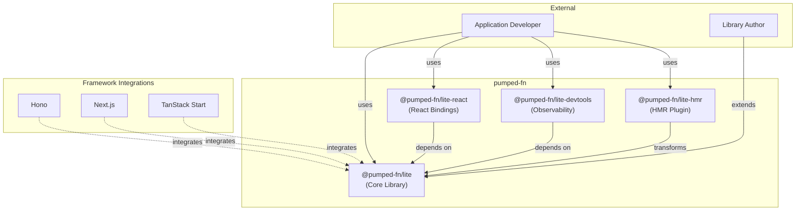

# pumped-fn System Overview

## Overview {#c3-0-overview}
<!-- TypeScript effect system for dependency injection and execution orchestration -->

pumped-fn is a lightweight TypeScript effect system that provides:
- Scope-based dependency injection with automatic lifecycle management
- Flow execution patterns for request/response handling
- Tag-based metadata system for cross-cutting concerns
- Extension hooks for observability and behavior modification
- Controller-based reactivity for state observation

The library is designed to be framework-agnostic with zero runtime dependencies.

## Architecture {#c3-0-architecture}
<!-- High-level view of system components -->

## Actors {#c3-0-actors}
<!-- Who/what interacts with this system -->

| Actor | Description |
|-------|-------------|
| Application Developer | Builds applications using pumped-fn for dependency management and flow execution |
| Library Author | Creates extensions, framework integrations, or custom tooling on top of lite |

## Containers {#c3-0-containers}
<!-- Separately deployable/publishable units -->

| Container | Type | Description | Documentation |
|-----------|------|-------------|---------------|
| @pumped-fn/lite | Library | Lightweight DI with minimal reactivity - atoms, flows, tags, controllers | [c3-2-lite](./c3-2-lite/) |
| @pumped-fn/lite-react | Library | Minimal React bindings with Suspense and useSyncExternalStore | [c3-3-lite-react](./c3-3-lite-react/) |
| @pumped-fn/lite-devtools | Library | Observability extension with transport-based event streaming | [c3-4-lite-devtools](./c3-4-lite-devtools/) |
| @pumped-fn/lite-hmr | Vite Plugin | Build-time transform preserving atom state across HMR reloads | [c3-5-lite-hmr](./c3-5-lite-hmr/) |
| docs | Static Site | VitePress documentation site | (out of scope) |

## Protocols {#c3-0-protocols}
<!-- How containers communicate -->

| From | To | Protocol | Description |
|------|-----|----------|-------------|
| Framework integrations | @pumped-fn/lite | npm dependency | Frameworks use lite for DI and flow handling |
| @pumped-fn/lite-react | @pumped-fn/lite | npm dependency | React hooks wrap lite Scope and Controller APIs |
| @pumped-fn/lite-devtools | @pumped-fn/lite | Extension interface | Devtools uses Extension hooks for instrumentation |
| @pumped-fn/lite-devtools | External UI | Transport (fire-and-forget) | Events streamed via BroadcastChannel, WebSocket, or Memory |
| @pumped-fn/lite-hmr | User code | AST transform | Plugin transforms atom() calls at build time |

Containers are npm packages with no runtime protocol - communication is through TypeScript types and function imports. Devtools uses fire-and-forget transports for zero-overhead event streaming.

## Cross-Cutting Concerns {#c3-0-cross-cutting}
<!-- Decisions that affect multiple containers -->

### Extension System
Cross-cutting behavior (logging, tracing, caching, error handling) is implemented via the Extension interface. Extensions hook into atom resolution and flow execution lifecycle via `wrapResolve` and `wrapExec` hooks.

Implemented in: [c3-2-lite](./c3-2-lite/)

### Tag-Based Metadata
Metadata propagation across execution boundaries uses the Tag system. Tags can be attached to atoms, flows, and scopes, then extracted at various points with `required`, `optional`, or `all` modes.

Implemented in: [c3-204-tag](./c3-2-lite/c3-204-tag.md)

### Controller Reactivity
Reactive state observation through the Controller pattern. Atoms can self-invalidate and listeners can subscribe to state changes with event filtering (`resolved`, `resolving`, `*`).

Implemented in: [c3-201-scope](./c3-2-lite/c3-201-scope.md)

### Observability (Devtools)
Developer observability via Extension-based instrumentation. Events (atom resolution, flow execution, errors) are streamed through fire-and-forget transports to external UIs without blocking application code.

Implemented in: [c3-4-lite-devtools](./c3-4-lite-devtools/)

## Deployment {#c3-0-deployment}
<!-- How this system is distributed -->

pumped-fn is distributed as npm packages:
- Published to npm registry via changesets
- Semantic versioning with automated changelog generation
- Zero runtime dependencies

No container/infrastructure deployment - this is a library ecosystem.

## System Testing {#c3-0-testing}
<!-- Cross-container testing strategy -->

Testing is per-package using Vitest:
- Unit tests for individual modules
- Behavior tests for integration scenarios
- Type tests for TypeScript inference

Packages are independently testable via their public APIs.
