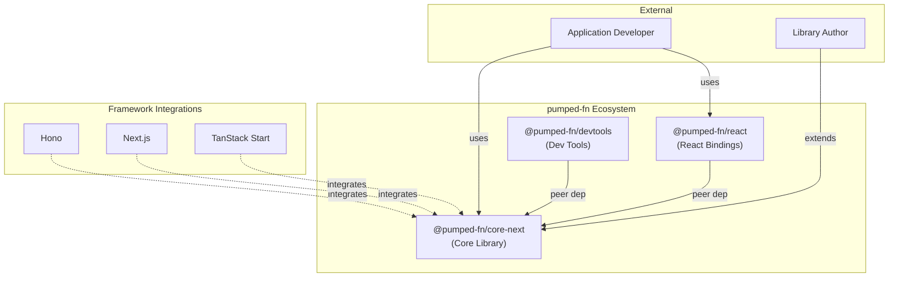

# pumped-fn System Overview

## Overview {#c3-0-overview}
<!-- TypeScript effect system for dependency injection and execution orchestration -->

pumped-fn is a TypeScript effect system that provides:
- Scope-based dependency injection with automatic lifecycle management
- Flow execution patterns for request/response handling
- Tag-based metadata system for cross-cutting concerns
- Extension hooks for observability and behavior modification

The library is designed to be framework-agnostic, with separate packages providing integrations for React, devtools, and other ecosystems.

## Architecture {#c3-0-architecture}
<!-- High-level view of system components -->

## Actors {#c3-0-actors}
<!-- Who/what interacts with this system -->

| Actor | Description |
|-------|-------------|
| Application Developer | Builds applications using pumped-fn for dependency management and flow execution |
| Library Author | Creates extensions, framework integrations, or custom tooling on top of core |

## Containers {#c3-0-containers}
<!-- Separately deployable/publishable units -->

| Container | Type | Description | Documentation |
|-----------|------|-------------|---------------|
| @pumped-fn/core-next | Library | Core effect system - scopes, executors, flows, tags, extensions | [c3-1-core](./c3-1-core/) |
| @pumped-fn/effect | Library | Lightweight effect system - minimal DI with atoms, flows, tags | [ADR-002](./adr/adr-002-lightweight-effect-package.md) |
| @pumped-fn/react | Library | React hooks and components for pumped-fn integration | (out of scope) |
| @pumped-fn/devtools | Library + CLI | Development tools with terminal UI | (out of scope) |
| docs | Static Site | VitePress documentation site | (out of scope) |

## Protocols {#c3-0-protocols}
<!-- How containers communicate -->

| From | To | Protocol | Description |
|------|-----|----------|-------------|
| @pumped-fn/react | @pumped-fn/core-next | npm peer dependency | React bindings consume Core types and functions |
| @pumped-fn/devtools | @pumped-fn/core-next | npm peer dependency | Devtools observe Core execution |
| Framework integrations | @pumped-fn/core-next | npm dependency | Frameworks use Core for DI and flow handling |

Containers are npm packages with no runtime protocol - communication is through TypeScript types and function imports.

## Cross-Cutting Concerns {#c3-0-cross-cutting}
<!-- Decisions that affect multiple containers -->

### Extension System
Cross-cutting behavior (logging, tracing, caching, error handling) is implemented via the Extension interface. Extensions hook into executor resolution and flow execution lifecycle.

Implemented in: [c3-1-core#c3-1-extension](./c3-1-core/#c3-1-extension)

### Tag-Based Metadata
Metadata propagation across execution boundaries uses the Tag system. Tags can be attached to executors, flows, and scopes, then extracted at various points.

Implemented in: [c3-1-core#c3-1-tag](./c3-1-core/#c3-1-tag)

### Error Handling
Structured error hierarchy with context-rich error classes. All errors include resolution paths and execution context for debugging.

Implemented in: [c3-1-core#c3-1-errors](./c3-1-core/#c3-1-errors)

### Schema Validation
StandardSchema-based validation for flow inputs/outputs and tag values. Library-agnostic validation contract.

Implemented in: [c3-1-core#c3-1-schema](./c3-1-core/#c3-1-schema)

## Deployment {#c3-0-deployment}
<!-- How this system is distributed -->

pumped-fn is distributed as npm packages:
- Published to npm registry via changesets
- Semantic versioning with automated changelog generation
- Peer dependencies for framework-specific packages

No container/infrastructure deployment - this is a library ecosystem.

## System Testing {#c3-0-testing}
<!-- Cross-container testing strategy -->

Testing is per-package using Vitest:
- Unit tests for individual modules
- Behavior tests for integration scenarios
- Memory profiling tests for performance

No cross-container system tests - packages are independently testable via their public APIs.
