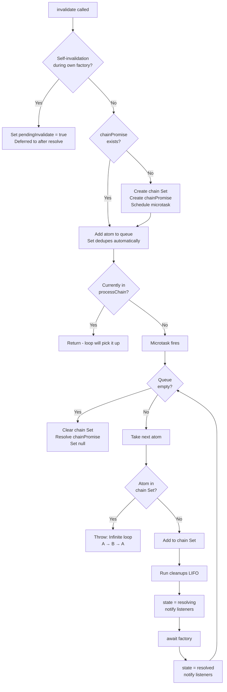
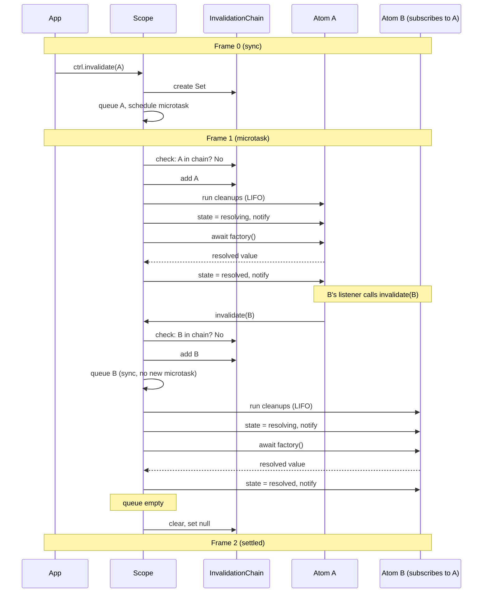

# [ADR-011] Sequential Invalidation Chain with Loop Detection

## Status {#adr-011-status}
**Proposed** - 2025-12-02

## Problem/Requirement {#adr-011-problem}

Current invalidation behavior has three issues:

**1. Parallel execution (fire-and-forget)**
```typescript
// Current: doInvalidate() calls resolve() without await
this.resolve(atom).catch(() => {})
```
When atom A invalidates and its listener triggers atom B to invalidate, they resolve **concurrently**, not sequentially. This makes behavior unpredictable.

**2. No infinite loop detection**
```typescript
// A subscribes to B, B subscribes to A
// A invalidates → B invalidates → A invalidates → ...forever
```
No mechanism to detect or prevent this.

**3. No frame control**
Invalidations schedule independent microtasks, making it impossible to reason about when the system settles.

## Exploration Journey {#adr-011-exploration}

**Initial hypothesis:** Batch all invalidations and resolve concurrently with event batching at end.

**Discovered:** User needs dependency-aware sequential chain where each atom fully resolves before downstream atoms start.

**Key decisions through brainstorming:**

| Question | Decision | Rationale |
|----------|----------|-----------|
| What triggers cascade? | Only `controller.on()` subscriptions | Keep explicit model from ADR-003, no implicit deps tracking |
| Loop detection behavior? | Throw immediately | Fail fast, loops indicate design bug |
| Event timing? | Sequential with notification between steps | Each listener sees resolved upstream before deciding |
| Self-invalidation during factory? | Keep deferred (`pendingInvalidate`) | Preserve existing poll-and-refresh pattern |
| Duplicate `invalidate()` calls? | Silent dedupe via Set | Redundant but harmless |
| Frame control? | Exactly 3 frames: trigger, chain, settle | Deterministic, testable |

## Solution {#adr-011-solution}

### Data Structures

```typescript
class ScopeImpl {
  // Existing
  private invalidationQueue = new Set<Lite.Atom<unknown>>()

  // New
  private invalidationChain: Set<Lite.Atom<unknown>> | null = null
  private chainPromise: Promise<void> | null = null
}
```

### Frame Model

| Frame | What happens |
|-------|--------------|
| 0 | Sync: `invalidate()` called, atom queued, microtask scheduled |
| 1 | Microtask: entire chain processes sequentially (A → B → C) |
| 2 | Nothing: chain settled, no pending work |

### Flowchart



### Sequence Diagram



### Error Message for Loop Detection

```
Error: Infinite invalidation loop detected: atomA → atomB → atomA
```

Include the chain path in the error for debugging.

## Changes Across Layers {#adr-011-changes}

### Component Level

**c3-201 (Scope & Controller):**

Update `#c3-201-invalidation` section with:
- Sequential chain behavior
- Loop detection
- Frame control guarantees
- Updated sequence diagram

### Source Files

**scope.ts:**

```typescript
// New fields
private invalidationChain: Set<Lite.Atom<unknown>> | null = null
private chainPromise: Promise<void> | null = null
private processingChain = false

// Updated scheduleInvalidation
private scheduleInvalidation<T>(atom: Lite.Atom<T>): void {
  this.invalidationQueue.add(atom)

  if (!this.chainPromise) {
    this.chainPromise = new Promise((resolve) => {
      queueMicrotask(() => {
        this.processInvalidationChain().then(resolve)
      })
    })
    this.invalidationChain = new Set()
  }
}

// New method
private async processInvalidationChain(): Promise<void> {
  this.processingChain = true

  try {
    while (this.invalidationQueue.size > 0) {
      const atom = this.takeNextFromQueue()

      if (this.invalidationChain!.has(atom)) {
        const path = this.buildChainPath(atom)
        throw new Error(`Infinite invalidation loop detected: ${path}`)
      }

      this.invalidationChain!.add(atom)
      await this.doInvalidate(atom)
    }
  } finally {
    this.processingChain = false
    this.invalidationChain = null
    this.chainPromise = null
  }
}

// Updated doInvalidate - remove fire-and-forget
private async doInvalidate<T>(atom: Lite.Atom<T>): Promise<void> {
  const entry = this.cache.get(atom)
  // ... cleanup, state = resolving, notify ...

  await this.resolve(atom)  // AWAIT, not fire-and-forget
}
```

### Test Files

**tests/scope.test.ts:**

Add new test suite for frame control:

```typescript
describe('invalidation chain', () => {
  it('executes in exactly 3 frames: trigger, chain, settle', async () => {
    const frames: string[][] = []
    let frameIndex = 0

    const track = (label: string) => {
      frames[frameIndex] ??= []
      frames[frameIndex].push(label)
    }

    const advanceFrame = async () => {
      frameIndex++
      frames[frameIndex] ??= []
      await Promise.resolve()
    }

    const atomA = atom({ factory: () => { track('A'); return 'a' } })
    const atomB = atom({
      deps: { a: controller(atomA) },
      factory: (ctx, { a }) => {
        a.on('resolved', () => ctx.invalidate())
        track('B')
        return 'b'
      }
    })
    const atomC = atom({
      deps: { b: controller(atomB) },
      factory: (ctx, { b }) => {
        b.on('resolved', () => ctx.invalidate())
        track('C')
        return 'c'
      }
    })

    const scope = createScope()
    await scope.resolve(atomC)

    frames.length = 0
    frameIndex = 0
    frames[0] = []

    track('trigger')
    scope.controller(atomA).invalidate()

    await advanceFrame()
    await advanceFrame()

    expect(frames).toEqual([
      ['trigger'],
      ['A', 'B', 'C'],
      []
    ])
  })

  it('throws on infinite loop', async () => {
    const atomA = atom({
      deps: { b: controller(atomB) },
      factory: (ctx, { b }) => {
        b.on('resolved', () => ctx.invalidate())
        return 'a'
      }
    })
    const atomB = atom({
      deps: { a: controller(atomA) },
      factory: (ctx, { a }) => {
        a.on('resolved', () => ctx.invalidate())
        return 'b'
      }
    })

    const scope = createScope()
    await scope.resolve(atomA)
    await scope.resolve(atomB)

    scope.controller(atomA).invalidate()

    await expect(scope.controller(atomA).resolve())
      .rejects.toThrow(/Infinite invalidation loop detected/)
  })

  it('allows self-invalidation during factory (deferred)', async () => {
    let count = 0
    const atomA = atom({
      factory: (ctx) => {
        count++
        if (count < 3) ctx.invalidate()
        return count
      }
    })

    const scope = createScope()
    await scope.resolve(atomA)

    // Should not throw, self-invalidation is deferred
    expect(count).toBe(3)
  })

  it('deduplicates concurrent invalidate() calls', async () => {
    let count = 0
    const atomA = atom({ factory: () => ++count })

    const scope = createScope()
    await scope.resolve(atomA)

    count = 0
    const ctrl = scope.controller(atomA)

    // Two concurrent calls
    ctrl.invalidate()
    ctrl.invalidate()

    await ctrl.resolve()

    // Factory called only once
    expect(count).toBe(1)
  })
})
```

## Verification {#adr-011-verification}

- [ ] Frame control test passes (3 frames exactly)
- [ ] Chain order is deterministic (A → B → C)
- [ ] Loop detection throws with helpful message
- [ ] Self-invalidation during factory still works (deferred)
- [ ] Duplicate invalidate() calls are deduplicated
- [ ] Existing tests still pass
- [ ] No new microtasks created mid-chain

## Related {#adr-011-related}

- [c3-201](../c3-2-lite/c3-201-scope.md) - Scope & Controller component
- [ADR-003](./adr-003-controller-reactivity.md) - Controller-based reactivity (established subscription model)
- [ADR-009](./adr-009-fix-duplicate-listener-notifications.md) - Controller.on() state filtering
