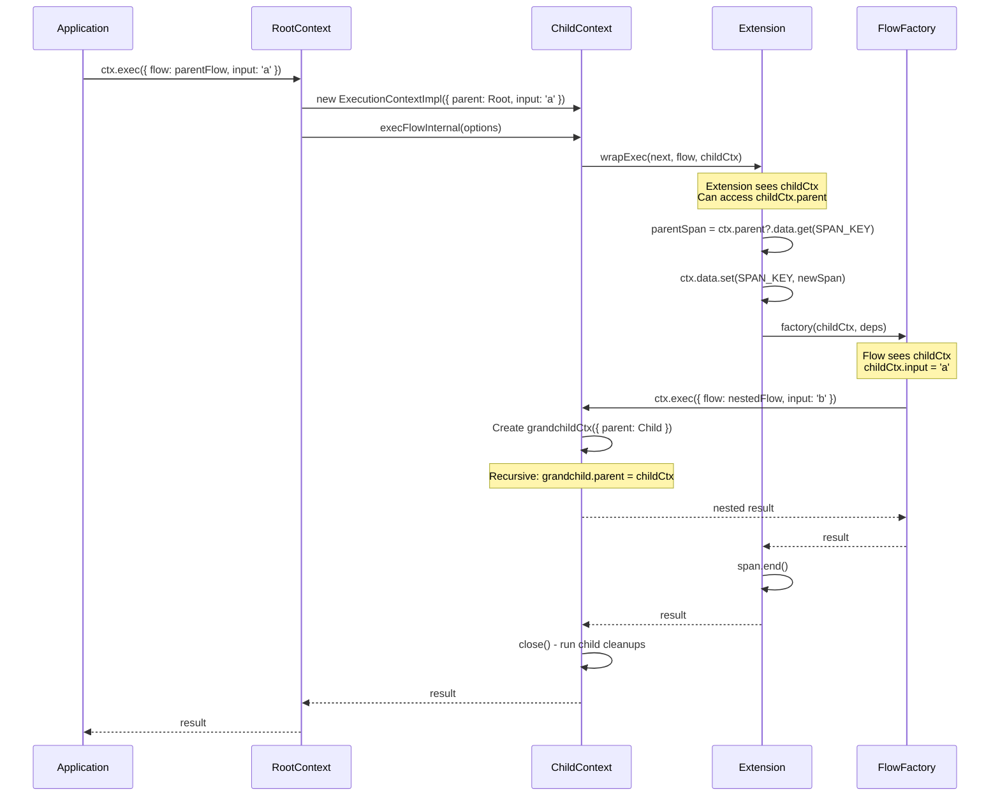
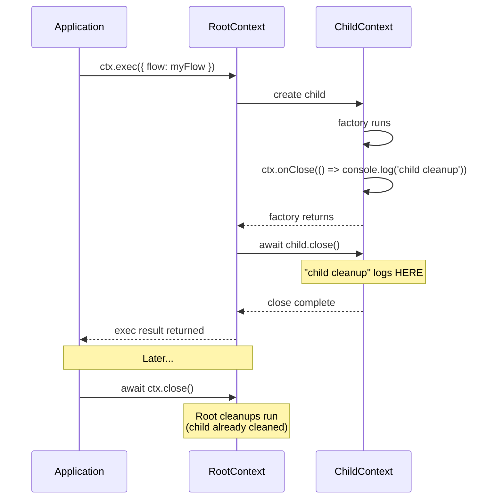
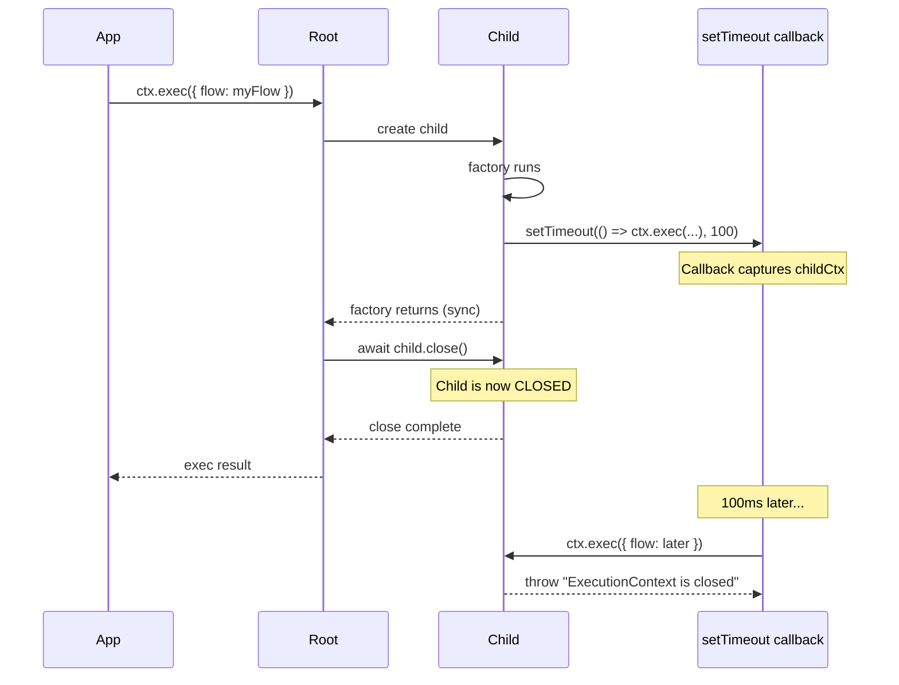

# [ADR-016] Hierarchical ExecutionContext with Parent-Child Per Exec

## Status {#adr-016-status}
**Accepted** - 2025-12-08

## Problem/Requirement {#adr-016-problem}

Extensions need to implement nested span tracing (OpenTelemetry-style) where:
- Each `ctx.exec()` creates a span
- Nested execs have parent-child span relationships
- Concurrent executions don't corrupt shared state

**Current limitation:** The same `ExecutionContext` instance is reused for all nested `ctx.exec()` calls:

```typescript
const myFlow = flow({
  factory: async (ctx) => {
    await ctx.exec({ flow: child1 })  // same ctx instance
    await ctx.exec({ flow: child2 })  // same ctx instance, input overwritten!
  }
})
```

This prevents extensions from:
1. Tracking parent-child relationships (no parent reference)
2. Storing per-execution data (shared mutable state races under concurrency)
3. Implementing span hierarchies without `AsyncLocalStorage`

**Failed approaches explored:**

| Approach | Problem |
|----------|---------|
| Map on shared ctx | Concurrent siblings race on "current span" |
| `ctx.withTags()` stack | Same race - shared mutable stack |
| Tag-only correlation | No automatic parent-child, just grouping |
| AsyncLocalStorage | Node.js only, not portable |

## Exploration Journey {#adr-016-exploration}

**Initial hypothesis:** Add `data` map to ExecutionContext (like ResolveContext per ADR-007).

**Explored isolated (c3-203):** ExecutionContext currently:
- Shares single instance for all nested execs
- Mutates `_input` per exec (overwrites previous)
- Has `cleanups` array shared across all execs
- `close()` runs all accumulated cleanups

**Explored upstream (c3-201):** ScopeImpl creates ExecutionContext via `createContext()`. No changes needed to Scope interface.

**Explored adjacent (c3-2 Extension):** `wrapExec` receives `(next, target, ctx)`. If ctx is child-per-exec, extension can access `ctx.parent.data` for parent span.

**Explored downstream (usage):** Flows receive ctx in factory. If child-per-exec:
- `ctx.input` is per-execution (no mutation of shared state)
- Nested `ctx.exec()` creates grandchild
- Callbacks capture ctx (parent chain preserved)

**Discovered key insight:** Child-per-exec solves:

| Scenario | Why It Works |
|----------|--------------|
| Concurrent siblings + nesting | Each exec has isolated ctx and data |
| Deferred callbacks | Callback captures ctx (parent preserved) |
| Event handlers | Same as callbacks |

**Remaining gaps:**
- `wrapResolve` (atom resolution) - different hook, no ExecutionContext
- User creates fresh context via `scope.createContext()` - intentional, documented

**Confirmed:** This aligns with ADR-001's design for core-next which already had child context tracking. We're bringing that pattern to lite in minimal form.

## Solution {#adr-016-solution}

Each `ctx.exec()` creates a child ExecutionContext with:
1. `parent` reference to caller's context
2. Own `data` map for per-execution storage
3. Auto-close when exec completes (runs child's cleanups)

### Interface Changes

```typescript
interface ExecutionContext {
  readonly input: unknown
  readonly scope: Scope
  readonly parent: ExecutionContext | undefined  // NEW - undefined for root
  readonly data: Map<symbol, unknown>            // NEW - per-execution storage
  exec<Output, Input>(options: ExecFlowOptions<Output, Input>): Promise<Output>
  exec<Output, Args extends unknown[]>(options: ExecFnOptions<Output, Args>): Promise<Output>
  onClose(fn: () => MaybePromise<void>): void
  close(): Promise<void>
}
```

**Why `Map<symbol, unknown>` instead of ADR-007's `DataStore`?**

| Aspect | ResolveContext.data (ADR-007) | ExecutionContext.data (this ADR) |
|--------|-------------------------------|----------------------------------|
| User | Atom factories (user code) | Extensions (library code) |
| Key type | Tag (user-defined) | Symbol (extension-private) |
| Lifetime | Survives invalidation | Per-exec only |
| Purpose | State across reruns | Parent-child propagation |

Extensions need **private symbols** for encapsulation. User code uses Tags for type safety.

### Implementation Detail {#adr-016-implementation}

#### ExecutionContextImpl Changes

```typescript
class ExecutionContextImpl implements Lite.ExecutionContext {
  private cleanups: (() => MaybePromise<void>)[] = []
  private closed = false
  private readonly _input: unknown                    // CHANGED: now readonly
  private readonly baseTags: Lite.Tagged<unknown>[]
  readonly parent: ExecutionContext | undefined       // NEW
  private _data: Map<symbol, unknown> | undefined     // NEW: lazy

  constructor(
    readonly scope: ScopeImpl,
    options?: {
      tags?: Lite.Tagged<unknown>[]
      parent?: ExecutionContext                       // NEW
      input?: unknown                                 // NEW
    }
  ) {
    this.parent = options?.parent
    this._input = options?.input
    const ctxTags = options?.tags
    this.baseTags = ctxTags?.length
      ? [...ctxTags, ...scope.tags]
      : scope.tags
  }

  get input(): unknown {
    return this._input
  }

  get data(): Map<symbol, unknown> {                  // NEW: lazy getter
    if (!this._data) {
      this._data = new Map()
    }
    return this._data
  }

  async exec(options: ExecFlowOptions | ExecFnOptions): Promise<unknown> {
    if (this.closed) {
      throw new Error("ExecutionContext is closed")
    }

    // NEW: Create child context for this execution
    const childCtx = new ExecutionContextImpl(this.scope, {
      parent: this,
      tags: this.baseTags
    })

    try {
      if ("flow" in options) {
        return await childCtx.execFlowInternal(options)
      } else {
        return await childCtx.execFnInternal(options)
      }
    } finally {
      // NEW: Auto-close child (runs child's cleanups)
      await childCtx.close()
    }
  }

  // RENAMED from execFlow - now internal, receives input via constructor
  private async execFlowInternal(options: {
    flow: Lite.Flow<unknown, unknown>
    input?: unknown
    name?: string
    tags?: Lite.Tagged<unknown>[]
  }): Promise<unknown> {
    const { flow, input, tags: execTags, name: execName } = options

    // Merge tags for this execution
    const hasExtraTags = (execTags?.length ?? 0) > 0 || (flow.tags?.length ?? 0) > 0
    const allTags = hasExtraTags
      ? [...(execTags ?? []), ...this.baseTags, ...(flow.tags ?? [])]
      : this.baseTags

    const resolvedDeps = await this.scope.resolveDeps(flow.deps, allTags)

    // Parse input
    let parsedInput: unknown = input
    if (flow.parse) {
      const label = execName ?? flow.name ?? "anonymous"
      try {
        parsedInput = await flow.parse(input)
      } catch (err) {
        throw new ParseError(...)
      }
    }

    // Store input on THIS child context (not mutation!)
    Object.defineProperty(this, '_input', { value: parsedInput })

    const factory = flow.factory as (
      ctx: Lite.ExecutionContext,
      deps?: Record<string, unknown>
    ) => MaybePromise<unknown>

    const doExec = async (): Promise<unknown> => {
      if (flow.deps && Object.keys(flow.deps).length > 0) {
        return factory(this, resolvedDeps)  // Pass THIS child context
      } else {
        return factory(this)
      }
    }

    return this.applyExecExtensions(flow, doExec, allTags)
  }

  private async applyExecExtensions(
    target: Lite.Flow | Function,
    doExec: () => Promise<unknown>,
    tags: Lite.Tagged<unknown>[]                      // NEW: pass tags
  ): Promise<unknown> {
    let next = doExec

    for (let i = this.scope.extensions.length - 1; i >= 0; i--) {
      const ext = this.scope.extensions[i]
      if (ext?.wrapExec) {
        const currentNext = next
        // Pass THIS child context to extension
        next = ext.wrapExec.bind(ext, currentNext, target, this) as () => Promise<unknown>
      }
    }

    return next()
  }

  // ... close() unchanged - runs this context's cleanups
}
```

#### Key Changes Summary

| Location | Change | Lines |
|----------|--------|-------|
| Constructor | Add `parent`, `input` options | ~8 |
| Fields | Add `parent`, `_data` (lazy) | ~5 |
| `data` getter | Lazy Map creation | ~6 |
| `exec()` | Create child, try/finally auto-close | ~15 |
| `execFlowInternal()` | Use `this` input, pass `this` to factory | ~10 |
| `execFnInternal()` | Similar changes | ~8 |
| `applyExecExtensions()` | Pass `this` (child) to extensions | ~5 |
| **Total** | | **~57 lines** |

### Execution Flow Sequence {#adr-016-sequence}



### Cleanup Lifecycle Sequence {#adr-016-cleanup-sequence}

**Critical clarification:** Child auto-close runs immediately after exec completes.



### Closure Capture Behavior {#adr-016-closure}

**Question from review:** If `ctx` is captured in setTimeout, does child remain valid?

**Answer:** The child context is **closed but still accessible**. Calling `exec()` on a closed context throws.



**Mitigation pattern:** For deferred work, create a dedicated context:

```typescript
const myFlow = flow({
  factory: async (ctx) => {
    // For deferred work, create root-level context
    const deferredCtx = ctx.scope.createContext()

    setTimeout(async () => {
      try {
        await deferredCtx.exec({ flow: later })
      } finally {
        await deferredCtx.close()
      }
    }, 100)

    return 'immediate result'
  }
})
```

### Root Context Behavior {#adr-016-root}

**Question from review:** What is root `ctx.input` if it never exec'd directly?

**Answer:** Root context has `input = undefined` and `parent = undefined`.

```typescript
const ctx = scope.createContext()
// ctx.input === undefined
// ctx.parent === undefined

await ctx.exec({ flow: f1, input: 'a' })
// ctx.input === undefined (unchanged)
// child.input === 'a'

await ctx.exec({ flow: f2, input: 'b' })
// ctx.input === undefined (still unchanged)
// child.input === 'b'
```

### Extension Usage for Tracing {#adr-016-tracing}

```typescript
const SPAN_KEY = Symbol('tracing.span')

const tracingExtension: Extension = {
  name: 'tracing',
  wrapExec: async (next, target, ctx) => {
    // Read parent span from parent context's data (if exists)
    const parentSpan = ctx.parent?.data.get(SPAN_KEY) as Span | undefined

    const span = tracer.startSpan({
      name: isFlow(target) ? (target.name ?? 'anonymous') : 'fn',
      parent: parentSpan
    })

    // Store span in THIS context's data
    ctx.data.set(SPAN_KEY, span)

    try {
      return await next()
    } finally {
      span.end()
    }
  }
}
```

### Concurrent Safety {#adr-016-concurrent}

```typescript
await Promise.all([
  ctx.exec({ flow: flowA }),  // childCtxA (parent: ctx, dataA: Map)
  ctx.exec({ flow: flowB })   // childCtxB (parent: ctx, dataB: Map)
])

// Inside flowA:
await childCtxA.exec({ flow: nested })
// grandchild.parent = childCtxA
// Reads parentSpan from childCtxA.data ✓

// Inside flowB (concurrent):
await childCtxB.exec({ flow: nested })
// grandchild.parent = childCtxB
// Reads parentSpan from childCtxB.data ✓
```

No race conditions - each execution has isolated context and data.

## Breaking Changes {#adr-016-breaking}

### 1. `onClose()` Timing Change (BREAKING)

**Before:** Cleanup registered on shared context, runs on manual `close()`.

**After:** Cleanup registered on child context, runs when exec completes (auto-close).

```typescript
// BEFORE: Cleanup runs on ctx.close()
const ctx = scope.createContext()
await ctx.exec({
  flow: flow({
    factory: async (ctx) => {
      ctx.onClose(() => console.log('cleanup'))
    }
  })
})
// Cleanup NOT run yet
await ctx.close()  // Cleanup runs HERE

// AFTER: Cleanup runs immediately after exec
await ctx.exec({
  flow: flow({
    factory: async (ctx) => {  // ctx is CHILD
      ctx.onClose(() => console.log('cleanup'))
    }
  })
})
// Cleanup runs HERE (child auto-closed)
await ctx.close()  // Nothing additional runs
```

**Migration:** If cleanup must run on root close, use scope-level pattern:

```typescript
const myFlow = flow({
  factory: async (ctx) => {
    // Register on root, not child
    const rootCtx = getRootContext(ctx)  // helper to traverse parent chain
    rootCtx.onClose(() => console.log('cleanup on root'))
  }
})

function getRootContext(ctx: ExecutionContext): ExecutionContext {
  return ctx.parent ? getRootContext(ctx.parent) : ctx
}
```

### 2. `ctx.input` Isolation (BEHAVIORAL FIX)

**Before:** `ctx.input` mutated on each exec (footgun).

**After:** Each child has its own immutable `input`.

```typescript
// BEFORE: Mutation footgun
await ctx.exec({ flow: f1, input: 'a' })  // ctx.input = 'a'
await ctx.exec({ flow: f2, input: 'b' })  // ctx.input = 'b' (overwrites!)

// AFTER: Isolated
await ctx.exec({ flow: f1, input: 'a' })  // childA.input = 'a'
await ctx.exec({ flow: f2, input: 'b' })  // childB.input = 'b'
// ctx.input unchanged (undefined for root)
```

**Migration:** If code accessed `ctx.input` outside receiving factory, it was relying on undefined behavior. Fix by passing data explicitly via tags or deps.

### 3. Closed Context After Exec (NEW BEHAVIOR)

**Before:** N/A (same context reused).

**After:** Child context is closed after exec returns.

```typescript
const myFlow = flow({
  factory: async (ctx) => {
    setTimeout(() => {
      // BEFORE: Would work (same context)
      // AFTER: Throws "ExecutionContext is closed"
      ctx.exec({ flow: later })
    }, 100)
  }
})
```

**Migration:** Create dedicated context for deferred work (see "Closure Capture Behavior" section).

## Complexity Estimate {#adr-016-complexity}

### Revised Implementation Size: ~60 lines

| File | Change | Lines |
|------|--------|-------|
| `types.ts` | Add `parent`, `data` to ExecutionContext interface | ~5 |
| `scope.ts` | Constructor: add parent, input options | ~8 |
| `scope.ts` | Add `parent` field, lazy `_data` field | ~5 |
| `scope.ts` | Add `data` getter (lazy creation) | ~6 |
| `scope.ts` | `exec()`: create child, try/finally auto-close | ~15 |
| `scope.ts` | `execFlowInternal()`: use `this` input, pass `this` | ~10 |
| `scope.ts` | `execFnInternal()`: similar changes | ~8 |
| `scope.ts` | `applyExecExtensions()`: pass child ctx | ~3 |
| **Total** | | **~60 lines** |

### Memory Considerations

- Each exec creates one small object (~6 properties)
- `data` Map created lazily (only if extension accesses it)
- Child eligible for GC after auto-close completes
- No memory leak for typical request/response patterns

## Alternative Considered: Shared Context with Stack {#adr-016-alternative}

**Approach:** Keep shared context, add `withData(fn)` method for scoped data.

```typescript
wrapExec: async (next, target, ctx) => {
  return ctx.withData({ [SPAN_KEY]: span }, async () => {
    return next()
  })
}
```

**Rejected because:**
1. Concurrent execs still race on shared stack
2. Requires more complex stack management
3. Doesn't fix `ctx.input` mutation footgun
4. More code than child-per-exec approach

## Changes Across Layers {#adr-016-changes}

### Context Level
No changes to c3-0.

### Container Level

**c3-2 (Lite Library):**
- Update Extension System section to show `ctx.parent` and `ctx.data` usage
- Add tracing extension example
- Document breaking changes in migration notes

### Component Level

**c3-203 (Flow & ExecutionContext):**
1. Update ExecutionContext interface with `parent` and `data`
2. Add "Hierarchical Execution" section with sequence diagrams
3. Update "Nested Execution" section to document child-per-exec
4. Add "Cleanup Lifecycle" section clarifying auto-close
5. Add extension usage patterns for tracing
6. Document breaking changes

**c3-201 (Scope & Controller):**
1. Update ExecutionContextImpl implementation notes
2. Document auto-close behavior
3. Note `createContext()` returns root context

### Source Files

| File | Changes |
|------|---------|
| `src/types.ts` | Add `parent: ExecutionContext \| undefined`, `data: Map<symbol, unknown>` |
| `src/scope.ts` | ExecutionContextImpl: parent field, data field, child creation, auto-close |

## Verification {#adr-016-verification}

### Core Behavior
- [ ] Each `ctx.exec()` creates new child context
- [ ] Child has `parent` reference to caller's context
- [ ] Child has own `data` Map (not shared)
- [ ] Child auto-closes when exec completes
- [ ] Child `onClose()` cleanups run on exec completion (not root close)

### Parent Chain
- [ ] Root context has `parent === undefined`
- [ ] Root context has `input === undefined`
- [ ] First exec child has `parent === rootCtx`
- [ ] Nested exec grandchild has `parent === childCtx`
- [ ] Parent chain accessible via `ctx.parent.parent...`

### Concurrent Safety
- [ ] Concurrent sibling execs have isolated data Maps
- [ ] Nested exec in concurrent flow reads correct parent data
- [ ] No race conditions on concurrent `ctx.exec()` calls

### Closure/Callback Safety
- [ ] Captured ctx in setTimeout is closed after exec returns
- [ ] Calling `exec()` on closed child throws "ExecutionContext is closed"
- [ ] Accessing `ctx.parent` on closed child still works
- [ ] Accessing `ctx.data` on closed child still works

### Extension Integration
- [ ] `wrapExec` receives child context (not parent)
- [ ] Extension can read `ctx.parent.data` for parent info
- [ ] Extension can write to `ctx.data` for current exec
- [ ] Full tracing extension example works end-to-end

### Cleanup Lifecycle
- [ ] Child `onClose()` callbacks run when exec completes
- [ ] Child cleanup runs before parent's exec() returns
- [ ] Root `ctx.close()` only runs root-level cleanups
- [ ] Double close on child is no-op

### Breaking Change Tests
- [ ] Code relying on shared `ctx.input` sees new isolation behavior
- [ ] Code registering cleanup expecting root-level run sees new auto-close
- [ ] setTimeout callback with captured ctx throws on exec()

### Backwards Compatibility
- [ ] Existing flows work without modification (input passed correctly)
- [ ] `ctx.scope` still accessible on child
- [ ] Extensions receiving ctx can still call all methods

## Migration Guide {#adr-016-migration}

### From: Shared ctx.input

```typescript
// OLD: Relied on mutation (undefined behavior)
let captured: ExecutionContext
await ctx.exec({
  flow: flow({ factory: (ctx) => { captured = ctx } })
})
console.log(captured.input)  // Worked by accident

// NEW: Input is per-child, passed explicitly
await ctx.exec({
  flow: flow({ factory: (ctx) => {
    console.log(ctx.input)  // Correct: access in receiving factory
  } }),
  input: data
})
```

### From: Root-level cleanup

```typescript
// OLD: Cleanup ran on root close
await ctx.exec({
  flow: flow({
    factory: (ctx) => {
      ctx.onClose(() => cleanup())  // Ran on ctx.close()
    }
  })
})
await ctx.close()  // cleanup() ran here

// NEW: Cleanup runs on exec completion
// If you need root-level cleanup:
const myFlow = flow({
  factory: (ctx) => {
    // Option 1: Use scope-level resource
    const resource = ctx.scope.resolve(resourceAtom)

    // Option 2: Traverse to root
    let root = ctx
    while (root.parent) root = root.parent
    root.onClose(() => cleanup())
  }
})
```

### From: Deferred ctx.exec()

```typescript
// OLD: Worked (same context, never closed)
await ctx.exec({
  flow: flow({
    factory: (ctx) => {
      setTimeout(() => ctx.exec({ flow: later }), 100)
    }
  })
})

// NEW: Create dedicated context for deferred work
await ctx.exec({
  flow: flow({
    factory: (ctx) => {
      const scope = ctx.scope
      setTimeout(async () => {
        const deferredCtx = scope.createContext()
        try {
          await deferredCtx.exec({ flow: later })
        } finally {
          await deferredCtx.close()
        }
      }, 100)
    }
  })
})
```

## Related {#adr-016-related}

- [ADR-001](./adr-001-execution-context-lifecycle.md) - ExecutionContext lifecycle (similar child tracking in core-next)
- [ADR-007](./adr-007-resolve-context-data.md) - Per-atom data pattern (DataStore for atoms, Map for extensions)
- [c3-203](../c3-2-lite/c3-203-flow.md) - Flow & ExecutionContext (primary change)
- [c3-201](../c3-2-lite/c3-201-scope.md) - Scope implementation
- [c3-2](../c3-2-lite/README.md) - Extension system
