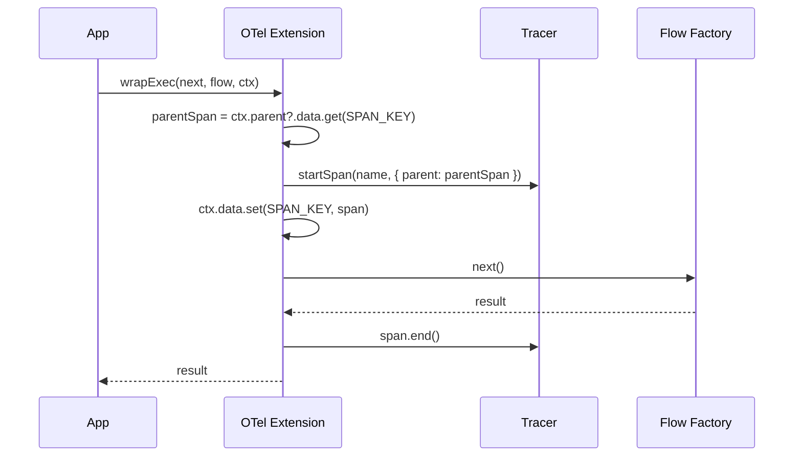

# [ADR-018] OpenTelemetry Extension for Lite Package

## Status {#adr-018-status}
**Accepted** - 2025-12-10

## Problem/Requirement {#adr-018-problem}

Users need production-grade observability for pumped-fn applications. While `@pumped-fn/lite-devtools` provides internal debugging events, it doesn't integrate with the OpenTelemetry ecosystem for:

- **Distributed tracing** across services (W3C Trace Context)
- **Metrics** for SLI/SLO monitoring (resolution times, error rates)
- **Standard exporters** (Jaeger, Zipkin, OTLP, Honeycomb, Datadog, etc.)

The hierarchical ExecutionContext from ADR-016 enables nested span tracing without AsyncLocalStorage. An OTel extension can leverage `ctx.parent` and `ctx.data` for automatic parent-child span relationships.

## Exploration Journey {#adr-018-exploration}

**Initial hypothesis:** New package similar to `@pumped-fn/lite-devtools` but outputting OTel spans.

**Explored isolated (new package):**
- Follows existing extension pattern from lite-devtools
- Uses `wrapResolve` for atom spans, `wrapExec` for flow spans
- Leverages `ctx.data` for span storage, `ctx.parent?.data` for parent span lookup

**Explored upstream (c3-2 Extension System):**
- Extension interface provides `wrapResolve`, `wrapExec`, `init`, `dispose` hooks
- Sufficient for tracing, metrics, and context propagation

**Explored adjacent (c3-4 lite-devtools):**
- Fire-and-forget pattern works well for devtools but OTel requires proper span lifecycle
- Need synchronous span.end() in finally blocks
- Transport pattern not applicable - use OTel SDK's TracerProvider/MeterProvider

**Explored downstream (user integration):**
- Users configure OTel SDK (exporters, sampling, processors)
- Pass TracerProvider to extension
- Extension creates tracer and integrates with scope

**Discovered:**
1. User-provided TracerProvider is essential for flexibility (exporters vary)
2. Span hierarchy uses ADR-016's `ctx.parent?.data.get(SPAN_KEY)`
3. Metrics require MeterProvider (optional, separate from tracing)
4. Context propagation via W3C headers needs `propagator.extract/inject`

**Confirmed:**
- Separate package `@pumped-fn/lite-extension-otel` (not part of lite or devtools)
- User provides TracerProvider (required) and MeterProvider (optional)
- No AsyncLocalStorage needed - hierarchical context handles parent chain

## Solution {#adr-018-solution}

Create `@pumped-fn/lite-extension-otel` with:

1. **Tracing** - Spans for atoms and flows with automatic hierarchy
2. **Metrics** - Histograms for resolution/execution time, counters for errors
3. **Context Propagation** - W3C Trace Context extraction/injection helpers

### API Design

```typescript
import { createOtel } from '@pumped-fn/lite-extension-otel'
import { trace, metrics } from '@opentelemetry/api'

const scope = createScope({
  extensions: [
    createOtel({
      tracer: trace.getTracer('my-app'),
      meter: metrics.getMeter('my-app'),  // optional
    })
  ]
})
```

### Extension Implementation Pattern



### Span Hierarchy (leveraging ADR-016)

```typescript
const SPAN_KEY = Symbol('otel.span')

wrapExec: async (next, target, ctx) => {
  // Get parent span from parent context (ADR-016 pattern)
  const parentSpan = ctx.parent?.data.get(SPAN_KEY) as Span | undefined

  const span = tracer.startSpan(
    isFlow(target) ? (target.name ?? 'flow') : 'fn',
    { parent: parentSpan ? trace.setSpan(context.active(), parentSpan) : undefined }
  )

  // Store in THIS context's data (isolated per execution)
  ctx.data.set(SPAN_KEY, span)

  try {
    const result = await context.with(trace.setSpan(context.active(), span), next)
    span.setStatus({ code: SpanStatusCode.OK })
    return result
  } catch (err) {
    span.setStatus({ code: SpanStatusCode.ERROR, message: String(err) })
    span.recordException(err)
    throw err
  } finally {
    span.end()
  }
}
```

### Metrics Collection

```typescript
const atomResolutionHistogram = meter.createHistogram('pumped.atom.resolution_ms')
const flowExecutionHistogram = meter.createHistogram('pumped.flow.execution_ms')
const errorCounter = meter.createCounter('pumped.errors')

wrapResolve: async (next, atom, scope) => {
  const start = performance.now()
  try {
    const result = await next()
    atomResolutionHistogram.record(performance.now() - start, {
      'atom.name': atom.factory.name ?? 'anonymous'
    })
    return result
  } catch (err) {
    errorCounter.add(1, { 'atom.name': atom.factory.name ?? 'anonymous' })
    throw err
  }
}
```

### Context Propagation Helpers

```typescript
import { propagation, context } from '@opentelemetry/api'

// Extract from incoming headers (e.g., HTTP request)
export function extractContext(headers: Record<string, string>): Context {
  return propagation.extract(context.active(), headers)
}

// Inject into outgoing headers (e.g., HTTP client call)
export function injectContext(headers: Record<string, string>): void {
  const span = getCurrentSpan()
  if (span) {
    propagation.inject(trace.setSpan(context.active(), span), headers)
  }
}

// Get current span from ExecutionContext
export function getCurrentSpan(ctx: ExecutionContext): Span | undefined {
  return ctx.data.get(SPAN_KEY) as Span | undefined
}
```

### Full Extension Interface

```typescript
export interface OtelOptions {
  /** Tracer for span creation (required) */
  readonly tracer: Tracer
  /** Meter for metrics (optional) */
  readonly meter?: Meter
  /** Filter atoms to trace (default: all) */
  readonly atomFilter?: (atom: Atom<unknown>) => boolean
  /** Filter flows to trace (default: all) */
  readonly flowFilter?: (flow: Flow<unknown, unknown>) => boolean
  /** Custom span name formatter */
  readonly spanName?: (target: Atom | Flow | Function) => string
}

export function createOtel(options: OtelOptions): Lite.Extension
```

## Changes Across Layers {#adr-018-changes}

### Context Level

**c3-0 (README.md):**
- Add `@pumped-fn/lite-extension-otel` to Containers table in [#c3-0-containers](#c3-0-containers)

### Container Level

**c3-7-lite-extension-otel (NEW):**
- Create container at `.c3/c3-7-lite-extension-otel/README.md`
- Document overview, API, usage patterns
- Link to ADR-016 for hierarchical context pattern

### Component Level

No changes to existing components. New package is self-contained.

### Source Files

New package at `packages/lite-extension-otel/`:

```
packages/lite-extension-otel/
├── src/
│   ├── index.ts      # Public exports
│   ├── types.ts      # OtelOptions, namespace
│   ├── extension.ts  # createOtel() implementation
│   ├── span.ts       # Span management, SPAN_KEY
│   ├── metrics.ts    # Histogram/counter setup
│   └── propagation.ts # Context propagation helpers
├── tests/
│   ├── tracing.test.ts
│   ├── metrics.test.ts
│   └── propagation.test.ts
├── package.json
├── tsconfig.json
└── tsdown.config.ts
```

**Package dependencies:**
```json
{
  "peerDependencies": {
    "@pumped-fn/lite": "^0.x",
    "@opentelemetry/api": "^1.0"
  }
}
```

## Verification {#adr-018-verification}

### Tracing
- [x] Spans created for atom resolution with correct name
- [x] Spans created for flow execution with correct name
- [x] Nested flows have parent-child span relationship via ctx.parent
- [x] Concurrent siblings have isolated spans (no race conditions)
- [x] Span status set to OK on success, ERROR on exception
- [x] Exception recorded on span before re-throwing
- [x] Span ends in finally block (even on error)

### Metrics
- [x] Resolution time histogram recorded for atoms
- [x] Execution time histogram recorded for flows
- [x] Error counter incremented on exceptions
- [x] Attributes include atom/flow name

### Context Propagation
- [x] extractContext() parses W3C Trace Context headers
- [x] injectContext() writes W3C headers for outgoing calls
- [x] getCurrentSpan() returns span from ExecutionContext

### Filters
- [x] atomFilter skips tracing for filtered atoms
- [x] flowFilter skips tracing for filtered flows
- [x] Skipped items still execute normally

### Integration
- [x] Works with @opentelemetry/sdk-trace-node
- [x] Works with @opentelemetry/sdk-metrics
- [x] No dependencies on AsyncLocalStorage
- [ ] Disposed properly on scope.dispose()

## Related {#adr-018-related}

- [ADR-015](./adr-015-devtools-integration.md) - Devtools extension pattern (similar approach)
- [ADR-016](./adr-016-hierarchical-execution-context.md) - Hierarchical context (enables span hierarchy)
- [c3-2](../c3-2-lite/README.md#c3-2-extension) - Extension system
- [c3-203](../c3-2-lite/c3-203-flow.md#c3-203-hierarchical) - Hierarchical execution pattern
