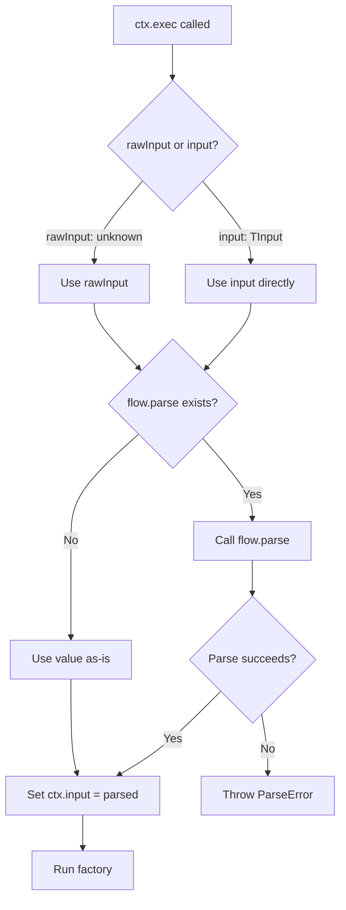

# [ADR-020] Raw Input Execution for Flows with Parse

## Status {#adr-020-status}
**Accepted** - 2025-12-11

## Problem/Requirement {#adr-020-problem}

When executing flows with `ctx.exec()`, callers must provide input matching the flow's `TInput` type:

```typescript
const createUser = flow({
  parse: (raw) => userSchema.parse(raw), // validates and returns { name: string, email: string }
  factory: (ctx) => db.create(ctx.input)
})

// Current: Must cast or type input correctly
await ctx.exec({ flow: createUser, input: body as UserInput })
```

This creates friction when:
1. Flow has a `parse` function that validates input anyway
2. Caller receives raw/unknown data (HTTP body, WebSocket message, etc.)
3. Type assertion is just ceremony since parse handles validation

**Goal:** Allow callers to pass `unknown` input when flow has `parse`, delegating validation responsibility to the flow.

## Exploration Journey {#adr-020-exploration}

**Initial hypothesis:** Add separate `unknownFlow` key for untyped execution.

**Explored:**
- Naming options: `unknownFlow`, `handle`, `run`, `raw`, `untyped`
- Alternative: Keep `flow` key, differentiate by input property name

**Discovered:**
- `rawInput` is cleaner than new flow key - keeps API consistent
- Mutually exclusive with `input` - can't use both
- Only meaningful for flows (functions don't have `parse`)
- Builds directly on ADR-005's parse infrastructure

**Confirmed:**
- Change is isolated to `ExecFlowOptions` type and exec implementation
- No extension changes needed
- No impact on atoms, tags, or scope core

## Solution {#adr-020-solution}

Add `rawInput` as alternative to `input` in `ExecFlowOptions`:

```typescript
type ExecFlowOptions<Output, Input> = {
  flow: Flow<Output, Input>
  name?: string
  tags?: Tagged<unknown>[]
} & (
  // Typed execution - input must match TInput
  | { input: NoInfer<Input>; rawInput?: never }
  // Raw execution - flow's parse handles validation
  | { rawInput: unknown; input?: never }
)
```

### Usage

```typescript
// Typed execution - caller knows the type
await ctx.exec({
  flow: createUser,
  input: { name: 'Alice', email: 'alice@example.com' }
})

// Raw execution - flow's parse validates
await ctx.exec({
  flow: createUser,
  rawInput: request.body  // unknown from HTTP
})
```

### Execution Flow



### Behavior Details

| Scenario | input | rawInput | flow.parse | Result |
|----------|-------|----------|------------|--------|
| Typed, no parse | `{ name: 'A' }` | - | undefined | `ctx.input = { name: 'A' }` |
| Typed, with parse | `{ name: 'A' }` | - | defined | parse runs, `ctx.input = parsed` |
| Raw, with parse | - | `{ name: 'A' }` | defined | parse runs, `ctx.input = parsed` |
| Raw, no parse | - | `{ name: 'A' }` | undefined | `ctx.input = { name: 'A' }` (unknown) |
| Both provided | `x` | `y` | any | TypeScript error |
| Neither provided | - | - | any | TypeScript error (if TInput required) |

### Type Safety

```typescript
// TypeScript enforces mutual exclusivity
await ctx.exec({
  flow: createUser,
  input: data,
  rawInput: body  // Error: cannot have both
})

// rawInput accepts unknown
const body: unknown = JSON.parse(request.body)
await ctx.exec({ flow: createUser, rawInput: body })  // OK

// input requires correct type
await ctx.exec({ flow: createUser, input: body })  // Error: unknown not assignable to UserInput
```

## Changes Across Layers {#adr-020-changes}

### Context Level
- No changes

### Container Level (c3-2)
- No changes

### Component Level

#### c3-203 Flow & ExecutionContext
- [c3-203 Executing](../c3-2-lite/c3-203-flow.md#c3-203-executing): Add rawInput documentation
- [c3-203 Types](../c3-2-lite/c3-203-flow.md#c3-203-types): Update ExecFlowOptions type

### Source Files

| File | Changes |
|------|---------|
| `src/types.ts` | Update `ExecFlowOptions` union type |
| `src/scope.ts` | Handle `rawInput` in exec implementation |
| `tests/flow.test.ts` | Add rawInput tests |

## Verification {#adr-020-verification}

### Type Safety
- [x] `input` and `rawInput` are mutually exclusive (TypeScript error if both)
- [x] `rawInput` accepts `unknown` without cast
- [x] `input` still requires matching `TInput`
- [x] Neither required if `TInput` is `void | undefined | null`

### Runtime Behavior
- [x] `rawInput` passed to `flow.parse` when present
- [x] `input` passed to `flow.parse` when present
- [x] Works identically at runtime (both go through parse)
- [x] ParseError thrown on validation failure (both paths)

### Backwards Compatibility
- [x] Existing `input` usage unchanged
- [x] All existing tests pass (160 tests)
- [x] Typecheck passes

## Related {#adr-020-related}

- [c3-203](../c3-2-lite/c3-203-flow.md) - Flow & ExecutionContext (primary change)
- [ADR-005](./adr-005-flow-schema-slots.md) - Parser functions (foundation for this feature)
- [ADR-016](./adr-016-hierarchical-execution-context.md) - Hierarchical ExecutionContext
