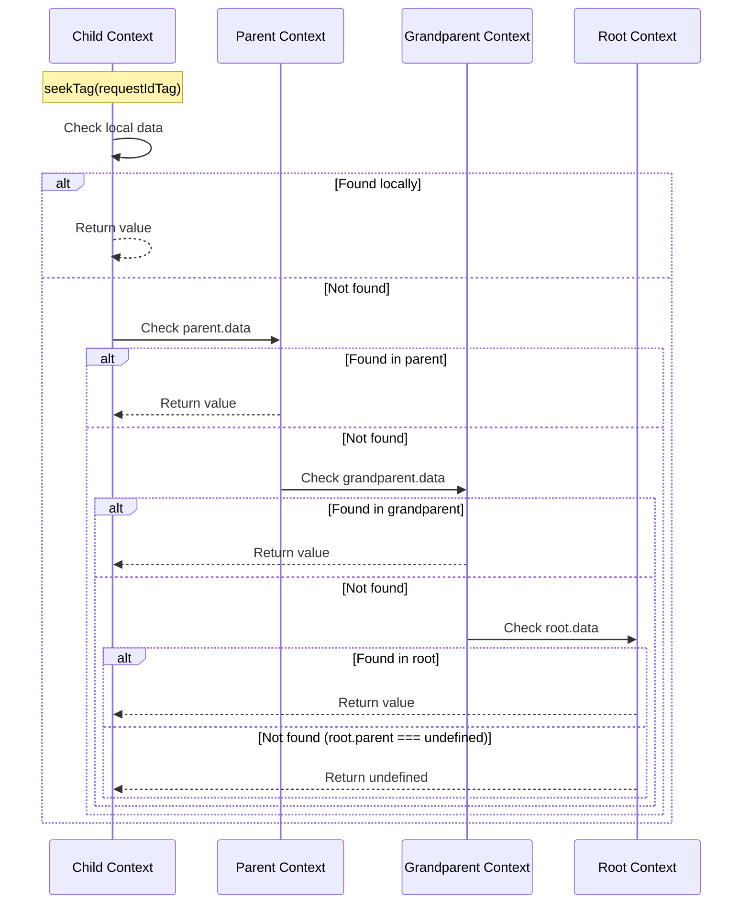

# [ADR-021] Hierarchical Data Lookup via seek() Method

## Status {#adr-021-status}
**Accepted** - 2025-12-11

## Problem/Requirement {#adr-021-problem}

Users expect `ctx.data` values set in parent contexts to be visible in child contexts, similar to scope inheritance in traditional DI systems:

```typescript
const parentFlow = flow({
  factory: async (ctx) => {
    ctx.data.setTag(requestIdTag, "req-123")

    await ctx.exec({
      flow: flow({
        factory: (childCtx) => {
          // User expects this to find "req-123" from parent
          const reqId = childCtx.data.getTag(requestIdTag)
          // But currently returns undefined (isolated data)
        }
      })
    })
  }
})
```

**Current behavior (per ADR-016):** Each `ctx.exec()` creates a child context with its own isolated `data` Map. This was intentional for:
1. Preventing concurrent exec races
2. Per-execution span tracking in OTel extension
3. Clear ownership semantics

**User need:** Access parent context data for cross-cutting concerns like request IDs, user context, trace correlation, etc.

## Exploration Journey {#adr-021-exploration}

**Initial hypothesis:** Change `ctx.data` to shared reference across parent-child chain.

**Explored isolated (c3-203):** ExecutionContext creates new `ContextDataImpl` per exec. Sharing would require passing parent's data instance.

**Explored downstream (c3-7 OTel):** The OTel extension stores spans per-execution:

```typescript
// Current OTel pattern
wrapExec: async (next, target, ctx) => {
  const parentSpan = ctx.parent?.data
    ? getSpanFromContext(ctx.parent.data)  // Read from parent
    : undefined

  const span = tracer.startSpan(spanName, {}, parentContext)
  setSpanInContext(ctx.data, span)  // Write to THIS context
  // ...
}
```

**Discovered:** Shared data would break OTel - child would overwrite parent's span.

**User clarification:** Rather than changing existing semantics, add a new method for hierarchical lookup. This preserves:
- Isolated writes (current behavior)
- Per-exec data for extensions
- Adds read-through for shared data use cases

**Confirmed approach:** Add `seek()` method that traverses parent chain for lookup.

## Solution {#adr-021-solution}

Add `seek()` and `seekTag()` methods to `ContextData` interface that look up values across the ExecutionContext parent chain:

```typescript
interface ContextData {
  // Existing methods (unchanged)
  get(key: string | symbol): unknown
  set(key: string | symbol, value: unknown): void
  getTag<T>(tag: Tag<T, boolean>): T | undefined
  setTag<T>(tag: Tag<T, boolean>, value: T): void
  // ... other existing methods

  // NEW: Hierarchical lookup methods
  /**
   * Look up value by key, traversing parent chain if not found locally.
   * Returns first match or undefined.
   */
  seek(key: string | symbol): unknown

  /**
   * Look up tag value, traversing parent chain if not found locally.
   * Returns first match or undefined (ignores tag defaults).
   */
  seekTag<T>(tag: Tag<T, boolean>): T | undefined
}
```

### Lookup Semantics



### Implementation

`ExecutionContextImpl` needs access to parent's data for seek:

```typescript
class ExecutionContextImpl implements Lite.ExecutionContext {
  // Existing fields...
  readonly parent: Lite.ExecutionContext | undefined
  private _data: ContextDataImpl | undefined

  get data(): Lite.ContextData {
    if (!this._data) {
      // Pass parent's data for seek() traversal
      this._data = new ContextDataImpl(this.parent?.data)
    }
    return this._data
  }
}

class ContextDataImpl implements Lite.ContextData {
  private readonly map = new Map<string | symbol, unknown>()

  constructor(
    private readonly parentData?: Lite.ContextData  // NEW
  ) {}

  // Existing methods unchanged...

  // NEW methods
  seek(key: string | symbol): unknown {
    if (this.map.has(key)) {
      return this.map.get(key)
    }
    return this.parentData?.seek(key)
  }

  seekTag<T>(tag: Lite.Tag<T, boolean>): T | undefined {
    if (this.map.has(tag.key)) {
      return this.map.get(tag.key) as T
    }
    return this.parentData?.seekTag(tag)
  }
}
```

### Usage Examples

**Cross-cutting request context:**

```typescript
const requestIdTag = tag<string>({ label: "requestId" })

const middleware = flow({
  factory: async (ctx) => {
    ctx.data.setTag(requestIdTag, generateRequestId())
    return ctx.exec({ flow: handler })
  }
})

const handler = flow({
  factory: async (ctx) => {
    // Finds requestId from parent middleware context
    const reqId = ctx.data.seekTag(requestIdTag)
    logger.info(`Handling request ${reqId}`)
  }
})
```

**User context propagation:**

```typescript
const userTag = tag<User>({ label: "user" })

const authFlow = flow({
  factory: async (ctx) => {
    const user = await authenticate(ctx.input)
    ctx.data.setTag(userTag, user)
    return ctx.exec({ flow: businessLogic })
  }
})

const businessLogic = flow({
  factory: (ctx) => {
    // Access user from auth context
    const user = ctx.data.seekTag(userTag)
    return processForUser(user)
  }
})
```

### Behavior Matrix

| Method | Local | Parent | Root | Returns |
|--------|-------|--------|------|---------|
| `getTag()` | Check | - | - | Local or undefined |
| `seekTag()` | Check | Check | Check | First found or undefined |
| `setTag()` | Write | - | - | Always local |

## Changes Across Layers {#adr-021-changes}

### Context Level
No changes to c3-0.

### Container Level

**c3-2 (Lite Library):**
- Update Public API section to document `seek()` and `seekTag()`

### Component Level

**c3-203 (Flow & ExecutionContext):**
1. Add `seek()` and `seekTag()` to ContextData interface
2. Add "Hierarchical Data Lookup" section documenting the methods
3. Update ExecutionContext Lifecycle to mention parent data access
4. Add usage examples

**Source files:**

| File | Changes |
|------|---------|
| `src/types.ts` | Add `seek()`, `seekTag()` to `ContextData` interface |
| `src/scope.ts` | Add `parentData` to `ContextDataImpl` constructor, implement seek methods |

## Verification {#adr-021-verification}

### Core Behavior
- [x] `seek(key)` returns local value if exists
- [x] `seek(key)` returns parent value if not local
- [x] `seek(key)` traverses full parent chain
- [x] `seek(key)` returns undefined if not found in any context
- [x] `seekTag(tag)` same traversal behavior
- [x] `seekTag(tag)` does NOT use tag's default value (pure lookup)

### Isolation Preserved
- [x] `getTag()` still returns only local values
- [x] `setTag()` still writes only to local context
- [x] Concurrent execs still have isolated data
- [x] OTel extension span tracking unchanged

### Parent Chain
- [x] Root context seek returns only local (no parent)
- [x] Child context seek checks local then parent
- [x] Grandchild context seek checks local → parent → grandparent

### Edge Cases
- [x] seek on closed context still works (data accessible)
- [x] seek with undefined parent returns undefined
- [x] seek finds value set before child context created

## Related {#adr-021-related}

- [ADR-016](./adr-016-hierarchical-execution-context.md) - Hierarchical context design (preserved)
- [c3-203](../c3-2-lite/c3-203-flow.md) - Flow & ExecutionContext (primary change)
- [c3-7](../c3-7-lite-extension-otel/README.md) - OTel extension (unchanged, validated)
