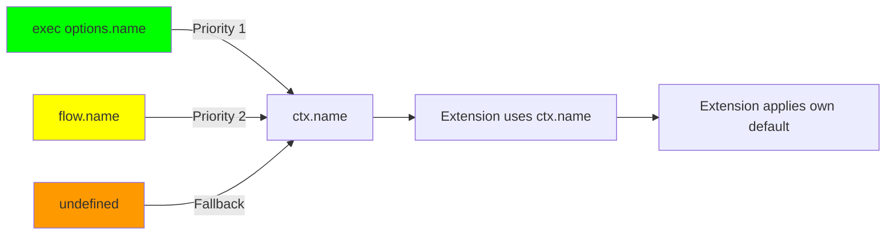

# [ADR-022] ExecutionContext Name Property for Extension Visibility

## Status {#adr-022-status}
**Accepted** - 2025-12-12

## Problem/Requirement {#adr-022-problem}

Extensions need visibility into flow/execution names for observability (tracing, logging, metrics). Currently, `wrapExec` receives `(next, target, ctx)` where:

```typescript
wrapExec: async (next, target, ctx) => {
  // Must inspect target to get name
  const name = isFlow(target) ? target.name : target.name
  // But exec-time name override is not accessible
}
```

**Issues:**
1. Exec-time `name` option (`ctx.exec({ flow, name: "override" })`) not accessible to extensions
2. Extensions must handle both Flow and Function targets differently
3. Name resolution logic duplicated across extensions

## Exploration Journey {#adr-022-exploration}

**Option 1: Add 4th parameter to wrapExec**
```typescript
wrapExec?(next, target, ctx, name: string): Promise<unknown>
```
Rejected: Signature change, not extensible for future metadata.

**Option 2: Options object as 4th parameter**
```typescript
wrapExec?(next, target, ctx, { name: string }): Promise<unknown>
```
Rejected: Still a signature change, extensions must update.

**Option 3: Add name to ExecutionContext** ✓
```typescript
interface ExecutionContext {
  readonly name: string | undefined
}
```
Selected: No signature change, extensions already have `ctx`, discoverable API.

**Design decision:** Name should be `string | undefined`, not default to "anonymous". User explicitly requested no default pollution - extensions decide their own fallback.

## Solution {#adr-022-solution}

Add `name: string | undefined` property to `ExecutionContext` interface:

```typescript
interface ExecutionContext {
  readonly input: unknown
  readonly name: string | undefined  // NEW
  readonly scope: Scope
  readonly parent: ExecutionContext | undefined
  readonly data: ContextData
  // ...
}
```

### Name Resolution Priority



1. `ctx.exec({ flow, name: "execName" })` → `ctx.name === "execName"`
2. `flow({ name: "flowName", ... })` → `ctx.name === "flowName"`
3. Neither provided → `ctx.name === undefined`

### Implementation

```typescript
class ExecutionContextImpl implements Lite.ExecutionContext {
  private readonly _execName: string | undefined
  private readonly _flowName: string | undefined

  constructor(scope, options) {
    this._execName = options?.execName
    this._flowName = options?.flowName
  }

  get name(): string | undefined {
    return this._execName ?? this._flowName
  }
}
```

Child context receives names from `exec()`:

```typescript
async exec(options) {
  const { flow, name: execName } = options

  const childCtx = new ExecutionContextImpl(this.scope, {
    parent: this,
    execName,
    flowName: flow.name
  })
}
```

### Extension Usage

```typescript
const otelExtension: Extension = {
  name: 'otel',
  wrapExec: async (next, target, ctx) => {
    // Use ctx.name with extension-specific fallback
    const spanName = ctx.name ?? options.defaultFlowName ?? "flow"
    const span = tracer.startSpan(spanName)
    // ...
  }
}
```

OTEL extension adds configurable `defaultFlowName` option for fallback.

## Changes Across Layers {#adr-022-changes}

### Container Level

**c3-2 (Lite Library):**
- Add `name` to `ExecutionContext` interface
- Update `ExecutionContextImpl` to store and expose name

### Component Level

**c3-203 (Flow & ExecutionContext):**
- Add `name` to ExecutionContext interface docs
- Update extension example to use `ctx.name`

**c3-7 (OTel Extension):**
- Use `ctx.name` instead of `target.name`
- Add `defaultFlowName` option

**Source files:**

| File | Changes |
|------|---------|
| `packages/lite/src/types.ts` | Add `name` to `ExecutionContext` interface |
| `packages/lite/src/scope.ts` | Add `_execName`, `_flowName` fields, `name` getter |
| `packages/lite-extension-otel/src/types.ts` | Add `defaultFlowName` option |
| `packages/lite-extension-otel/src/extension.ts` | Use `ctx.name` |

## Verification {#adr-022-verification}

### Core Behavior
- [ ] `ctx.name` returns exec name when provided
- [ ] `ctx.name` returns flow name when exec name not provided
- [ ] `ctx.name` returns undefined when neither provided
- [ ] Function execution uses `fn.name` as flowName

### Extension Integration
- [ ] OTEL extension uses `ctx.name`
- [ ] `defaultFlowName` fallback works
- [ ] Existing `spanName` option still overrides

### Backward Compatibility
- [ ] Existing extensions without `ctx.name` usage still work
- [ ] No breaking changes to public API

## Related {#adr-022-related}

- [c3-203](../c3-2-lite/c3-203-flow.md) - Flow & ExecutionContext (primary change)
- [c3-7](../c3-7-lite-extension-otel/README.md) - OTel extension (uses ctx.name)
- [ADR-018](./adr-018-otel-extension.md) - OTel extension design
