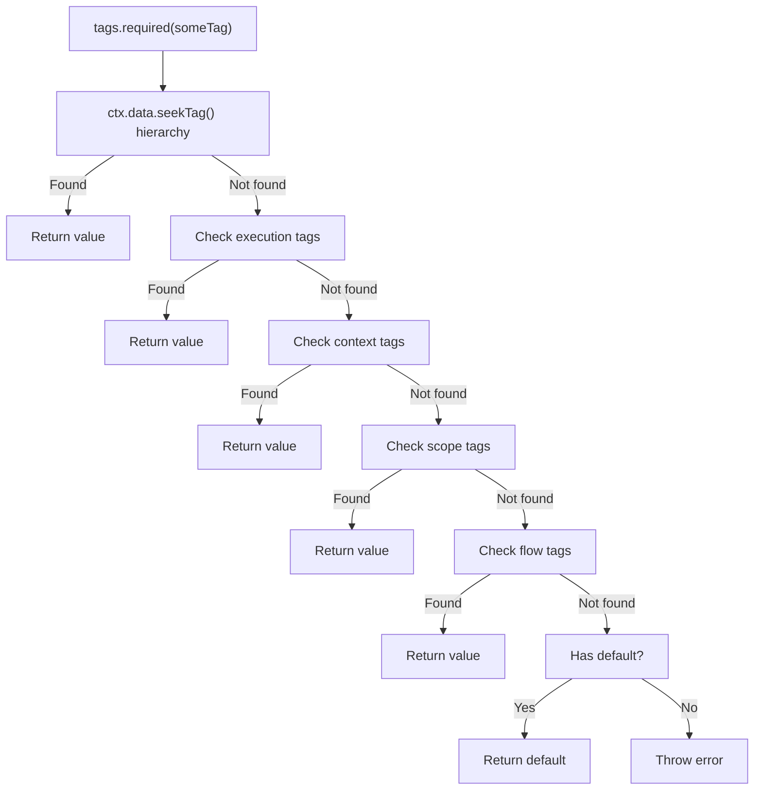

# [ADR-023] Tag Dependencies Use seekTag for Hierarchical Lookup

## Status {#adr-023-status}
**Proposed** - 2025-12-12

## Problem/Requirement {#adr-023-problem}

Users expect `tags.required(someTag)` in a child flow to find values set via `ctx.data.setTag(someTag, value)` in a parent context:

```typescript
const requestIdTag = tag<string>({ label: "requestId" })

const middleware = flow({
  factory: async (ctx) => {
    ctx.data.setTag(requestIdTag, generateRequestId())
    return ctx.exec({ flow: handler })
  }
})

const handler = flow({
  deps: { reqId: tags.required(requestIdTag) },  // User expects this to work
  factory: (ctx, { reqId }) => {
    logger.info(`Handling request ${reqId}`)
  }
})
```

**Current behavior:** `tags.required()` only looks at the merged `Tagged[]` array from:
1. Flow's attached tags
2. Scope's tags
3. Context's tags (at createContext time)
4. Execution tags (passed to exec)

It does **not** look at `ctx.data` - values set via `ctx.data.setTag()` are invisible to tag dependencies.

**User need:** Tag dependencies should search the ExecutionContext parent chain using `seekTag()` semantics (added in ADR-021), enabling middleware patterns where parent contexts set values that child flows consume as dependencies.

## Exploration Journey {#adr-023-exploration}

**Initial hypothesis:** The issue is in `resolveDeps` which calls `tag.get(tags)` on a flat array instead of using `seekTag()`.

**Explored isolated (scope.ts:524-560):**

```typescript
async resolveDeps(deps, tagSource?) {
  const tags = tagSource ?? this.tags  // Flat Tagged[] array

  for (const [key, dep] of Object.entries(deps)) {
    if (tagExecutorSymbol in dep) {
      switch (tagExecutor.mode) {
        case "required":
          result[key] = tagExecutor.tag.get(tags)  // Only searches flat array
        case "optional":
          result[key] = tagExecutor.tag.find(tags)
        case "all":
          result[key] = tagExecutor.tag.collect(tags)
      }
    }
  }
}
```

**Discovered problem:** `resolveDeps` has no access to `ExecutionContext` - it only receives the flat `Tagged[]` array. To use `seekTag()`, we need to pass the context.

**Explored upstream (ADR-021):** The `seekTag()` method exists on `ContextData` and traverses the parent chain:

```typescript
seekTag<T>(tag: Tag<T>): T | undefined {
  if (this.map.has(tag.key)) {
    return this.map.get(tag.key) as T
  }
  return this.parentData?.seekTag(tag)
}
```

**Explored adjacent (c3-203, c3-204):** Two separate tag mechanisms exist:
1. `Tagged[]` arrays - compile-time known values
2. `ctx.data.setTag()` - runtime dynamic values

**User clarification confirmed:** The request is to unify these - tag dependencies should look at both sources.

**Design consideration:** Order of precedence matters. The closest context should win:
1. **`ctx.data.seekTag()` traversal (highest priority)** - runtime values from nearest parent
2. Execution tags
3. Context tags
4. Scope tags
5. Flow tags (lowest priority)

This ensures runtime values set via `ctx.data.setTag()` in parent contexts take precedence over static `Tagged[]` values, matching the intuition that "closer" data wins.

## Solution {#adr-023-solution}

Modify `resolveDeps` to accept optional `ExecutionContext` and check `ctx.data.seekTag()` **first** (highest priority):

```typescript
async resolveDeps(
  deps: Record<string, Dependency> | undefined,
  tagSource?: Tagged<unknown>[],
  ctx?: ExecutionContext  // NEW parameter
): Promise<Record<string, unknown>> {
  if (!deps) return {}

  const result: Record<string, unknown> = {}
  const tags = tagSource ?? this.tags

  for (const [key, dep] of Object.entries(deps)) {
    if (tagExecutorSymbol in dep) {
      const tagExecutor = dep as TagExecutor<unknown>

      switch (tagExecutor.mode) {
        case "required": {
          // First try ctx.data hierarchy (highest priority)
          if (ctx) {
            const fromData = ctx.data.seekTag(tagExecutor.tag)
            if (fromData !== undefined) {
              result[key] = fromData
              break
            }
          }
          // Fall back to Tagged[] array
          result[key] = tagExecutor.tag.get(tags)
          break
        }
        case "optional": {
          // First try ctx.data hierarchy (highest priority)
          if (ctx) {
            const fromData = ctx.data.seekTag(tagExecutor.tag)
            if (fromData !== undefined) {
              result[key] = fromData
              break
            }
          }
          // Fall back to Tagged[] array
          result[key] = tagExecutor.tag.find(tags)
          break
        }
        case "all": {
          // Collect from ctx.data hierarchy first (higher priority)
          const fromData = ctx ? collectFromDataHierarchy(ctx, tagExecutor.tag) : []
          // Then collect from Tagged[] array
          const fromTags = tagExecutor.tag.collect(tags)
          result[key] = [...fromData, ...fromTags]
          break
        }
      }
    }
  }
  return result
}
```

### Helper for `tags.all()` Hierarchy Collection

```typescript
function collectFromDataHierarchy<T>(
  ctx: ExecutionContext,
  tag: Tag<T>
): T[] {
  const results: T[] = []
  let current: ExecutionContext | undefined = ctx

  while (current) {
    const value = current.data.getTag(tag)  // Local only, no seek
    if (value !== undefined) {
      results.push(value)
    }
    current = current.parent
  }

  return results
}
```

### Call Site Changes

In `ExecutionContextImpl.execFlowInternal()`:

```typescript
private async execFlowInternal(options) {
  const { flow, tags: execTags } = options

  const allTags = [...(execTags ?? []), ...this.baseTags, ...(flow.tags ?? [])]

  // Pass `this` (ExecutionContext) to enable seekTag fallback
  const resolvedDeps = await this.scope.resolveDeps(flow.deps, allTags, this)
  // ...
}
```

### Lookup Precedence



### Usage Example

```typescript
const requestIdTag = tag<string>({ label: "requestId" })
const userTag = tag<User>({ label: "user" })

const authMiddleware = flow({
  factory: async (ctx) => {
    const user = await authenticate(ctx.input)
    ctx.data.setTag(userTag, user)
    ctx.data.setTag(requestIdTag, generateId())

    return ctx.exec({ flow: businessLogic })
  }
})

const businessLogic = flow({
  deps: {
    user: tags.required(userTag),      // Found via seekTag from parent
    reqId: tags.optional(requestIdTag) // Found via seekTag from parent
  },
  factory: (ctx, { user, reqId }) => {
    logger.info(`Processing for ${user.name}, request ${reqId}`)
    return process(ctx.input, user)
  }
})
```

## Changes Across Layers {#adr-023-changes}

### Context Level
No changes to c3-0.

### Container Level

**c3-2 (Lite Library):**
- Update Public API section to document `resolveDeps` context parameter
- Add note about tag resolution order in Extension System section

### Component Level

**c3-204 (Tag System):**
1. Update "Tag Extraction Modes" section to document hierarchical lookup behavior
2. Add "Lookup Precedence" subsection explaining Tagged[] → ctx.data.seekTag() fallback
3. Update "Tag Sources" to include ctx.data as a source

**c3-203 (Flow & ExecutionContext):**
1. Update "Flow with Tag Dependencies" example to show ctx.data.setTag() pattern
2. Add cross-reference to c3-204 for hierarchical tag lookup

**Source files:**

| File | Changes |
|------|---------|
| `src/scope.ts` | Add `ctx` parameter to `resolveDeps`, implement seekTag fallback |
| `src/types.ts` | Update `Scope.resolveDeps` signature |

## Verification {#adr-023-verification}

### Core Behavior
- [ ] `tags.required(tag)` checks ctx.data.seekTag() first (highest priority)
- [ ] `tags.required(tag)` falls back to Tagged[] array if not in ctx.data
- [ ] `tags.required(tag)` traverses full parent chain via seekTag
- [ ] `tags.required(tag)` throws if not found anywhere and no default
- [ ] `tags.optional(tag)` returns undefined if not found anywhere
- [ ] `tags.all(tag)` collects from ctx.data hierarchy first, then Tagged[] array

### Precedence
- [ ] ctx.data.seekTag() values override Tagged[] array values
- [ ] Closest parent's ctx.data value wins (seekTag semantics)
- [ ] Tagged[] array used as fallback when not in ctx.data
- [ ] Within Tagged[] array: exec > context > scope > flow tags

### Parent Chain
- [ ] Child flow finds parent's ctx.data.setTag value
- [ ] Grandchild flow finds grandparent's ctx.data.setTag value
- [ ] Root context (no parent) only searches Tagged[] array

### Atom Resolution
- [ ] Atom deps still work (no ExecutionContext available)
- [ ] Atom deps only search scope.tags (no ctx.data)

### Backwards Compatibility
- [ ] Existing code passing tags via Tagged[] still works (as fallback)
- [ ] ctx.data.seekTag() now takes precedence over Tagged[] array (breaking change)
- [ ] Code not using ctx.data.setTag() is unaffected

## Related {#adr-023-related}

- [ADR-021](./adr-021-hierarchical-data-seek.md) - Introduced seekTag() method
- [c3-204](../c3-2-lite/c3-204-tag.md) - Tag System (primary change)
- [c3-203](../c3-2-lite/c3-203-flow.md) - Flow & ExecutionContext (usage patterns)
