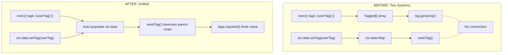
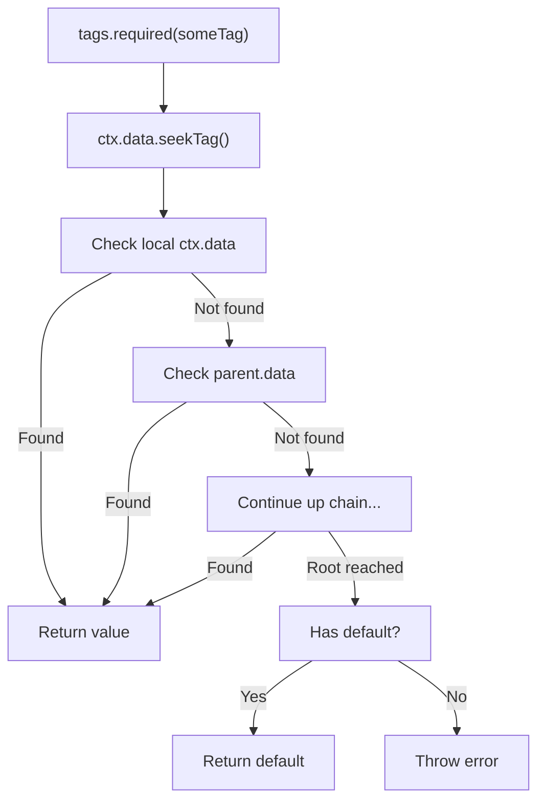

# [ADR-023] Unify Tag System Under ctx.data with seekTag

## Status {#adr-023-status}
**Proposed** - 2025-12-12

## Problem/Requirement {#adr-023-problem}

The current tag system has two separate mechanisms that cause confusion:

**1. Tagged[] arrays** - passed via `exec({ tags })`, `createContext({ tags })`, `createScope({ tags })`
- Looked up via `tag.get(taggedArray)`
- Does NOT propagate to grandchildren (exec tags only visible to immediate child)

**2. ctx.data** - runtime storage with hierarchical lookup
- Set via `ctx.data.setTag(tag, value)`
- Looked up via `ctx.data.seekTag(tag)` which traverses parent chain
- NOT visible to `tags.required()` dependencies

```typescript
const middleware = flow({
  factory: async (ctx) => {
    ctx.data.setTag(userTag, user)
    return ctx.exec({ flow: handler })
  }
})

const handler = flow({
  deps: { user: tags.required(userTag) },
  factory: (ctx, { user }) => {
    // FAILS! tags.required() doesn't see ctx.data values
  }
})
```

**Additional bug:** Exec tags don't propagate to grandchildren:

```typescript
ctx.exec({ flow: f1, tags: [userTag('alice')] })

const f1 = flow({
  factory: (ctx) => ctx.exec({ flow: f2 })
})

const f2 = flow({
  deps: { user: tags.required(userTag) },
  factory: (ctx, { user }) => {
    // FAILS! userTag not visible to grandchild
  }
})
```

The README implies a unified system, but code has two separate systems.

## Solution {#adr-023-solution}

Unify under ctx.data: auto-populate Tagged[] into ctx.data, use seekTag() for resolution.



### Auto-Population Rules

| Source | When | Populates Into |
|--------|------|----------------|
| `exec({ tags: [...] })` | Child context created | `childCtx.data` |
| `flow.tags` | Flow executes | `childCtx.data` |
| `createContext({ tags: [...] })` | Context created | `rootCtx.data` |
| `createScope({ tags: [...] })` | Context created | `rootCtx.data` (via createContext) |

### Implementation Details

**1. Auto-populate in exec():**

```typescript
async exec(options) {
  const childCtx = new ExecutionContextImpl(this.scope, {
    parent: this,
    input: parsedInput,
  })

  if ("flow" in options) {
    const { flow, tags: execTags } = options

    for (const tagged of execTags ?? []) {
      childCtx.data.set(tagged.key, tagged.value)
    }

    for (const tagged of flow.tags ?? []) {
      if (!childCtx.data.has(tagged.key)) {
        childCtx.data.set(tagged.key, tagged.value)
      }
    }
  }

  return childCtx.execFlowInternal(options)
}
```

**2. Auto-populate in createContext():**

```typescript
createContext(options?: CreateContextOptions): ExecutionContext {
  const ctx = new ExecutionContextImpl(this, options)

  for (const tagged of options?.tags ?? []) {
    ctx.data.set(tagged.key, tagged.value)
  }

  for (const tagged of this.tags) {
    if (!ctx.data.has(tagged.key)) {
      ctx.data.set(tagged.key, tagged.value)
    }
  }

  return ctx
}
```

**3. Change resolveDeps to use seekTag():**

```typescript
async resolveDeps(
  deps: Record<string, Dependency> | undefined,
  ctx?: ExecutionContext
): Promise<Record<string, unknown>> {
  if (!deps) return {}

  const result: Record<string, unknown> = {}

  for (const [key, dep] of Object.entries(deps)) {
    if (tagExecutorSymbol in dep) {
      const tagExecutor = dep as TagExecutor<unknown>

      switch (tagExecutor.mode) {
        case "required": {
          const value = ctx?.data.seekTag(tagExecutor.tag)
          if (value !== undefined) {
            result[key] = value
          } else if (tagExecutor.tag.hasDefault) {
            result[key] = tagExecutor.tag.defaultValue
          } else {
            throw new Error(`Tag "${tagExecutor.tag.label}" not found`)
          }
          break
        }
        case "optional": {
          const value = ctx?.data.seekTag(tagExecutor.tag)
          result[key] = value ?? tagExecutor.tag.defaultValue
          break
        }
        case "all": {
          result[key] = ctx ? collectFromHierarchy(ctx, tagExecutor.tag) : []
          break
        }
      }
    }
  }

  return result
}
```

**4. Helper for tags.all():**

```typescript
function collectFromHierarchy<T>(ctx: ExecutionContext, tag: Tag<T>): T[] {
  const results: T[] = []
  let current: ExecutionContext | undefined = ctx

  while (current) {
    const value = current.data.getTag(tag)
    if (value !== undefined) {
      results.push(value)
    }
    current = current.parent
  }

  return results
}
```

### Lookup Precedence



Priority within ctx.data (highest to lowest):
1. Current context (exec tags, ctx.data.setTag, flow.tags)
2. Parent context
3. Grandparent context
4. ... up to root (context tags, scope tags)
5. Tag's default value

### Usage Example

```typescript
const userTag = tag<User>({ label: 'user' })
const requestIdTag = tag<string>({ label: 'requestId' })

const authMiddleware = flow({
  factory: async (ctx) => {
    const user = await authenticate(ctx.input)
    ctx.data.setTag(userTag, user)
    return ctx.exec({ flow: handler })
  }
})

await ctx.exec({
  flow: handler,
  tags: [requestIdTag('req-123')]
})

const handler = flow({
  deps: {
    user: tags.required(userTag),
    reqId: tags.optional(requestIdTag)
  },
  factory: (ctx, { user, reqId }) => {
    // Works! Both found through unified seekTag
  }
})

const deepHandler = flow({
  deps: { user: tags.required(userTag) },
  factory: (ctx, { user }) => {
    // Also works! Grandchild finds via parent chain
  }
})
```

## Changes Across Layers {#adr-023-changes}

### Container Level

**c3-2 (Lite Library):**
- Remove `baseTags` from ExecutionContextImpl
- Remove `tagSource` parameter from `resolveDeps`
- Add `ctx` parameter to `resolveDeps`
- Add auto-population logic to `exec()` and `createContext()`

### Component Level

**c3-203 (Flow & ExecutionContext):**
- Remove "Tag Merge Order" section
- Document auto-population behavior
- Update examples to show unified system

**c3-204 (Tag System):**
- Update "Tag Extraction Modes" to document seekTag usage
- Update "Tag Sources" to explain auto-population
- Change `tags.all()` documentation (hierarchy collection)

**Source files:**

| File | Changes |
|------|---------|
| `src/scope.ts` | Remove baseTags, add auto-population, change resolveDeps |
| `src/types.ts` | Update Scope interface (remove resolveDeps tagSource param) |

## Verification {#adr-023-verification}

### Core Behavior
- [ ] `exec({ tags })` auto-populates into childCtx.data
- [ ] `flow.tags` auto-populates into childCtx.data
- [ ] `createContext({ tags })` auto-populates into ctx.data
- [ ] `createScope({ tags })` auto-populates via createContext
- [ ] `tags.required()` uses seekTag() to find values
- [ ] `tags.optional()` uses seekTag() to find values
- [ ] `tags.all()` collects from hierarchy (one per level)

### Propagation
- [ ] Exec tags visible to grandchildren via seekTag
- [ ] ctx.data.setTag() in parent visible to tags.required() in child
- [ ] Deeper nesting still finds values

### Priority
- [ ] exec tags override flow.tags (same tag in same context)
- [ ] Child ctx.data overrides parent ctx.data (seekTag behavior)
- [ ] ctx.data.setTag() can override auto-populated values

### Atoms
- [ ] Atom deps work without ExecutionContext
- [ ] Atom tag deps use scope.tags (fallback behavior)

### Backwards Compatibility
- [ ] Existing exec({ tags }) works (auto-populated)
- [ ] Existing createContext({ tags }) works
- [ ] `tags.all()` semantic change: hierarchy levels, not array duplicates

## Migration {#adr-023-migration}

**For most users:** No changes required. Existing code works, plus new capabilities.

**If using `tags.all()` with duplicate tags at same level:**

```typescript
const rolesTag = tag<string[]>({ label: 'roles' })
exec({ tags: [rolesTag(['admin', 'editor'])] })
tags.required(rolesTag)
```

## Related {#adr-023-related}

- [ADR-021](./adr-021-hierarchical-data-seek.md) - Introduced seekTag() method
- [c3-203](../c3-2-lite/c3-203-flow.md) - Flow & ExecutionContext
- [c3-204](../c3-2-lite/c3-204-tag.md) - Tag System
