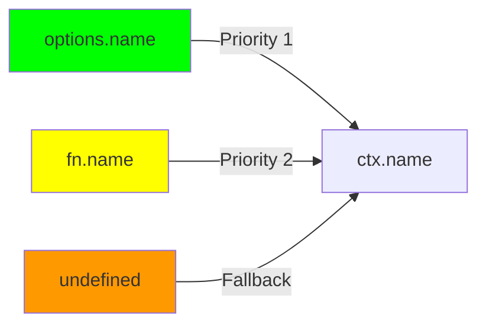

# [ADR-024] Add name Option to ExecFnOptions for API Consistency

## Status {#adr-024-status}
**Accepted** - 2025-12-12

## Problem/Requirement {#adr-024-problem}

`ctx.exec()` supports two execution modes:
1. **Flow execution** - `ctx.exec({ flow, input, name?, tags? })`
2. **Function execution** - `ctx.exec({ fn, params, tags? })`

Flow execution has `name?: string` for explicit naming, but function execution lacks it:

```typescript
// Flow: can provide explicit name
await ctx.exec({ flow: myFlow, input: data, name: "processOrder" })

// Function: no name option - only uses fn.name
await ctx.exec({
  fn: async (ctx, orderId: string) => processOrder(orderId),
  params: ["order-123"]
  // name: "processOrder"  <-- NOT AVAILABLE
})
```

This creates an API inconsistency. Function executions can only derive names from:
1. The function's JavaScript `.name` property (often empty for arrow functions)
2. Nothing else

**Impact:**
- Extensions (OTel, Devtools) see `ctx.name === undefined` for anonymous functions
- Tracing spans have poor names
- Logging/metrics lack meaningful labels

## Exploration Journey {#adr-024-exploration}

**Initial hypothesis:** Component-level change to c3-203 (Flow & ExecutionContext).

**Explored:**
- **Isolated:** `ExecFnOptions` in `types.ts` lacks `name` property
- **Upstream:** `ExecutionContext` already has `name: string | undefined` (ADR-022)
- **Adjacent:** `ExecFlowOptions` has `name?: string` - established pattern
- **Downstream:** OTel extension already uses `ctx.name` - will benefit automatically

**Confirmed:**
- ADR-022 established name resolution: `execName > flowName > undefined`
- For functions, only `flowName` (from `fn.name`) is populated
- Need to pass explicit `execName` through `ExecFnOptions`

**Scope:** Contained to c3-203 types and implementation. No upstream impacts.

## Solution {#adr-024-solution}

Add `name?: string` to `ExecFnOptions`:

```typescript
export interface ExecFnOptions<Output, Args extends unknown[] = unknown[]> {
  fn: (ctx: ExecutionContext, ...args: Args) => MaybePromise<Output>
  params: Args
  name?: string  // NEW
  tags?: Tagged<unknown>[]
}
```

### Implementation Change

In `scope.ts` `exec()` method, pass `execName` for function execution:

```typescript
} else {
  const childCtx = new ExecutionContextImpl(this.scope, {
    parent: this,
    tags: this.baseTags,
    execName: options.name,  // NEW: explicit name takes priority
    flowName: options.fn.name || undefined,
    input: options.params
  })
  // ...
}
```

### Name Resolution (unchanged logic)



### Usage

```typescript
// Before: anonymous function, ctx.name === undefined
await ctx.exec({
  fn: async (ctx, id) => fetchData(id),
  params: ["123"]
})

// After: explicit name, ctx.name === "fetchUserData"
await ctx.exec({
  fn: async (ctx, id) => fetchData(id),
  params: ["123"],
  name: "fetchUserData"
})
```

## Changes Across Layers {#adr-024-changes}

### Component Level

**c3-203 (Flow & ExecutionContext):**
- Add `name?: string` to `ExecFnOptions` interface documentation
- Update "Executing Functions" example to show `name` option

**Source files:**

| File | Changes |
|------|---------|
| `packages/lite/src/types.ts` | Add `name?: string` to `ExecFnOptions` |
| `packages/lite/src/scope.ts` | Pass `options.name` as `execName` for function execution |

## Verification {#adr-024-verification}

- [x] `ExecFnOptions` accepts `name?: string`
- [x] `ctx.name` returns explicit name when provided
- [x] `ctx.name` falls back to `fn.name` when explicit name not provided
- [x] `ctx.name` returns `undefined` when neither available
- [x] OTel extension receives correct name for function executions
- [x] TypeScript types compile correctly
- [x] No breaking changes to existing code

## Related {#adr-024-related}

- [ADR-022](./adr-022-execution-context-name.md) - Established `ctx.name` property
- [c3-203](../c3-2-lite/c3-203-flow.md) - Flow & ExecutionContext (primary change)
- [c3-7](../c3-7-lite-extension-otel/README.md) - OTel extension (benefits automatically)
