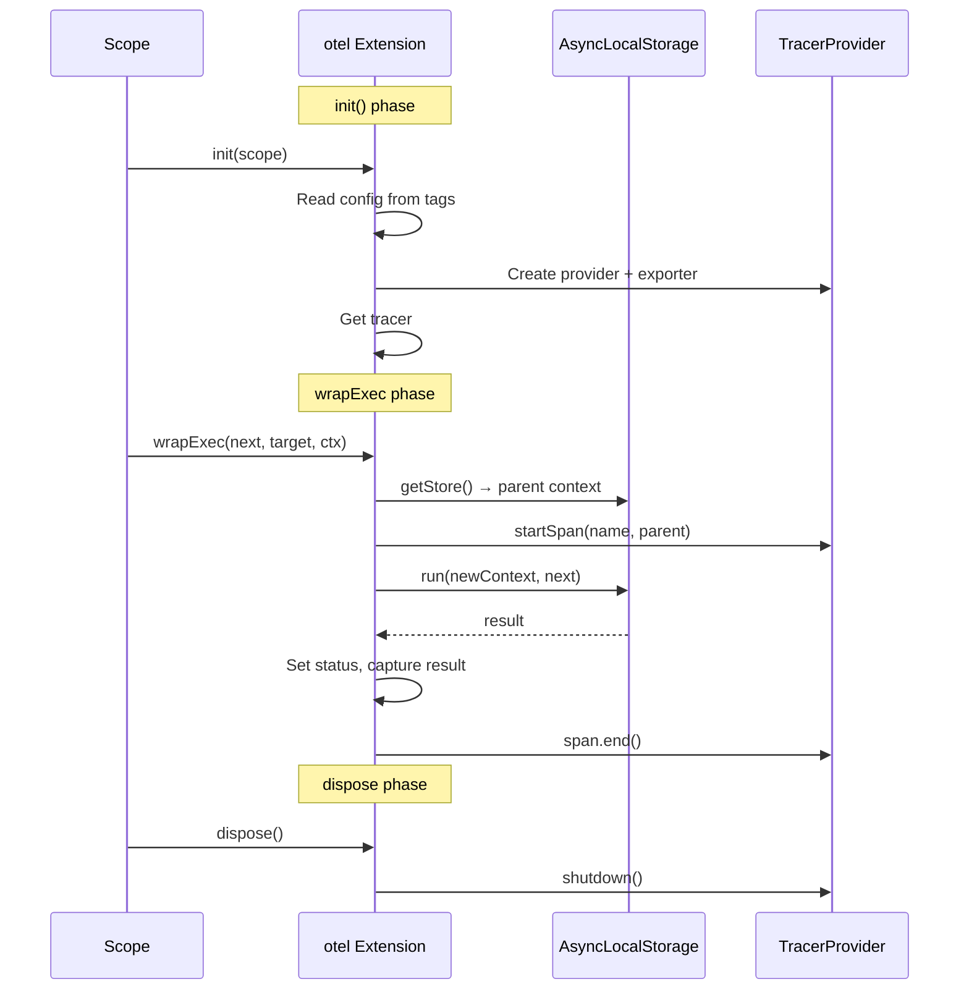

# [ADR-025] Simplify OTEL Extension with Self-Contained Provider Management

## Status {#adr-025-status}
**Accepted** - 2025-12-12

## Problem/Requirement {#adr-025-problem}

The current OTEL extension (ADR-018) over-engineers for flexibility:

1. **External SDK setup required** - Users must configure TracerProvider, MeterProvider, exporters before using the extension
2. **Complex file structure** - 5 source files for what could be 1
3. **ContextData for span storage** - Couples to pumped-fn internals when AsyncLocalStorage is simpler
4. **No lifecycle management** - Extension doesn't handle provider init/shutdown
5. **Missing result capture** - No built-in way to capture operation inputs/outputs in spans

The 80% use case wants tracing "just working" with minimal configuration.

## Exploration Journey {#adr-025-exploration}

**Initial hypothesis:** Simplify c3-7 by adopting a self-contained pattern with tag-based config.

**Explored isolated (c3-7):**
- Current: 5 files, ~200 lines, external tracer required
- Proposed: 1 file, ~80 lines, self-contained with tags
- ContextData Symbol pattern adds complexity vs AsyncLocalStorage

**Explored upstream (c3-2 Extension):**
- Extension interface has `init()` and `dispose()` hooks - underutilized by current implementation
- Tags system (c3-204) can replace options object for configuration
- No changes needed to Extension interface

**Explored adjacent (c3-4 lite-devtools):**
- Devtools is also self-contained with transports
- Pattern validates: extensions can manage their own infrastructure

**Explored downstream (users):**
- Current API requires ~15 lines of setup
- Simplified API: 3 lines (just add extension with tag overrides)

**Discovered:**
1. `init()` hook can create TracerProvider from config
2. `dispose()` hook can handle provider.shutdown()
3. AsyncLocalStorage is standard Node.js API, simpler than Symbol-based ContextData
4. Result/input capture with redaction addresses real observability needs
5. Metrics should be separate extension (single responsibility)

**Confirmed:**
- Simplification is backward-compatible via optional config tags
- AsyncLocalStorage works in Node.js 18+ (our target)
- Provider lifecycle in extension eliminates user boilerplate

## Solution {#adr-025-solution}

Refactor to self-contained extension with:

1. **Tag-based configuration** - Use pumped-fn tags instead of options object
2. **AsyncLocalStorage context** - Replace ContextData Symbol with ALS
3. **Lifecycle management** - `init()` creates provider, `dispose()` shuts down
4. **Result capture** - Optional input/output capture with redaction support
5. **Hierarchical redaction** - Uses `seekTag()` to traverse parent chain, enabling a parent to redact all child spans
6. **Remove metrics** - Separate concern (can be separate extension)

### New API Design

```typescript
import { tag, createScope } from '@pumped-fn/lite'
import { otel, otelConfig } from '@pumped-fn/lite-extension-otel'

const scope = createScope({
  extensions: [otel()]
})

scope.setTag(otelConfig.name, 'my-app')
scope.setTag(otelConfig.url, 'http://localhost:4318/v1/traces')
scope.setTag(otelConfig.type, 'http')
scope.setTag(otelConfig.captureResults, true)
```

### Configuration Tags

```typescript
export const otelConfig = {
  name: tag<string>({ label: 'otel.name', default: 'default-app' }),
  url: tag<string>({ label: 'otel.url', default: 'http://localhost:4318/v1/traces' }),
  type: tag<'http' | 'grpc' | 'console'>({ label: 'otel.type', default: 'console' }),
  captureResults: tag<boolean>({ label: 'otel.captureResults', default: true }),
  redact: tag<boolean>({ label: 'otel.redact', default: false }),
}
```

### Simplified Implementation



### Context Flow (AsyncLocalStorage vs ContextData)

```mermaid
graph LR
    subgraph "Current (ContextData Symbol)"
        CD1[ctx.data.set SPAN_KEY span1]
        CD2[ctx.parent.data.get SPAN_KEY]
        CD1 --> CD2
    end

    subgraph "Proposed (AsyncLocalStorage)"
        ALS1[als.run context1 next]
        ALS2[als.getStore → context1]
        ALS1 --> ALS2
    end

    style CD1 fill:#4a1c1c
    style CD2 fill:#4a1c1c
    style ALS1 fill:#2d5016
    style ALS2 fill:#2d5016
```



### Extension Implementation

```typescript
export function otel(): Lite.Extension {
  let tracer: Tracer
  let provider: BasicTracerProvider
  let captureResults = false
  const otelContextStorage = new AsyncLocalStorage<Context>()

  return {
    name: 'otel-extension',

    async init(scope) {
      const config = await scope.resolve(otelConfigAtom)
      captureResults = config.captureResults

      const exporter = config.type === 'console'
        ? new ConsoleSpanExporter()
        : new OTLPTraceExporter({ url: config.url })

      provider = new BasicTracerProvider({
        spanProcessors: [new SimpleSpanProcessor(exporter)],
        resource: defaultResource().merge(
          resourceFromAttributes({ [ATTR_SERVICE_NAME]: config.name })
        )
      })

      tracer = provider.getTracer(config.name)
    },

    wrapExec(next, _target, ctx) {
      const spanName = ctx.name ?? 'unknown-flow'
      // seekTag traverses parent chain - enables hierarchical redaction
      const shouldRedact = ctx.data.seekTag(otelConfig.redact) ?? false
      const parentContext = otelContextStorage.getStore() || ROOT_CONTEXT
      const span = tracer.startSpan(spanName, undefined, parentContext)
      const newContext = trace.setSpan(parentContext, span)

      return otelContextStorage.run(newContext, () => next())
        .then((result) => {
          span.setStatus({ code: SpanStatusCode.OK })
          if (!shouldRedact && captureResults) {
            span.setAttribute('operation.result', safeStringify(result))
          }
          return result
        })
        .catch((err) => {
          span.setStatus({ code: SpanStatusCode.ERROR, message: String(err) })
          span.recordException(err instanceof Error ? err : new Error(String(err)))
          throw err
        })
        .finally(() => span.end())
    },

    async dispose() {
      await provider?.shutdown()
    }
  }
}
```

### Comparison

| Aspect | ADR-018 | ADR-025 |
|--------|---------|---------|
| Setup lines | ~15 | ~3 |
| Source files | 5 | 1 |
| LOC | ~200 | ~80 |
| External setup | Required | None |
| Context storage | ContextData Symbol | AsyncLocalStorage |
| Provider lifecycle | User managed | Extension managed |
| Result capture | No | Yes, with redaction |
| Metrics | Built-in | Separate extension |
| Atom tracing | Yes | No (flows only) |
| Filters | Yes | No (trace all) |

## Changes Across Layers {#adr-025-changes}

### Context Level

**c3-0 (README.md):**
- No changes (container already listed)

### Container Level

**c3-7-lite-extension-otel:**
- Update README.md with simplified API
- Update architecture diagram
- Document tag-based configuration
- Add migration section for advanced users

### Component Level

No component-level docs needed - single-file implementation.

### Source Files

```
packages/lite-extension-otel/
├── src/
│   └── index.ts          # Single file: otel(), otelConfig
├── tests/
│   └── otel.test.ts      # Extension tests
├── package.json
└── README.md
```

**Dependencies change:**
```json
{
  "dependencies": {
    "@opentelemetry/api": "^1.0",
    "@opentelemetry/sdk-trace-base": "^1.0",
    "@opentelemetry/exporter-trace-otlp-http": "^0.50",
    "@opentelemetry/resources": "^1.0",
    "@opentelemetry/semantic-conventions": "^1.0"
  },
  "peerDependencies": {
    "@pumped-fn/lite": "^0.x"
  }
}
```

Note: OTel packages move from peer to direct dependencies since extension manages provider.

## Verification {#adr-025-verification}

- [x] Extension initializes provider from tag configuration
- [x] Spans created for flow executions with correct names
- [x] Parent-child span hierarchy via AsyncLocalStorage
- [x] Result capture works when enabled
- [x] Redaction prevents sensitive data in spans
- [x] Provider shutdown called on dispose
- [x] Console exporter works in development
- [ ] OTLP HTTP exporter sends to collector (manual verification needed)
- [x] Tests pass with in-memory exporter
- [ ] No memory leaks from AsyncLocalStorage (manual profiling needed)

## Migration {#adr-025-migration}

### Removed: Atom Tracing

ADR-018 included `wrapResolve` for tracing atom resolutions. This is removed because:

1. **Noise vs signal**: Atoms resolve frequently during dependency injection. Tracing every resolution creates span floods that obscure meaningful operation traces.
2. **Performance**: Each atom resolve would create a span, adding ~10-20ns overhead per resolution. For complex dependency graphs, this compounds.
3. **Scope**: The extension now focuses on flow executions - the meaningful business operations users want to trace.

**For users who need atom-level visibility**: Use the lite-devtools extension which provides execution tree inspection without span overhead.

### Removed: Trace Filters

ADR-018 had filter configuration to exclude certain flows from tracing. This is removed because:

1. **Complexity vs utility**: Filter configuration added API surface for an edge case.
2. **Alternative**: Use `otelConfig.redact` tag per-execution to control what gets captured, or wrap flows you don't want traced outside the otel scope.

## Related {#adr-025-related}

- [ADR-018](./adr-018-otel-extension.md) - Original design being simplified
- [ADR-016](./adr-016-hierarchical-execution-context.md) - Hierarchical context (still useful, less central)
- [c3-7](../c3-7-lite-extension-otel/README.md) - Container docs to update
- [c3-204](../c3-2-lite/c3-204-tag.md) - Tag system used for configuration
