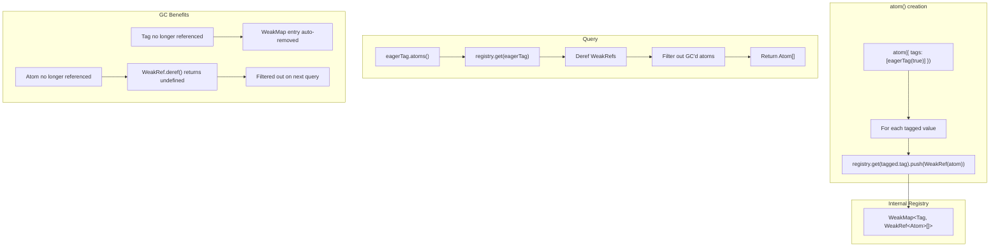

# [ADR-026] Tag Atom Registry for Automatic Tracking

## Status {#adr-026-status}
**Accepted** - 2025-12-15

## Problem/Requirement {#adr-026-problem}

Need a lightweight way to track which atoms are associated with a tag for patterns like:
- Eager resolution: resolve all atoms marked with `eagerTag` at scope creation
- Debugging: list all atoms using a specific tag
- Extension patterns: registry-based features without core changes

Currently, there's no way to query "which atoms have this tag?" without maintaining a separate registry manually.

**Desired API:**

```typescript
const eagerTag = tag<true>({ label: 'eager' })

const atomA = atom({
  tags: [eagerTag(true)],
  factory: () => 'a'
})

const atomB = atom({
  tags: [eagerTag(true)],
  factory: () => 'b'
})

// Query atoms with this tag
eagerTag.atoms()  // → [atomA, atomB]

// Use case: eager resolution
for (const atom of eagerTag.atoms()) {
  await scope.resolve(atom)
}
```

## Exploration Journey {#adr-026-exploration}

**Initial hypothesis:** Add `defaultFactory` option for lazy defaults with side effects.

**Explored:** Factory approach requires passing resolution context, memoization handling, and complicates the Tag API significantly.

**Discovered:** Simpler solution - just track the atom→tag relationship automatically and provide a query method.

**Key insight:** The relationship is established at atom definition time when `tags: [...]` is specified. No need for lazy evaluation or factories.

**Refined:** Use `WeakMap<Tag, WeakRef<Atom>[]>` for automatic cleanup when tags or atoms are garbage collected.

## Solution {#adr-026-solution}

Add an internal registry using WeakMap that tracks atoms by tag, with automatic registration during `atom()` creation.



**Key behaviors:**

1. **Automatic tracking**: `atom()` registers to registry when tags present
2. **Memory-friendly**: `WeakMap` + `WeakRef` enables garbage collection
3. **Clean on query**: `tag.atoms()` filters out GC'd atoms
4. **No new options**: Works automatically

### Tagged Interface Change

Add reference to parent Tag for WeakMap key lookup:

```typescript
interface Tagged<T> {
  readonly [taggedSymbol]: true
  readonly key: symbol
  readonly value: T
  readonly tag: Tag<T, boolean>  // NEW: reference to parent tag
}
```

### Registry Implementation

```typescript
// Internal registry - not exported
const registry = new WeakMap<Lite.Tag<unknown, boolean>, WeakRef<Lite.Atom<unknown>>[]>()

// Called by atom() during creation
export function registerAtomToTags(
  atom: Lite.Atom<unknown>,
  tags: Lite.Tagged<unknown>[]
): void {
  for (const tagged of tags) {
    const refs = registry.get(tagged.tag) ?? []
    refs.push(new WeakRef(atom))
    registry.set(tagged.tag, refs)
  }
}

// Called by tag.atoms()
export function getAtomsForTag(tag: Lite.Tag<unknown, boolean>): Lite.Atom<unknown>[] {
  const refs = registry.get(tag)
  if (!refs) return []

  const live: Lite.Atom<unknown>[] = []
  const liveRefs: WeakRef<Lite.Atom<unknown>>[] = []

  for (const ref of refs) {
    const atom = ref.deref()
    if (atom) {
      live.push(atom)
      liveRefs.push(ref)
    }
  }

  // Update with only live refs
  if (liveRefs.length > 0) {
    registry.set(tag, liveRefs)
  } else {
    registry.delete(tag)
  }

  return live
}
```

### Tag API Addition

```typescript
interface Tag<T, HasDefault extends boolean = false> {
  // ... existing properties

  atoms(): Atom<unknown>[]  // NEW: Get all atoms using this tag
}
```

### tag() Changes

```typescript
function createTagged(value: T): Lite.Tagged<T> {
  let validatedValue = value
  if (parse) {
    try {
      validatedValue = parse(value)
    } catch (err) {
      throw new ParseError(...)
    }
  }
  return {
    [taggedSymbol]: true,
    key,
    value: validatedValue,
    tag: tagInstance,  // NEW: reference to this tag
  }
}

// Add atoms() to returned tag object
const tagInstance = Object.assign(createTagged, {
  [tagSymbol]: true as const,
  key,
  label: options.label,
  hasDefault,
  defaultValue,
  parse,
  get,
  find,
  collect,
  atoms() {  // NEW
    return getAtomsForTag(tagInstance)
  },
})
```

### atom() Integration

```typescript
export function atom<T>(options: AtomOptions<T>): Lite.Atom<T> {
  const atomInstance = {
    // ... existing atom creation
  }

  // Register to tag registry
  if (options.tags?.length) {
    registerAtomToTags(atomInstance, options.tags)
  }

  return atomInstance
}
```

## Changes Across Layers {#adr-026-changes}

### Component Level

#### c3-204 (Tag System)

**tag.ts changes:**

1. Add internal `registry: WeakMap<Tag, WeakRef<Atom>[]>`
2. Export `registerAtomToTags()` for atom.ts to use
3. Add `tag` property to Tagged interface
4. Add `atoms()` method to Tag

**types.ts changes:**

```typescript
export interface Tagged<T> {
  readonly [taggedSymbol]: true
  readonly key: symbol
  readonly value: T
  readonly tag: Tag<T, boolean>  // NEW
}

export interface Tag<T, HasDefault extends boolean = false> {
  // ... existing
  atoms(): Atom<unknown>[]  // NEW
}
```

#### c3-202 (Atom)

**atom.ts changes:**

```typescript
import { registerAtomToTags } from './tag'

export function atom<T>(options: AtomOptions<T>): Lite.Atom<T> {
  const atomInstance = { /* ... */ }

  if (options.tags?.length) {
    registerAtomToTags(atomInstance, options.tags)
  }

  return atomInstance
}
```

### Container Level

#### c3-2 (Lite Library)

- No public API changes needed (`.atoms()` added to existing Tag interface)
- Update README with registry pattern example

### Documentation Updates

- c3-204-tag.md: Add "Tag Registry" section explaining `.atoms()` usage
- c3-204-tag.md: Add "Eager Resolution Pattern" example

## Verification {#adr-026-verification}

- [x] Tagged values include `tag` reference to parent Tag
- [x] `atom()` with tags registers to WeakMap registry automatically
- [x] `tag.atoms()` returns atoms that used this tag
- [x] GC'd atoms filtered out on query
- [x] GC'd tags have entries auto-removed by WeakMap
- [x] Works with multiple tags on same atom
- [x] Works with same tag on multiple atoms
- [x] Type inference: `tag.atoms()` returns `Atom<unknown>[]`
- [x] No memory leaks: both tags and atoms can be GC'd

## Related {#adr-026-related}

- [c3-204](../c3-2-lite/c3-204-tag.md) - Tag System (primary impact)
- [c3-202](../c3-2-lite/c3-202-atom.md) - Atom creation changes
