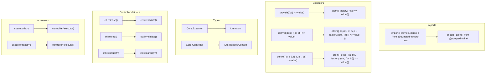

# [ADR-028] Codemod Package for core-next to lite Migration

## Status {#adr-028-status}
**Proposed** - 2025-12-16

## Problem/Requirement {#adr-028-problem}

`@pumped-fn/core-next` (last version 0.5.94) has been superseded by `@pumped-fn/lite`. Users with existing codebases need a migration path. Manual migration is error-prone and tedious due to:

1. **API shape changes**: `provide(factory)` → `atom({ factory })`
2. **Dependency pattern changes**: `derive([deps], factory)` → `atom({ deps: { name: dep }, factory })`
3. **Type namespace changes**: `Core.*` → `Lite.*`
4. **Factory signature changes**: `(deps, controller)` → `(ctx, deps)`
5. **Controller method renames**: `release()`/`reload()` → `invalidate()`
6. **Accessor patterns**: `executor.lazy`/`.reactive`/`.static` → `controller()` helper

**Requirement:** One-time CLI-based codemod for big-bang migration, leveraging existing codemod infrastructure.

## Exploration Journey {#adr-028-exploration}

**Initial hypothesis:** Create standalone CLI with custom AST manipulation.

**Explored:**

- **Isolated (this package):**
  - Needs to parse TypeScript, transform AST, preserve formatting
  - Must handle complex patterns like spread dependencies, nested calls
  - Should produce readable diffs for review

- **Upstream (source packages):**
  - `@pumped-fn/core-next@0.5.94` - frozen at git tag, API well-documented
  - Key exports: `provide`, `derive`, `preset`, `tag`, `tags`, `createScope`, `extension`, `resolves`
  - Types: `Core.Executor`, `Core.Controller`, `Core.Accessor`, etc.

- **Adjacent (codemod platforms):**
  - **jscodeshift** - Facebook's battle-tested codemod toolkit, wide adoption
  - **ts-morph** - TypeScript-specific, heavier but more type-aware
  - **codemod.com** - Platform with hosting, but adds external dependency

- **Downstream (target package):**
  - `@pumped-fn/lite` - current API documented in c3-2
  - Key exports: `atom`, `flow`, `tag`, `tags`, `preset`, `createScope`, `controller`, `service`
  - Types: `Lite.Atom`, `Lite.Flow`, `Lite.ResolveContext`, `Lite.Controller`, etc.

**Discovered:**

1. **jscodeshift is the pragmatic choice** - wide adoption, good TypeScript support via `@babel/parser`, works with `npx`
2. **Transform complexity is moderate** - most patterns are direct 1:1 mappings with structural changes
3. **Some patterns need manual review** - dynamic executor references, complex spread patterns

**Confirmed:**
- Migration is feasible with AST transforms
- One-time CLI invocation pattern is sufficient
- No need for incremental/watch mode

## Solution {#adr-028-solution}

Create `@pumped-fn/codemod` package with jscodeshift transforms, invokable via:

```bash
npx @pumped-fn/codemod
```

Or with jscodeshift directly:

```bash
npx jscodeshift -t node_modules/@pumped-fn/codemod/transforms/core-next-to-lite.js ./src --extensions=ts,tsx
```

### Transform Rules



### Detailed Transform Mappings

#### Function Transforms

| core-next Pattern | lite Pattern | Notes |
|-------------------|--------------|-------|
| `provide(fn)` | `atom({ factory: fn' })` | Rename `controller` → `ctx` in fn |
| `provide(fn, ...tags)` | `atom({ factory: fn', tags: [...tags] })` | |
| `derive([a], fn)` | `atom({ deps: { a }, factory: fn' })` | Destructure array to record |
| `derive({ a, b }, fn)` | `atom({ deps: { a, b }, factory: fn' })` | Keep record shape |
| `derive([a], fn, ...tags)` | `atom({ deps: { a }, factory: fn', tags })` | |

#### Accessor Transforms

| core-next Pattern | lite Pattern | Semantic Notes |
|-------------------|--------------|----------------|
| `executor.lazy` | `controller(executor)` | Both provide deferred resolution |
| `executor.reactive` | `controller(executor)` | lite controller auto-subscribes to changes |
| `executor.static` | `controller(executor)` | **Breaking**: lite has no static accessor - controller resolves once per factory |

#### Controller Method Transforms (inside factory)

| core-next | lite | Notes |
|-----------|------|-------|
| `ctl.release()` | `ctx.invalidate()` | Triggers re-resolution |
| `ctl.reload()` | `ctx.invalidate()` | Same as release in lite |
| `ctl.cleanup(fn)` | `ctx.cleanup(fn)` | Direct rename |
| `ctl.scope` | `ctx.scope` | Direct rename |

#### Type Reference Transforms

| core-next Type | lite Type | Status |
|----------------|-----------|--------|
| `Core.Executor<T>` | `Lite.Atom<T>` | ✅ Direct map |
| `Core.Controller` | `Lite.ResolveContext` | ✅ Direct map |
| `Core.Accessor<T>` | `Lite.Controller<T>` | ✅ Direct map |
| `Core.Lazy<T>` | `Lite.ControllerDep<T>` | ⚠️ Semantic shift |
| `Core.Reactive<T>` | `Lite.ControllerDep<T>` | ⚠️ Semantic shift |
| `Core.Static<T>` | ❌ No equivalent | 🔴 Manual review |
| `Core.Cleanup` | `() => MaybePromise<void>` | ⚠️ Inline type |
| `Core.Preset<T>` | `Lite.Preset<T>` | ✅ Direct map |
| `Core.BaseExecutor<T>` | ❌ No equivalent | 🔴 Internal type |
| `Core.UExecutor` | `Lite.Atom<unknown>` | ⚠️ Semantic shift |
| `Core.AnyExecutor` | `Lite.Atom<unknown>` | ✅ Direct map |
| `Core.ResolveState<T>` | ❌ No equivalent | 🔴 Use `AtomState` |
| `Core.PendingState<T>` | ❌ No equivalent | 🔴 Manual review |
| `Core.ResolvedState<T>` | ❌ No equivalent | 🔴 Manual review |
| `Core.RejectedState` | ❌ No equivalent | 🔴 Manual review |
| `Core.InferOutput<T>` | `Lite.InferDep<T>` | ⚠️ Name change |
| `MaybePromised<T>` | `MaybePromise<T>` | ⚠️ Name change, no `Promised` |
| `Promised<T>` | `Promise<T>` | 🔴 Class removed |

#### Tag Type Transforms

| core-next Type | lite Type | Status |
|----------------|-----------|--------|
| `Tag.Tag<T>` | `Lite.Tag<T>` | ✅ Direct map |
| `Tag.Tagged<T>` | `Lite.Tagged<T>` | ✅ Direct map |
| `Tag.TagExecutor<O,T>` | `Lite.TagExecutor<O,T>` | ✅ Direct map |
| `Tag.Container` | ❌ No equivalent | 🔴 Internal type |
| `Tag.Store` | ❌ No equivalent | 🔴 Internal type |
| `Tag.Source` | `Lite.TagSource` | ✅ Direct map |

#### Helper Function Transforms

| core-next | lite | Notes |
|-----------|------|-------|
| `resolves([a, b, c])` | ❌ No equivalent | 🔴 Edge case report |
| `extension({ name, ... })` | Implement `Extension` interface | ⚠️ Shape differs |
| `custom(schema)` | `tag({ parse: ... })` | ⚠️ No StandardSchema |

### Edge Cases Requiring Manual Review

1. **Dynamic executor references**: `const e = condition ? execA : execB; e.lazy` - cannot statically determine
2. **Spread in derive**: `derive([...execs], fn)` - cannot generate record keys
3. **resolves() helper**: Complex batching, suggest manual conversion
4. **extension() helper function**: Shape differs, needs manual adjustment
5. **Promised class usage**: `.then()` chains on `Promised` need review for metadata access
6. **Core.Static usage**: No equivalent in lite - semantic redesign required
7. **Core.ResolveState inspection**: State machine differs, use `controller.state` instead
8. **StandardSchema integration**: lite uses plain `parse` functions, not StandardSchema

### Edge Case Report Generation

The codemod generates `migration-report.md` summarizing all edge cases found:

```markdown
# Migration Report
Generated: 2024-12-16

## Summary
- ✅ Automatically transformed: 47 patterns
- ⚠️ Transformed with warnings: 12 patterns
- 🔴 Requires manual review: 5 patterns

## Manual Review Required

### 1. src/services/auth.ts:45
**Pattern**: `Core.Static<UserSession>`
**Issue**: No equivalent in lite - static accessors removed
**Suggestion**: Use `controller(userSessionAtom)` and cache result manually

### 2. src/utils/batch.ts:23
**Pattern**: `resolves([configAtom, dbAtom, cacheAtom])`
**Issue**: resolves() helper removed
**Suggestion**: Replace with:
\`\`\`typescript
const [config, db, cache] = await Promise.all([
  scope.resolve(configAtom),
  scope.resolve(dbAtom),
  scope.resolve(cacheAtom)
])
\`\`\`

### 3. src/core/state.ts:89
**Pattern**: `executor.reactive` in conditional
**Issue**: Dynamic accessor - cannot determine statically
**Context**:
\`\`\`typescript
const accessor = shouldReact ? executor.reactive : executor.static
\`\`\`
**Suggestion**: Review logic - lite controller handles both patterns

...
```

### AI-Assisted Migration Prompt

For complex edge cases, the report includes a prompt template for AI assistance:

```markdown
## AI Migration Assistance

Copy the following to Claude/ChatGPT for help with remaining manual migrations:

---
I'm migrating from @pumped-fn/core-next to @pumped-fn/lite.
Here are patterns that couldn't be auto-transformed:

[EDGE_CASES_JSON]

For each pattern:
1. Explain why automatic transformation wasn't possible
2. Suggest the idiomatic lite equivalent
3. Note any behavioral differences to watch for

Reference docs:
- lite API: atom(), flow(), tag(), controller(), createScope()
- Key differences: No Promised class, no static accessors, controller replaces lazy/reactive
---
```

The report embeds the edge cases as structured JSON for easy AI consumption:

```json
{
  "edgeCases": [
    {
      "file": "src/services/auth.ts",
      "line": 45,
      "pattern": "Core.Static<UserSession>",
      "category": "type_no_equivalent",
      "context": "type SessionAccessor = Core.Static<UserSession>",
      "surrounding": ["const getSession = ...", "..."]
    }
  ]
}
```

### Package Structure

```
packages/codemod/
├── package.json
├── README.md
├── bin/
│   └── cli.ts                      # npx entry point
├── src/
│   ├── index.ts                    # Main orchestrator
│   ├── transforms/
│   │   ├── core-next-to-lite.ts    # Main jscodeshift transform
│   │   ├── imports.ts              # Import rewriting
│   │   ├── executors.ts            # provide/derive → atom
│   │   ├── accessors.ts            # lazy/reactive/static → controller
│   │   ├── types.ts                # Core.* → Lite.*
│   │   └── controller-methods.ts   # ctl.* → ctx.*
│   ├── report/
│   │   ├── collector.ts            # Edge case collector during transform
│   │   ├── generator.ts            # Markdown report generator
│   │   └── ai-prompt.ts            # AI assistance prompt template
│   └── utils/
│       ├── ast.ts                  # AST helpers
│       └── patterns.ts             # Pattern matching utilities
└── tests/
    ├── fixtures/
    │   ├── provide-basic.input.ts
    │   ├── provide-basic.output.ts
    │   ├── derive-array.input.ts
    │   ├── derive-array.output.ts
    │   ├── accessor-lazy.input.ts
    │   ├── accessor-lazy.output.ts
    │   ├── types-core.input.ts
    │   ├── types-core.output.ts
    │   └── ...
    └── transforms.test.ts
```

### CLI Interface

```bash
# Default: transform all .ts/.tsx files in current directory
npx @pumped-fn/codemod

# Specify path
npx @pumped-fn/codemod ./src

# Dry run (print changes without writing)
npx @pumped-fn/codemod --dry

# Verbose output
npx @pumped-fn/codemod --verbose
```

## Changes Across Layers {#adr-028-changes}

### Context Level (c3-0)

Update README.md Containers table to include:

| Container | Type | Description |
|-----------|------|-------------|
| @pumped-fn/codemod | CLI Tool | One-time migration from core-next to lite |

### Container Level

Create new container: `c3-8-codemod/`

- Overview: CLI tool for automated code migration
- Technology: jscodeshift, TypeScript, Node.js
- Single-use pattern (no ongoing maintenance expected)

### Component Level

No component-level documentation needed - package is simple enough that container docs suffice.

## Verification {#adr-028-verification}

### Core Transforms
- [ ] Transform handles `provide()` without dependencies
- [ ] Transform handles `provide()` with tags
- [ ] Transform handles `derive()` with array dependencies
- [ ] Transform handles `derive()` with record dependencies
- [ ] Transform handles `derive()` with tags
- [ ] Transform renames `controller` → `ctx` in factory parameters
- [ ] Transform renames `ctl.release()` → `ctx.invalidate()`
- [ ] Transform renames `ctl.reload()` → `ctx.invalidate()`
- [ ] Transform renames `ctl.cleanup()` → `ctx.cleanup()`

### Accessor Transforms
- [ ] Transform handles `executor.lazy` → `controller(executor)`
- [ ] Transform handles `executor.reactive` → `controller(executor)`
- [ ] Transform handles `executor.static` → `controller(executor)` with warning

### Type Transforms
- [ ] Transform rewrites `Core.Executor<T>` → `Lite.Atom<T>`
- [ ] Transform rewrites `Core.Controller` → `Lite.ResolveContext`
- [ ] Transform rewrites `Core.Accessor<T>` → `Lite.Controller<T>`
- [ ] Transform rewrites `Core.Lazy<T>` → `Lite.ControllerDep<T>` with warning
- [ ] Transform rewrites `Core.Reactive<T>` → `Lite.ControllerDep<T>` with warning
- [ ] Transform flags `Core.Static<T>` as manual review required
- [ ] Transform rewrites `MaybePromised<T>` → `MaybePromise<T>`
- [ ] Transform flags `Promised<T>` usage as manual review required
- [ ] Transform rewrites `Tag.*` types → `Lite.*` equivalents

### Import Transforms
- [ ] Transform rewrites imports from `@pumped-fn/core-next` → `@pumped-fn/lite`
- [ ] Transform adds `controller` import when accessor patterns found
- [ ] Transform removes unused imports after transformation

### CLI & Reporting
- [ ] CLI runs via `npx @pumped-fn/codemod`
- [ ] Dry-run mode works correctly (`--dry`)
- [ ] Verbose mode shows transformation details (`--verbose`)
- [ ] Migration report generated (`migration-report.md`)
- [ ] Report includes summary statistics
- [ ] Report includes AI-friendly JSON for edge cases
- [ ] Report includes copy-paste prompt for AI assistance
- [ ] Edge cases produce warnings in report, not silent failures

## Migration {#adr-028-migration}

Users migrate by running:

```bash
# 1. Install (or use npx)
npm install -D @pumped-fn/codemod

# 2. Run codemod
npx @pumped-fn/codemod ./src

# 3. Review changes
git diff

# 4. Update package.json
npm uninstall @pumped-fn/core-next
npm install @pumped-fn/lite

# 5. Fix any remaining issues flagged by TypeScript
npm run typecheck

# 6. Remove codemod
npm uninstall @pumped-fn/codemod
```

## Related {#adr-028-related}

- [c3-2](../c3-2-lite/) - Target package documentation
- [ADR-002](./adr-002-lightweight-lite-package.md) - Original lite package decision
- Git tag `@pumped-fn/core-next@0.5.94` - Source package frozen state
