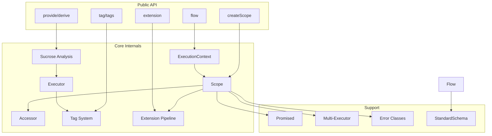
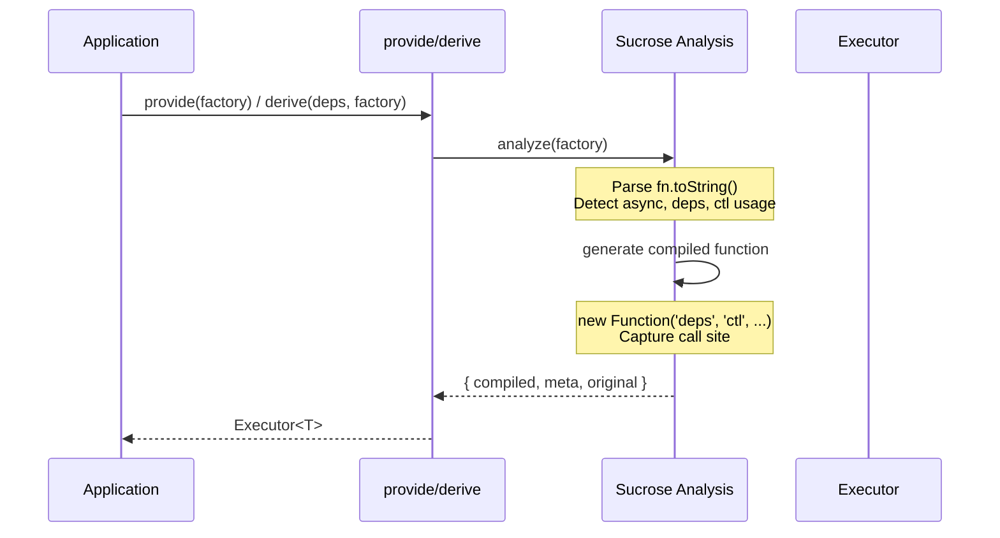
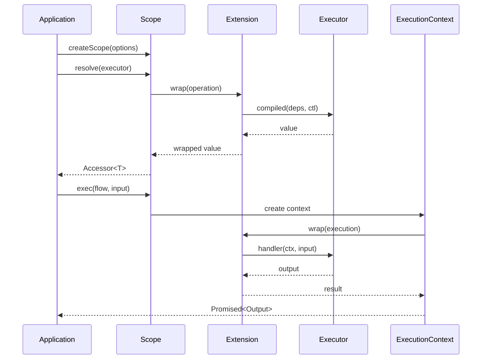

# Core Library (@pumped-fn/core-next)

## Overview {#c3-1-overview}
<!-- Primary responsibility: effect system foundation -->

The core library provides the foundation for pumped-fn's effect system:
- **Executor** - Unit of work with factory functions and dependencies
- **Scope** - Execution container managing lifecycle and caching
- **Flow** - Request/response pattern with schema validation
- **Tag** - Metadata system for cross-cutting data
- **Extension** - Hooks for observability and behavior modification

## Technology Stack {#c3-1-stack}
<!-- Runtime and build tooling -->

| Category | Technology | Version |
|----------|------------|---------|
| Language | TypeScript | ^5.0 |
| Build | tsdown | latest |
| Testing | Vitest | latest |
| Output | ESM + CJS | dual package |

## Component Relationships {#c3-1-relationships}
<!-- How internal modules connect -->



## Data Flow {#c3-1-data-flow}
<!-- Execution sequence -->

### Executor Creation (Compile Time)



### Resolution (Runtime)



## Public API {#c3-1-api}
<!-- Exported functions and types -->

### Core Functions

| Function | Purpose | File |
|----------|---------|------|
| `provide(factory)` | Create executor without dependencies | executor.ts |
| `derive(deps, factory)` | Create executor with dependencies | executor.ts |
| `preset(executor, value)` | Override executor in scope | executor.ts |
| `createScope(options)` | Create execution scope | scope.ts |
| `resolves(...executors)` | Resolve multiple executors | helpers.ts |
| `flow(definition, handler)` | Create flow with execute helper | flow.ts |
| `flowMeta` | Access flow metadata tags | execution-context.ts |
| `tag(schema, options)` | Create metadata tag | tag.ts |
| `tags.required/optional/all` | Tag dependency helpers | tag.ts |
| `extension(ext)` | Type helper for extensions | helpers.ts |
| `custom(schema)` | Create custom schema validator | primitives.ts |
| `validate(schema, data)` | Validate data against schema | primitives.ts |
| `Promised` | Enhanced Promise with context | primitives.ts |

### Type Namespaces

| Namespace | Contains |
|-----------|----------|
| `Core` | Executor, Scope, Controller, Accessor, Cleanup, ResolveState, Preset |
| `Flow` | Definition, Handler, Flow, Context, Execution, ParallelResult |
| `Extension` | Extension, Operation, ResolveOperation, ExecutionOperation |
| `Tag` | Tag, Tagged, Store, Container, Source, TagExecutor |
| `Multi` | MultiExecutor, Key, Option, DeriveOption |
| `StandardSchemaV1` | Props, Result, Issue, InferInput, InferOutput |

## Cross-Cutting Implementations {#c3-1-cross-cutting}
<!-- Where cross-cutting concerns are implemented -->

### Extension System {#c3-1-extension}
Cross-cutting behavior hooks into executor resolution and flow execution.

Implemented in: [c3-104-extension](./c3-104-extension.md)

### Tag System {#c3-1-tag}
Metadata propagation across execution boundaries.

Implemented in: [c3-103-tag](./c3-103-tag.md)

### Error Handling {#c3-1-errors}
Structured error hierarchy with context-rich classes.

Implemented in: [c3-105-errors](./c3-105-errors.md)

### Schema Validation {#c3-1-schema}
StandardSchema-based validation for flows and tags.

Implemented in: [c3-106-schema](./c3-106-schema.md)

## Components {#c3-1-components}
<!-- Component inventory -->

| Component | Role | Responsibility | Documentation |
|-----------|------|----------------|---------------|
| Scope & Executor | Business Logic | Core DI - factory resolution, dependency injection, caching | [c3-101-scope](./c3-101-scope.md) |
| Flow & ExecutionContext | Request Handler | Request/response pattern with schema validation | [c3-102-flow](./c3-102-flow.md) |
| Tag System | State Container | Metadata attachment and extraction | [c3-103-tag](./c3-103-tag.md) |
| Extension System | Transformer | Cross-cutting concern hooks | [c3-104-extension](./c3-104-extension.md) |
| Error Classes | Business Logic | Structured error reporting | [c3-105-errors](./c3-105-errors.md) |
| StandardSchema | Transformer | Validation contract | [c3-106-schema](./c3-106-schema.md) |
| Multi-Executor | Business Logic | Keyed executor pools | [c3-107-multi](./c3-107-multi.md) |
| Promised | Transformer | Enhanced Promise with context | [c3-108-promised](./c3-108-promised.md) |

## Source Organization {#c3-1-source}
<!-- File structure -->

```
packages/next/src/
├── index.ts              # Public API exports
├── types.ts              # Core type definitions
├── scope.ts              # Scope implementation
├── executor.ts           # Executor factory functions
├── sucrose.ts            # Static analysis + code generation (ADR-002)
├── flow.ts               # Flow definition + FlowExecutionImpl
├── execution-context.ts  # ExecutionContext lifecycle
├── tag.ts                # Tag system (types, executors, merge)
├── primitives.ts         # Promised class + schema validation
├── helpers.ts            # resolves() + extension()
├── multi.ts              # Multi-executor pools
└── errors.ts             # Error classes
```

## Testing {#c3-1-testing}
<!-- Testing strategy -->

Tests are organized in a unified test suite covering all layers:

| Test File | Focus |
|-----------|-------|
| index.test.ts | Unified test suite - 198 tests covering Scope, Flow, Tag, Extension, ExecutionContext, Multi, Promised, Errors, Sucrose |

**Coverage**: 83% (82.9% statements, 85% functions, 68% branches)

Run tests: `pnpm -F @pumped-fn/core-next test`
Coverage: `pnpm -F @pumped-fn/core-next test:coverage`
Typecheck: `pnpm -F @pumped-fn/core-next typecheck`
