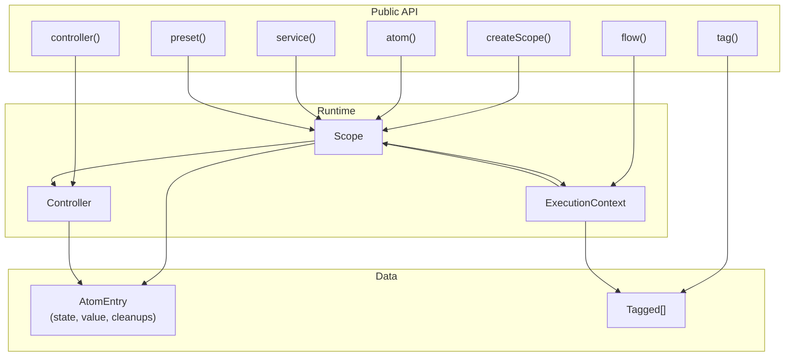
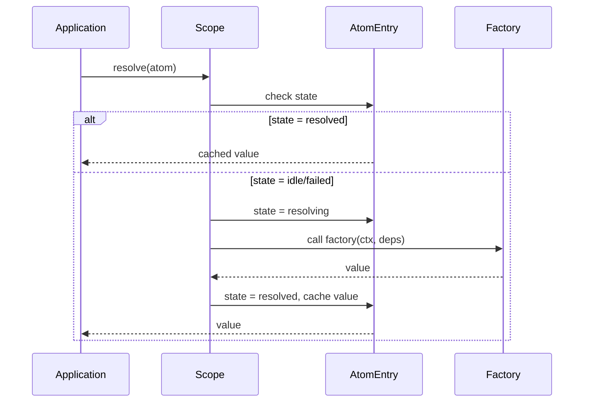
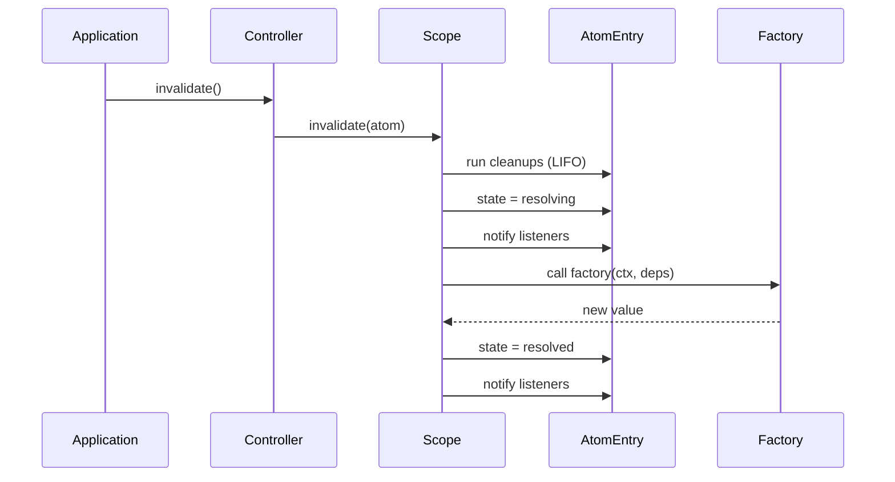

# Lite Library (@pumped-fn/lite)

## Overview {#c3-2-overview}
<!-- Lightweight DI with minimal reactivity -->

`@pumped-fn/lite` is a minimal dependency injection library for TypeScript that provides:
- **Atoms** - Long-lived dependencies with lifecycle management
- **Flows** - Short-lived request/response execution patterns
- **Tags** - Metadata attachment and extraction
- **Controllers** - Deferred resolution with reactivity support

**Design principles:**
1. Very light, very compact - say no to unnecessary features
2. Very little API exposed - every API is gold, expensive to learn
3. Minimal overhead - optimized code required

**Bundle size:** <17KB (ESM), <17KB (CJS)

**Dependencies:** Zero external dependencies

## Technology Stack {#c3-2-stack}
<!-- Runtime and build tooling -->

| Category | Technology |
|----------|------------|
| Language | TypeScript 5.9+ |
| Runtime | Node.js 18+ |
| Build | tsdown (rolldown-based) |
| Test | Vitest |
| Package | ESM + CJS dual format |

## Component Relationships {#c3-2-relationships}
<!-- How internal modules connect -->



## Data Flow {#c3-2-data-flow}
<!-- Execution sequence -->

### Atom Resolution Flow



### Controller Invalidation Flow



## Public API {#c3-2-api}
<!-- Exported functions and types -->

### Factory Functions

| Function | Description | Returns |
|----------|-------------|---------|
| `createScope(options?)` | Create DI container (sync, with `ready` promise) | `Scope` |
| `atom(config)` | Define long-lived dependency | `Atom<T>` |
| `flow(config)` | Define request handler | `Flow<T, I>` |
| `tag(config)` | Define metadata tag | `Tag<T>` |
| `preset(atom, value)` | Create preset injection | `Preset<T>` |
| `controller(atom)` | Create controller dependency | `ControllerDep<T>` |
| `service(config)` | Define context-aware method container | `Atom<T extends ServiceMethods>` |
| `scope.select(atom, selector, options?)` | Create fine-grained subscription | `SelectHandle<S>` |

### Type Guards

| Function | Description |
|----------|-------------|
| `isAtom(value)` | Check if value is Atom |
| `isFlow(value)` | Check if value is Flow |
| `isTag(value)` | Check if value is Tag |
| `isTagged(value)` | Check if value is Tagged |
| `isPreset(value)` | Check if value is Preset |
| `isControllerDep(value)` | Check if value is ControllerDep |
| `isTagExecutor(value)` | Check if value is TagExecutor |

### Interfaces

| Interface | Description |
|-----------|-------------|
| `Scope` | DI container with resolution, controller, and event APIs |
| `Controller<T>` | Deferred accessor with state, get, invalidate, and subscription |
| `ExecutionContext` | Flow execution context with input, exec, and lifecycle |
| `Extension` | Cross-cutting hooks for resolve and exec |

### Namespace Export

All types are grouped under the `Lite` namespace:

```typescript
import type { Lite } from '@pumped-fn/lite'

const myAtom: Lite.Atom<Config> = atom({ factory: () => loadConfig() })
```

## Source Organization {#c3-2-source}
<!-- File structure -->

```
packages/lite/
├── src/
│   ├── index.ts      # Public exports
│   ├── types.ts      # Lite namespace with all interfaces
│   ├── symbols.ts    # Unique symbols for type guards
│   ├── atom.ts       # atom(), controller(), type guards
│   ├── flow.ts       # flow(), isFlow()
│   ├── tag.ts        # tag(), tags, tag type guards
│   ├── preset.ts     # preset(), isPreset()
│   ├── service.ts    # service(), isService()
│   └── scope.ts      # createScope(), Scope, Controller, ExecutionContext
├── tests/
│   ├── atom.test.ts
│   ├── flow.test.ts
│   ├── tag.test.ts
│   ├── preset.test.ts
│   ├── service.test.ts
│   ├── scope.test.ts
│   ├── extension.test.ts
│   └── types.test.ts
├── package.json
├── tsconfig.json
└── tsdown.config.ts
```

## Components {#c3-2-components}
<!-- Component inventory -->

| ID | Component | Description |
|----|-----------|-------------|
| [c3-201](./c3-201-scope.md) | Scope & Controller | DI container, resolution, lifecycle states, reactivity |
| [c3-202](./c3-202-atom.md) | Atom | Long-lived dependency definition |
| [c3-203](./c3-203-flow.md) | Flow & ExecutionContext | Request/response execution pattern |
| [c3-204](./c3-204-tag.md) | Tag System | Metadata attachment and extraction |
| [c3-205](./c3-205-preset.md) | Preset | Value injection and atom redirection |
| [c3-206](./c3-206-service.md) | Service | Context-aware method containers |

## Extension System {#c3-2-extension}
<!-- Cross-cutting concern hooks -->

Extensions provide AOP-style hooks for cross-cutting concerns:

```typescript
interface Extension {
  readonly name: string
  init?(scope: Scope): MaybePromise<void>
  wrapResolve?<T>(next: () => Promise<T>, atom: Atom<T>, scope: Scope): Promise<T>
  wrapExec?<T>(next: () => Promise<T>, target: Flow | Function, ctx: ExecutionContext): Promise<T>
  dispose?(scope: Scope): MaybePromise<void>
}
```

**Lifecycle:**
1. `init()` - Called when scope is created (after `createScope()`)
2. `wrapResolve()` - Wraps atom resolution (innermost extension runs first)
3. `wrapExec()` - Wraps flow/function execution
4. `dispose()` - Called when scope is disposed

**Example logging extension:**

```typescript
const loggingExtension: Lite.Extension = {
  name: 'logging',
  wrapResolve: async (next, atom, scope) => {
    console.log('Resolving atom...')
    const result = await next()
    console.log('Resolved:', result)
    return result
  }
}

const scope = createScope({ extensions: [loggingExtension] })
```

**Example tracing extension with hierarchical context:**

```typescript
const SPAN_KEY = Symbol('tracing.span')

interface Span {
  name: string
  parent?: Span
  end(): void
}

const tracingExtension: Lite.Extension = {
  name: 'tracing',
  wrapExec: async (next, target, ctx) => {
    // Extensions receive CHILD context (created by exec)
    // Access parent span from parent context's data
    const parentSpan = ctx.parent?.data.get(SPAN_KEY) as Span | undefined

    const span: Span = {
      name: isFlow(target) ? (target.name ?? 'anonymous') : 'fn',
      parent: parentSpan,  // Automatic parent-child relationship!
      end: () => console.log(`Span ended: ${span.name}`)
    }

    // Store span in THIS context's data (isolated per execution)
    ctx.data.set(SPAN_KEY, span)

    try {
      const result = await next()
      return result
    } finally {
      span.end()
    }
  }
}

const scope = createScope({ extensions: [tracingExtension] })
const ctx = scope.createContext()

await ctx.exec({
  flow: flow({
    name: 'parent',
    factory: async (ctx) => {
      // parentSpan stored in ctx.data

      await ctx.exec({
        flow: flow({
          name: 'child',
          factory: async (ctx) => {
            // childSpan.parent = parentSpan (automatic!)
          }
        })
      })
    }
  })
})
// Hierarchical span tree created without AsyncLocalStorage!
```

**Key pattern:**
- Each `ctx.exec()` creates child context with isolated `data` Map
- Extensions read `ctx.parent?.data` for parent info
- Extensions write to `ctx.data` for current execution
- Enables nested tracing without global state or AsyncLocalStorage

## Testing {#c3-2-testing}
<!-- Testing strategy -->

**Test organization:**
- Unit tests per source file
- Type tests using `expectTypeOf` from Vitest
- 145 tests covering all components (including 15 hierarchical context tests)

**Running tests:**
```bash
pnpm -F @pumped-fn/lite test        # Run all tests
pnpm -F @pumped-fn/lite test:watch  # Watch mode
pnpm -F @pumped-fn/lite typecheck   # Type check src
pnpm -F @pumped-fn/lite typecheck:full  # Type check src + tests
```

## Related {#c3-2-related}

- [ADR-002](../adr/adr-002-lightweight-lite-package.md) - Initial package design decisions
- [ADR-003](../adr/adr-003-controller-reactivity.md) - Controller-based reactivity design
- [ADR-008](../adr/adr-008-sync-create-scope.md) - Synchronous createScope with ready promise
- [ADR-009](../adr/adr-009-fix-duplicate-listener-notifications.md) - Controller.on() state filtering
