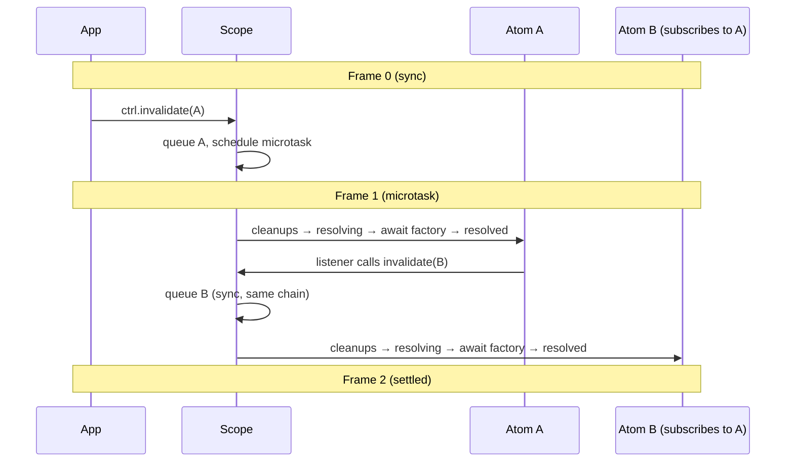

# Scope & Controller

## Overview {#c3-201-overview}
<!-- Foundation of the DI system -->

The Scope is the central DI container that:
- Resolves atoms and caches their values
- Manages atom lifecycle states (idle → resolving → resolved/failed)
- Provides Controllers for reactive access to atoms
- Creates ExecutionContexts for flow execution
- Emits state change events for observability

## Concepts {#c3-201-concepts}

### AtomState

Atoms have explicit lifecycle states:

```
States: idle | resolving | resolved | failed

Transitions:
┌──────┐  resolve()   ┌───────────┐  success   ┌──────────┐
│ idle │─────────────►│ resolving │───────────►│ resolved │
└──────┘              └───────────┘            └──────────┘
                           │                        │
                         error                 invalidate()
                           │                        │
                           ▼                        ▼
                      ┌────────┐             ┌───────────┐
                      │ failed │────────────►│ resolving │
                      └────────┘ invalidate()└───────────┘
```

### Controller

A Controller provides deferred, reactive access to an atom:

```typescript
type ControllerEvent = 'resolving' | 'resolved' | '*'

interface Controller<T> {
  readonly state: AtomState    // Current lifecycle state
  get(): T                     // Get value (throws if not resolved)
  resolve(): Promise<T>        // Trigger resolution
  release(): Promise<void>     // Run cleanup, remove from cache
  invalidate(): void           // Trigger re-resolution (runs factory)
  set(value: T): void          // Replace value directly (skips factory)
  update(fn: (prev: T) => T): void  // Transform value (skips factory)
  on(listener: () => void): () => void  // Subscribe to all changes
  on(event: ControllerEvent, listener: () => void): () => void  // Subscribe to specific state
}
```

### ExecutionContext

Created from Scope for flow execution:

```typescript
interface ExecutionContext {
  readonly input: unknown      // Current flow input
  readonly scope: Scope        // Parent scope
  exec(options): Promise<T>    // Execute flow or function
  onClose(fn): void            // Register cleanup
  close(): Promise<void>       // Run cleanups
}
```

## Scope API {#c3-201-api}

### createScope

```typescript
function createScope(options?: ScopeOptions): Scope

interface ScopeOptions {
  extensions?: Extension[]       // Cross-cutting hooks
  tags?: Tagged<unknown>[]       // Scope-level tags
  presets?: Preset<unknown>[]    // Value/atom presets
}
```

Returns a Scope synchronously. The `ready` promise resolves when all extensions
have been initialized. Resolution methods automatically wait for `ready`.

### Scope Interface

```typescript
interface Scope {
  readonly ready: Promise<void>  // Resolves when extensions initialized
  resolve<T>(atom: Atom<T>): Promise<T>
  controller<T>(atom: Atom<T>): Controller<T>
  controller<T>(atom: Atom<T>, options: { resolve: true }): Promise<Controller<T>>
  release<T>(atom: Atom<T>): Promise<void>
  dispose(): Promise<void>
  createContext(options?: CreateContextOptions): ExecutionContext
  on(event: AtomState, atom: Atom<unknown>, listener: () => void): () => void
}
```

## Resolution {#c3-201-resolution}

### Basic Resolution

```typescript
const scope = createScope()

// Option 1: resolve() waits for ready internally
const db = await scope.resolve(dbAtom)

// Option 2: explicit wait
await scope.ready
const db = await scope.resolve(dbAtom)
```

### Resolution with Dependencies

When resolving an atom with dependencies:
1. Resolve all dependencies first (respecting dependency graph)
2. Create ResolveContext with cleanup registration
3. Call factory with context and resolved dependencies
4. Cache result and transition to 'resolved' state

### Circular Dependency Detection

```typescript
const a = atom({
  deps: { b: bAtom },
  factory: (ctx, { b }) => b + 1
})

const b = atom({
  deps: { a: aAtom },
  factory: (ctx, { a }) => a + 1
})

await scope.resolve(a) // Throws: "Circular dependency detected"
```

### Concurrent Resolution

Multiple concurrent calls to `resolve()` for the same atom share a single promise:

```typescript
const [r1, r2, r3] = await Promise.all([
  scope.resolve(expensiveAtom),
  scope.resolve(expensiveAtom),
  scope.resolve(expensiveAtom),
])
// Factory called only once
```

## Controller Usage {#c3-201-controller}

### Basic Controller

```typescript
const ctrl = scope.controller(configAtom)

console.log(ctrl.state)  // 'idle'

await ctrl.resolve()
console.log(ctrl.state)  // 'resolved'
console.log(ctrl.get())  // { port: 3000 }
```

### Pre-Resolved Controller via Scope

When you need a controller that's already resolved outside of atom dependencies:

```typescript
// Returns Promise<Controller<T>> - controller is resolved when promise settles
const ctrl = await scope.controller(configAtom, { resolve: true })
console.log(ctrl.state)  // 'resolved'
console.log(ctrl.get())  // { port: 3000 } - safe, no throw
```

| Call | Return Type | Controller State |
|------|-------------|------------------|
| `scope.controller(atom)` | `Controller<T>` | `idle` |
| `scope.controller(atom, { resolve: true })` | `Promise<Controller<T>>` | `resolved` after await |

**Note:** Unlike the `controller()` dependency helper which is consumed during async dep resolution, `scope.controller()` must return a `Promise` when `{ resolve: true }` is specified because resolution is inherently async.

### Subscribing to Changes

```typescript
const ctrl = scope.controller(configAtom)

// Subscribe to resolved state only (most common)
ctrl.on('resolved', () => {
  console.log('New value:', ctrl.get())
})

// Subscribe to resolving state only
ctrl.on('resolving', () => {
  console.log('Loading...')
})

// Subscribe to all state changes
ctrl.on('*', () => {
  console.log('State changed:', ctrl.state)
})

// Legacy syntax (equivalent to '*')
ctrl.on(() => {
  console.log('State changed:', ctrl.state)
})

await ctrl.resolve()
ctrl.invalidate()
// With on('resolved', ...) - logs once per invalidation cycle

unsub() // Stop listening
```

### Pre-Resolved Controller Dependency

When using `controller(atom, { resolve: true })` as a dependency, the controller
is already in `resolved` state when the factory runs:

```typescript
const myAtom = atom({
  deps: { config: controller(configAtom, { resolve: true }) },
  factory: (ctx, { config }) => {
    console.log(config.state)  // 'resolved'
    console.log(config.get())  // { port: 3000 } - safe, no throw

    config.on('resolved', () => ctx.invalidate())
    return config.get().port
  }
})
```

### Controller.get() Behavior

| State | Behavior |
|-------|----------|
| `idle` | Throws "Atom not resolved" |
| `resolving` | Returns stale value (previous resolved value) |
| `resolved` | Returns current value |
| `failed` | Throws the error that caused failure |

## Select Usage {#c3-201-select}

### Creating a SelectHandle

```typescript
const handle = scope.select(
  todosAtom,
  (todos) => todos.find(t => t.id === itemId),
  { eq: (a, b) => a?.updatedAt === b?.updatedAt }
)
```

### SelectHandle Interface

```typescript
interface SelectHandle<S> {
  get(): S                                    // Current sliced value
  subscribe(listener: () => void): () => void // Subscribe to changes
}
```

### Usage Pattern

```typescript
// Get current value
const todo = handle.get()

// Subscribe to changes
const unsub = handle.subscribe(() => {
  console.log('Changed:', handle.get())
})

// Cleanup
unsub() // Auto-cleans handle when last subscriber leaves
```

### Behavior

| Condition | Result |
|-----------|--------|
| Atom not resolved | Throws error |
| eq returns true | No notification |
| eq returns false | Notify + update value |
| Last subscriber leaves | Auto-cleanup |

## Invalidation {#c3-201-invalidation}

### External Invalidation

```typescript
const ctrl = scope.controller(configAtom)
await ctrl.resolve()

ctrl.invalidate()
// 1. Runs cleanups (LIFO order)
// 2. Transitions to 'resolving'
// 3. Notifies 'resolving' and '*' listeners
// 4. Re-runs factory (awaited)
// 5. Transitions to 'resolved' or 'failed'
// 6. Notifies 'resolved' and '*' listeners
```

Note: Listeners are notified exactly twice per invalidation cycle (once for 'resolving', once for 'resolved').

### Invalidation Chain

When a listener triggers another invalidation, they form a **sequential chain**:



**Frame guarantees:**

| Frame | What happens |
|-------|--------------|
| 0 | Sync: `invalidate()` called, atom queued, microtask scheduled |
| 1 | Microtask: entire chain processes sequentially |
| 2 | Nothing: chain settled, no pending work |

**Key behaviors:**
- Each atom fully resolves (`await factory()`) before the next starts
- Listeners see resolved upstream before deciding to invalidate
- Chain order is deterministic (upstream before downstream)
- Duplicate `invalidate()` calls on same atom are deduplicated

### Loop Detection

Infinite loops are detected and throw immediately:

```typescript
// A subscribes to B, B subscribes to A
const atomA = atom({
  deps: { b: controller(atomB) },
  factory: (ctx, { b }) => {
    b.on('resolved', () => ctx.invalidate())
    return 'a'
  }
})

const atomB = atom({
  deps: { a: controller(atomA) },
  factory: (ctx, { a }) => {
    a.on('resolved', () => ctx.invalidate())
    return 'b'
  }
})

scope.controller(atomA).invalidate()
// Throws: "Infinite invalidation loop detected: atomA → atomB → atomA"
```

### Self-Invalidation from Factory

```typescript
const configAtom = atom({
  factory: async (ctx) => {
    const config = await fetchConfig()

    const interval = setInterval(() => ctx.invalidate(), 30_000)
    ctx.cleanup(() => clearInterval(interval))

    return config
  }
})
```

Note: `ctx.invalidate()` during own factory is **deferred** via `pendingInvalidate` flag, not part of the chain. This preserves the poll-and-refresh pattern.

### Invalidation During Resolution

If `invalidate()` is called while the atom is already resolving:
- The invalidation is queued (pendingInvalidate = true)
- After current resolution completes, invalidation runs again

## Direct Value Mutation {#c3-201-set-update}

### Controller.set() and Controller.update()

Push values directly without re-running the factory:

```typescript
const ctrl = scope.controller(userAtom)
await ctrl.resolve()

// Replace value directly
ctrl.set({ name: 'Alice' })

// Transform value
ctrl.update(user => ({ ...user, lastSeen: Date.now() }))
```

### Behavior

Both methods follow the same flow as `invalidate()`:
1. Queue via same invalidation mechanism
2. Run cleanups (LIFO)
3. State: `resolved → resolving → resolved`
4. Replace value (from argument, not factory)
5. Notify listeners

### Comparison with invalidate()

| | `invalidate()` | `set(value)` / `update(fn)` |
|---|---|---|
| Runs cleanups | Yes | Yes |
| State transition | resolving → resolved | resolving → resolved |
| Gets value from | Factory (async) | Argument (sync) |
| Triggers listeners | Yes | Yes |
| Uses queue | Yes | Yes |

### Use Cases

| Use Case | Method |
|----------|--------|
| External data source pushes value (WebSocket) | `set()` |
| Transform based on current value | `update()` |
| Re-fetch from source | `invalidate()` |

### Example: WebSocket Updates

```typescript
const wsAtom = atom({
  deps: { user: controller(userAtom) },
  factory: (ctx, { user }) => {
    const ws = new WebSocket('wss://api.example.com')

    ws.onmessage = (event) => {
      const data = JSON.parse(event.data)
      if (data.type === 'user-update') {
        user.set(data.payload)  // Push directly, no factory re-run
      }
    }

    ctx.cleanup(() => ws.close())
    return ws
  }
})
```

### State Requirements

| State | `set()` / `update()` Behavior |
|-------|-------------------------------|
| `idle` | Throws "Atom not resolved" |
| `resolving` | Queues, executes after resolution |
| `resolved` | Queues normally |
| `failed` | Throws the stored error |

## Event Listening {#c3-201-events}

### Scope-Level Events

```typescript
const scope = await createScope()

const unsub = scope.on('resolved', configAtom, () => {
  console.log('Config resolved!')
})

scope.on('failed', configAtom, () => {
  console.error('Config failed to load')
})

await scope.resolve(configAtom)
// Logs: "Config resolved!"
```

### Event Types

| Event | When Fired |
|-------|------------|
| `'idle'` | Never (initial state, no transition to idle) |
| `'resolving'` | Resolution starts, or invalidation triggers re-resolution |
| `'resolved'` | Factory completes successfully |
| `'failed'` | Factory throws or rejects |

## Cleanup & Disposal {#c3-201-cleanup}

### Release Single Atom

```typescript
await scope.release(dbAtom)
// 1. Runs all cleanups for dbAtom (LIFO order)
// 2. Removes from cache
```

### Dispose Entire Scope

```typescript
await scope.dispose()
// 1. Calls dispose() on all extensions
// 2. Releases all cached atoms
```

### Cleanup Order

Cleanups run in LIFO (Last-In-First-Out) order:

```typescript
const atom = atom({
  factory: (ctx) => {
    ctx.cleanup(() => console.log('First registered, last to run'))
    ctx.cleanup(() => console.log('Last registered, first to run'))
    return 'value'
  }
})
```

## Source Files {#c3-201-source}

| File | Contents |
|------|----------|
| `src/scope.ts` | `createScope()`, `ScopeImpl`, `ControllerImpl`, `ExecutionContextImpl` |
| `src/types.ts` | `Scope`, `Controller`, `ExecutionContext`, `AtomState` interfaces |
| `src/symbols.ts` | `controllerSymbol` |

## Testing {#c3-201-testing}

Key test scenarios in `tests/scope.test.ts`:
- Resolution caching and deduplication
- Circular dependency detection
- Extension wrapping order
- Controller state transitions
- Invalidation cleanup sequence
- Event emission timing
- Concurrent resolution sharing

## Related {#c3-201-related}

- [c3-202](./c3-202-atom.md) - Atom definition
- [c3-203](./c3-203-flow.md) - ExecutionContext usage in flows
- [ADR-003](../adr/adr-003-controller-reactivity.md) - Controller design decisions
- [ADR-008](../adr/adr-008-sync-create-scope.md) - Synchronous createScope with ready promise
- [ADR-009](../adr/adr-009-fix-duplicate-listener-notifications.md) - Controller.on() state filtering
- [ADR-013](../adr/adr-013-controller-set-update.md) - Controller.set() and Controller.update() design
