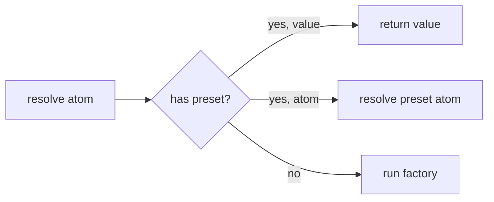

# Preset

## Overview {#c3-205-overview}
<!-- Value injection and atom redirection -->

Presets allow overriding atom resolution behavior:
- **Value preset**: Bypass factory, use provided value directly
- **Atom preset**: Redirect resolution to a different atom

Primary use cases:
- Testing: Inject mock values without changing atom definitions
- Configuration: Override defaults per environment
- Feature flags: Swap implementations at runtime

## Concepts {#c3-205-concepts}

### Preset Interface

```typescript
interface Preset<T> {
  readonly [presetSymbol]: true
  readonly atom: Atom<T>
  readonly value: T | Atom<T>
}
```

### Preset Behavior

When resolving an atom with a preset:
1. Check if preset exists for the atom
2. If preset value is a direct value → use it, skip factory
3. If preset value is another atom → resolve that atom instead

## Creating Presets {#c3-205-creating}

### Value Preset

```typescript
import { preset } from '@pumped-fn/lite'

const configPreset = preset(configAtom, { port: 8080, host: 'test' })
```

### Atom Preset (Redirection)

```typescript
const mockDbAtom = atom({
  factory: () => createMockDb()
})

const dbPreset = preset(dbAtom, mockDbAtom)
```

## Using Presets {#c3-205-using}

### At Scope Creation

```typescript
const scope = await createScope({
  presets: [
    preset(configAtom, { port: 8080 }),
    preset(dbAtom, mockDbAtom)
  ]
})

const config = await scope.resolve(configAtom)
// { port: 8080 } - factory was bypassed

const db = await scope.resolve(dbAtom)
// Result from mockDbAtom factory
```

### Multiple Presets

```typescript
const scope = await createScope({
  presets: [
    preset(configAtom, testConfig),
    preset(loggerAtom, mockLogger),
    preset(httpClientAtom, mockHttpClient)
  ]
})
```

## Testing Patterns {#c3-205-patterns}

### Unit Testing Atoms

```typescript
describe('userService', () => {
  it('should load user', async () => {
    const mockDb = {
      query: vi.fn().mockResolvedValue({ id: '1', name: 'Test' })
    }

    const scope = await createScope({
      presets: [preset(dbAtom, mockDb)]
    })

    const user = await scope.resolve(userAtom)

    expect(user.name).toBe('Test')
    expect(mockDb.query).toHaveBeenCalled()
  })
})
```

### Integration Testing

```typescript
describe('API integration', () => {
  let scope: Lite.Scope

  beforeEach(async () => {
    scope = await createScope({
      presets: [
        preset(configAtom, testConfig),
        preset(dbAtom, testDbAtom) // Use test database
      ]
    })
  })

  afterEach(async () => {
    await scope.dispose()
  })

  it('should handle request', async () => {
    const ctx = scope.createContext()
    const result = await ctx.exec({
      flow: handleRequestFlow,
      input: testRequest
    })
    await ctx.close()

    expect(result.status).toBe(200)
  })
})
```

### Environment Configuration

```typescript
function createAppScope(env: 'dev' | 'prod' | 'test') {
  const presets: Lite.Preset<unknown>[] = []

  if (env === 'test') {
    presets.push(
      preset(dbAtom, mockDbAtom),
      preset(httpAtom, mockHttpAtom)
    )
  }

  if (env === 'dev') {
    presets.push(
      preset(configAtom, devConfig)
    )
  }

  return createScope({ presets })
}
```

## Preset vs Factory Override {#c3-205-comparison}

| Approach | Use When |
|----------|----------|
| Preset | Testing, per-scope configuration |
| Different atom | Architectural separation |
| Factory with deps | Dynamic behavior based on injected values |

### Preset (Recommended for Testing)

```typescript
// Clean separation: atom definition unchanged
const scope = await createScope({
  presets: [preset(dbAtom, mockDb)]
})
```

### Factory with Config (Recommended for Runtime)

```typescript
// Configuration-driven behavior
const dbAtom = atom({
  deps: { config: configAtom },
  factory: (ctx, { config }) => {
    return config.useMock ? createMockDb() : createRealDb()
  }
})
```

## Type Safety {#c3-205-types}

Presets are type-safe:

```typescript
const configAtom = atom({
  factory: (): Config => ({ port: 3000 })
})

// OK - matches Config type
preset(configAtom, { port: 8080 })

// Type error - missing 'port'
preset(configAtom, { host: 'test' })

// OK - atom with matching output type
const altConfigAtom = atom({ factory: (): Config => ({ port: 9000 }) })
preset(configAtom, altConfigAtom)
```

## Type Guard {#c3-205-guards}

### isPreset

```typescript
import { isPreset } from '@pumped-fn/lite'

if (isPreset(value)) {
  console.log('Atom:', value.atom)
  console.log('Value:', value.value)
}
```

## Limitations {#c3-205-limitations}

### No Dynamic Presets

Presets are set at scope creation and cannot be changed:

```typescript
const scope = await createScope({
  presets: [preset(configAtom, config1)]
})

// Cannot change preset after creation
// Must create new scope with different presets
```

### Preset Resolution Order

Presets are checked before normal resolution:



### Preset Atom Cycles

Be careful with preset atom redirection:

```typescript
// This would cause infinite loop
preset(atomA, atomB)
preset(atomB, atomA) // Don't do this!
```

## Source Files {#c3-205-source}

| File | Contents |
|------|----------|
| `src/preset.ts` | `preset()`, `isPreset()` |
| `src/scope.ts` | Preset handling in `resolve()` |
| `src/types.ts` | `Preset` interface |
| `src/symbols.ts` | `presetSymbol` |

## Testing {#c3-205-testing}

Key test scenarios in `tests/preset.test.ts`:
- Value preset bypasses factory
- Atom preset redirects resolution
- Type guard

Key test scenarios in `tests/scope.test.ts`:
- Preset resolution order
- Multiple presets

## Related {#c3-205-related}

- [c3-201](./c3-201-scope.md) - Scope creation with presets
- [c3-202](./c3-202-atom.md) - Atom definition
