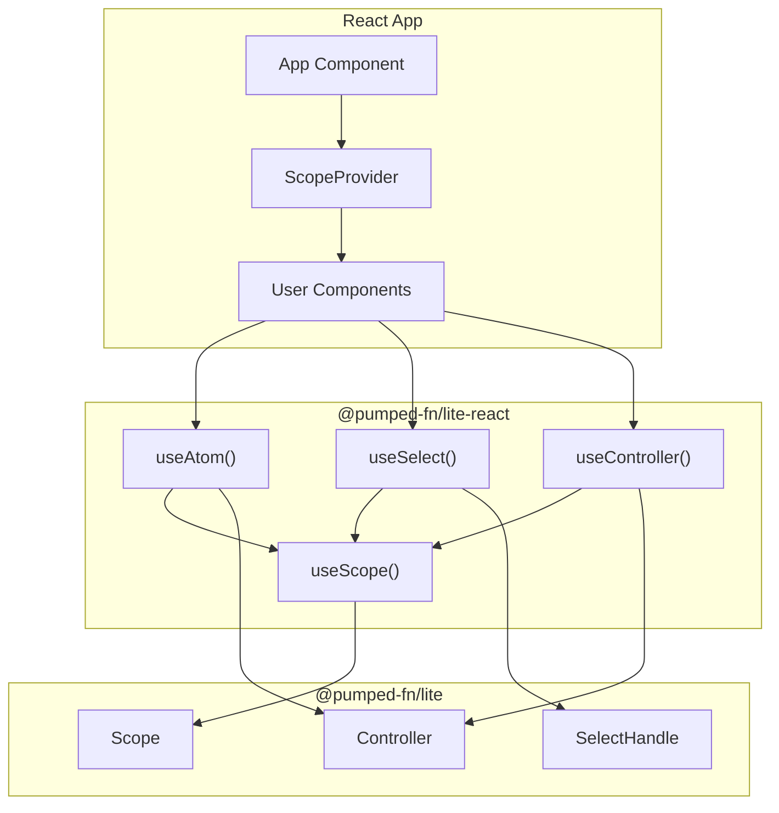
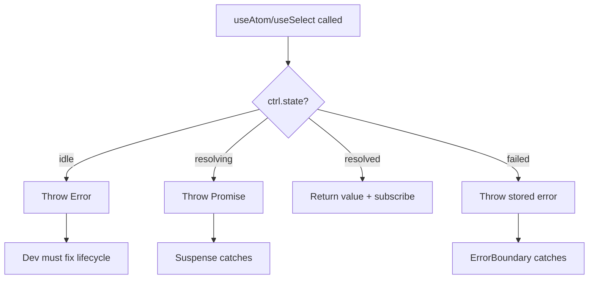

# Lite React Library (@pumped-fn/lite-react)

## Overview {#c3-3-overview}

`@pumped-fn/lite-react` provides thin React wrappers around `@pumped-fn/lite` primitives:
- **ScopeProvider** - React Context provider for scope injection
- **useAtom** - Subscribe to atom values with Suspense/ErrorBoundary integration
- **useSelect** - Fine-grained selection with custom equality
- **useController** - Access Controller for imperative operations

**Design principles:**
1. Thin wrappers - no hidden magic, explicit lifecycle
2. Hooks observe, don't trigger - atoms must be pre-resolved
3. SSR-compatible - no side effects on import, no global state

**Bundle size:** <2KB (estimated)

**Dependencies:** Peer dependencies only (react >=18.0.0, @pumped-fn/lite >=1.4.0)

## Technology Stack {#c3-3-stack}

| Category | Technology |
|----------|------------|
| Language | TypeScript 5.9+ |
| Runtime | Browser/Node.js |
| React | React 18+ (useSyncExternalStore) |
| Build | tsdown (rolldown-based) |
| Test | Vitest + @testing-library/react |
| Package | ESM + CJS dual format |

## Component Relationships {#c3-3-relationships}



## State Handling {#c3-3-states}

Hooks handle the four atom states via React patterns:



| State | Hook Behavior |
|-------|---------------|
| `idle` | Throw `Error("Atom not resolved...")` |
| `resolving` | Throw Promise from `ctrl.resolve()` - Suspense catches |
| `resolved` | Return value, subscribe to changes |
| `failed` | Throw stored error - ErrorBoundary catches |

## Public API {#c3-3-api}

### Context

| Export | Description |
|--------|-------------|
| `ScopeContext` | React Context for advanced use cases |
| `ScopeProvider` | Provider component for scope injection |

### Hooks

| Hook | Description | Returns |
|------|-------------|---------|
| `useScope()` | Get scope from context | `Lite.Scope` |
| `useController(atom, options?)` | Get memoized controller | `Lite.Controller<T>` |
| `useAtom(atom)` | Subscribe to atom value (Suspense) | `T` |
| `useAtom(atom, { suspense: false })` | Manual state handling | `UseAtomState<T>` |
| `useSelect(atom, selector, eq?)` | Fine-grained selection | `S` |

### Type Exports

| Type | Description |
|------|-------------|
| `UseAtomOptions` | Options for useAtom hook |
| `UseAtomState<T>` | Return type for non-Suspense mode |
| `UseControllerOptions` | Options for useController hook |
| `Lite` | Re-exported namespace from `@pumped-fn/lite` |

## Source Organization {#c3-3-source}

```
packages/lite-react/
├── src/
│   ├── index.ts          # Public exports
│   ├── context.tsx       # ScopeContext, ScopeProvider
│   └── hooks.ts          # useScope, useAtom, useSelect, useController
├── tests/
│   ├── hooks.test.tsx    # Comprehensive test suite
│   └── setup.ts          # Test setup (jest-dom)
├── package.json
├── tsconfig.json
├── tsconfig.test.json
├── vitest.config.ts
└── tsdown.config.ts
```

## Components {#c3-3-components}

| ID | Component | Description |
|----|-----------|-------------|
| [c3-301](./c3-301-hooks.md) | React Hooks | useScope, useAtom, useSelect, useController |

## Usage Patterns {#c3-3-patterns}

### Basic Usage

```tsx
import { createScope, atom } from '@pumped-fn/lite'
import { ScopeProvider, useAtom } from '@pumped-fn/lite-react'

const userAtom = atom({
  factory: async () => fetch('/api/user').then(r => r.json())
})

const scope = createScope()
await scope.resolve(userAtom)

function App() {
  return (
    <ScopeProvider scope={scope}>
      <Suspense fallback={<Loading />}>
        <UserProfile />
      </Suspense>
    </ScopeProvider>
  )
}

function UserProfile() {
  const user = useAtom(userAtom)
  return <div>{user.name}</div>
}
```

### Invalidation with Suspense

```tsx
function UserProfile() {
  const user = useAtom(userAtom)
  const ctrl = useController(userAtom)

  const refresh = () => ctrl.invalidate()

  return (
    <div>
      <h1>{user.name}</h1>
      <button onClick={refresh}>Refresh</button>
    </div>
  )
}
```

### Fine-Grained Selection

```tsx
function TodoCount() {
  const count = useSelect(
    todosAtom,
    todos => todos.filter(t => !t.done).length
  )
  return <span>{count} remaining</span>
}
```

## Testing {#c3-3-testing}

**Test organization:**
- Hook tests with @testing-library/react
- State handling tests for all 4 atom states
- Suspense and ErrorBoundary integration tests
- 17 tests passing, 4 skipped (jsdom timing issues)

**Running tests:**
```bash
pnpm -F @pumped-fn/lite-react test        # Run all tests
pnpm -F @pumped-fn/lite-react typecheck   # Type check src
pnpm -F @pumped-fn/lite-react typecheck:full  # Type check src + tests
```

**Testing with presets:**
```tsx
import { createScope, preset } from '@pumped-fn/lite'
import { ScopeProvider } from '@pumped-fn/lite-react'

test('renders user name', async () => {
  const scope = createScope({
    presets: [preset(userAtom, { name: 'Test User' })]
  })
  await scope.resolve(userAtom)

  render(
    <ScopeProvider scope={scope}>
      <UserProfile />
    </ScopeProvider>
  )

  expect(screen.getByText('Test User')).toBeInTheDocument()
})
```

## SSR Compatibility {#c3-3-ssr}

The package is SSR-compatible because:
1. No side effects on import
2. Uses `useSyncExternalStore` with `getServerSnapshot`
3. No window/document access
4. Scope passed as prop (no global state)

## Related {#c3-3-related}

- [c3-2](../c3-2-lite/) - @pumped-fn/lite base library
- [ADR-006](../adr/adr-006-select-fine-grained-reactivity.md) - select() API design
- [ADR-003](../adr/adr-003-controller-reactivity.md) - Controller reactivity pattern
