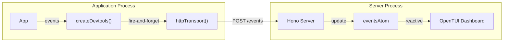

# Lite Devtools Server (@pumped-fn/lite-devtools-server)

## Goal

Provide a separate-process terminal UI that can receive devtools events over HTTP and present runtime activity without embedding a browser app.

## Overview {#c3-6-overview}

CLI tool that receives devtools events via HTTP and displays them in a terminal dashboard. Designed for cross-process observability where the application and devtools UI run in separate processes.

## Responsibilities

- Accept fire-and-forget devtools events over HTTP
- Keep a reactive event buffer for the terminal UI
- Render a terminal dashboard over that buffered state

## Architecture {#c3-6-architecture}


```mermaid
graph LR
    subgraph "Application Process"
        App[App]
        DT["createDevtools()"]
        HT["httpTransport()"]
    end

    subgraph "Server Process"
        Server["Hono Server"]
        Atom["eventsAtom"]
        TUI["OpenTUI Dashboard"]
    end

    App -->|events| DT
    DT -->|fire-and-forget| HT
    HT -->|POST /events| Server
    Server -->|update| Atom
    Atom -->|reactive| TUI
```

## Technology Stack {#c3-6-stack}

| Layer | Choice | Rationale |
|-------|--------|-----------|
| HTTP Server | Hono | Lightweight, modern, works with Node.js |
| State | @pumped-fn/lite | Dog-fooding the library, reactive atoms |
| React Bindings | @pumped-fn/lite-react | Reactive UI updates via useAtom |
| Terminal UI | OpenTUI | React-based TUI rendering |

## API {#c3-6-api}

### CLI

```bash
# Intended CLI entrypoint on default port 3001
npx @pumped-fn/lite-devtools-server

# Custom port
PORT=4000 npx @pumped-fn/lite-devtools-server
```

The CLI is the intended primary entrypoint, but the packaged OpenTUI runtime still needs release-time verification in the target Node environment. The programmatic API below is the more reliable fallback if the bundled dashboard assets fail to load.

### HTTP Endpoints

| Endpoint | Method | Description |
|----------|--------|-------------|
| `/events` | POST | Receive events (JSON array) |
| `/events` | GET | Retrieve buffered events |
| `/health` | GET | Health check |

### Programmatic

```typescript
import { createApp, scope, eventsAtom } from '@pumped-fn/lite-devtools-server'
import { serve } from '@hono/node-server'

await scope.ready
await scope.resolve(eventsAtom)
const ctrl = scope.controller(eventsAtom)
const app = createApp(ctrl)
serve({ fetch: app.fetch, port: 3001 })
```

## Source Organization {#c3-6-source}

```
packages/lite-devtools-server/
├── src/
│   ├── bin.tsx     # CLI entry point
│   ├── server.ts   # Hono HTTP server
│   ├── state.ts    # Reactive state (eventsAtom)
│   ├── ui.tsx      # OpenTUI React dashboard
│   └── index.ts    # Public exports
├── package.json
└── tsconfig.json
```

## Components

| ID | Name | Category | Status | Goal Contribution |
|----|------|----------|--------|-------------------|
| c3-601 | Server State | foundation | active | Accepts remote events, maintains the bounded event buffer, and exposes the programmatic server surface. |
| c3-602 | Terminal Dashboard | foundation | active | Boots the CLI dashboard and renders the buffered events through the shared lite state. |

## Related {#c3-6-related}

- [c3-4 Lite Devtools](../c3-4-lite-devtools/) - Event source library with httpTransport
- [ADR-015](../adr/adr-015-devtools-integration.md) - Devtools architecture decision
- [c3-2 Lite](../c3-2-lite/) - Core library used for state management
