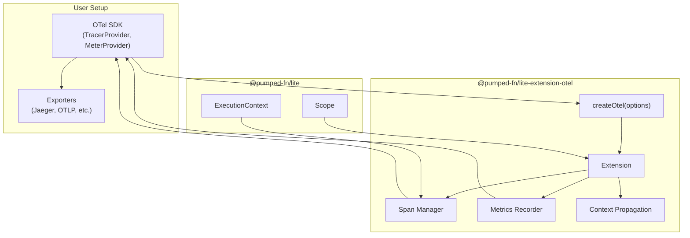
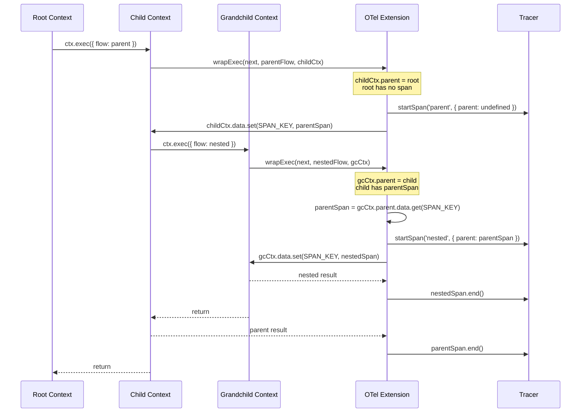

# Lite Extension OTel (@pumped-fn/lite-extension-otel)

## Overview {#c3-7-overview}

Extension-based OpenTelemetry integration for `@pumped-fn/lite`. Leverages the hierarchical ExecutionContext (ADR-016) for automatic parent-child span relationships without AsyncLocalStorage.

**Features:**
- **Tracing** - Spans for atoms and flows with hierarchy
- **Metrics** - Resolution time, execution duration, error rates
- **Context Propagation** - W3C Trace Context for distributed tracing

**Design principles:**
1. User controls OTel SDK configuration (exporters, sampling)
2. No global state - uses `ctx.data` for span storage
3. Standard OTel API - works with any compatible backend

## Technology Stack {#c3-7-stack}

| Category | Technology |
|----------|------------|
| Language | TypeScript 5.9+ |
| Runtime | Node.js 18+, Browser |
| OTel API | @opentelemetry/api ^1.0 |
| Build | tsdown (rolldown-based) |
| Test | Vitest |

## Architecture {#c3-7-architecture}



## Span Hierarchy Flow {#c3-7-hierarchy}



## API {#c3-7-api}

### Basic Setup

```typescript
import { createOtel } from '@pumped-fn/lite-extension-otel'
import { createScope } from '@pumped-fn/lite'
import { trace, metrics } from '@opentelemetry/api'

const scope = createScope({
  extensions: [
    createOtel({
      tracer: trace.getTracer('my-app', '1.0.0'),
      meter: metrics.getMeter('my-app'),  // optional
    })
  ]
})
```

### With SDK Configuration

```typescript
import { NodeSDK } from '@opentelemetry/sdk-node'
import { OTLPTraceExporter } from '@opentelemetry/exporter-trace-otlp-http'

const sdk = new NodeSDK({
  traceExporter: new OTLPTraceExporter({
    url: 'http://localhost:4318/v1/traces'
  }),
  serviceName: 'my-app'
})
sdk.start()

const scope = createScope({
  extensions: [
    createOtel({
      tracer: trace.getTracer('my-app')
    })
  ]
})
```

### Options

```typescript
interface OtelOptions {
  /** Tracer for span creation (required) */
  readonly tracer: Tracer
  /** Meter for metrics (optional) */
  readonly meter?: Meter
  /** Filter atoms to trace (default: all) */
  readonly atomFilter?: (atom: Atom<unknown>) => boolean
  /** Filter flows to trace (default: all) */
  readonly flowFilter?: (flow: Flow<unknown, unknown>) => boolean
  /** Custom span name formatter */
  readonly spanName?: (target: Atom | Flow | Function) => string
}
```

### Context Propagation

```typescript
import { extractContext, injectContext, getCurrentSpan } from '@pumped-fn/lite-extension-otel'

// HTTP server: extract incoming context
const handleRequest = flow({
  factory: async (ctx) => {
    const headers = ctx.input as Record<string, string>
    const incomingCtx = extractContext(headers)

    // Span will be child of incoming context
    return processRequest(ctx.input)
  }
})

// HTTP client: inject outgoing context
const callService = flow({
  factory: async (ctx) => {
    const headers: Record<string, string> = {}
    injectContext(ctx, headers)

    return fetch('http://other-service/api', { headers })
  }
})
```

## Metrics {#c3-7-metrics}

When `meter` is provided, the extension records:

| Metric | Type | Description |
|--------|------|-------------|
| `pumped.atom.resolution_ms` | Histogram | Time to resolve atoms |
| `pumped.flow.execution_ms` | Histogram | Time to execute flows |
| `pumped.errors` | Counter | Error count by type |

**Attributes:**
- `atom.name` / `flow.name` - Target name
- `error.type` - Exception class name (for errors)

## Source Organization {#c3-7-source}

```
packages/lite-extension-otel/
├── src/
│   ├── index.ts        # Public exports
│   ├── types.ts        # OtelOptions, namespace
│   ├── extension.ts    # createOtel() implementation
│   ├── span.ts         # Span management, SPAN_KEY
│   ├── metrics.ts      # Histogram/counter setup
│   └── propagation.ts  # extractContext, injectContext
├── tests/
│   ├── tracing.test.ts
│   ├── metrics.test.ts
│   └── propagation.test.ts
├── package.json
├── tsconfig.json
└── tsdown.config.ts
```

## Testing {#c3-7-testing}

**Test organization:**
- Unit tests with in-memory OTel exporter
- Type tests using `expectTypeOf` from Vitest

**Running tests:**
```bash
pnpm -F @pumped-fn/lite-extension-otel test
pnpm -F @pumped-fn/lite-extension-otel typecheck
```

## Related {#c3-7-related}

- [ADR-018](../adr/adr-018-otel-extension.md) - Design decision
- [ADR-016](../adr/adr-016-hierarchical-execution-context.md) - Hierarchical context enabling span hierarchy
- [c3-2 Extension System](../c3-2-lite/README.md#c3-2-extension) - Extension interface
- [c3-4 lite-devtools](../c3-4-lite-devtools/README.md) - Similar extension pattern
