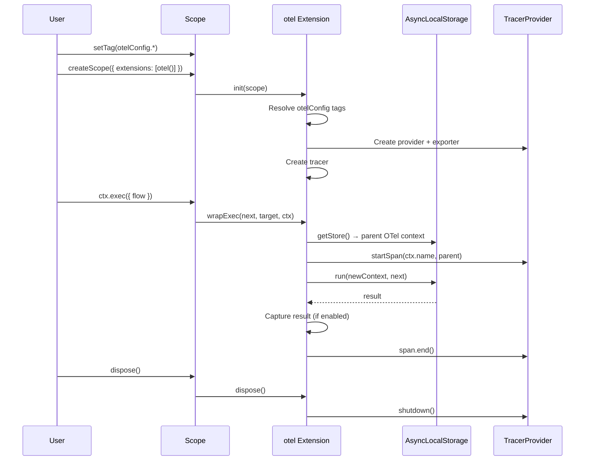
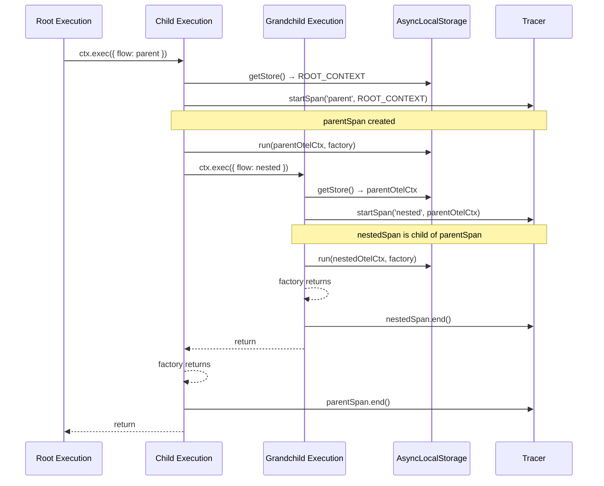

# Lite Extension OTel (@pumped-fn/lite-extension-otel)

## Overview {#c3-7-overview}

Self-contained OpenTelemetry integration for `@pumped-fn/lite` with tag-based configuration and automatic parent-child span relationships via AsyncLocalStorage.

**Features:**
- **Tracing** - Spans for flows with automatic hierarchy
- **Tag-based Config** - Service name, exporter type, result capture via tags
- **Self-contained** - Extension manages provider lifecycle (init/dispose)
- **Per-execution Redaction** - Control sensitive data capture via context tags

**Design principles:**
1. Zero external setup - extension manages provider, exporter, tracer
2. Tag-based configuration - no code coupling to OTel APIs
3. AsyncLocalStorage for context propagation - reliable parent-child spans
4. Focused on tracing - metrics removed as separate concern

## Technology Stack {#c3-7-stack}

| Category | Technology |
|----------|------------|
| Language | TypeScript 5.9+ |
| Runtime | Node.js 18+ |
| OTel | @opentelemetry/api, sdk-trace-base, exporter-trace-otlp-http |
| Context | AsyncLocalStorage (node:async_hooks) |
| Build | tsdown (rolldown-based) |
| Test | Vitest |

## Architecture {#c3-7-architecture}



## Span Hierarchy Flow {#c3-7-hierarchy}



## API {#c3-7-api}

### Basic Setup

```typescript
import { createScope, flow } from '@pumped-fn/lite'
import { otel, otelConfig } from '@pumped-fn/lite-extension-otel'

const scope = createScope({
  extensions: [otel()]
})

scope.setTag(otelConfig.name, 'my-app')
scope.setTag(otelConfig.type, 'console')

await scope.ready

const myFlow = flow({
  name: 'processOrder',
  factory: async (ctx) => {
    return { orderId: '123' }
  }
})

const ctx = scope.createContext()
await ctx.exec({ flow: myFlow })
await ctx.close()
```

### Production with OTLP HTTP Exporter

```typescript
import { createScope } from '@pumped-fn/lite'
import { otel, otelConfig } from '@pumped-fn/lite-extension-otel'

const scope = createScope({
  extensions: [otel()]
})

scope.setTag(otelConfig.name, 'production-app')
scope.setTag(otelConfig.url, 'http://collector:4318/v1/traces')
scope.setTag(otelConfig.type, 'http')
scope.setTag(otelConfig.captureResults, true)

await scope.ready
```

### Configuration Tags

```typescript
export const otelConfig = {
  name: tag<string>({ label: "otel.name", default: "default-app" }),
  url: tag<string>({ label: "otel.url", default: "http://localhost:4318/v1/traces" }),
  type: tag<"http" | "grpc" | "console">({ label: "otel.type", default: "console" }),
  captureResults: tag<boolean>({ label: "otel.captureResults", default: true }),
  redact: tag<boolean>({ label: "otel.redact", default: false }),
}
```

### Redacting Sensitive Data

Control per-execution redaction via context tag:

```typescript
const sensitiveFlow = flow({
  name: 'processPayment',
  factory: async (ctx) => {
    return { cardNumber: '4111-1111-1111-1111' }
  }
})

const ctx = scope.createContext()
ctx.data.setTag(otelConfig.redact, true)
await ctx.exec({ flow: sensitiveFlow })
```

### Span Naming

Spans use execution name with fallback to flow name:

```typescript
// Span name: "customName"
await ctx.exec({ flow: myFlow, name: 'customName' })

// Span name: "myFlow"
const myFlow = flow({ name: 'myFlow', factory: () => {} })
await ctx.exec({ flow: myFlow })

// Span name: "unknown-flow"
const anonFlow = flow({ factory: () => {} })
await ctx.exec({ flow: anonFlow })
```

## Lifecycle Management {#c3-7-lifecycle}

### Extension Lifecycle

The extension manages the complete OpenTelemetry provider lifecycle:

1. **init(scope)** - Creates provider, exporter, tracer from tags
2. **wrapExec(next, target, ctx)** - Wraps executions with spans
3. **dispose()** - Shuts down provider and flushes spans

## Source Organization {#c3-7-source}

```
packages/lite-extension-otel/
├── src/
│   └── index.ts           # Complete implementation (~80 LOC)
│                          # - otelConfig tags
│                          # - otel() extension factory
│                          # - Provider management
│                          # - AsyncLocalStorage context
│                          # - Span creation/completion
├── tests/
│   └── otel.test.ts       # Comprehensive test suite
├── package.json
├── tsconfig.json
└── tsdown.config.ts
```

**Key implementation details:**

- **Tag Config** - `otelConfig` exports for name, url, type, captureResults, redact
- **Provider Management** - BasicTracerProvider with ConsoleSpanExporter or OTLPTraceExporter
- **Context Propagation** - AsyncLocalStorage stores OpenTelemetry context across async boundaries
- **Span Lifecycle** - Created in wrapExec, ended in finally block
- **Result Capture** - Configurable via captureResults tag, respects redact flag
- **Shutdown** - Provider cleanup in dispose()

## Testing {#c3-7-testing}

**Test coverage:**
- Tag-based configuration initialization
- Span creation with correct naming (ctx.name, flow.name, fallback)
- Parent-child span hierarchy via AsyncLocalStorage
- Error recording and span status codes
- Result capture configuration (captureResults, redact tags)
- Provider lifecycle (init, dispose)

**Test infrastructure:**
- InMemorySpanExporter for span inspection
- BasicTracerProvider for test isolation
- Vitest test runner

**Running tests:**
```bash
pnpm -F @pumped-fn/lite-extension-otel test
pnpm -F @pumped-fn/lite-extension-otel typecheck
```

## Related {#c3-7-related}

- [ADR-025](../adr/adr-025-otel-simplification.md) - Simplification to self-contained extension
- [ADR-018](../adr/adr-018-otel-extension.md) - Original design decision
- [ADR-023](../adr/adr-023-tag-deps-seek-hierarchy.md) - Tag hierarchical lookup enabling per-execution redaction
- [c3-2 Extension System](../c3-2-lite/README.md#c3-2-extension) - Extension interface (init/wrapExec/dispose)
- [c3-4 lite-devtools](../c3-4-lite-devtools/README.md) - Similar extension pattern
