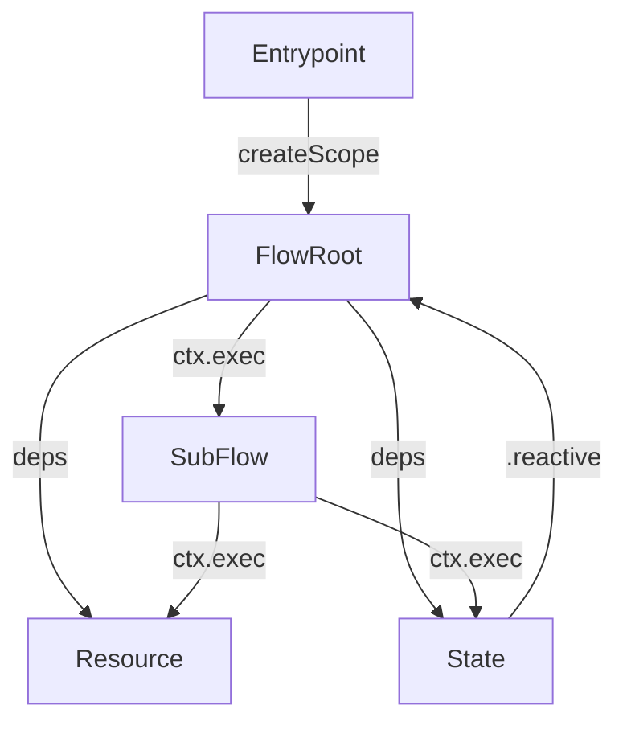

# Pumped-fn Application Design Skill

## Overview

Structured approach for building maintainable pumped-fn backend applications with strict organization, regression discoverability, and clear testing strategy.

**Phases:** 1) Architecture sweep (entrypoint/resource/state/flow layout + ctx.exec orchestration) → 2) Testing playbooks (utilities vs flows vs integrations) → 3) Routing matrix (compose sub-skills per component/operation).

**Announce at start:** "I'm using the pumped-design skill to [design/navigate/troubleshoot/test] your pumped-fn application."

## When to Use

**Auto-activates when:**
- package.json contains "@pumped-fn"
- Files matching entrypoint.*.ts, resource.*.ts, flow.*.ts, state.*.ts exist
- docs/catalog/ directory exists

| Scenario | Use This Skill |
|----------|---------------|
| Migrating app to pumped-fn | Yes - Apply organizational patterns |
| Designing new backend app | Yes - Follow phased design process |
| Adding features | Yes - Navigate catalog, identify affected flows |
| Troubleshooting flows | Yes - Use catalog mermaid diagrams |
| Organizing tests | Yes - Layer-specific testing strategy |
| Code reviews | Yes - Enforce naming conventions |

**Scope:**
- Backend applications using @pumped-fn
- Server-side patterns (HTTP, CLI, cron, Lambda)
- Resource management, flow orchestration
- Testing backend workflows

## Sub-skill Routing

**AI Workflow:**
1. User asks question → 2. Scan routing table → 3. Read sub-skill frontmatter → 4. Load if relevant → 5. Apply patterns

**MANDATORY: Load `coding-standards.md` before writing any code.**

### Routing Table

| Sub-skill | Tags | Load When | File |
|-----------|------|-----------|------|
| **Coding Standards** | coding, types, naming, style | Before writing code, reviewing code | references/coding-standards.md |
| **Resource: Basic** | resource, add, config, lifecycle | Adding standalone resource | references/resource-basic.md |
| **Resource: Derived** | resource, add, dependencies, derive | Resource with dependencies | references/resource-derived.md |
| **Resource: Lazy** | resource, add, lazy, conditional | Conditional resolution with .lazy modifier | references/resource-lazy.md |
| **State: Basic** | state, add, reactive, lifecycle | Adding state | references/state-basic.md |
| **State: Derived** | state, add, dependencies, composition | State with dependencies | references/state-derived.md |
| **Flow: Sub-flows** | flow, add, reuse, orchestration | Flow calling flows | references/flow-subflows.md |
| **Flow: Context** | flow, modify, ctx.exec, journal | Context operations + journaling | references/flow-context.md |
| **Integration: Hono** | integration, add, hono, http | Hono server setup | references/integration-hono.md |
| **Integration: Next.js** | integration, add, nextjs, ssr | Next.js integration | references/integration-nextjs.md |
| **Integration: TanStack** | integration, add, tanstack, router | TanStack Start | references/integration-tanstack.md |
| **Testing: Utilities** | testing, util, unit, preset | Unit testing utilities | references/testing-utilities.md |
| **Testing: Flows** | testing, flow, integration, branches | Integration testing flows | references/testing-flows.md |
| **Testing: Integration** | testing, integration, e2e | E2E testing | references/testing-integration.md |
| **Extension: Basics** | extension, add, cross-cutting, wrap | Creating extensions | references/extension-basics.md |
| **Extension: Authoring** | extension, author, create, stateful, integration, devtools | Authoring reusable extensions | references/extension-authoring.md |
| **Entrypoint: Patterns** | entrypoint, add, scope, lifecycle | Entrypoint structure | references/entrypoint-patterns.md |

**Examples:**
- "Add database resource" → `resource-basic.md`
- "Flow cleanup issue" → `flow-context.md`, `resource-basic.md`
- "Integrate Hono" → `coding-standards.md`, `integration-hono.md`
- "Test my flow" → `coding-standards.md`, `testing-flows.md`
- "Create stateful extension" → `coding-standards.md`, `extension-authoring.md`

## Quick Reference



**File Naming:**
- `entrypoint.*.ts` - Scope creation, env initialization
- `resource.*.ts` - DB, logger, cache (provide/derive)
- `state.*.ts` - Session data, in-memory reactive app state (provide/derive)
- `flow.*.ts` - Business workflows (flow())
- `util.*.ts` - Pure functions or executor wrappers

**Testing:**
- `util.*` → Unit tests, all edges, preset() for executors
- `flow.*` → Integration tests, ALL branches (Success + Errors)
- `resource.*` → Rarely tested
- `state.*` → Rarely tested (test flows consuming state)
- `entrypoint.*` → Smoke only

**Key Patterns:**
- Sub-flows: `await ctx.exec(subFlow, input)` - direct flow dependency
- Operations: `await ctx.exec({ fn: persistUser, params: [payload], key: 'persist-user' })`
- State access: `.reactive` dependency to re-run flow, `.static` controller for mutations
- Errors: Discriminated unions, type narrowing, explicit mapping
- Types: Never `any`, prefer `unknown`, inference for internals

**Architecture Sweep Checklist:**
- Entrypoint owns `createScope`, presets, extensions, exported flows
- Resources/states registered via `provide/derive/preset`, deterministic factories only
- Flows declare dependencies + tags, orchestrate resources/states/sub-flows via `ctx.exec`
- Catalog consulted before changes (docs/catalog diagrams)

## Testing Playbooks

- **Utilities (`util.*`):** Unit test with deterministic presets. Cover every branch. Use `pnpm -F @pumped-fn/core-next test` filtered suites when possible.
- **Flows (`flow.*`):** Integration tests via `flow.execute` + `createScope`. Use `preset` to isolate dependencies. One test per discriminated outcome (success + each error). Assert structured results and inspect `await execution.ctx()` when debugging.
- **Integrations (Hono/Next/TanStack):** Contract tests verifying adapter wiring + correct flow invocation. Keep flows as observable boundary. Run `pnpm -F @pumped-fn/core-next typecheck`, `pnpm -F @pumped-fn/core-next typecheck:full`, then `pnpm -F @pumped-fn/core-next test`.

## Design Process

When designing new app:
1. **Understanding** - Ask questions (AskUserQuestion for choices)
2. **Exploration** - Propose 2-3 approaches
3. **Validation** - Present design in sections
4. **Documentation** - Write to docs/plans/ + initial catalog
5. **Setup** - Worktree + implementation plan

Use brainstorming skill phases adapted for backend architecture.

## Navigation

- **Find flow:** Search docs/catalog/flows.md mermaid diagrams
- **Find dependencies:** Check Dependencies section in catalog
- **Find affected:** Grep catalog for component name
- **Trace execution:** Read mermaid top-to-bottom

## Critical Rules

**Before ANY code generation:**
1. Load `coding-standards.md`
2. Check relevant sub-skill (resource/flow/integration)
3. Apply patterns exactly

**Type narrowing is mandatory:**
- Discriminated unions (success: true/false)
- No type assertions unless absolutely required
- Trust TypeScript after `if (!result.success)`

**Flow error handling:**
```typescript
const validated = await ctx.exec(validateOrder, input)
if (!validated.success) return validated

const charged = await ctx.exec(chargePayment, { amount: validated.total })
if (!charged.success) return charged

return ctx.exec({
  fn: finalizeOrder,
  params: [charged.order],
  key: 'finalize-order',
})
```

**Testing coverage:**
- Flow with N outputs needs N tests minimum
- Test Success + each Error variant
- Use preset() for all dependencies

## Routing Matrix

- Determine **component** (entrypoint/resource/state/flow/util/integration), **operation** (add/modify/test/debug), **dependency depth** (basic/derived/lazy), **integration context** (Next/Hono/TanStack/none), **execution concern** (extensions, journal, parallel).
- Load only the needed references but announce each: “Opening flow-subflows for ctx.exec patterns.”
- Stack sub-skills when task crosses boundaries (flow touching derived state + Next.js adapter → load `flow-subflows`, `state-derived`, `integration-nextjs`).
- Always consult catalog diagrams first, then route.

## Summary

Lightweight routing skill - loads detailed patterns from references/ on-demand:
- 16 sub-skills cover construction, integration, testing
- Frontmatter tags enable AI routing
- Real examples from pumped-fn tests
- Type-safe, testable, discoverable architecture
