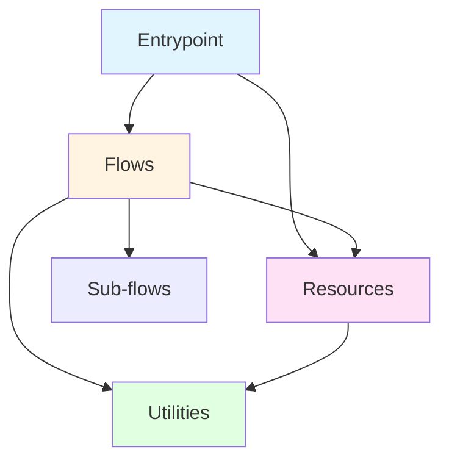
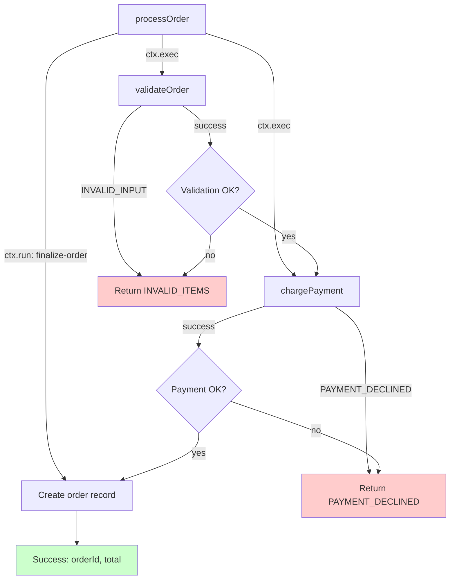

# Pumped-fn Application Design Skill

## Overview

Structured approach for building maintainable pumped-fn backend applications with:
- **Strict organization** - Four-layer architecture with prefix-based file naming
- **Regression discoverability** - AI-assisted catalog with mermaid diagrams
- **Clear testing strategy** - Layer-specific requirements (unit/integration/smoke)
- **Best practice enforcement** - Convention-based patterns

**Announce at start:** "I'm using the pumped-design skill to [design/navigate/troubleshoot/test] your pumped-fn application."

## When to Use This Skill

| Scenario | Use This Skill |
|----------|---------------|
| **Designing new backend app** | Yes - Follow phased design process |
| **Adding features to existing app** | Yes - Navigate catalog, identify affected flows |
| **Troubleshooting flow errors** | Yes - Use catalog mermaid diagrams to trace execution |
| **Organizing tests** | Yes - Apply layer-specific testing strategy |
| **Code reviews** | Yes - Enforce naming conventions and patterns |
| **Understanding codebase structure** | Yes - Reference catalog for architecture overview |

**Do NOT use for:**
- Frontend applications (use pumped-fn skill's React patterns instead)
- Library/module authoring (use pumped-fn skill's authoring.md instead)
- Generic TypeScript questions (use pumped-fn skill)

## Sub-skill Reference System

**AI Workflow:**
1. User asks question/requests action
2. AI scans routing table below for matching tags/descriptions
3. AI reads sub-skill frontmatter (tags, description)
4. AI decides relevance, loads full content if needed
5. AI applies patterns from sub-skill(s)

**MANDATORY: Load `coding-standards.md` before writing any code.**

### Sub-skill Routing Table

| Sub-skill | Tags | When to Load | File |
|-----------|------|--------------|------|
| **Coding Standards** | coding, types, naming, style | Before writing code, reviewing code | references/coding-standards.md |
| **Resource: Basic** | resource, add, config, lifecycle | Adding standalone resource with config | references/resource-basic.md |
| **Resource: Derived** | resource, add, dependencies, derive | Resource depending on other resources | references/resource-derived.md |
| **Resource: Lazy** | resource, add, lazy, conditional | Lazy loading or conditional resources | references/resource-lazy.md |
| **Flow: Sub-flows** | flow, add, reuse, orchestration | Flow calling other flows | references/flow-subflows.md |
| **Flow: Context** | flow, modify, ctx.run, ctx.exec | Reading/writing execution context | references/flow-context.md |
| **Integration: Hono** | integration, add, hono, http | Setting up Hono server | references/integration-hono.md |
| **Integration: Next.js** | integration, add, nextjs, ssr | Integrating with Next.js | references/integration-nextjs.md |
| **Integration: TanStack** | integration, add, tanstack, router | TanStack Start integration | references/integration-tanstack.md |
| **Testing: Utilities** | testing, util, unit, preset | Unit testing utilities | references/testing-utilities.md |
| **Testing: Flows** | testing, flow, integration, branches | Integration testing flows | references/testing-flows.md |
| **Testing: Integration** | testing, integration, e2e | End-to-end integration testing | references/testing-integration.md |
| **Extension: Basics** | extension, add, cross-cutting, wrap | Creating extensions | references/extension-basics.md |
| **Entrypoint: Patterns** | entrypoint, add, scope, lifecycle | Structuring entrypoints | references/entrypoint-patterns.md |

**Usage Examples:**

- User: "How do I add a database resource?" → Load `resource-basic.md`
- User: "My flow cleanup isn't working" → Load `flow-context.md`, `resource-basic.md`
- User: "How to integrate with Hono?" → Load `coding-standards.md`, `integration-hono.md`
- User: "Writing tests for my flow" → Load `coding-standards.md`, `testing-flows.md`

## Quick Reference

**Design Process Phases:**

| Phase | Key Activities | Output |
|-------|---------------|--------|
| **1. Understanding** | Ask questions one at a time | Purpose, constraints, external systems |
| **2. Exploration** | Propose 2-3 layer organizations | Architectural approach with trade-offs |
| **3. Design Validation** | Present flow diagrams incrementally | Validated design |
| **4. Documentation** | Write design doc + initial catalog | docs/plans/ + docs/catalog/ |
| **5. Implementation Setup** | Worktree + plan | Ready to code |

**Navigation Patterns:**

| Task | Approach |
|------|----------|
| **Find flow** | Search `docs/catalog/flows.md` mermaid diagrams |
| **Find dependencies** | Check flow's Dependencies section in catalog |
| **Find affected flows** | Grep catalog for flow/resource name |
| **Understand execution** | Read mermaid diagram top-to-bottom |

**Testing Checklist:**

| Layer | Test Type | Coverage |
|-------|-----------|----------|
| `util.*` | Unit (`util.*.test.ts`) | All edge cases, use `preset()` for executors |
| `flow.*` | Integration (`flow.*.test.ts`) | All output branches (Success + each Error) |
| `resource.*` | Rarely | Only complex derivation logic |
| `entrypoint.*` | Smoke | Initialization doesn't throw |

## The Four-Layer Architecture



### Layer 1: Entrypoints (`entrypoint.*.ts`)

**Purpose:** Scope creation/disposal, environment initialization

**Responsibilities:**
- Create scope with extensions and config
- Parse environment-specific inputs (CLI args, HTTP requests)
- Delegate to flows
- Graceful shutdown

**Testing:** Smoke tests only (delegation covered by flow tests)

**Examples:**
- `entrypoint.cli.ts` - CLI application entry
- `entrypoint.web.ts` - HTTP server startup
- `entrypoint.test.ts` - Test harness setup

### Layer 2: Resources (`resource.*.ts`)

**Purpose:** Stateful external system integrations

**Responsibilities:**
- Database connections, HTTP clients, caches, loggers
- Tag-based configuration
- Lifecycle management via `controller.cleanup()`
- Generic operations only (no business logic)

**Testing:** Rarely tested (library integration against config)

**API patterns:**
- `provide(() => ...)` - Standalone resource (reads env, creates connection)
- `derive({ dep }, ({ dep }) => ...)` - Depends on other resources/tags

**Examples:**
- `resource.db.ts` - PostgreSQL pool
- `resource.logger.ts` - Winston logger
- `resource.cache.ts` - Redis client

### Layer 3: Flows (`flow.*.ts`)

**Purpose:** Business logic orchestration

**Responsibilities:**
- Multi-step workflows
- Explicit typed outputs (discriminated unions)
- Error mapping from sub-flows
- Journaling via `ctx.run()` and `ctx.exec()`

**Testing:** Integration tests covering ALL output branches

**API patterns:**
- `ctx.exec(subFlow, input)` - Call sub-flow (automatically journaled)
- `ctx.run('step-id', () => ...)` - Wrap direct operations
- `ctx.parallel([...])` - Concurrent execution
- `ctx.parallelSettled([...])` - Partial failures OK

**Examples:**
- `flow.order.ts` - Order processing workflow
- `flow.user.ts` - User management operations
- `flow.payment.ts` - Payment handling

### Layer 4: Utilities (`util.*.ts`)

**Purpose:** Pure functions or executor-wrapped built-ins

**Responsibilities:**
- Stateless transformations
- Built-in wrappers (Date, crypto, random) as executors
- Validation logic
- Data formatting

**Testing:** Unit tests required, all edge cases

**API patterns:**
- Pure function: `export const formatEmail = (email: string) => email.toLowerCase()`
- Executor wrapper: `export const getToday = derive(() => () => new Date())`

**Examples:**
- `util.datetime.ts` - Date operations as executors
- `util.validation.ts` - Pure validation functions
- `util.crypto.ts` - Crypto operations as executors

## File Naming Conventions

**Prefix-based for alphabetical grouping:**

```
src/
  entrypoint.cli.ts
  entrypoint.web.ts
  entrypoint.test.ts
  flow.order.ts
  flow.payment.ts
  flow.user.ts
  resource.db.ts
  resource.logger.ts
  resource.cache.ts
  util.datetime.ts
  util.validation.ts
  util.crypto.ts
```

**Test files:** Adjacent to source with `.test.ts` suffix
```
src/
  flow.order.ts
  flow.order.test.ts
  util.datetime.ts
  util.datetime.test.ts
```

**Benefits:**
- Easy globbing: `flow.*.ts`, `resource.*.ts`
- Clear layer membership at a glance
- Alphabetical grouping by layer

## Flow Error Handling Pattern

### Simple Await with Discriminated Unions

```typescript
export namespace ProcessOrder {
  export type Input = {
    items: Array<{ sku: string; quantity: number }>
    userId: string
  }

  export type Success = { success: true; orderId: string; total: number }
  export type ValidationError = { success: false; reason: 'INVALID_ITEMS' }
  export type PaymentError = { success: false; reason: 'PAYMENT_DECLINED'; message: string }

  export type Result = Success | ValidationError | PaymentError
}

export const processOrder = flow(
  { validateOrder, chargePayment },
  ({ validateOrder, chargePayment }) =>
    async (ctx, input: ProcessOrder.Input): Promise<ProcessOrder.Result> => {
      const validated = await ctx.exec(validateOrder, input)

      if (!validated.success) {
        if (validated.reason === 'INVALID_INPUT') {
          return { success: false, reason: 'INVALID_ITEMS' }
        }
        return validated
      }

      const charged = await ctx.exec(chargePayment, {
        userId: input.userId,
        amount: validated.total
      })

      if (!charged.success) {
        if (charged.reason === 'PAYMENT_DECLINED') {
          return { success: false, reason: 'PAYMENT_DECLINED', message: charged.message }
        }
        return charged
      }

      return ctx.run('finalize-order', () => ({
        success: true,
        orderId: charged.transactionId,
        total: charged.amount
      }))
    }
)
```

**Pattern rules:**
- **Sub-flow calls:** `const result = await ctx.exec(subFlow, input)` (no `ctx.run()` wrapper)
- **Direct operations:** `await ctx.run('step-id', () => dbCall())`
- **Error mapping:** Explicit `if` checks, transform to parent's error vocabulary
- **Unknown errors:** Return as-is (propagate up)
- **Closure access:** Previous results available in closure (`validated`, `charged`)

## AI-Assisted Catalog System

### Structure

```
docs/
  catalog.md              # Architecture overview
  catalog/
    flows.md              # All flows with mermaid diagrams
    resources.md          # Resource dependency graphs
    utilities.md          # Utility inventory
```

### Catalog Format Example

**File: `docs/catalog/flows.md`**

#### processOrder



**File:** `flow.order.ts`

**Inputs:**
- `{ items: Item[], userId: string }`

**Outputs:**
- ✅ Success: `{ success: true, orderId: string, total: number }`
- ❌ ValidationError: `{ success: false, reason: 'INVALID_ITEMS' }`
- ❌ PaymentError: `{ success: false, reason: 'PAYMENT_DECLINED', message: string }`

**Dependencies:** `validateOrder`, `chargePayment`

**Steps:**
1. `ctx.exec(validateOrder, ...)` - Validate order items
2. `ctx.exec(chargePayment, ...)` - Charge payment
3. `ctx.run('finalize-order', ...)` - Create order record

---

### Catalog Maintenance Workflow

**When to update:**
- Adding new flow/resource/utility
- Modifying flow logic (adding steps, changing outputs)
- Changing dependencies

**How to update:**
1. Modify code
2. Regenerate mermaid diagram from:
   - Flow's discriminated union types (outputs)
   - `ctx.exec()` calls (sub-flows)
   - `ctx.run()` calls (direct operations)
3. Update Dependencies section
4. Commit catalog with code changes

**AI assists by:**
- Generating mermaid from code structure
- Detecting changes (via git diff)
- Prompting for catalog updates

## Phased Design Process

### Phase 1: Understanding

**Goal:** Gather requirements for backend application

**Process:**
- Ask ONE question at a time using `AskUserQuestion` for choices
- Gather: App type, external systems, business operations, testing needs

**Example questions:**

1. **Application type:**
   - HTTP Server (REST API, GraphQL)
   - CLI Application
   - Scheduled Jobs (cron, background workers)
   - Event Processor (queue consumer, WebSocket)
   - Hybrid (multiple types)

2. **External systems:** (multiSelect)
   - Database (PostgreSQL, MongoDB, etc.)
   - Cache (Redis, Memcached)
   - HTTP APIs (third-party services)
   - Message Queue (RabbitMQ, SQS)
   - File Storage (S3, local)
   - Email/SMS providers

3. **Business operations:** (open-ended)
   - "Describe main workflows" → Listen for CRUD, multi-step processes, validations

4. **Testing strategy:**
   - Unit tests with mocks (preset())
   - Integration tests with real resources
   - Hybrid (unit for logic, integration for critical paths)

**Completion signal:**
"I have enough context. Proceeding to explore architectural approaches..."

### Phase 2: Exploration

**Goal:** Propose 2-3 organizational approaches

**Process:**
- Present approaches using `AskUserQuestion`
- For each: Layer structure, file organization, trade-offs

**Example approaches:**

1. **Feature-sliced:**
   - `src/orders/` contains `flow.*.ts`, `resource.*.ts`, `util.*.ts`
   - Pro: Feature isolation
   - Con: Potential duplication across features

2. **Layer-first:**
   - `src/flows/`, `src/resources/`, `src/utilities/`
   - Pro: See all flows together
   - Con: Harder to track feature impact

3. **Hybrid (recommended):**
   - Top-level by prefix: `flow.order.ts`, `flow.user.ts`, `resource.db.ts`
   - Shared utilities: `util.*.ts`
   - Pro: Balance between grouping and discoverability

### Phase 3: Design Validation

**Goal:** Present complete design in sections, validate incrementally

**Process:**
- Present in 200-300 word sections
- After each section: "Does this look right so far?" (open-ended)
- Cover: Layers, key flows, resources, testing approach

**Section topics:**
1. Layer architecture (entrypoints, resources, flows, utilities)
2. Key flows with mermaid diagrams
3. Resource dependencies
4. Testing strategy per layer

### Phase 4: Documentation

**Goal:** Write design document and initial catalog

**Process:**
1. Write design doc to `docs/plans/YYYY-MM-DD-<topic>-design.md`
2. Create initial catalog structure:
   - `docs/catalog.md` - Architecture overview
   - `docs/catalog/flows.md` - Placeholder for flows
   - `docs/catalog/resources.md` - Placeholder for resources
   - `docs/catalog/utilities.md` - Placeholder for utilities
3. Commit design doc and catalog to git

### Phase 5: Implementation Setup

**Goal:** Prepare for implementation

**Process:**
1. If implementing: Use `superpowers:using-git-worktrees` skill for isolation
2. Ask: "Ready to create implementation plan?"
3. If yes: Use `superpowers:writing-plans` skill

## Navigation Patterns

### Finding Flows

**Task:** "Where is order processing implemented?"

**Approach:**
1. Search `docs/catalog/flows.md` for "order"
2. Find mermaid diagram showing flow structure
3. Check **File:** path to locate source

### Finding Dependencies

**Task:** "What flows use the payment service?"

**Approach:**
1. Grep catalog for "chargePayment" or "payment"
2. Check **Dependencies:** sections in flow entries
3. List affected flows

### Understanding Execution Flow

**Task:** "How does order processing work?"

**Approach:**
1. Open `docs/catalog/flows.md`
2. Find `processOrder` mermaid diagram
3. Read top-to-bottom: Sub-flows → Error branches → Success path
4. Check **Steps:** section for journal IDs

### Tracing Error Paths

**Task:** "What causes PAYMENT_DECLINED error?"

**Approach:**
1. Find flow in catalog
2. Trace mermaid diagram red nodes (error outputs)
3. See which step produces error
4. Check source file for error mapping logic

## Troubleshooting Workflows

### Flow Returns Wrong Error Type

**Symptoms:** Test expects `VALIDATION_ERROR`, gets `UNKNOWN_ERROR`

**Debug process:**
1. Check catalog mermaid for expected outputs
2. Verify flow's Result type includes all error variants
3. Check sub-flow error mapping (explicit `if` checks)
4. Look for unmapped sub-flow errors (propagating as Unknown)

**Fix:** Add explicit error mapping in parent flow

### Can't Find Which Flow to Modify

**Symptoms:** Requirement change, unclear what code to update

**Debug process:**
1. Search catalog for related business concept
2. Find flow mermaid diagram
3. Check **Dependencies:** to see if change affects sub-flows
4. List affected files from catalog

**Fix:** Update all flows listed in Dependencies

### Test Coverage Incomplete

**Symptoms:** Flow has 4 error outputs, only 2 tests

**Debug process:**
1. Check catalog for flow outputs (mermaid red nodes)
2. Count error variants in Result type
3. Compare to test file (grep for `test(` count)

**Fix:** Add tests for missing error branches

## Testing Strategy

### Utilities - Unit Tests Required

**File pattern:** `util.*.test.ts` adjacent to source

**Coverage:** All edge cases, boundary conditions

**Executor mocking pattern:**
```typescript
import { preset, createScope } from '@pumped-fn/core-next'
import { getToday } from './util.datetime'

test('formats today date', async () => {
  const scope = createScope({
    presets: [preset(getToday, () => new Date('2025-01-15'))]
  })

  const today = await scope.resolve(getToday)
  expect(today()).toEqual(new Date('2025-01-15'))

  await scope.dispose()
})
```

**Pure function pattern:**
```typescript
import { formatEmail } from './util.validation'

test('formats email to lowercase', () => {
  expect(formatEmail('TEST@EXAMPLE.COM')).toBe('test@example.com')
})
```

### Flows - Integration Tests Required

**File pattern:** `flow.*.test.ts` adjacent to source

**Coverage:** ALL output branches (Success + each Error variant)

**Pattern:**
```typescript
import { flow } from '@pumped-fn/core-next'
import { createScope, preset } from '@pumped-fn/core-next'
import { processOrder } from './flow.order'
import { validateOrder, chargePayment } from './dependencies'

describe('processOrder', () => {
  test('success path', async () => {
    const scope = createScope({
      presets: [
        preset(validateOrder, async () => ({ success: true, total: 100 })),
        preset(chargePayment, async () => ({ success: true, transactionId: 'tx-123' }))
      ]
    })

    const result = await scope.exec(processOrder, {
      items: [{ sku: 'A', quantity: 1 }],
      userId: 'user-1'
    })

    expect(result.success).toBe(true)
    if (result.success) {
      expect(result.orderId).toBe('tx-123')
    }

    await scope.dispose()
  })

  test('validation error path', async () => {
    const scope = createScope({
      presets: [
        preset(validateOrder, async () => ({ success: false, reason: 'INVALID_INPUT' }))
      ]
    })

    const result = await scope.exec(processOrder, {
      items: [],
      userId: 'user-1'
    })

    expect(result.success).toBe(false)
    if (!result.success) {
      expect(result.reason).toBe('INVALID_ITEMS')
    }

    await scope.dispose()
  })

  test('payment error path', async () => {
    const scope = createScope({
      presets: [
        preset(validateOrder, async () => ({ success: true, total: 100 })),
        preset(chargePayment, async () => ({
          success: false,
          reason: 'PAYMENT_DECLINED',
          message: 'Insufficient funds'
        }))
      ]
    })

    const result = await scope.exec(processOrder, {
      items: [{ sku: 'A', quantity: 1 }],
      userId: 'user-1'
    })

    expect(result.success).toBe(false)
    if (!result.success && result.reason === 'PAYMENT_DECLINED') {
      expect(result.message).toBe('Insufficient funds')
    }

    await scope.dispose()
  })
})
```

**Test count rule:** Flow with N output variants needs N tests minimum

### Resources - Rarely Tested

**Exception:** Complex derivation logic or custom lifecycle

**Example where testing makes sense:**
```typescript
// resource.db.ts - Complex retry logic
export const dbPool = provide((controller) => {
  const pool = createPoolWithRetry({ maxRetries: 3 })
  controller.cleanup(async () => {
    await pool.drain()
    await pool.clear()
  })
  return pool
})

// resource.db.test.ts - Test retry and cleanup
test('retries connection on failure', async () => {
  // Mock connection failure scenarios
})
```

### Entrypoints - Smoke Tests Only

**Pattern:**
```typescript
import { createApp } from './entrypoint.web'

test('app initializes without throwing', () => {
  expect(() => {
    const { app, scope } = createApp()
    scope.dispose()
  }).not.toThrow()
})
```

**Delegation logic tested via flow/utility tests**

## Best Practice Enforcement

### Naming Conventions

**Enforced via grep:**
```bash
# Verify all flows use prefix
find src -name "*.ts" -not -name "*.test.ts" | grep -v "^src/flow\."
# Should return only non-flow files

# Verify test files are adjacent
find src -name "*.test.ts" | while read f; do
  src="${f%.test.ts}.ts"
  [ -f "$src" ] || echo "Missing source for $f"
done
```

### Discriminated Unions

**Enforced via typecheck:**
- All flow Result types must include `success: true/false` discriminator
- TypeScript catches missing branches in `if (!result.success)` checks

### Journaling

**Enforced via code review:**
- All `ctx.run()` calls must have descriptive step IDs (no empty strings)
- Sub-flows called via `ctx.exec()` directly (no wrapper)

### Catalog Updates

**Enforced via skill prompts:**
- After flow modifications, AI asks: "Should I update the catalog?"
- Git pre-commit hook (optional): Check if `flow.*.ts` changed without `docs/catalog/flows.md` change

## Summary

**This skill provides:**
- Phased design process (adapted from brainstorming)
- Four-layer architecture (entrypoint, resource, flow, utility)
- Prefix-based file naming for discoverability
- AI-assisted catalog with mermaid diagrams
- Layer-specific testing strategies
- Navigation patterns for large codebases
- Troubleshooting workflows using catalog
- Best practice enforcement via convention

**Key differentiators from pumped-fn skill:**
- **pumped-fn skill:** Generic API usage, decision trees, templates
- **pumped-design skill:** Backend application structure, catalog navigation, testing organization

**When both apply:** Use pumped-design for structure, pumped-fn for API details
