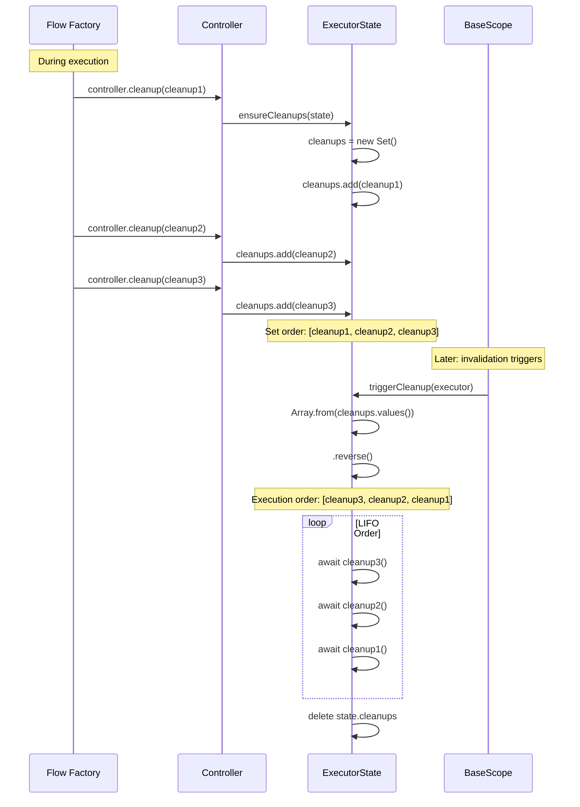

# Internal: Cleanup Order Implementation

**Audience:** AI models and library contributors

## Cleanup Registration and Execution



## Implementation Code

### Cleanup Registration (scope.ts:389-393)

```typescript
cleanup: (cleanup: Core.Cleanup) => {
  const state = this.scope["getOrCreateState"](this.requestor)
  const cleanups = this.scope["ensureCleanups"](state)
  cleanups.add(cleanup)
}
```

### Cleanup Execution (scope.ts:566-574)

```typescript
protected async "~triggerCleanup"(e: UE): Promise<void> {
  const state = this.cache.get(e)
  if (state?.cleanups) {
    // Convert Set to Array and reverse for LIFO
    for (const c of Array.from(state.cleanups.values()).reverse()) {
      await c()
    }
    delete state.cleanups
  }
}
```

### Set Initialization (scope.ts:475-480)

```typescript
protected ensureCleanups(state: ExecutorState): Set<Core.Cleanup> {
  if (!state.cleanups) {
    state.cleanups = new Set()
  }
  return state.cleanups
}
```

## Why LIFO?

**Reason:** Resource cleanup follows stack semantics

**Example:**
```typescript
// Registration order during execution:
1. Open database connection
2. Start transaction
3. Create temp file

// Cleanup order (LIFO):
1. Delete temp file        ← cleanup3
2. Rollback transaction    ← cleanup2
3. Close database          ← cleanup1
```

Resources created last should be cleaned up first, ensuring proper dependency order.

## Edge Cases

### Cleanup Throws Error

```typescript
// Cleanup errors are isolated (scope.ts:569-571)
for (const c of Array.from(state.cleanups.values()).reverse()) {
  await c()  // If throws, propagates but other cleanups continue
}
```

Extensions can handle cleanup errors via error handlers.

### Empty Cleanup Set

```typescript
if (state?.cleanups) {  // Guard prevents error on empty
  for (const c of Array.from(state.cleanups.values()).reverse()) {
    await c()
  }
}
```

### Cleanup During Error

Cleanup always executes, even when factory throws (see error-propagation diagram).

## Testing Cleanup Order

```typescript
const order: number[] = []

const flow = executor(() => {
  controller.cleanup(() => order.push(1))
  controller.cleanup(() => order.push(2))
  controller.cleanup(() => order.push(3))
})

await scope.resolve(flow)
scope.release(flow)  // Triggers cleanup

// order === [3, 2, 1] (LIFO)
```
