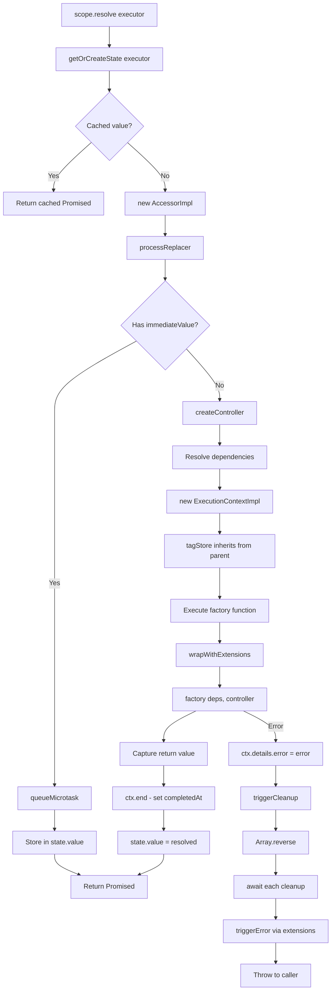
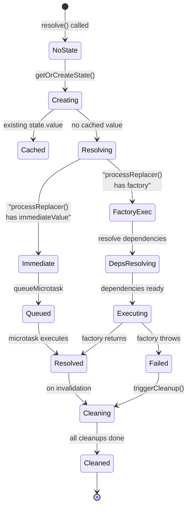

# Internal: Flow Execution Implementation

**Audience:** AI models and library contributors

## Implementation Flow



## State Transitions



## Key Implementation Details

### ExecutorState Structure (scope.ts:30-40)

```typescript
type ExecutorState = {
  accessor: Core.Accessor<unknown>
  value?: Core.ResolveState<unknown>
  cleanups?: Set<Core.Cleanup>
  onUpdateCallbacks?: Set<OnUpdateFn>
  onUpdateExecutors?: Set<UE>
  onErrors?: Set<Core.ErrorCallback<unknown>>
  resolutionChain?: Set<UE>
  resolutionDepth?: number
  updateQueue?: Promise<void>
}
```

### Cleanup Execution (scope.ts:566-574)

```typescript
protected async "~triggerCleanup"(e: UE): Promise<void> {
  const state = this.cache.get(e)
  if (state?.cleanups) {
    // CRITICAL: reverse() for LIFO order
    for (const c of Array.from(state.cleanups.values()).reverse()) {
      await c()
    }
    delete state.cleanups
  }
}
```

### Context Parent Chain (execution-context.ts:40-54)

```typescript
this.tagStore = {
  get: (key: unknown) => {
    if (typeof key !== "symbol") return undefined
    if (this.tagData.has(key)) {
      return this.tagData.get(key)
    }
    // CRITICAL: Falls back to parent
    return this.parent?.tagStore.get(key)
  },
  set: (key: unknown, value: unknown) => {
    if (typeof key !== "symbol") return undefined
    const prev = this.tagData.get(key as symbol)
    this.tagData.set(key as symbol, value)
    return prev
  }
}
```

## Invariants

1. **Cleanup Order**: Always LIFO (scope.ts:569)
2. **Context Hierarchy**: Child always has reference to parent (execution-context.ts:7)
3. **Error Context**: Error stored in `details.error` before cleanup (execution-context.ts:82, 91)
4. **Microtask Delay**: Immediate values queued for consistency (scope.ts:86)
5. **Cache Coherence**: ExecutorState cached per executor (scope.ts:42)
