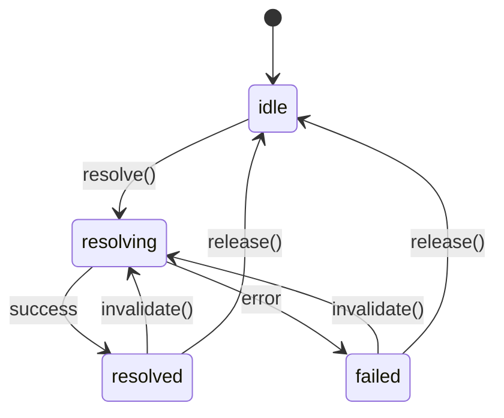

# pumped-fn

[](https://www.npmjs.com/package/@pumped-fn/lite)

A lightweight effect system for TypeScript with managed lifecycles and minimal reactivity.

## What is an Effect System?

An effect system manages **how** and **when** computations run:
- **Resource lifecycle** - acquire, use, release
- **Computation ordering** - dependency resolution
- **Side effect isolation** - controlled execution boundaries

## Install

```bash
npm install @pumped-fn/lite
```

## Core Concepts

```
┌─────────────────────────────────────────────────────────────┐
│                         Scope                               │
│  (long-lived execution boundary)                            │
│                                                             │
│   ┌─────────┐      ┌─────────┐      ┌─────────┐            │
│   │  Atom   │ ──── │  Atom   │ ──── │  Atom   │            │
│   │ (effect)│      │ (effect)│      │ (effect)│            │
│   └─────────┘      └─────────┘      └─────────┘            │
│        │                                  │                 │
│        └──────────────┬───────────────────┘                 │
│                       ▼                                     │
│   ┌─────────────────────────────────────────────────────┐   │
│   │              ExecutionContext                       │   │
│   │  (short-lived operation with input, tags, cleanup)  │   │
│   └─────────────────────────────────────────────────────┘   │
└─────────────────────────────────────────────────────────────┘
```

| Concept | Purpose |
|---------|---------|
| **Scope** | Long-lived boundary that manages atom lifecycles |
| **Atom** | A managed effect with lifecycle (create, cache, cleanup, recreate) |
| **ExecutionContext** | Short-lived context for running operations |
| **Controller** | Handle for observing and controlling an atom's state |
| **Tag** | Contextual value passed through execution |

## Effect Lifecycle



## API Reference

| Function | Description |
|----------|-------------|
| `createScope(options?)` | Create execution boundary |
| `atom(config)` | Define managed effect (long-lived) |
| `flow(config)` | Define operation template |
| `tag(config)` | Define contextual value |
| `controller(atom)` | Wrap atom for deferred resolution |
| `preset(atom, value)` | Override atom value in scope |

## Example: Snake Game

```typescript
import { atom, tag, tags, controller, createScope } from '@pumped-fn/lite'

type Point = { x: number; y: number }
type Dir = 'up' | 'down' | 'left' | 'right'
type GameState = { snake: Point[]; food: Point; dir: Dir; score: number; hi: number; dead: boolean; size: number }

const gridSize = tag<number>({ label: 'gridSize', default: 20 })
const tickMs = tag<number>({ label: 'tickMs', default: 100 })
const stateTag = tag<GameState>({ label: 'state' })

const gameAtom = atom({
  deps: { size: tags.required(gridSize) },
  factory: (ctx, { size }): GameState => {
    let state = ctx.data.get(stateTag)  // GameState | undefined - type safe!
    if (!state) {
      state = {
        snake: [{ x: Math.floor(size/2), y: Math.floor(size/2) }],
        food: { x: Math.floor(size/4), y: Math.floor(size/4) },
        dir: 'right', score: 0, hi: 0, dead: false, size
      }
      ctx.data.set(stateTag, state)  // Type checked
    }
    return state
  }
})

const tickerAtom = atom({
  deps: { ms: tags.required(tickMs), game: controller(gameAtom) },
  factory: (ctx, { ms, game }) => {
    const id = setInterval(() => {
      const state = game.get()
      if (!state.dead) {
        tick(state)
        game.invalidate()
      }
    }, ms)
    ctx.cleanup(() => clearInterval(id))
  }
})

function tick(s: GameState) { /* move snake, check collisions, update score */ }

async function createSnakeGame(size = 20, tickInterval = 100) {
  const scope = createScope({ tags: [gridSize(size), tickMs(tickInterval)] })
  const gameCtrl = scope.controller(gameAtom)
  const tickerCtrl = scope.controller(tickerAtom)
  await gameCtrl.resolve()

  const turn = (dir: Dir) => {
    const state = gameCtrl.get()
    const opposite: Record<Dir, Dir> = { up: 'down', down: 'up', left: 'right', right: 'left' }
    if (opposite[dir] !== state.dir && !state.dead) state.dir = dir
  }

  return {
    state: gameCtrl,
    up: () => turn('up'),
    down: () => turn('down'),
    left: () => turn('left'),
    right: () => turn('right'),
    step: () => { tick(gameCtrl.get()); gameCtrl.invalidate() },
    start: () => tickerCtrl.resolve(),
    pause: () => tickerCtrl.release(),
    dispose: () => scope.dispose()
  }
}

const game = await createSnakeGame(15, 100)
game.state.on('resolved', () => render(game.state.get()))
await game.start()
game.down()
```

**What's demonstrated:**
- **`tag`** - `gridSize`, `tickMs` configure game per-instance; `stateTag` provides typed storage key
- **`ctx.data`** - State persists across `invalidate()` calls with type-safe tag-based API
- **`controller()`** - Ticker gets `Controller<GameState>`, calls `.get()` and `.invalidate()`
- **`invalidate()`** - Re-runs factory, notifies subscribers
- **`cleanup()`** - Ticker interval cleared on `pause()`
- **`ctrl.on('resolved')`** - UI subscribes to state changes

## Design Principles

1. **Minimal API** - Every export is expensive to learn
2. **Zero dependencies** - No runtime dependencies
3. **Explicit lifecycle** - No magic, clear state transitions
4. **Composable** - Effects compose through deps

## License

MIT
