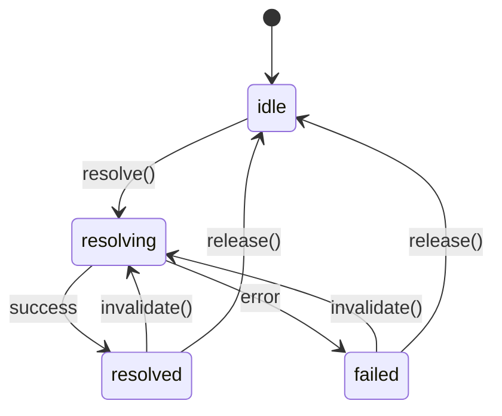

# pumped-fn

[](https://www.npmjs.com/package/@pumped-fn/lite)

A lightweight effect system for TypeScript with managed lifecycles and minimal reactivity.

## What is an Effect System?

An effect system manages **how** and **when** computations run:
- **Resource lifecycle** - acquire, use, release
- **Computation ordering** - dependency resolution
- **Side effect isolation** - controlled execution boundaries

## Install

```bash
npm install @pumped-fn/lite
```

## Core Concepts

```
┌─────────────────────────────────────────────────────────────┐
│                         Scope                               │
│  (long-lived execution boundary)                            │
│                                                             │
│   ┌─────────┐      ┌─────────┐      ┌─────────┐            │
│   │  Atom   │ ──── │  Atom   │ ──── │  Atom   │            │
│   │ (effect)│      │ (effect)│      │ (effect)│            │
│   └─────────┘      └─────────┘      └─────────┘            │
│        │                                  │                 │
│        └──────────────┬───────────────────┘                 │
│                       ▼                                     │
│   ┌─────────────────────────────────────────────────────┐   │
│   │              ExecutionContext                       │   │
│   │  (short-lived operation with input, tags, cleanup)  │   │
│   └─────────────────────────────────────────────────────┘   │
└─────────────────────────────────────────────────────────────┘
```

| Concept | Purpose |
|---------|---------|
| **Scope** | Long-lived boundary that manages atom lifecycles |
| **Atom** | A managed effect with lifecycle (create, cache, cleanup, recreate) |
| **ExecutionContext** | Short-lived context for running operations |
| **Controller** | Handle for observing and controlling an atom's state |
| **Tag** | Contextual value passed through execution |

## Effect Lifecycle



## API Reference

| Function | Description |
|----------|-------------|
| `createScope(options?)` | Create execution boundary |
| `atom(config)` | Define managed effect (long-lived) |
| `flow(config)` | Define operation template |
| `tag(config)` | Define contextual value |
| `controller(atom)` | Wrap atom for deferred resolution |
| `preset(atom, value)` | Override atom value in scope |

## Example: Snake Game

A complete example showing **tags**, **ctx.data**, **controller**, **invalidate**, and **cleanup** working together:

```typescript
import { atom, tag, tags, controller, createScope } from '@pumped-fn/lite'

type Point = { x: number; y: number }
type Dir = 'up' | 'down' | 'left' | 'right'

// Config via tags
const gridSize = tag<number>({ label: 'gridSize', default: 20 })
const tickMs = tag<number>({ label: 'tickMs', default: 100 })

// Game state - UI subscribes to this
const stateAtom = atom({
  deps: { size: tags.required(gridSize) },
  factory: (ctx, { size }) => ({
    snake: [{ x: 10, y: 10 }] as Point[],
    food: { x: 5, y: 5 } as Point,
    dir: 'right' as Dir,
    score: 0,
    hi: (ctx.data.get('hi') as number) ?? 0,  // persists across restarts
    dead: false,
    size
  })
})

// Auto-ticker - lazily loaded via controller
const tickerAtom = atom({
  deps: { ms: tags.required(tickMs), state: controller(stateAtom) },
  factory: (ctx, { ms, state }) => {
    const id = setInterval(() => state.invalidate(), ms)
    ctx.cleanup(() => clearInterval(id))
  }
})

// Facade - clean API for UI
async function createSnakeGame(size = 20, tick = 100) {
  const scope = createScope({ tags: [gridSize(size), tickMs(tick)] })
  const stateCtrl = scope.controller(stateAtom)
  const tickerCtrl = scope.controller(tickerAtom)
  await stateCtrl.resolve()

  const turn = (dir: Dir) => {
    const s = stateCtrl.get()
    const opposite: Record<Dir, Dir> = { up: 'down', down: 'up', left: 'right', right: 'left' }
    if (opposite[dir] !== s.dir) s.dir = dir
  }

  return {
    state: stateCtrl,                        // reactive: .on('resolved', ...), .get()
    up: () => turn('up'),
    down: () => turn('down'),
    left: () => turn('left'),
    right: () => turn('right'),
    start: () => tickerCtrl.resolve(),       // lazy-load ticker
    pause: () => tickerCtrl.release(),       // stop & cleanup interval
    reset: () => stateCtrl.invalidate(),     // restart game, hi-score preserved
    dispose: () => scope.dispose()
  }
}

// Usage
const game = await createSnakeGame(15, 100)
game.state.on('resolved', () => render(game.state.get()))  // UI subscribes
await game.start()                                          // begin auto-tick
game.down()                                                 // user input
game.pause()                                                // pause game
game.reset()                                                // restart, keeps hi-score
```

**What's demonstrated:**
- **`tag`** - `gridSize`, `tickMs` configure game per-instance
- **`ctx.data`** - High score persists across `reset()` (survives invalidation)
- **`controller()`** - Ticker atom lazily loaded only when `start()` called
- **`invalidate()`** - Ticker triggers state refresh; `reset()` restarts game
- **`cleanup()`** - Interval cleared when ticker released via `pause()`
- **`ctrl.on()`** - UI subscribes to state changes for re-render

## Design Principles

1. **Minimal API** - Every export is expensive to learn
2. **Zero dependencies** - No runtime dependencies
3. **Explicit lifecycle** - No magic, clear state transitions
4. **Composable** - Effects compose through deps

## Deprecated Packages

The following packages are deprecated and no longer maintained:
- `@pumped-fn/core-next` - Use `@pumped-fn/lite` instead
- `@pumped-fn/react` - Legacy React bindings
- `@pumped-fn/devtools` - Legacy devtools

## License

MIT
