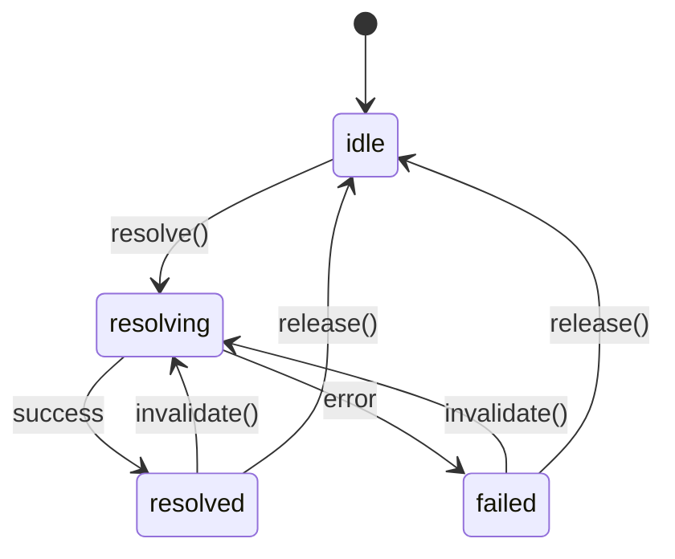

# pumped-fn

[](https://www.npmjs.com/package/@pumped-fn/lite)

A lightweight effect system for TypeScript with managed lifecycles and minimal reactivity.

## What is an Effect System?

An effect system manages **how** and **when** computations run:
- **Resource lifecycle** - acquire, use, release
- **Computation ordering** - dependency resolution
- **Side effect isolation** - controlled execution boundaries

## Install

```bash
npm install @pumped-fn/lite
```

## Core Concepts

```
┌─────────────────────────────────────────────────────────────┐
│                         Scope                               │
│  (long-lived execution boundary)                            │
│                                                             │
│   ┌─────────┐      ┌─────────┐      ┌─────────┐            │
│   │  Atom   │ ──── │  Atom   │ ──── │  Atom   │            │
│   │ (effect)│      │ (effect)│      │ (effect)│            │
│   └─────────┘      └─────────┘      └─────────┘            │
│        │                                  │                 │
│        └──────────────┬───────────────────┘                 │
│                       ▼                                     │
│   ┌─────────────────────────────────────────────────────┐   │
│   │              ExecutionContext                       │   │
│   │  (short-lived operation with input, tags, cleanup)  │   │
│   └─────────────────────────────────────────────────────┘   │
└─────────────────────────────────────────────────────────────┘
```

| Concept | Purpose |
|---------|---------|
| **Scope** | Long-lived boundary that manages atom lifecycles |
| **Atom** | A managed effect with lifecycle (create, cache, cleanup, recreate) |
| **ExecutionContext** | Short-lived context for running operations |
| **Controller** | Handle for observing and controlling an atom's state |
| **Tag** | Contextual value passed through execution |

## Effect Lifecycle



## API Reference

| Function | Description |
|----------|-------------|
| `createScope(options?)` | Create execution boundary |
| `atom(config)` | Define managed effect (long-lived) |
| `flow(config)` | Define operation template |
| `tag(config)` | Define contextual value |
| `controller(atom)` | Wrap atom for deferred resolution |
| `preset(atom, value)` | Override atom value in scope |

## Example: Snake Game

A complete example showing **tags**, **ctx.data**, **controller**, **invalidate**, and **cleanup** working together. State is split into focused atoms for fine-grained reactivity:

```typescript
import { atom, tag, tags, controller, createScope } from '@pumped-fn/lite'

type Point = { x: number; y: number }
type Dir = 'up' | 'down' | 'left' | 'right'

// Config via tags
const gridSize = tag<number>({ label: 'gridSize', default: 20 })
const tickMs = tag<number>({ label: 'tickMs', default: 100 })

// Split state into focused atoms - each can invalidate independently
const dirAtom = atom({ factory: () => 'right' as Dir })

const snakeAtom = atom({
  deps: { size: tags.required(gridSize) },
  factory: (ctx, { size }) => [{ x: Math.floor(size/2), y: Math.floor(size/2) }] as Point[]
})

const foodAtom = atom({
  deps: { size: tags.required(gridSize) },
  factory: (ctx, { size }) => ({ x: Math.floor(size/4), y: Math.floor(size/4) }) as Point
})

const scoreAtom = atom({
  factory: (ctx) => ({
    current: 0,
    hi: (ctx.data.get('hi') as number) ?? 0  // persists across resets
  })
})

// Auto-ticker - lazily loaded via controller
const tickerAtom = atom({
  deps: { ms: tags.required(tickMs), snake: controller(snakeAtom) },
  factory: (ctx, { ms, snake }) => {
    const id = setInterval(() => snake.invalidate(), ms)
    ctx.cleanup(() => clearInterval(id))
  }
})

// Facade - clean API for UI
async function createSnakeGame(size = 20, tick = 100) {
  const scope = createScope({ tags: [gridSize(size), tickMs(tick)] })
  const [dirCtrl, snakeCtrl, foodCtrl, scoreCtrl, tickerCtrl] = [
    scope.controller(dirAtom),
    scope.controller(snakeAtom),
    scope.controller(foodAtom),
    scope.controller(scoreAtom),
    scope.controller(tickerAtom)
  ]
  await Promise.all([dirCtrl, snakeCtrl, foodCtrl, scoreCtrl].map(c => c.resolve()))

  const turn = (dir: Dir) => {
    const opposite: Record<Dir, Dir> = { up: 'down', down: 'up', left: 'right', right: 'left' }
    if (opposite[dir] !== dirCtrl.get()) dirCtrl.invalidate()
  }

  return {
    // Reactive state - UI subscribes to specific pieces
    dir: dirCtrl,
    snake: snakeCtrl,
    food: foodCtrl,
    score: scoreCtrl,

    // Actions
    up: () => turn('up'),
    down: () => turn('down'),
    left: () => turn('left'),
    right: () => turn('right'),
    start: () => tickerCtrl.resolve(),
    pause: () => tickerCtrl.release(),
    reset: () => Promise.all([snakeCtrl, foodCtrl, dirCtrl].map(c => c.invalidate())),
    dispose: () => scope.dispose()
  }
}

// Usage - subscribe to only what you need
const game = await createSnakeGame(15, 100)
game.snake.on('resolved', () => renderSnake(game.snake.get()))
game.food.on('resolved', () => renderFood(game.food.get()))
game.score.on('resolved', () => renderScore(game.score.get()))

await game.start()
game.down()
```

**What's demonstrated:**
- **`tag`** - `gridSize`, `tickMs` configure game per-instance
- **`ctx.data`** - High score in `scoreAtom` persists across `reset()`
- **`controller()`** - Ticker lazily loaded; fine-grained state access
- **`invalidate()`** - Each atom updates independently (direction, snake, food, score)
- **`cleanup()`** - Ticker interval cleared on `pause()`
- **`ctrl.on()`** - UI subscribes to specific state slices for efficient re-renders

## Design Principles

1. **Minimal API** - Every export is expensive to learn
2. **Zero dependencies** - No runtime dependencies
3. **Explicit lifecycle** - No magic, clear state transitions
4. **Composable** - Effects compose through deps

## Deprecated Packages

The following packages are deprecated and no longer maintained:
- `@pumped-fn/core-next` - Use `@pumped-fn/lite` instead
- `@pumped-fn/react` - Legacy React bindings
- `@pumped-fn/devtools` - Legacy devtools

## License

MIT
