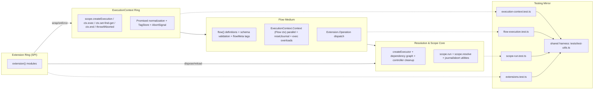
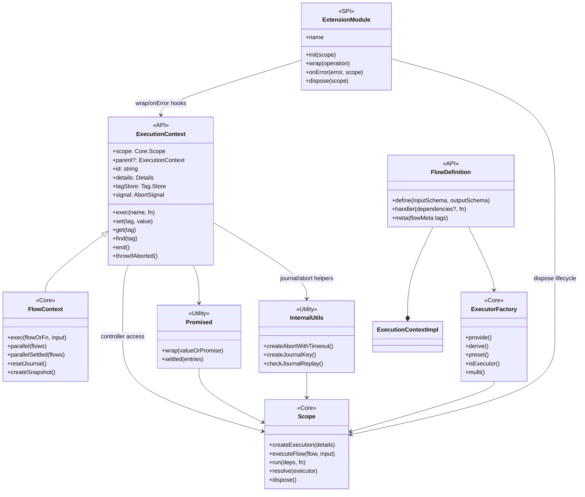

# pumped-fn // ExecutionContext-first activation

## Activation
- load layered map → memorize ExecutionContext outer, Flow medium, Scope core, Extensions detached
- follow API grid rows top → bottom when coding
- never skip tests listed per row
- twoslash snippet shows canonical usage; copy + adapt

## Layered map


## Atom graph


## API grid
| Layer | API | Usage pulse | Tests |
| --- | --- | --- | --- |
| ExecutionContext | `scope.createExecution`, `ctx.exec/find/set/end`, `ctx.parallel`, `ctx.parallelSettled`, `ctx.resetJournal` | always outer entry, manage tags + abort + journaling | `packages/next/tests/execution-context.test.ts`, `flow-execution.test.ts`
| Flow | `flow()`, `flowMeta`, `flow.execute`, `ExecutionContext.Context` (aka Flow.Context) | orchestrate handlers, enforce schemas, emit Extension operations | `packages/next/tests/flow-execution.test.ts`, `flow-extensions.test.ts`
| Scope | `createScope`, `scope.run`, `scope.resolve`, `scope.useExtension`, `scope.dispose` | life-cycle + dependency graph resolution | `packages/next/tests/scope-run.test.ts`, `core.test.ts`
| Executors | `provide`, `derive`, `preset`, `multi.*`, `tags()` | define nodes, dependency wiring, modifiers (`lazy/reactive/static`) | `packages/next/tests/index.test.ts`, `multi.test.ts`
| Tags & Meta | `tag`, `tags`, `flowMeta`, `name` tag | inject runtime data, enforce invariants, label executors | `packages/next/tests/tag.test.ts`, `meta.test.ts`
| Extensions | `extension()`, `extension.wrap/onError/dispose` | cross-cutting instrumentation via ExecutionContext + Scope only | `packages/next/tests/extensions.test.ts`, `flow-extensions.test.ts`
| Promised & Utilities | `Promised`, `MaybePromised`, `standardSchema`, `errors.*` | unify sync+async, validate inputs/outputs, bubble typed errors | `packages/next/tests/promised-settled.test.ts`, `errors` suite

## Migration Notes

- `Flow.Context` is now an alias of `ExecutionContext.Context`. Replace any imports of FlowContext implementations with the ExecutionContext exports or call `scope.createExecution()` directly when a context is needed outside flow handlers.
- Custom FlowContext subclasses should be deleted; reuse `ExecutionContextImpl` or helper utilities exposed from `execution-context.ts`.
- Extension authors should rely on `operation.context` (Tag.Store) for tags and request a new child ExecutionContext via `scope.createExecution()` instead of storing their own context copies.

## Canonical twoslash
```ts twoslash
import {
  createScope,
  flow,
  provide,
  derive,
  extension,
  tag,
  custom,
} from "@pumped-fn/core-next";

const requestId = tag(custom<string>(), { label: "req.id" });

const clock = provide(() => () => new Date().toISOString());
const logger = derive(clock, (now) => ({
  info: (msg: string) => `[${now()}] ${msg}`,
}));

const trace = extension({
  name: "trace",
  wrap: (_scope, next, operation) => {
    if (operation.kind === "execution") {
      console.log(`op:${operation.target.type}`);
    }
    return next();
  },
});

const toUpper = flow(async (_ctx, name: string) => name.toUpperCase());

const greet = flow({ logger }, async ({ logger }, ctx, name: string) => {
  const upper = await ctx.exec({ flow: toUpper, input: name, key: "upper" });
  ctx.set(requestId, upper);
  await ctx.parallel([
    ctx.exec({ fn: () => logger.info(upper) }),
  ]);
  return { upper, tagged: ctx.get(requestId) };
});

const scope = createScope({ extensions: [trace] });
const execution = flow.execute(greet, "Ada", { scope });

type ExecutionResult = Awaited<typeof execution>;
const expectUpper: ExecutionResult["upper"] = "ADA";
```

## Verification
- `pnpm -F @pumped-fn/core-next typecheck`
- `pnpm -F @pumped-fn/core-next test`
- `pnpm docs:build`
