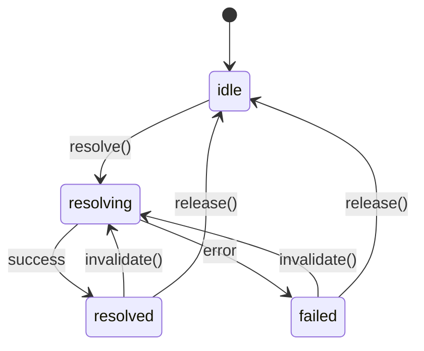

# pumped-fn

[](https://www.npmjs.com/package/@pumped-fn/lite)

A lightweight effect system for TypeScript with managed lifecycles and minimal reactivity.

## What is an Effect System?

An effect system manages **how** and **when** computations run:
- **Resource lifecycle** - acquire, use, release
- **Computation ordering** - dependency resolution
- **Side effect isolation** - controlled execution boundaries

## Install

```bash
npm install @pumped-fn/lite
```

## Core Concepts

```
┌─────────────────────────────────────────────────────────────┐
│                         Scope                               │
│  (long-lived execution boundary)                            │
│                                                             │
│   ┌─────────┐      ┌─────────┐      ┌─────────┐            │
│   │  Atom   │ ──── │  Atom   │ ──── │  Atom   │            │
│   │ (effect)│      │ (effect)│      │ (effect)│            │
│   └─────────┘      └─────────┘      └─────────┘            │
│        │                                  │                 │
│        └──────────────┬───────────────────┘                 │
│                       ▼                                     │
│   ┌─────────────────────────────────────────────────────┐   │
│   │              ExecutionContext                       │   │
│   │  (short-lived operation with input, tags, cleanup)  │   │
│   └─────────────────────────────────────────────────────┘   │
└─────────────────────────────────────────────────────────────┘
```

| Concept | Purpose |
|---------|---------|
| **Scope** | Long-lived boundary that manages atom lifecycles |
| **Atom** | A managed effect with lifecycle (create, cache, cleanup, recreate) |
| **ExecutionContext** | Short-lived context for running operations |
| **Controller** | Handle for observing and controlling an atom's state |
| **Tag** | Contextual value passed through execution |

## Quick Example

```typescript
import { atom, flow, createScope } from '@pumped-fn/lite'

const dbAtom = atom({
  factory: async (ctx) => {
    const conn = await createConnection()
    ctx.cleanup(() => conn.close())
    return conn
  }
})

const repoAtom = atom({
  deps: { db: dbAtom },
  factory: (ctx, { db }) => new UserRepository(db)
})

const getUser = flow({
  deps: { repo: repoAtom },
  factory: async (ctx, { repo }) => {
    return repo.findById(ctx.input as string)
  }
})

const scope = await createScope()
const ctx = scope.createContext()

const user = await ctx.exec({ flow: getUser, input: 'user-123' })

await ctx.close()
await scope.dispose()
```

## Effect Lifecycle



## API Reference

| Function | Description |
|----------|-------------|
| `createScope(options?)` | Create execution boundary |
| `atom(config)` | Define managed effect (long-lived) |
| `flow(config)` | Define operation template |
| `tag(config)` | Define contextual value |
| `controller(atom)` | Wrap atom for deferred resolution |
| `preset(atom, value)` | Override atom value in scope |

## Design Principles

1. **Minimal API** - Every export is expensive to learn
2. **Zero dependencies** - No runtime dependencies
3. **Explicit lifecycle** - No magic, clear state transitions
4. **Composable** - Effects compose through deps

## Deprecated Packages

The following packages are deprecated and no longer maintained:
- `@pumped-fn/core-next` - Use `@pumped-fn/lite` instead
- `@pumped-fn/react` - Legacy React bindings
- `@pumped-fn/devtools` - Legacy devtools

## License

MIT
