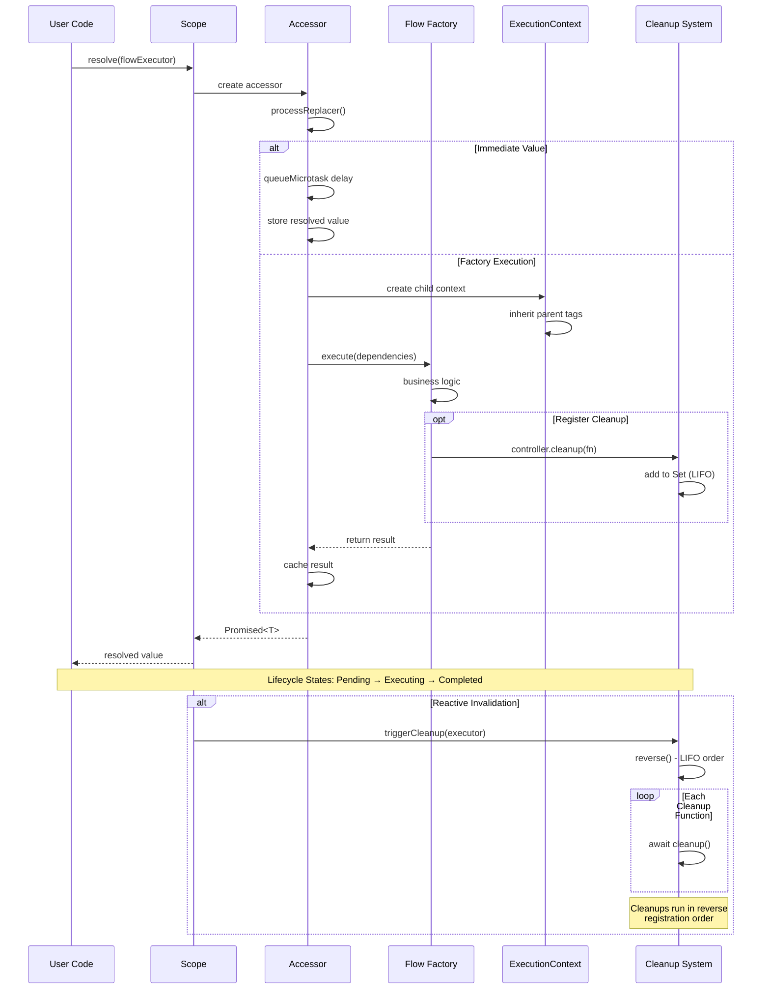

# Scenario: Flow Lifecycle Happy Path

## Purpose

Understand normal flow execution from creation through execution, context building, and cleanup.

## Prerequisites

Basic understanding of reactive programming and dependency injection.

## Diagram

## Key Points

- **Context Hierarchy**: ExecutionContext inherits tags from parent via `tagStore.get(key)` (execution-context.ts:46)
- **Cleanup Order**: LIFO (Last In First Out) - `Array.from(state.cleanups.values()).reverse()` (scope.ts:569)
- **Immediate Values**: Queued via microtask for consistency (scope.ts:86)
- **State Caching**: Results cached in `ExecutorState` (scope.ts:30-40)

## Code References

- `packages/next/src/scope.ts:566-574` - cleanup execution in reverse order
- `packages/next/src/execution-context.ts:57-98` - ExecutionContext.exec() lifecycle
- `packages/next/src/scope.ts:82-97` - immediate value handling
- `packages/next/src/scope.ts:389-393` - cleanup registration

## Related Scenarios

- [02-error-propagation.md](./02-error-propagation.md) - what happens when flow throws
- [03-parallel-execution-order.md](./03-parallel-execution-order.md) - timing of concurrent flows

## Common Issues

- **Cleanup not running**: Check if executor was actually resolved (cached state exists)
- **Unexpected execution order**: Immediate values have microtask delay
- **Context data missing**: Parent context must have tag set before child creation
