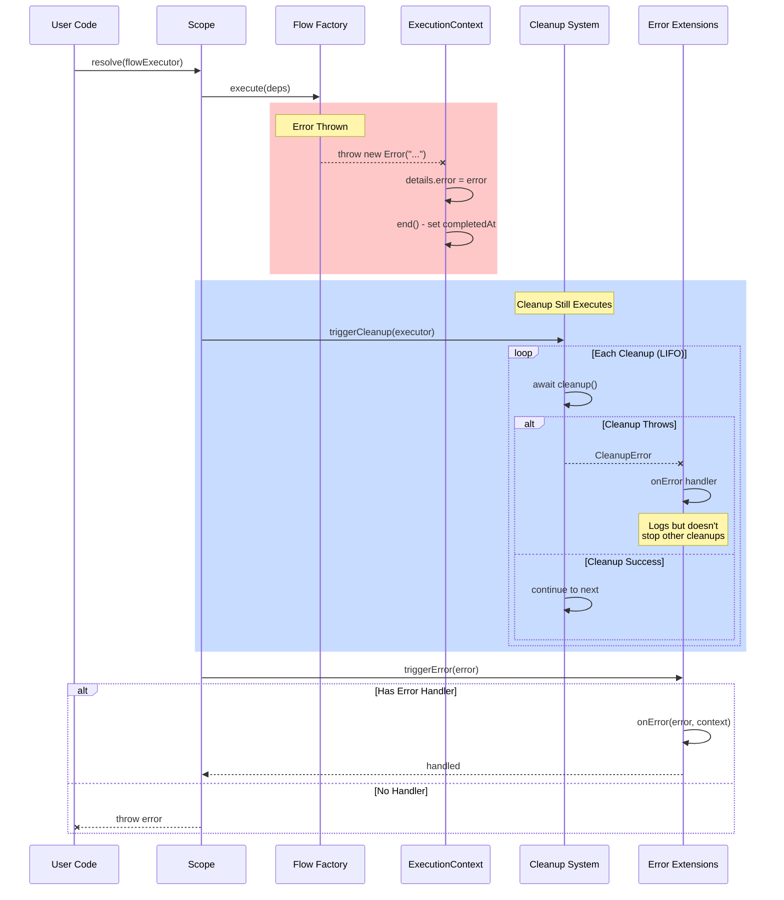
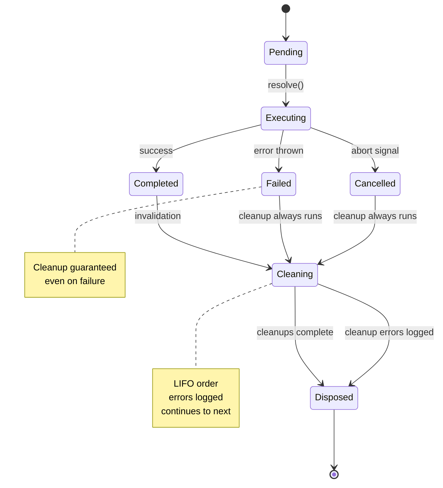

# Scenario: Error Propagation and Handling

## Purpose

Understand how errors propagate through execution stack and how cleanup behaves during errors.

## Prerequisites

- [01-flow-lifecycle-happy-path.md](./01-flow-lifecycle-happy-path.md)

## Diagram

## State Chart: Error States

## Key Points

- **Cleanup Guarantee**: Cleanups execute even when flow throws (scope.ts:566-574)
- **Error Isolation**: Cleanup errors logged but don't stop other cleanups
- **Extension Hooks**: Extensions can intercept via `onError` handler
- **Execution Context**: Error stored in `details.error` before cleanup (execution-context.ts:82, 91)

## Code References

- `packages/next/src/scope.ts:566-574` - cleanup execution regardless of error
- `packages/next/src/execution-context.ts:81-94` - error capture and context ending
- `packages/next/src/scope.ts:633` - triggerError via extensions

## Related Scenarios

- [01-flow-lifecycle-happy-path.md](./01-flow-lifecycle-happy-path.md) - normal execution
- [04-error-tracing-root-cause.md](./04-error-tracing-root-cause.md) - debugging errors

## Common Issues

- **Cleanup not running after error**: Check if error thrown before cleanup registration
- **Error swallowed**: Extension error handler may be catching without re-throwing
- **Cleanup errors hidden**: Cleanup errors logged to console, check stderr
