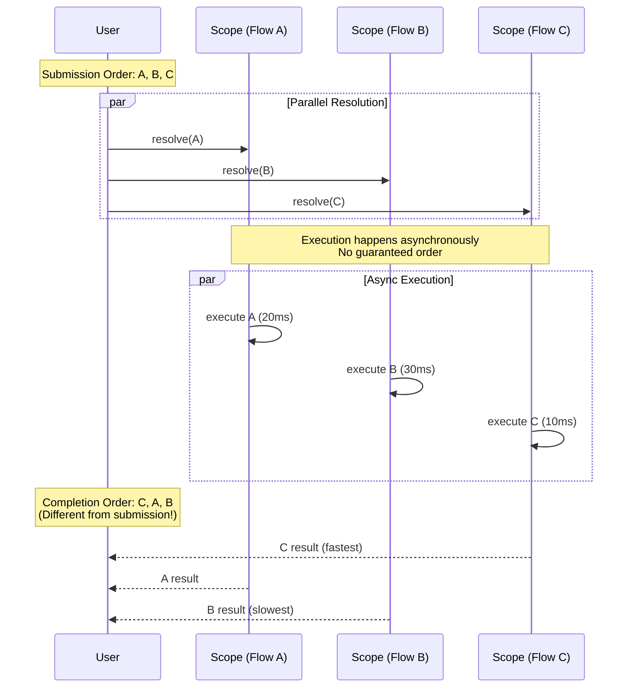

# Scenario: Parallel Execution Order

## Purpose

Understand execution timing and ordering of concurrent flows.

## Prerequisites

- [01-flow-lifecycle-happy-path.md](./01-flow-lifecycle-happy-path.md)

## Diagram

```mermaid
gantt
    title Parallel Flow Execution Timeline
    dateFormat SSS
    axisFormat %L ms

    section User Code
    Submit Flow A           :milestone, 000, 0ms
    Submit Flow B           :milestone, 001, 1ms
    Submit Flow C           :milestone, 002, 2ms

    section Flow A
    A: Pending              :a1, 000, 5ms
    A: Executing            :active, a2, after a1, 20ms
    A: Completed            :done, a3, after a2, 1ms

    section Flow B
    B: Pending              :b1, 001, 3ms
    B: Executing            :active, b2, after b1, 30ms
    B: Completed            :done, b3, after b2, 1ms

    section Flow C
    C: Pending              :c1, 002, 8ms
    C: Executing            :active, c2, after c1, 10ms
    C: Completed            :done, c3, after c2, 1ms

    section Completion Order
    C completes first       :milestone, crit, 021, 0ms
    A completes second      :milestone, crit, 026, 0ms
    B completes last        :milestone, crit, 035, 0ms
```

## Sequence View



## Key Points

- **No Order Guarantee**: Parallel flows execute concurrently, completion order unpredictable
- **Microtask Timing**: Each flow queued independently (scope.ts:86)
- **Execution Status**: Track via `FlowExecution.status` property (flow-execution.ts:47-50)
- **Promise.all Behavior**: Use `Promised.all()` to wait for multiple flows

## Code References

- `packages/next/src/flow-execution.ts:47-50` - status tracking
- `packages/next/src/scope.ts:86` - microtask queueing
- `packages/next/src/promises.ts` - Promised utilities for parallel execution

## Related Scenarios

- [01-flow-lifecycle-happy-path.md](./01-flow-lifecycle-happy-path.md) - single flow execution
- [02-error-propagation.md](./02-error-propagation.md) - parallel error modes

## Common Issues

- **Assuming sequential execution**: Parallel flows have no guaranteed order
- **Race conditions**: Use proper synchronization or sequential dependencies
- **Timing assumptions**: Don't rely on "fast" flows finishing before "slow" ones
