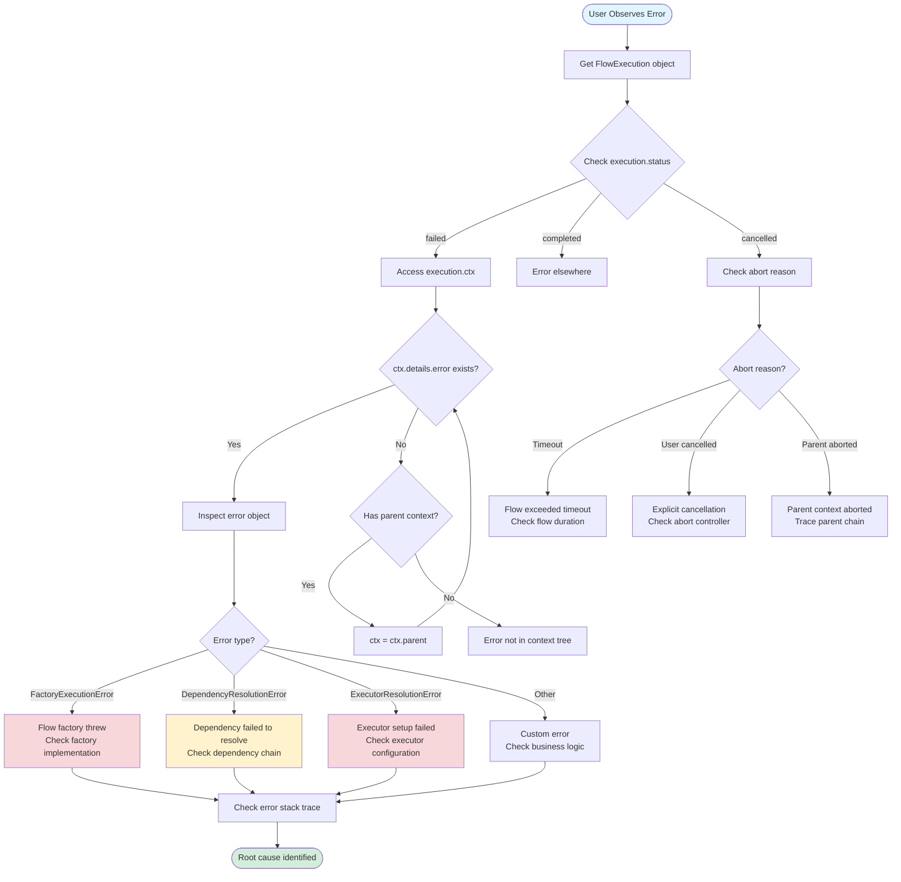
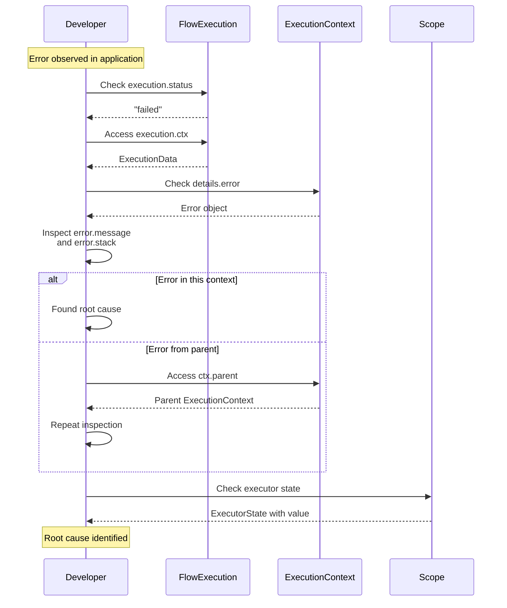

# Scenario: Error Tracing for Root Cause

## Purpose

Debug errors by tracing back through execution context hierarchy to find root cause.

## Prerequisites

- [02-error-propagation.md](./02-error-propagation.md)

## Diagram

## Debugging Workflow

## Key Points

- **ExecutionContext Chain**: Follow `parent` property to traverse hierarchy (execution-context.ts:7)
- **Error Storage**: Errors stored in `details.error` (execution-context.ts:32)
- **Status Tracking**: Use `execution.status` to determine failure type (flow-execution.ts:47)
- **Error Types**: Framework defines specific error types (types.ts, errors.ts)

## Code References

- `packages/next/src/execution-context.ts:5-55` - ExecutionContext structure and parent chain
- `packages/next/src/flow-execution.ts:47-50` - status property
- `packages/next/src/types.ts` - error type definitions
- `packages/next/src/errors.ts` - error classes

## Related Scenarios

- [02-error-propagation.md](./02-error-propagation.md) - how errors propagate
- [01-flow-lifecycle-happy-path.md](./01-flow-lifecycle-happy-path.md) - normal execution context

## Common Issues

- **Error not in ctx**: Error may have been caught by extension handler
- **Parent chain incomplete**: Context created without proper parent reference
- **Wrong execution object**: Ensure inspecting correct FlowExecution instance
