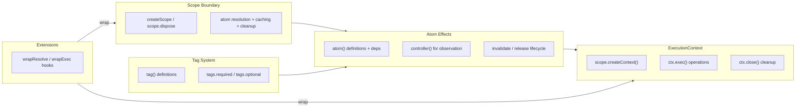
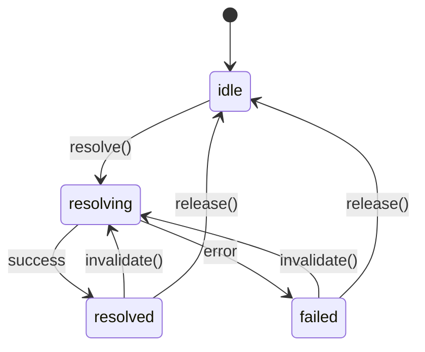

# pumped-fn

A lightweight effect system for TypeScript with managed lifecycles and minimal reactivity.

## Activation
- load layered map → understand Scope boundary, Atom effects, ExecutionContext operations
- follow API grid when coding
- twoslash snippet shows canonical usage; copy + adapt

## Layered map


## Core Concepts

```
┌─────────────────────────────────────────────────────────────┐
│                         Scope                               │
│  (long-lived execution boundary)                            │
│                                                             │
│   ┌─────────┐      ┌─────────┐      ┌─────────┐            │
│   │  Atom   │ ──── │  Atom   │ ──── │  Atom   │            │
│   │ (effect)│      │ (effect)│      │ (effect)│            │
│   └─────────┘      └─────────┘      └─────────┘            │
│        │                                  │                 │
│        └──────────────┬───────────────────┘                 │
│                       ▼                                     │
│   ┌─────────────────────────────────────────────────────┐   │
│   │              ExecutionContext                       │   │
│   │  (short-lived operation with input, tags, cleanup)  │   │
│   └─────────────────────────────────────────────────────┘   │
└─────────────────────────────────────────────────────────────┘
```

| Concept | Purpose |
|---------|---------|
| **Scope** | Long-lived boundary that manages atom lifecycles |
| **Atom** | A managed effect with lifecycle (create, cache, cleanup, recreate) |
| **ExecutionContext** | Short-lived context for running operations with input and tags |
| **Controller** | Handle for observing and controlling an atom's state |
| **Tag** | Contextual value passed through execution |

## API grid
| Layer | API | Usage | Tests |
| --- | --- | --- | --- |
| Scope | `createScope`, `scope.dispose`, `scope.createContext` | lifecycle boundary, create execution contexts | `packages/lite/tests/` |
| Atoms | `atom`, `controller`, `preset` | define managed effects, observe state, override values | `packages/lite/tests/` |
| ExecutionContext | `ctx.exec`, `ctx.close`, `ctx.cleanup` | run operations, manage cleanup | `packages/lite/tests/` |
| Flow | `flow` | define operation templates with deps | `packages/lite/tests/` |
| Tags | `tag`, `tags.required`, `tags.optional` | contextual values through execution | `packages/lite/tests/` |
| Extensions | `Lite.Extension` | cross-cutting wrapResolve/wrapExec hooks | `packages/lite/tests/` |

## Effect Lifecycle



## Canonical twoslash
```ts twoslash
import { atom, flow, createScope, tag, controller } from "@pumped-fn/lite";

const requestId = tag<string>({ label: "req.id" });

const dbAtom = atom({
  factory: async (ctx) => {
    const conn = { query: async (sql: string) => ({ rows: [] }) };
    ctx.cleanup(() => console.log("closing db"));
    return conn;
  },
});

const repoAtom = atom({
  deps: { db: dbAtom },
  factory: (ctx, { db }) => ({
    findById: async (id: string) => db.query(`SELECT * WHERE id = ${id}`),
  }),
});

const getUser = flow({
  deps: { repo: repoAtom },
  factory: async (ctx, { repo }) => {
    return repo.findById(ctx.input as string);
  },
});

const scope = await createScope();
const ctx = scope.createContext();

const user = await ctx.exec({ flow: getUser, input: "user-123" });

await ctx.close();
await scope.dispose();
```

## Verification
- `pnpm -F @pumped-fn/lite typecheck`
- `pnpm -F @pumped-fn/lite test`
- `pnpm docs:build`

