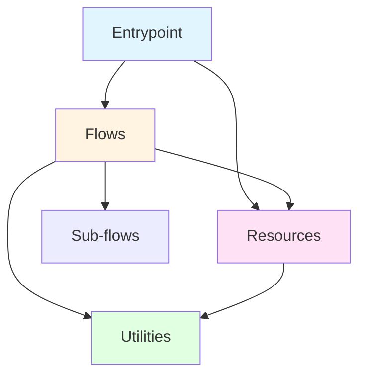
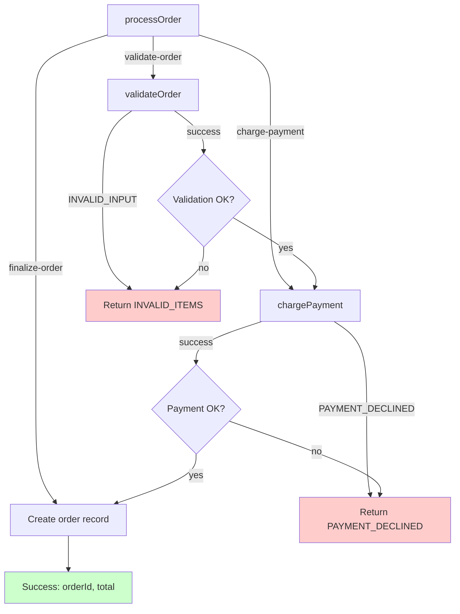

# Pumped-fn Structured Application Design Pattern

**Date:** 2025-10-30
**Status:** Approved Design
**Purpose:** Strict organizational pattern for pumped-fn applications with regression discoverability

## Overview

Design pattern for building pumped-fn backend applications with:
- Very strict code organization
- Easy regression discovery when requirements change
- Clear testing strategy per layer
- AI-assisted catalog for navigation and troubleshooting

## Core Architecture

### Four Strict Layers



#### 1. Entrypoints (`entrypoint.*.ts`)

- Scope creation/disposal, extension/config setup
- Environment-specific initialization (CLI args, HTTP server, test harness)
- Delegates to flows/resources, minimal logic
- **Testing:** Smoke tests only

**Example:**
- `entrypoint.cli.ts` - CLI application
- `entrypoint.web.ts` - HTTP server
- `entrypoint.test.ts` - Test harness

#### 2. Resources (`resource.*.ts`)

- Stateful integrations: DB connections, loggers, caches
- `provide()/derive()` with controller access for lifecycle
- Tag-based configuration access
- **Testing:** Rarely tested (library integration, config-driven)

**Example:**
- `resource.db.ts` - Database pool
- `resource.logger.ts` - Logger
- `resource.cache.ts` - Redis client

#### 3. Flows (`flow.*.ts`)

- Workflow orchestration via `flow()`
- Explicit typed outputs: `Success | Error1 | Error2 | ...`
- Sub-flow calls via `ctx.exec()`
- Every step journaled via `ctx.run('step-id', ...)`
- **Testing:** Integration tests covering all output branches

**Example:**
- `flow.order.ts` - Order processing
- `flow.user.ts` - User management
- `flow.payment.ts` - Payment handling

#### 4. Utilities (`util.*.ts`)

- Pure functions OR executor-wrapped built-ins
- For built-ins (Date, crypto, random): exposed as executors via `derive()`
- **Testing:** Unit tests, mockable via `preset()` in tests

**Example:**
- `util.datetime.ts` - Date utilities as executors
- `util.validation.ts` - Pure validation functions
- `util.crypto.ts` - Crypto operations as executors

### File Naming Conventions

**Prefix-based for alphabetical grouping:**
- `entrypoint.*.ts` - All entrypoints group together
- `resource.*.ts` - All resources group together
- `flow.*.ts` - All flows group together
- `util.*.ts` - All utilities group together

**Benefits:**
- Easy to glob: `flow.*.ts`, `resource.*.ts`
- Clear layer membership at a glance
- Short, scannable prefixes

## Flow Error Handling Pattern

### Explicit Typed Outputs with Simple Await

```typescript
export namespace ProcessOrder {
  export type Input = {
    items: Array<{ sku: string; quantity: number }>
    userId: string
  }

  export type Success = { success: true; orderId: string; total: number }
  export type ValidationError = { success: false; reason: 'INVALID_ITEMS' }
  export type PaymentError = { success: false; reason: 'PAYMENT_DECLINED'; message: string }

  export type Result = Success | ValidationError | PaymentError
}

export const processOrder = flow(
  { validateOrder, chargePayment },
  ({ validateOrder, chargePayment }) =>
    async (ctx, input: ProcessOrder.Input): Promise<ProcessOrder.Result> => {
      const validated = await ctx.exec(validateOrder, input)

      if (!validated.success) {
        if (validated.reason === 'INVALID_INPUT') {
          return { success: false, reason: 'INVALID_ITEMS' }
        }
        return validated
      }

      const charged = await ctx.exec(chargePayment, {
        userId: input.userId,
        amount: validated.total
      })

      if (!charged.success) {
        if (charged.reason === 'PAYMENT_DECLINED') {
          return { success: false, reason: 'PAYMENT_DECLINED', message: charged.message }
        }
        return charged
      }

      return ctx.run('finalize-order', () => ({
        success: true,
        orderId: charged.transactionId,
        total: charged.amount
      }))
    }
)
```

**Key principles:**
- `ctx.exec(subFlow, input)` - Call sub-flows directly (automatically journaled)
- `ctx.run('step-id', () => ...)` - Wrap direct operations (DB calls, computations)
- Await each step sequentially for readability
- Closure captures previous results (`validated`, `charged`)
- Parent flow explicitly maps sub-flow errors to its vocabulary
- Unknown errors propagate by returning as-is
- Try/catch free - discriminated unions for type-safe errors

## Testing Strategy Per Layer

### Utilities - Unit Tests Required

- Test file: `util.*.test.ts` (adjacent to source)
- Coverage: All edge cases, boundary conditions
- For executor-wrapped built-ins: Use `preset()` to control return values

```typescript
// util.datetime.test.ts
preset(getToday, () => new Date('2025-01-15'))
expect(resolve(getToday)()).toEqual(new Date('2025-01-15'))
```

### Flows - Integration Tests Required

- Test file: `flow.*.test.ts`
- Coverage: All output branches (Happy path + each Error variant)
- Use `preset()` to simulate sub-flow/resource/utility failures
- Verify error mapping and cause chains

**Example:** Flow with 3 outputs (Success | ValidationError | PaymentError) needs 3+ test cases

### Resources - Rarely Tested

- Testing library integration against config = low value
- Exception: Complex derivation logic or custom lifecycle handling

### Entrypoints - Smoke Tests Only

- Verify initialization doesn't throw
- Delegation logic covered by flow/utility tests

## AI-Assisted Catalog System

### Structure

```
docs/
  catalog.md          # Main index with architecture overview
  catalog/
    resources.md      # Resource dependency graphs
    flows.md          # Flow execution trees (mermaid)
    utilities.md      # Utility inventory
```

### Catalog Format (Mermaid Diagrams)

**Example: `docs/catalog/flows.md`**

#### processOrder



**Outputs:**
- ✅ `{ success: true, orderId, total }`
- ❌ `{ success: false, reason: 'INVALID_ITEMS' }`
- ❌ `{ success: false, reason: 'PAYMENT_DECLINED', message }`

**Dependencies:** `validateOrder`, `chargePayment`

### Benefits

- **Visual regression analysis** - See entire execution path at a glance
- **Output coverage** - Red nodes = error outputs to test
- **Step IDs visible** - Journal keys labeled on edges
- **Dependency tracking** - Clear what needs updating

### AI Workflow

- When flow changes, AI regenerates mermaid diagram from step IDs and discriminated unions
- When troubleshooting, AI searches catalog for dependency graphs
- When adding features, AI identifies affected flows from catalog

## Regression Discovery Workflow

1. **Change detected** (API, flow logic, resource config)
2. **AI searches catalog** - Mermaid diagrams show dependencies
3. **Lists affected flows/tests**
4. **Updates catalog** after implementation

## Enforcement Mechanism

**Convention-based:**
- Document pattern in skill (`.claude/skills/pumped-design/SKILL.md`)
- Rely on developer discipline and code reviews
- AI-assisted catalog maintenance
- Testing requirements per layer

## Key Design Decisions

| Decision | Choice | Rationale |
|----------|--------|-----------|
| **File naming** | Prefix-based (`flow.*`, `resource.*`) | Alphabetical grouping, easy globbing |
| **Error handling** | Simple await + discriminated unions | Readability, debuggability, discoverability |
| **Utility mocking** | Executor-based with `preset()` | Built-ins mockable without global state |
| **Testing strategy** | Layer-specific (utilities=unit, flows=integration) | Cost/value balance |
| **Catalog format** | Mermaid diagrams in markdown | Visual, version-controlled, AI-maintainable |
| **Enforcement** | Convention via skill documentation | Lightweight, flexible, AI-assisted |

## Implementation Plan

1. Create `pumped-design` skill in `.claude/skills/pumped-design/`
2. Skill includes:
   - Phased design process (adapted from brainstorming skill)
   - Navigation patterns for pumped applications
   - Troubleshooting workflows using catalog
   - Test organization guidance
   - Best practice enforcement
3. Update project examples to follow pattern
4. Generate initial catalog for existing codebase

## Sub-skill Architecture

The pumped-design skill uses a two-layer approach:

**Layer 1: Main SKILL.md**
- Brainstorming-based design process
- Sub-skill routing table with tags and descriptions
- AI reads descriptions to decide which sub-skills to load

**Layer 2: Sub-skills (references/*.md)**
- Each sub-skill has YAML frontmatter (tags, description)
- AI reads frontmatter first to assess relevance
- Full content includes: patterns, code templates, real examples, troubleshooting

**Sub-skills created:**
- `coding-standards.md` - Type safety, naming, organization (load before writing code)
- `resource-basic.md` - Standalone resources with config/lifecycle
- `resource-derived.md` - Resources with dependencies
- `resource-lazy.md` - Lazy/conditional resource loading
- `flow-subflows.md` - Flow orchestration with sub-flows
- `flow-context.md` - Context operations (ctx.run, ctx.exec)
- `integration-hono.md` - Hono server integration
- `integration-nextjs.md` - Next.js integration
- `integration-tanstack.md` - TanStack Start integration
- `testing-utilities.md` - Unit testing utilities
- `testing-flows.md` - Integration testing flows
- `testing-integration.md` - End-to-end testing
- `extension-basics.md` - Creating extensions
- `entrypoint-patterns.md` - Entrypoint structure

**AI Workflow:**
1. User asks question
2. AI scans routing table for relevant tags/descriptions
3. AI loads sub-skill frontmatter
4. AI loads full content if relevant
5. AI applies patterns
