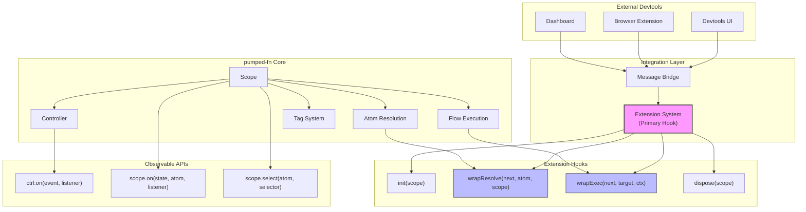
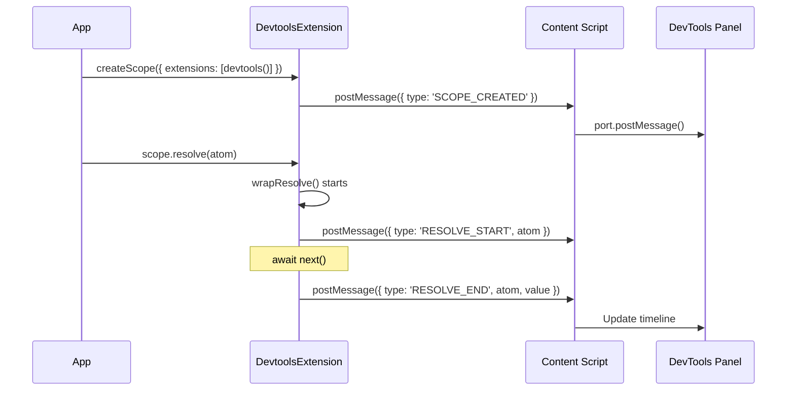
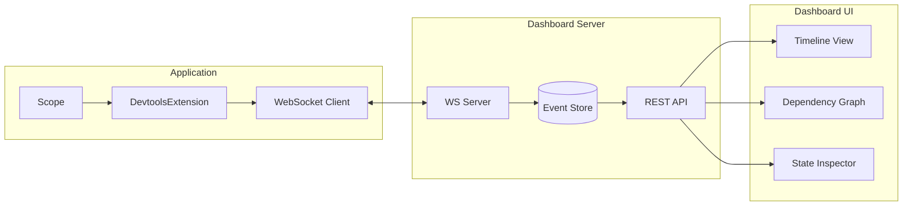
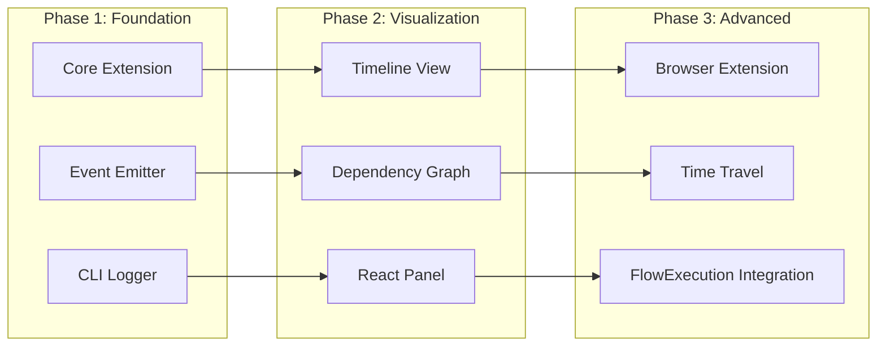

# Devtools Integration Analysis

**Date:** 2025-12-07
**Status:** Draft

## Overview

Analysis of devtools integration options for pumped-fn, leveraging the existing exposed APIs.

## Current Integration Points



## Integration Point Details

### 1. Extension System (Primary)

The extension interface is purpose-built for cross-cutting concerns:

```typescript
interface Extension {
  readonly name: string
  init?(scope: Scope): MaybePromise<void>
  wrapResolve?(next: () => Promise<unknown>, atom: Atom<unknown>, scope: Scope): Promise<unknown>
  wrapExec?(next: () => Promise<unknown>, target: Flow | Function, ctx: ExecutionContext): Promise<unknown>
  dispose?(scope: Scope): MaybePromise<void>
}
```

**Available Data:**

| Hook | Available Information |
|------|----------------------|
| `init` | Scope reference, extensions list, scope tags |
| `wrapResolve` | Atom factory, deps, tags, scope instance |
| `wrapExec` | Flow/fn reference, input, execution context, tags |
| `dispose` | Final scope state, cleanup tracking |

### 2. Controller Events

```typescript
const ctrl = scope.controller(atom)

ctrl.on('resolving', () => { /* resolution started */ })
ctrl.on('resolved', () => { /* value available via ctrl.get() */ })
ctrl.on('*', () => { /* any state change */ })

ctrl.state  // 'idle' | 'resolving' | 'resolved' | 'failed'
```

### 3. Scope Events

```typescript
scope.on('idle', atom, () => { /* atom released */ })
scope.on('resolving', atom, () => { /* resolution started */ })
scope.on('resolved', atom, () => { /* resolution complete */ })
scope.on('failed', atom, () => { /* resolution failed */ })
```

### 4. Select API

```typescript
const handle = scope.select(atom, value => value.count)
handle.subscribe(() => {
  const derived = handle.get()
})
```

## Potential Devtools Features

### Feature Matrix

| Feature | Extension | Controller | Scope Events | Future (FlowExecution) |
|---------|-----------|------------|--------------|------------------------|
| Atom Timeline | ✅ wrapResolve | ✅ on('*') | ✅ | - |
| Dependency Graph | ✅ atom.deps | - | - | - |
| Flow Tracing | ✅ wrapExec | - | - | ✅ execution.id |
| State Inspection | ✅ | ✅ ctrl.get() | - | - |
| Tag Inspection | ✅ atom.tags, ctx.input | - | - | - |
| Execution Timing | ✅ | - | - | ✅ |
| Cancellation | - | - | - | ✅ abort signal |
| Error Tracking | ✅ try/catch | - | ✅ 'failed' | ✅ status |
| Memory Profiling | ✅ dispose | ✅ release | - | ✅ auto-cleanup |

## Implementation Options

### Option A: Browser DevTools Extension



**Pros:**
- Native browser integration
- Familiar UX (like React DevTools)
- Access to Chrome/Firefox DevTools APIs

**Cons:**
- Browser-specific implementation
- Complex content script messaging

### Option B: Standalone Dashboard



**Pros:**
- Framework-agnostic
- SSR/Node.js support
- Multi-app aggregation
- Persistent history

**Cons:**
- Extra infrastructure
- Latency overhead

### Option C: In-App Debug Panel (React)

```typescript
import { DevtoolsProvider, useDevtools } from '@pumped-fn/react-devtools'

function App() {
  return (
    <DevtoolsProvider>
      <ScopeProvider scope={scope}>
        <MyApp />
        <DevtoolsPanel position="bottom" /> {/* Overlay panel */}
      </ScopeProvider>
    </DevtoolsProvider>
  )
}
```

**Pros:**
- Zero config
- Immediate feedback
- Framework integration

**Cons:**
- React-only
- Bundle size impact
- Production strip needed

### Option D: CLI/Terminal Logger

```typescript
const devtools = createDevtools({
  output: 'console', // or 'file', 'stream'
  format: 'pretty', // or 'json', 'compact'
  filter: { atoms: true, flows: true, timing: true }
})

const scope = createScope({ extensions: [devtools] })
```

**Output:**
```
[12:34:56.789] ⚡ RESOLVE dbAtom
[12:34:56.792]   └─ deps: [configAtom]
[12:34:56.795] ✓ RESOLVED dbAtom (6ms)
[12:34:56.800] ▶ EXEC fetchUserFlow
[12:34:56.801]   └─ input: { id: "123" }
[12:34:56.850] ✓ EXEC fetchUserFlow (50ms)
```

**Pros:**
- Universal (Node, browser, Deno)
- Minimal overhead
- Easy CI integration

**Cons:**
- No interactive exploration
- Limited visualization

## Recommended Phased Approach



### Phase 1: Core Devtools Extension

Create `@pumped-fn/devtools` package:

```typescript
interface DevtoolsOptions {
  onAtomResolve?: (event: AtomResolveEvent) => void
  onAtomResolved?: (event: AtomResolvedEvent) => void
  onFlowExec?: (event: FlowExecEvent) => void
  onFlowComplete?: (event: FlowCompleteEvent) => void
  onError?: (event: ErrorEvent) => void
}

interface AtomResolveEvent {
  id: string
  atom: Lite.Atom<unknown>
  atomName: string
  deps: string[]
  tags: Lite.Tagged<unknown>[]
  timestamp: number
}

interface AtomResolvedEvent extends AtomResolveEvent {
  duration: number
  value?: unknown // Optional, may be stripped
}

interface FlowExecEvent {
  id: string
  flow: Lite.Flow<unknown, unknown>
  flowName: string
  input: unknown
  tags: Lite.Tagged<unknown>[]
  timestamp: number
}

interface FlowCompleteEvent extends FlowExecEvent {
  duration: number
  output?: unknown
  error?: Error
}

function createDevtools(options?: DevtoolsOptions): Lite.Extension {
  return {
    name: 'devtools',

    init: (scope) => {
      // Track scope creation
    },

    wrapResolve: async (next, atom, scope) => {
      const event = createAtomResolveEvent(atom)
      options?.onAtomResolve?.(event)

      const start = performance.now()
      try {
        const result = await next()
        options?.onAtomResolved?.({
          ...event,
          duration: performance.now() - start,
          value: result
        })
        return result
      } catch (error) {
        options?.onError?.({ ...event, error })
        throw error
      }
    },

    wrapExec: async (next, target, ctx) => {
      const event = createFlowExecEvent(target, ctx)
      options?.onFlowExec?.(event)

      const start = performance.now()
      try {
        const result = await next()
        options?.onFlowComplete?.({
          ...event,
          duration: performance.now() - start,
          output: result
        })
        return result
      } catch (error) {
        options?.onError?.({ ...event, error })
        throw error
      }
    },

    dispose: (scope) => {
      // Cleanup, final stats
    }
  }
}
```

### Phase 2: React Integration

```typescript
// @pumped-fn/react-devtools
export function DevtoolsProvider({ children }: { children: React.ReactNode }) {
  const [events, addEvent] = useReducer(eventsReducer, [])

  const extension = useMemo(() => createDevtools({
    onAtomResolved: addEvent,
    onFlowComplete: addEvent
  }), [])

  return (
    <DevtoolsContext.Provider value={{ events, extension }}>
      {children}
    </DevtoolsContext.Provider>
  )
}

export function DevtoolsPanel() {
  const { events } = useDevtools()
  return (
    <div className="devtools-panel">
      <Timeline events={events} />
      <DependencyGraph events={events} />
      <StateInspector events={events} />
    </div>
  )
}
```

### Phase 3: FlowExecution Integration

Once the approved FlowExecution design is implemented:

```typescript
interface EnhancedFlowExecEvent extends FlowExecEvent {
  executionId: string // From FlowExecution.id
  status: 'pending' | 'running' | 'completed' | 'failed' | 'cancelled'
  abortController?: AbortController
}

// Track execution status changes
execution.onStatusChange((status, exec) => {
  devtools.emit('flow:status', {
    executionId: exec.id,
    status,
    timestamp: Date.now()
  })
})
```

## Data Available from Current APIs

| Data Point | Source | Method |
|------------|--------|--------|
| Atom name | `atom.factory.name` | Property access |
| Atom dependencies | `atom.deps` | Property access |
| Atom tags | `atom.tags` | Property access |
| Flow name | `flow.name` | Property access |
| Flow dependencies | `flow.deps` | Property access |
| Flow input | `ctx.input` | Property access |
| Execution tags | `options.tags` | Via wrapExec params |
| Scope tags | `scope.tags` | Property access (internal) |
| Controller state | `ctrl.state` | Property access |
| Current value | `ctrl.get()` | Method call |
| Resolution timing | `performance.now()` | Wrap measurement |

## Considerations

### Security
- Strip sensitive values in production
- Allow value serialization customization
- Rate limit event emission

### Performance
- Lazy initialization
- Event batching
- Off-thread processing (Web Workers)
- Tree-shakeable in production

### Compatibility
- Works with SSR (Node.js)
- Browser environments
- React Native (via custom transport)

## Next Steps

1. Create ADR for devtools architecture decision
2. Implement Phase 1 core extension
3. Add CLI logger for immediate utility
4. Design React devtools panel UI
5. Plan browser extension architecture
