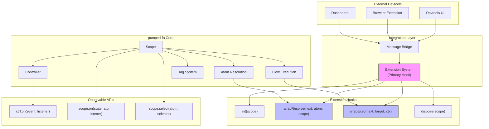
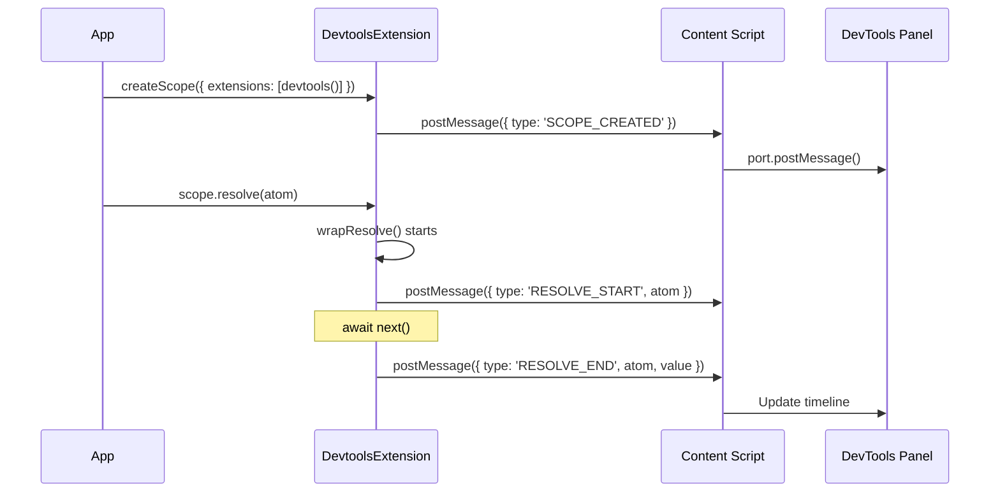
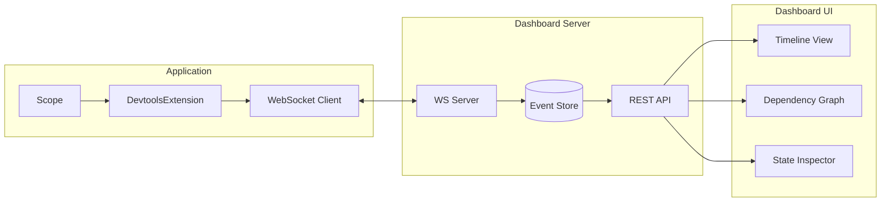
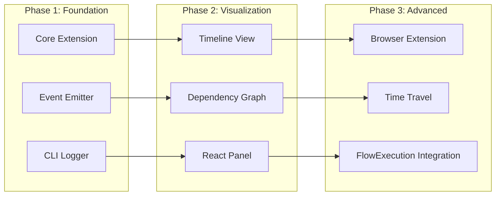
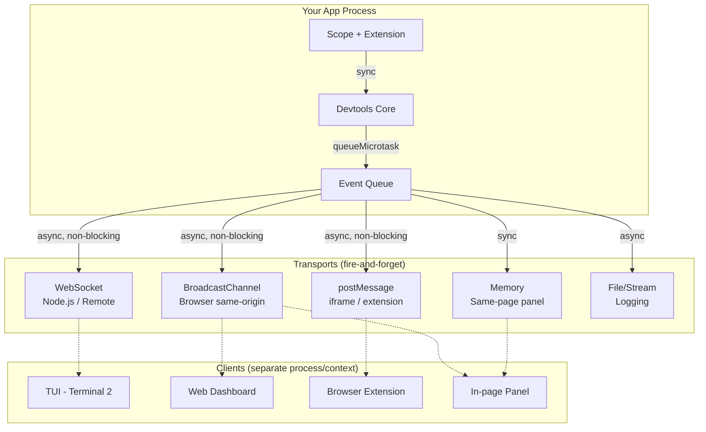
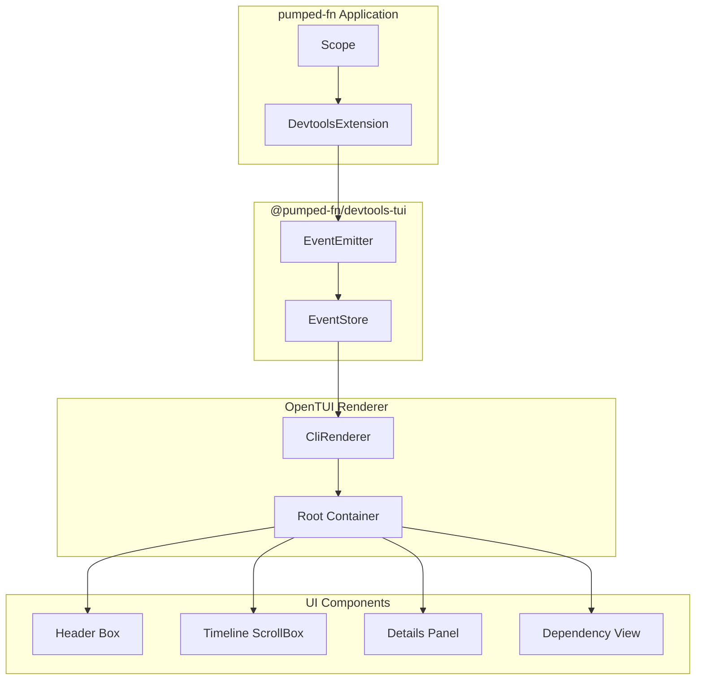

# Devtools Integration Analysis

**Date:** 2025-12-07
**Status:** Draft

## Overview

Analysis of devtools integration options for pumped-fn, leveraging the existing exposed APIs.

## Current Integration Points



## Integration Point Details

### 1. Extension System (Primary)

The extension interface is purpose-built for cross-cutting concerns:

```typescript
interface Extension {
  readonly name: string
  init?(scope: Scope): MaybePromise<void>
  wrapResolve?(next: () => Promise<unknown>, atom: Atom<unknown>, scope: Scope): Promise<unknown>
  wrapExec?(next: () => Promise<unknown>, target: Flow | Function, ctx: ExecutionContext): Promise<unknown>
  dispose?(scope: Scope): MaybePromise<void>
}
```

**Available Data:**

| Hook | Available Information |
|------|----------------------|
| `init` | Scope reference, extensions list, scope tags |
| `wrapResolve` | Atom factory, deps, tags, scope instance |
| `wrapExec` | Flow/fn reference, input, execution context, tags |
| `dispose` | Final scope state, cleanup tracking |

### 2. Controller Events

```typescript
const ctrl = scope.controller(atom)

ctrl.on('resolving', () => { /* resolution started */ })
ctrl.on('resolved', () => { /* value available via ctrl.get() */ })
ctrl.on('*', () => { /* any state change */ })

ctrl.state  // 'idle' | 'resolving' | 'resolved' | 'failed'
```

### 3. Scope Events

```typescript
scope.on('idle', atom, () => { /* atom released */ })
scope.on('resolving', atom, () => { /* resolution started */ })
scope.on('resolved', atom, () => { /* resolution complete */ })
scope.on('failed', atom, () => { /* resolution failed */ })
```

### 4. Select API

```typescript
const handle = scope.select(atom, value => value.count)
handle.subscribe(() => {
  const derived = handle.get()
})
```

## Potential Devtools Features

### Feature Matrix

| Feature | Extension | Controller | Scope Events | Future (FlowExecution) |
|---------|-----------|------------|--------------|------------------------|
| Atom Timeline | ✅ wrapResolve | ✅ on('*') | ✅ | - |
| Dependency Graph | ✅ atom.deps | - | - | - |
| Flow Tracing | ✅ wrapExec | - | - | ✅ execution.id |
| State Inspection | ✅ | ✅ ctrl.get() | - | - |
| Tag Inspection | ✅ atom.tags, ctx.input | - | - | - |
| Execution Timing | ✅ | - | - | ✅ |
| Cancellation | - | - | - | ✅ abort signal |
| Error Tracking | ✅ try/catch | - | ✅ 'failed' | ✅ status |
| Memory Profiling | ✅ dispose | ✅ release | - | ✅ auto-cleanup |

## Implementation Options

### Option A: Browser DevTools Extension



**Pros:**
- Native browser integration
- Familiar UX (like React DevTools)
- Access to Chrome/Firefox DevTools APIs

**Cons:**
- Browser-specific implementation
- Complex content script messaging

### Option B: Standalone Dashboard



**Pros:**
- Framework-agnostic
- SSR/Node.js support
- Multi-app aggregation
- Persistent history

**Cons:**
- Extra infrastructure
- Latency overhead

### Option C: In-App Debug Panel (React)

```typescript
import { DevtoolsProvider, useDevtools } from '@pumped-fn/react-devtools'

function App() {
  return (
    <DevtoolsProvider>
      <ScopeProvider scope={scope}>
        <MyApp />
        <DevtoolsPanel position="bottom" /> {/* Overlay panel */}
      </ScopeProvider>
    </DevtoolsProvider>
  )
}
```

**Pros:**
- Zero config
- Immediate feedback
- Framework integration

**Cons:**
- React-only
- Bundle size impact
- Production strip needed

### Option D: CLI/Terminal Logger

```typescript
const devtools = createDevtools({
  output: 'console', // or 'file', 'stream'
  format: 'pretty', // or 'json', 'compact'
  filter: { atoms: true, flows: true, timing: true }
})

const scope = createScope({ extensions: [devtools] })
```

**Output:**
```
[12:34:56.789] ⚡ RESOLVE dbAtom
[12:34:56.792]   └─ deps: [configAtom]
[12:34:56.795] ✓ RESOLVED dbAtom (6ms)
[12:34:56.800] ▶ EXEC fetchUserFlow
[12:34:56.801]   └─ input: { id: "123" }
[12:34:56.850] ✓ EXEC fetchUserFlow (50ms)
```

**Pros:**
- Universal (Node, browser, Deno)
- Minimal overhead
- Easy CI integration

**Cons:**
- No interactive exploration
- Limited visualization

## Recommended Phased Approach



### Phase 1: Core Devtools Extension

Create `@pumped-fn/devtools` package with transport-based architecture:



#### Transport Strategy by Environment

| Environment | Transport | Why |
|-------------|-----------|-----|
| Browser (same-origin) | `BroadcastChannel` | Zero setup, native API, no server |
| Browser (extension) | `postMessage` | Cross-origin communication |
| Browser (same-page) | `Memory` | Direct reference, zero overhead |
| Node.js | `WebSocket` | Cross-process, TUI in separate terminal |
| Node.js (logging) | `File/Stream` | Persistent debug logs |

#### Core Design Principles

1. **Fire-and-forget**: Never await transport, never block app
2. **Permissive**: Silently drop if transport fails
3. **Batched**: Queue events, flush on microtask
4. **Serializable**: Events must be JSON-safe for cross-context

```typescript
interface Transport {
  readonly name: string
  send(events: DevtoolsEvent[]): void  // fire-and-forget, no return
  dispose?(): void
}

interface DevtoolsOptions {
  transports?: Transport[]
  batchMs?: number        // batch window, default 0 (microtask)
  maxQueueSize?: number   // drop oldest if exceeded, default 1000
  serialize?: (event: DevtoolsEvent) => unknown  // custom serializer
}

interface DevtoolsEvent {
  id: string
  type: 'atom:resolve' | 'atom:resolved' | 'flow:exec' | 'flow:complete' | 'error'
  timestamp: number
  name: string
  duration?: number
  deps?: string[]
  input?: unknown
  output?: unknown
  error?: { message: string, stack?: string }
}
```

#### Built-in Transports

```typescript
// Browser: BroadcastChannel (recommended for web)
function broadcastChannel(channel?: string): Transport {
  const bc = new BroadcastChannel(channel ?? 'pumped-devtools')
  return {
    name: 'broadcast-channel',
    send: (events) => {
      try { bc.postMessage(events) } catch {}  // permissive
    },
    dispose: () => bc.close()
  }
}

// Browser: postMessage (for extensions, iframes)
function postMessage(target: Window, origin?: string): Transport {
  return {
    name: 'post-message',
    send: (events) => {
      try { target.postMessage({ type: 'pumped-devtools', events }, origin ?? '*') } catch {}
    }
  }
}

// Browser/Node: Memory (same-page panel, testing)
function memory(): Transport & { subscribe: (cb: (events: DevtoolsEvent[]) => void) => () => void } {
  const listeners = new Set<(events: DevtoolsEvent[]) => void>()
  return {
    name: 'memory',
    send: (events) => listeners.forEach(cb => cb(events)),
    subscribe: (cb) => { listeners.add(cb); return () => listeners.delete(cb) }
  }
}

// Node.js: WebSocket server (for TUI, remote dashboard)
function websocketServer(opts: { port: number }): Transport {
  const clients = new Set<WebSocket>()
  const wss = new WebSocketServer({ port: opts.port })
  wss.on('connection', (ws) => {
    clients.add(ws)
    ws.on('close', () => clients.delete(ws))
  })
  return {
    name: 'websocket',
    send: (events) => {
      const data = JSON.stringify(events)
      clients.forEach(ws => { try { ws.send(data) } catch {} })
    },
    dispose: () => wss.close()
  }
}

// Node.js: File stream (debugging, CI)
function fileStream(opts: { path: string }): Transport {
  const stream = createWriteStream(opts.path, { flags: 'a' })
  return {
    name: 'file',
    send: (events) => {
      events.forEach(e => stream.write(JSON.stringify(e) + '\n'))
    },
    dispose: () => stream.end()
  }
}
```

#### Extension Implementation

```typescript
function createDevtools(options?: DevtoolsOptions): Lite.Extension {
  const transports = options?.transports ?? []
  const maxQueue = options?.maxQueueSize ?? 1000
  let queue: DevtoolsEvent[] = []
  let scheduled = false

  function emit(event: DevtoolsEvent) {
    queue.push(event)
    if (queue.length > maxQueue) queue.shift()  // drop oldest

    if (!scheduled) {
      scheduled = true
      queueMicrotask(() => {
        const batch = queue
        queue = []
        scheduled = false
        transports.forEach(t => t.send(batch))  // fire-and-forget
      })
    }
  }

  return {
    name: 'devtools',

    wrapResolve: async (next, atom, scope) => {
      const id = crypto.randomUUID()
      const name = atom.factory.name ?? '<anonymous>'
      const deps = Object.keys(atom.deps ?? {})

      emit({ id, type: 'atom:resolve', timestamp: Date.now(), name, deps })

      const start = performance.now()
      try {
        const result = await next()
        emit({ id, type: 'atom:resolved', timestamp: Date.now(), name, deps, duration: performance.now() - start })
        return result
      } catch (err) {
        emit({ id, type: 'error', timestamp: Date.now(), name, error: { message: String(err) } })
        throw err
      }
    },

    wrapExec: async (next, target, ctx) => {
      const id = crypto.randomUUID()
      const name = 'name' in target ? (target.name ?? '<anonymous>') : target.name ?? '<fn>'

      emit({ id, type: 'flow:exec', timestamp: Date.now(), name, input: ctx.input })

      const start = performance.now()
      try {
        const result = await next()
        emit({ id, type: 'flow:complete', timestamp: Date.now(), name, duration: performance.now() - start })
        return result
      } catch (err) {
        emit({ id, type: 'error', timestamp: Date.now(), name, error: { message: String(err) } })
        throw err
      }
    },

    dispose: () => {
      transports.forEach(t => t.dispose?.())
    }
  }
}
```

#### Usage Examples

```typescript
// Browser app with in-page devtools panel
const mem = memory()
const scope = createScope({
  extensions: [devtools({ transports: [mem, broadcastChannel()] })]
})

// React panel subscribes via memory transport
mem.subscribe((events) => setEvents(prev => [...prev, ...events]))

// Node.js app with TUI in separate terminal
const scope = createScope({
  extensions: [devtools({
    transports: [
      websocketServer({ port: 9229 }),
      fileStream({ path: './debug.ndjson' })
    ]
  })]
})

// Then in another terminal:
// npx @pumped-fn/devtools-tui --port 9229
```

### Phase 2: React Integration

```typescript
// @pumped-fn/react-devtools
export function DevtoolsProvider({ children }: { children: React.ReactNode }) {
  const [events, addEvent] = useReducer(eventsReducer, [])

  const extension = useMemo(() => createDevtools({
    onAtomResolved: addEvent,
    onFlowComplete: addEvent
  }), [])

  return (
    <DevtoolsContext.Provider value={{ events, extension }}>
      {children}
    </DevtoolsContext.Provider>
  )
}

export function DevtoolsPanel() {
  const { events } = useDevtools()
  return (
    <div className="devtools-panel">
      <Timeline events={events} />
      <DependencyGraph events={events} />
      <StateInspector events={events} />
    </div>
  )
}
```

### Phase 3: FlowExecution Integration

Once the approved FlowExecution design is implemented:

```typescript
interface EnhancedFlowExecEvent extends FlowExecEvent {
  executionId: string // From FlowExecution.id
  status: 'pending' | 'running' | 'completed' | 'failed' | 'cancelled'
  abortController?: AbortController
}

// Track execution status changes
execution.onStatusChange((status, exec) => {
  devtools.emit('flow:status', {
    executionId: exec.id,
    status,
    timestamp: Date.now()
  })
})
```

## Data Available from Current APIs

| Data Point | Source | Method |
|------------|--------|--------|
| Atom name | `atom.factory.name` | Property access |
| Atom dependencies | `atom.deps` | Property access |
| Atom tags | `atom.tags` | Property access |
| Flow name | `flow.name` | Property access |
| Flow dependencies | `flow.deps` | Property access |
| Flow input | `ctx.input` | Property access |
| Execution tags | `options.tags` | Via wrapExec params |
| Scope tags | `scope.tags` | Property access (internal) |
| Controller state | `ctrl.state` | Property access |
| Current value | `ctrl.get()` | Method call |
| Resolution timing | `performance.now()` | Wrap measurement |

## Considerations

### Security
- Strip sensitive values in production
- Allow value serialization customization
- Rate limit event emission

### Performance
- Lazy initialization
- Event batching
- Off-thread processing (Web Workers)
- Tree-shakeable in production

### Compatibility
- Works with SSR (Node.js)
- Browser environments
- React Native (via custom transport)

## OpenTUI Integration (Recommended for Phase 1)

[OpenTUI](https://github.com/sst/opentui) is a TypeScript TUI library from SST that provides an excellent foundation for building a terminal-based devtools interface. It offers flexbox-based layouts, rich text styling, and interactive components.

### Why OpenTUI?

| Feature | Benefit for Devtools |
|---------|---------------------|
| TypeScript-first | Type-safe integration with pumped-fn |
| Flexbox layout (Yoga) | Complex dashboard layouts |
| React/Solid reconciler | Familiar component model |
| High performance (Zig) | Efficient event streaming |
| ScrollBox component | Timeline/log scrolling |
| Select component | Interactive navigation |
| Syntax highlighting | Code/value inspection |

### Architecture with OpenTUI



### OpenTUI Components Mapping

| Devtools Feature | OpenTUI Component | Usage |
|-----------------|-------------------|-------|
| Event timeline | `ScrollBoxRenderable` | Scrollable log of events |
| Event details | `BoxRenderable` + `TextRenderable` | Selected event info |
| Navigation | `SelectRenderable` | Filter/navigate events |
| Value inspector | `CodeRenderable` | Syntax-highlighted JSON |
| Status bar | `BoxRenderable` | Scope stats, timing |
| Tabs | `TabSelectRenderable` | Switch views |

### Implementation Plan (Using @opentui/react)

Using the React reconciler for a declarative, familiar development experience:

```tsx
// tsconfig.json requirement:
// { "compilerOptions": { "jsx": "react-jsx", "jsxImportSource": "@opentui/react" } }

import { createCliRenderer } from "@opentui/core"
import { createRoot, useKeyboard, useTerminalDimensions } from "@opentui/react"
import { useState, useEffect, useCallback } from "react"
import { createDevtools, type DevtoolsEvent } from "@pumped-fn/devtools"

interface DevtoolsStore {
  events: DevtoolsEvent[]
  subscribe: (listener: () => void) => () => void
  getSnapshot: () => DevtoolsEvent[]
}

function createDevtoolsStore(): DevtoolsStore {
  const events: DevtoolsEvent[] = []
  const listeners = new Set<() => void>()

  return {
    events,
    subscribe: (listener) => {
      listeners.add(listener)
      return () => listeners.delete(listener)
    },
    getSnapshot: () => events,
    push: (event: DevtoolsEvent) => {
      events.push(event)
      listeners.forEach(l => l())
    }
  }
}

function useDevtoolsEvents(store: DevtoolsStore) {
  const [events, setEvents] = useState(store.getSnapshot())
  useEffect(() => store.subscribe(() => setEvents([...store.getSnapshot()])), [store])
  return events
}

function Header({ atomCount }: { atomCount: number }) {
  return (
    <box height={3} border borderStyle="single">
      <text style={{ color: "#61AFEF" }}>
        pumped-fn devtools{" "}
        <span style={{ color: "#98C379" }}>Atoms: {atomCount}</span>
      </text>
    </box>
  )
}

function EventRow({ event }: { event: DevtoolsEvent }) {
  const time = new Date(event.timestamp).toISOString().slice(11, 23)
  const icons: Record<string, string> = {
    'atom:resolve': '⚡', 'atom:resolved': '✓',
    'flow:exec': '▶', 'flow:complete': '✓', 'error': '✗',
  }
  const colors: Record<string, string> = {
    'atom:resolve': '#E5C07B', 'atom:resolved': '#98C379',
    'flow:exec': '#61AFEF', 'flow:complete': '#98C379', 'error': '#E06C75',
  }

  const name = 'atomName' in event ? event.atomName : event.flowName
  const duration = 'duration' in event ? ` (${event.duration.toFixed(1)}ms)` : ''

  return (
    <text>
      <span style={{ color: "#5C6370" }}>{time}</span>{" "}
      <span style={{ color: colors[event.type] }}>{icons[event.type]}</span>{" "}
      <span style={{ color: "#ABB2BF" }}>{event.type.padEnd(14)}</span>{" "}
      <span style={{ color: "#C678DD" }}>{name}</span>
      <span style={{ color: "#5C6370" }}>{duration}</span>
    </text>
  )
}

function Timeline({ events }: { events: DevtoolsEvent[] }) {
  return (
    <scrollbox flex={1} border borderStyle="single">
      {events.map((event) => (
        <EventRow key={event.id} event={event} />
      ))}
    </scrollbox>
  )
}

function Details({ event }: { event: DevtoolsEvent | null }) {
  if (!event) {
    return (
      <box height={8} border borderStyle="single">
        <text style={{ color: "#5C6370" }}>Select an event to view details</text>
      </box>
    )
  }

  const name = 'atomName' in event ? event.atomName : event.flowName
  const input = 'input' in event ? JSON.stringify(event.input, null, 2) : null

  return (
    <box height={8} border borderStyle="single" flexDirection="column">
      <text>
        <strong>Selected:</strong> <span style={{ color: "#C678DD" }}>{name}</span>
      </text>
      {input && (
        <code language="json">{input}</code>
      )}
      {'duration' in event && (
        <text>
          <span style={{ color: "#5C6370" }}>Duration:</span>{" "}
          <span style={{ color: "#98C379" }}>{event.duration.toFixed(1)}ms</span>
        </text>
      )}
    </box>
  )
}

function DevtoolsApp({ store }: { store: DevtoolsStore }) {
  const events = useDevtoolsEvents(store)
  const [selectedIndex, setSelectedIndex] = useState<number | null>(null)
  const { height } = useTerminalDimensions()

  useKeyboard((key) => {
    if (key === 'j' || key === 'ArrowDown') {
      setSelectedIndex(i => Math.min((i ?? -1) + 1, events.length - 1))
    }
    if (key === 'k' || key === 'ArrowUp') {
      setSelectedIndex(i => Math.max((i ?? 0) - 1, 0))
    }
    if (key === 'q') {
      process.exit(0)
    }
  })

  const selectedEvent = selectedIndex !== null ? events[selectedIndex] : null
  const atomCount = events.filter(e => e.type === 'atom:resolved').length

  return (
    <box flexDirection="column" height="100%" width="100%">
      <Header atomCount={atomCount} />
      <Timeline events={events} />
      <Details event={selectedEvent} />
      <box height={1}>
        <text style={{ color: "#5C6370" }}>
          j/k: navigate | q: quit | Events: {events.length}
        </text>
      </box>
    </box>
  )
}

export async function startDevtoolsTui() {
  const renderer = await createCliRenderer({
    exitOnCtrlC: true,
    targetFps: 30,
  })

  const store = createDevtoolsStore()

  const extension = createDevtools({
    onAtomResolve: (e) => store.push({ type: 'atom:resolve', ...e }),
    onAtomResolved: (e) => store.push({ type: 'atom:resolved', ...e }),
    onFlowExec: (e) => store.push({ type: 'flow:exec', ...e }),
    onFlowComplete: (e) => store.push({ type: 'flow:complete', ...e }),
    onError: (e) => store.push({ type: 'error', ...e }),
  })

  createRoot(renderer).render(<DevtoolsApp store={store} />)

  return {
    extension,
    destroy: () => renderer.destroy(),
  }
}
```

### OpenTUI React Components

| JSX Element | Purpose |
|-------------|---------|
| `<box>` | Flexbox container with border, padding |
| `<text>` | Text display with inline styling |
| `<scrollbox>` | Scrollable container for timeline |
| `<code>` | Syntax-highlighted code block |
| `<select>` | Interactive selection list |
| `<span>`, `<strong>`, `<em>` | Inline text modifiers |

### OpenTUI React Hooks

| Hook | Purpose |
|------|---------|
| `useKeyboard(handler)` | Handle keyboard input (j/k navigation) |
| `useTerminalDimensions()` | Reactive terminal size |
| `useRenderer()` | Access renderer for advanced ops |
| `useOnResize(callback)` | Terminal resize events |

### Example Output

```
┌─────────────────────────────────────────────────────────┐
│ pumped-fn devtools                          Atoms: 5    │
├─────────────────────────────────────────────────────────┤
│ 12:34:56.789 ⚡ atom:resolve    configAtom              │
│ 12:34:56.790 ✓ atom:resolved   configAtom (1.2ms)      │
│ 12:34:56.791 ⚡ atom:resolve    dbAtom                  │
│ 12:34:56.795 ✓ atom:resolved   dbAtom (4.1ms)          │
│ 12:34:56.800 ▶ flow:exec       fetchUserFlow           │
│ 12:34:56.850 ✓ flow:complete   fetchUserFlow (50.3ms)  │
│ 12:34:56.855 ⚡ atom:resolve    cacheAtom               │
│                                                         │
├─────────────────────────────────────────────────────────┤
│ Selected: fetchUserFlow                                 │
│ Input: { id: "user-123" }                               │
│ Duration: 50.3ms | Dependencies: [dbAtom, cacheAtom]    │
└─────────────────────────────────────────────────────────┘
```

### Package Structure

```
packages/
├── devtools/                    # Core extension (platform-agnostic)
│   ├── src/
│   │   ├── extension.ts         # Lite.Extension implementation
│   │   ├── events.ts            # Event types and formatters
│   │   ├── store.ts             # In-memory event storage
│   │   └── index.ts
│   └── package.json
│
├── devtools-tui/                # OpenTUI React-based terminal UI
│   ├── src/
│   │   ├── main.tsx             # Entry point, renderer setup
│   │   ├── App.tsx              # Root component
│   │   ├── components/
│   │   │   ├── Header.tsx       # Title bar with stats
│   │   │   ├── Timeline.tsx     # Scrollable event list
│   │   │   ├── EventRow.tsx     # Individual event display
│   │   │   ├── Details.tsx      # Selected event details
│   │   │   └── StatusBar.tsx    # Keyboard hints, counts
│   │   ├── hooks/
│   │   │   └── useDevtoolsEvents.ts
│   │   └── index.ts
│   ├── tsconfig.json            # jsxImportSource: @opentui/react
│   └── package.json
│
└── devtools-web/                # Browser React panel (future)
```

### Dependencies

```json
{
  "dependencies": {
    "@opentui/core": "^0.1.57",
    "@opentui/react": "^0.1.57",
    "@pumped-fn/devtools": "workspace:*",
    "react": "^18.0.0"
  }
}
```

### Requirements

- **Zig compiler** required for OpenTUI build
- Node.js 18+ / Bun recommended
- Terminal with true color support for best experience

### Caveats

- OpenTUI is still in development (not production-ready per their docs)
- Requires Zig toolchain for native bindings
- Browser environments not supported (terminal only)

## Next Steps

1. Create ADR for devtools architecture decision
2. Implement Phase 1 core extension (`@pumped-fn/devtools`)
3. Build OpenTUI-based terminal devtools (`@pumped-fn/devtools-tui`)
4. Design React devtools panel UI (Phase 2)
5. Plan browser extension architecture (Phase 3)
