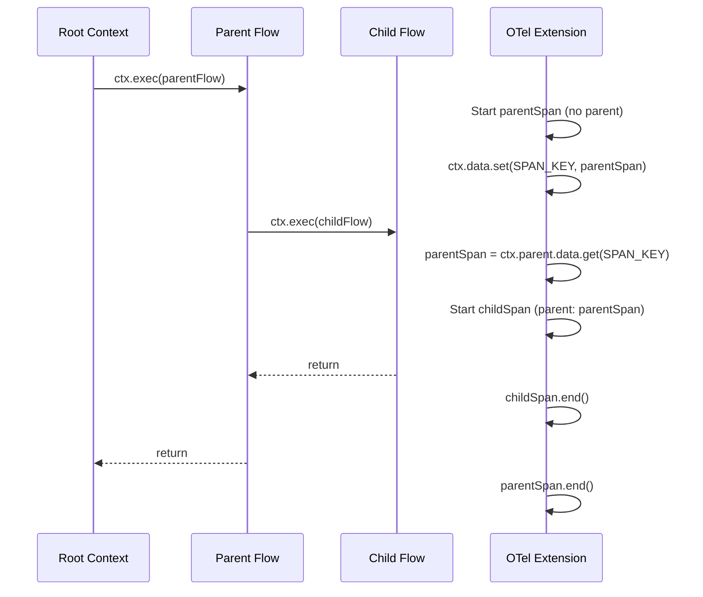
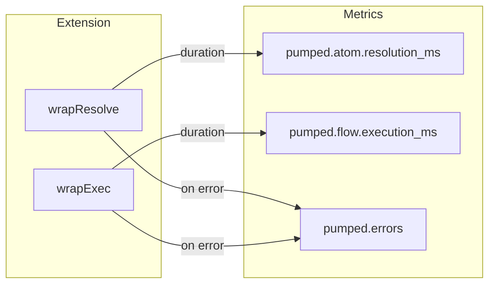
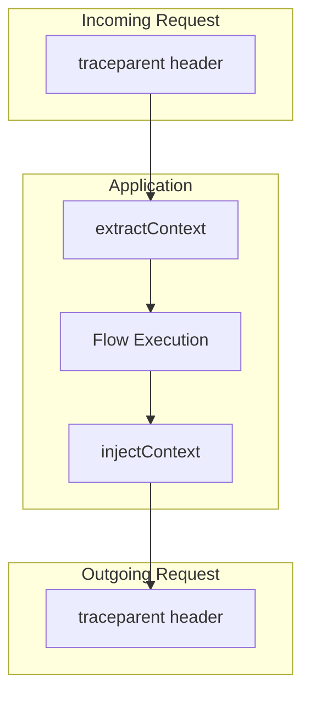

# @pumped-fn/lite-extension-otel Implementation Plan

> **For Claude:** REQUIRED SUB-SKILL: Use superpowers:executing-plans to implement this plan task-by-task.

**Goal:** Create OpenTelemetry extension for @pumped-fn/lite with tracing, metrics, and context propagation.

**Architecture:** Extension-based integration using `wrapResolve` for atom spans and `wrapExec` for flow spans. Leverages ADR-016 hierarchical ExecutionContext (`ctx.parent`, `ctx.data`) for automatic parent-child span relationships without AsyncLocalStorage.

**Tech Stack:** TypeScript, @opentelemetry/api (peer dependency), Vitest, tsdown

---

## Task 1: Package Scaffolding

**Files:**
- Create: `packages/lite-extension-otel/package.json`
- Create: `packages/lite-extension-otel/tsconfig.json`
- Create: `packages/lite-extension-otel/tsdown.config.ts`
- Create: `packages/lite-extension-otel/src/index.ts`

**Step 1: Create package.json**

```json
{
  "name": "@pumped-fn/lite-extension-otel",
  "version": "0.0.1",
  "description": "OpenTelemetry extension for @pumped-fn/lite with tracing, metrics, and context propagation",
  "type": "module",
  "main": "./dist/index.cjs",
  "module": "./dist/index.mjs",
  "types": "./dist/index.d.cts",
  "exports": {
    ".": {
      "import": {
        "types": "./dist/index.d.mts",
        "default": "./dist/index.mjs"
      },
      "require": {
        "types": "./dist/index.d.cts",
        "default": "./dist/index.cjs"
      }
    }
  },
  "files": ["dist"],
  "scripts": {
    "build": "tsdown",
    "typecheck": "tsc --noEmit",
    "test": "vitest run",
    "test:watch": "vitest"
  },
  "peerDependencies": {
    "@pumped-fn/lite": "^1.0.0",
    "@opentelemetry/api": "^1.0.0"
  },
  "devDependencies": {
    "@pumped-fn/lite": "workspace:*",
    "@opentelemetry/api": "^1.9.0",
    "@opentelemetry/sdk-trace-base": "^1.30.1",
    "@opentelemetry/sdk-metrics": "^1.30.1",
    "tsdown": "catalog:",
    "typescript": "catalog:",
    "vitest": "catalog:"
  },
  "keywords": ["pumped-fn", "opentelemetry", "otel", "tracing", "metrics", "observability"],
  "license": "MIT",
  "repository": {
    "type": "git",
    "directory": "packages/lite-extension-otel",
    "url": "git+https://github.com/pumpd-fn/pumped-fn.git"
  }
}
```

**Step 2: Create tsconfig.json**

```json
{
  "compilerOptions": {
    "target": "ES2022",
    "module": "ESNext",
    "moduleResolution": "bundler",
    "lib": ["ES2022", "DOM"],
    "strict": true,
    "esModuleInterop": true,
    "skipLibCheck": true,
    "declaration": true,
    "declarationMap": true,
    "sourceMap": true,
    "outDir": "./dist",
    "rootDir": "./src",
    "noUncheckedIndexedAccess": true,
    "noImplicitOverride": true,
    "noPropertyAccessFromIndexSignature": true
  },
  "include": ["src/**/*"],
  "exclude": ["node_modules", "dist", "tests"]
}
```

**Step 3: Create tsdown.config.ts**

```typescript
import { defineConfig } from "tsdown";

export default defineConfig({
  entry: ["src/index.ts"],
  dts: true,
  format: ["cjs", "esm"],
  clean: true,
});
```

**Step 4: Create minimal src/index.ts**

```typescript
export const VERSION = "0.0.1";
```

**Step 5: Install dependencies**

Run: `pnpm install`

**Step 6: Verify build works**

Run: `pnpm -F @pumped-fn/lite-extension-otel build`
Expected: Build succeeds, creates dist/ folder

**Step 7: Commit**

```bash
git add packages/lite-extension-otel
git commit -m "chore(lite-extension-otel): scaffold package structure"
```

---

## Task 2: Types Definition

**Files:**
- Create: `packages/lite-extension-otel/src/types.ts`
- Modify: `packages/lite-extension-otel/src/index.ts`

**Step 1: Write failing test for types**

Create: `packages/lite-extension-otel/tests/types.test.ts`

```typescript
import { describe, it, expectTypeOf } from "vitest";
import type { OtelExtension } from "../src";
import type { Tracer, Meter } from "@opentelemetry/api";
import type { Lite } from "@pumped-fn/lite";

describe("OtelExtension types", () => {
  it("OtelOptions accepts tracer", () => {
    expectTypeOf<OtelExtension.Options>().toMatchTypeOf<{
      tracer: Tracer;
      meter?: Meter;
    }>();
  });

  it("createOtel returns Extension", () => {
    expectTypeOf<typeof import("../src").createOtel>().returns.toMatchTypeOf<Lite.Extension>();
  });
});
```

**Step 2: Run test to verify it fails**

Run: `pnpm -F @pumped-fn/lite-extension-otel test`
Expected: FAIL - OtelExtension not exported

**Step 3: Create types.ts**

```typescript
import type { Tracer, Meter } from "@opentelemetry/api";
import type { Lite } from "@pumped-fn/lite";

export namespace OtelExtension {
  export interface Options {
    /** Tracer for span creation (required) */
    readonly tracer: Tracer;
    /** Meter for metrics (optional) */
    readonly meter?: Meter;
    /** Filter atoms to trace (default: all) */
    readonly atomFilter?: (atom: Lite.Atom<unknown>) => boolean;
    /** Filter flows to trace (default: all) */
    readonly flowFilter?: (flow: Lite.Flow<unknown, unknown>) => boolean;
    /** Custom span name formatter */
    readonly spanName?: (target: Lite.Atom<unknown> | Lite.Flow<unknown, unknown> | Function) => string;
  }
}
```

**Step 4: Update index.ts with stub**

```typescript
import type { Lite } from "@pumped-fn/lite";
import type { OtelExtension } from "./types";

export type { OtelExtension } from "./types";

export function createOtel(_options: OtelExtension.Options): Lite.Extension {
  return {
    name: "otel",
  };
}
```

**Step 5: Run test to verify it passes**

Run: `pnpm -F @pumped-fn/lite-extension-otel test`
Expected: PASS

**Step 6: Commit**

```bash
git add packages/lite-extension-otel
git commit -m "feat(lite-extension-otel): add types and createOtel stub"
```

---

## Task 3: Span Key and Core Tracing

**Files:**
- Create: `packages/lite-extension-otel/src/span.ts`
- Modify: `packages/lite-extension-otel/src/extension.ts`
- Create: `packages/lite-extension-otel/tests/tracing.test.ts`

**Step 1: Write failing test for flow tracing**

```typescript
import { describe, it, expect, beforeEach, afterEach } from "vitest";
import { createOtel } from "../src";
import { createScope, flow } from "@pumped-fn/lite";
import {
  BasicTracerProvider,
  InMemorySpanExporter,
  SimpleSpanProcessor,
} from "@opentelemetry/sdk-trace-base";

describe("OTel tracing", () => {
  let exporter: InMemorySpanExporter;
  let provider: BasicTracerProvider;

  beforeEach(() => {
    exporter = new InMemorySpanExporter();
    provider = new BasicTracerProvider();
    provider.addSpanProcessor(new SimpleSpanProcessor(exporter));
    provider.register();
  });

  afterEach(() => {
    exporter.reset();
    provider.shutdown();
  });

  it("creates span for flow execution", async () => {
    const testFlow = flow({
      name: "testFlow",
      factory: () => 42,
    });

    const scope = createScope({
      extensions: [createOtel({ tracer: provider.getTracer("test") })],
    });

    const ctx = scope.createContext();
    await ctx.exec({ flow: testFlow });
    await ctx.close();

    const spans = exporter.getFinishedSpans();
    expect(spans.length).toBe(1);
    expect(spans[0]?.name).toBe("testFlow");
  });
});
```

**Step 2: Run test to verify it fails**

Run: `pnpm -F @pumped-fn/lite-extension-otel test`
Expected: FAIL - no spans created

**Step 3: Create span.ts**

```typescript
import type { Span } from "@opentelemetry/api";

export const SPAN_KEY = Symbol("otel.span");

export function getSpanFromContext(data: Map<symbol, unknown>): Span | undefined {
  return data.get(SPAN_KEY) as Span | undefined;
}

export function setSpanInContext(data: Map<symbol, unknown>, span: Span): void {
  data.set(SPAN_KEY, span);
}
```

**Step 4: Create extension.ts with wrapExec**

```typescript
import {
  trace,
  context,
  SpanStatusCode,
  type Tracer,
  type Span,
} from "@opentelemetry/api";
import { isFlow, type Lite } from "@pumped-fn/lite";
import type { OtelExtension } from "./types";
import { SPAN_KEY, getSpanFromContext, setSpanInContext } from "./span";

function getTargetName(
  target: Lite.Flow<unknown, unknown> | Function,
  options?: OtelExtension.Options
): string {
  if (options?.spanName) {
    return options.spanName(target as Lite.Flow<unknown, unknown>);
  }
  if (isFlow(target)) {
    return target.name ?? "flow";
  }
  if (typeof target === "function" && target.name) {
    return target.name;
  }
  return "fn";
}

export function createOtel(options: OtelExtension.Options): Lite.Extension {
  const { tracer, flowFilter } = options;

  return {
    name: "otel",

    wrapExec: async (next, target, ctx) => {
      if (flowFilter && isFlow(target) && !flowFilter(target)) {
        return next();
      }

      const parentSpan = ctx.parent?.data
        ? getSpanFromContext(ctx.parent.data)
        : undefined;

      const parentContext = parentSpan
        ? trace.setSpan(context.active(), parentSpan)
        : context.active();

      const span = tracer.startSpan(getTargetName(target, options), {}, parentContext);
      setSpanInContext(ctx.data, span);

      try {
        const result = await context.with(
          trace.setSpan(context.active(), span),
          next
        );
        span.setStatus({ code: SpanStatusCode.OK });
        return result;
      } catch (err) {
        span.setStatus({
          code: SpanStatusCode.ERROR,
          message: err instanceof Error ? err.message : String(err),
        });
        if (err instanceof Error) {
          span.recordException(err);
        }
        throw err;
      } finally {
        span.end();
      }
    },
  };
}
```

**Step 5: Update index.ts**

```typescript
export type { OtelExtension } from "./types";
export { createOtel } from "./extension";
export { SPAN_KEY, getSpanFromContext } from "./span";
```

**Step 6: Run test to verify it passes**

Run: `pnpm -F @pumped-fn/lite-extension-otel test`
Expected: PASS

**Step 7: Commit**

```bash
git add packages/lite-extension-otel
git commit -m "feat(lite-extension-otel): add flow tracing with wrapExec"
```

---

## Task 4: Hierarchical Span Tracing

**Files:**
- Modify: `packages/lite-extension-otel/tests/tracing.test.ts`

**Step 1: Write failing test for nested spans**

Add to `tracing.test.ts`:

```typescript
it("creates parent-child span hierarchy for nested flows", async () => {
  const childFlow = flow({
    name: "childFlow",
    factory: () => "child",
  });

  const parentFlow = flow({
    name: "parentFlow",
    factory: async (ctx) => {
      const result = await ctx.exec({ flow: childFlow });
      return `parent-${result}`;
    },
  });

  const scope = createScope({
    extensions: [createOtel({ tracer: provider.getTracer("test") })],
  });

  const ctx = scope.createContext();
  const result = await ctx.exec({ flow: parentFlow });
  await ctx.close();

  expect(result).toBe("parent-child");

  const spans = exporter.getFinishedSpans();
  expect(spans.length).toBe(2);

  const childSpan = spans.find((s) => s.name === "childFlow");
  const parentSpan = spans.find((s) => s.name === "parentFlow");

  expect(childSpan).toBeDefined();
  expect(parentSpan).toBeDefined();
  expect(childSpan?.parentSpanId).toBe(parentSpan?.spanContext().spanId);
});
```

**Step 2: Run test to verify it passes (should already work)**

Run: `pnpm -F @pumped-fn/lite-extension-otel test`
Expected: PASS (ADR-016 ctx.parent already provides this)

**Step 3: Write test for concurrent sibling isolation**

Add to `tracing.test.ts`:

```typescript
it("concurrent siblings have isolated spans", async () => {
  const slowFlow = flow({
    name: "slowFlow",
    factory: async () => {
      await new Promise((r) => setTimeout(r, 10));
      return "slow";
    },
  });

  const fastFlow = flow({
    name: "fastFlow",
    factory: () => "fast",
  });

  const scope = createScope({
    extensions: [createOtel({ tracer: provider.getTracer("test") })],
  });

  const ctx = scope.createContext();
  const [slow, fast] = await Promise.all([
    ctx.exec({ flow: slowFlow }),
    ctx.exec({ flow: fastFlow }),
  ]);
  await ctx.close();

  expect(slow).toBe("slow");
  expect(fast).toBe("fast");

  const spans = exporter.getFinishedSpans();
  expect(spans.length).toBe(2);

  const slowSpan = spans.find((s) => s.name === "slowFlow");
  const fastSpan = spans.find((s) => s.name === "fastFlow");

  // Both have no parent (root context has no span)
  expect(slowSpan?.parentSpanId).toBeUndefined();
  expect(fastSpan?.parentSpanId).toBeUndefined();
});
```

**Step 4: Run test to verify it passes**

Run: `pnpm -F @pumped-fn/lite-extension-otel test`
Expected: PASS

**Step 5: Commit**

```bash
git add packages/lite-extension-otel
git commit -m "test(lite-extension-otel): add hierarchical and concurrent span tests"
```

---

## Task 5: Atom Resolution Tracing

**Files:**
- Modify: `packages/lite-extension-otel/src/extension.ts`
- Modify: `packages/lite-extension-otel/tests/tracing.test.ts`

**Step 1: Write failing test for atom tracing**

Add to `tracing.test.ts`:

```typescript
import { atom } from "@pumped-fn/lite";

it("creates span for atom resolution", async () => {
  const testAtom = atom({
    factory: async function configAtom() {
      return { key: "value" };
    },
  });

  const scope = createScope({
    extensions: [createOtel({ tracer: provider.getTracer("test") })],
  });

  await scope.resolve(testAtom);

  const spans = exporter.getFinishedSpans();
  expect(spans.length).toBe(1);
  expect(spans[0]?.name).toBe("configAtom");
});
```

**Step 2: Run test to verify it fails**

Run: `pnpm -F @pumped-fn/lite-extension-otel test`
Expected: FAIL - no span for atom

**Step 3: Add wrapResolve to extension.ts**

Add to `createOtel` function:

```typescript
function getAtomName(
  atom: Lite.Atom<unknown>,
  options?: OtelExtension.Options
): string {
  if (options?.spanName) {
    return options.spanName(atom);
  }
  return atom.factory.name ?? "atom";
}

// Inside createOtel return object:
wrapResolve: async (next, atom, _scope) => {
  if (options.atomFilter && !options.atomFilter(atom)) {
    return next();
  }

  const span = tracer.startSpan(getAtomName(atom, options));

  try {
    const result = await context.with(
      trace.setSpan(context.active(), span),
      next
    );
    span.setStatus({ code: SpanStatusCode.OK });
    return result;
  } catch (err) {
    span.setStatus({
      code: SpanStatusCode.ERROR,
      message: err instanceof Error ? err.message : String(err),
    });
    if (err instanceof Error) {
      span.recordException(err);
    }
    throw err;
  } finally {
    span.end();
  }
},
```

**Step 4: Run test to verify it passes**

Run: `pnpm -F @pumped-fn/lite-extension-otel test`
Expected: PASS

**Step 5: Commit**

```bash
git add packages/lite-extension-otel
git commit -m "feat(lite-extension-otel): add atom resolution tracing"
```

---

## Task 6: Error Handling

**Files:**
- Modify: `packages/lite-extension-otel/tests/tracing.test.ts`

**Step 1: Write test for error recording**

Add to `tracing.test.ts`:

```typescript
it("records exception on span when flow fails", async () => {
  const failingFlow = flow({
    name: "failingFlow",
    factory: () => {
      throw new Error("test error");
    },
  });

  const scope = createScope({
    extensions: [createOtel({ tracer: provider.getTracer("test") })],
  });

  const ctx = scope.createContext();
  await expect(ctx.exec({ flow: failingFlow })).rejects.toThrow("test error");
  await ctx.close();

  const spans = exporter.getFinishedSpans();
  expect(spans.length).toBe(1);
  expect(spans[0]?.status.code).toBe(SpanStatusCode.ERROR);
  expect(spans[0]?.events.some((e) => e.name === "exception")).toBe(true);
});

it("records exception on span when atom fails", async () => {
  const failingAtom = atom({
    factory: async function failingAtom(): Promise<never> {
      throw new Error("atom error");
    },
  });

  const scope = createScope({
    extensions: [createOtel({ tracer: provider.getTracer("test") })],
  });

  await expect(scope.resolve(failingAtom)).rejects.toThrow("atom error");

  const spans = exporter.getFinishedSpans();
  expect(spans.length).toBe(1);
  expect(spans[0]?.status.code).toBe(SpanStatusCode.ERROR);
});
```

**Step 2: Run tests to verify they pass**

Run: `pnpm -F @pumped-fn/lite-extension-otel test`
Expected: PASS (error handling already implemented)

**Step 3: Commit**

```bash
git add packages/lite-extension-otel
git commit -m "test(lite-extension-otel): add error handling tests"
```

---

## Task 7: Metrics Collection

**Files:**
- Create: `packages/lite-extension-otel/src/metrics.ts`
- Modify: `packages/lite-extension-otel/src/extension.ts`
- Create: `packages/lite-extension-otel/tests/metrics.test.ts`

**Step 1: Write failing test for metrics**

Create `tests/metrics.test.ts`:

```typescript
import { describe, it, expect, beforeEach, afterEach } from "vitest";
import { createOtel } from "../src";
import { createScope, flow, atom } from "@pumped-fn/lite";
import { BasicTracerProvider, InMemorySpanExporter, SimpleSpanProcessor } from "@opentelemetry/sdk-trace-base";
import {
  MeterProvider,
  InMemoryMetricReader,
} from "@opentelemetry/sdk-metrics";

describe("OTel metrics", () => {
  let spanExporter: InMemorySpanExporter;
  let tracerProvider: BasicTracerProvider;
  let metricReader: InMemoryMetricReader;
  let meterProvider: MeterProvider;

  beforeEach(() => {
    spanExporter = new InMemorySpanExporter();
    tracerProvider = new BasicTracerProvider();
    tracerProvider.addSpanProcessor(new SimpleSpanProcessor(spanExporter));

    metricReader = new InMemoryMetricReader();
    meterProvider = new MeterProvider();
    meterProvider.addMetricReader(metricReader);
  });

  afterEach(async () => {
    spanExporter.reset();
    await tracerProvider.shutdown();
    await meterProvider.shutdown();
  });

  it("records flow execution duration histogram", async () => {
    const testFlow = flow({
      name: "testFlow",
      factory: async () => {
        await new Promise((r) => setTimeout(r, 5));
        return 42;
      },
    });

    const scope = createScope({
      extensions: [
        createOtel({
          tracer: tracerProvider.getTracer("test"),
          meter: meterProvider.getMeter("test"),
        }),
      ],
    });

    const ctx = scope.createContext();
    await ctx.exec({ flow: testFlow });
    await ctx.close();

    const { resourceMetrics } = await metricReader.collect();
    const flowMetric = resourceMetrics.scopeMetrics
      .flatMap((sm) => sm.metrics)
      .find((m) => m.descriptor.name === "pumped.flow.execution_ms");

    expect(flowMetric).toBeDefined();
  });

  it("records atom resolution duration histogram", async () => {
    const testAtom = atom({
      factory: async function testAtom() {
        await new Promise((r) => setTimeout(r, 5));
        return { value: 1 };
      },
    });

    const scope = createScope({
      extensions: [
        createOtel({
          tracer: tracerProvider.getTracer("test"),
          meter: meterProvider.getMeter("test"),
        }),
      ],
    });

    await scope.resolve(testAtom);

    const { resourceMetrics } = await metricReader.collect();
    const atomMetric = resourceMetrics.scopeMetrics
      .flatMap((sm) => sm.metrics)
      .find((m) => m.descriptor.name === "pumped.atom.resolution_ms");

    expect(atomMetric).toBeDefined();
  });

  it("increments error counter on failure", async () => {
    const failingFlow = flow({
      name: "failingFlow",
      factory: () => {
        throw new Error("fail");
      },
    });

    const scope = createScope({
      extensions: [
        createOtel({
          tracer: tracerProvider.getTracer("test"),
          meter: meterProvider.getMeter("test"),
        }),
      ],
    });

    const ctx = scope.createContext();
    await expect(ctx.exec({ flow: failingFlow })).rejects.toThrow();
    await ctx.close();

    const { resourceMetrics } = await metricReader.collect();
    const errorMetric = resourceMetrics.scopeMetrics
      .flatMap((sm) => sm.metrics)
      .find((m) => m.descriptor.name === "pumped.errors");

    expect(errorMetric).toBeDefined();
  });
});
```

**Step 2: Run test to verify it fails**

Run: `pnpm -F @pumped-fn/lite-extension-otel test`
Expected: FAIL - no metrics recorded

**Step 3: Create metrics.ts**

```typescript
import type { Meter, Histogram, Counter } from "@opentelemetry/api";

export interface OtelMetrics {
  readonly atomResolutionHistogram: Histogram;
  readonly flowExecutionHistogram: Histogram;
  readonly errorCounter: Counter;
}

export function createMetrics(meter: Meter): OtelMetrics {
  return {
    atomResolutionHistogram: meter.createHistogram("pumped.atom.resolution_ms", {
      description: "Time to resolve atoms in milliseconds",
      unit: "ms",
    }),
    flowExecutionHistogram: meter.createHistogram("pumped.flow.execution_ms", {
      description: "Time to execute flows in milliseconds",
      unit: "ms",
    }),
    errorCounter: meter.createCounter("pumped.errors", {
      description: "Number of errors during resolution/execution",
    }),
  };
}
```

**Step 4: Update extension.ts to use metrics**

Update `createOtel`:

```typescript
import { createMetrics, type OtelMetrics } from "./metrics";

export function createOtel(options: OtelExtension.Options): Lite.Extension {
  const { tracer, meter, flowFilter, atomFilter } = options;

  let metrics: OtelMetrics | undefined;
  if (meter) {
    metrics = createMetrics(meter);
  }

  return {
    name: "otel",

    wrapResolve: async (next, atom, _scope) => {
      if (atomFilter && !atomFilter(atom)) {
        return next();
      }

      const span = tracer.startSpan(getAtomName(atom, options));
      const start = performance.now();

      try {
        const result = await context.with(
          trace.setSpan(context.active(), span),
          next
        );
        span.setStatus({ code: SpanStatusCode.OK });
        metrics?.atomResolutionHistogram.record(performance.now() - start, {
          "atom.name": getAtomName(atom, options),
        });
        return result;
      } catch (err) {
        span.setStatus({
          code: SpanStatusCode.ERROR,
          message: err instanceof Error ? err.message : String(err),
        });
        if (err instanceof Error) {
          span.recordException(err);
        }
        metrics?.errorCounter.add(1, {
          "atom.name": getAtomName(atom, options),
          "error.type": err instanceof Error ? err.constructor.name : "unknown",
        });
        throw err;
      } finally {
        span.end();
      }
    },

    wrapExec: async (next, target, ctx) => {
      if (flowFilter && isFlow(target) && !flowFilter(target)) {
        return next();
      }

      const parentSpan = ctx.parent?.data
        ? getSpanFromContext(ctx.parent.data)
        : undefined;

      const parentContext = parentSpan
        ? trace.setSpan(context.active(), parentSpan)
        : context.active();

      const spanName = getTargetName(target, options);
      const span = tracer.startSpan(spanName, {}, parentContext);
      setSpanInContext(ctx.data, span);
      const start = performance.now();

      try {
        const result = await context.with(
          trace.setSpan(context.active(), span),
          next
        );
        span.setStatus({ code: SpanStatusCode.OK });
        metrics?.flowExecutionHistogram.record(performance.now() - start, {
          "flow.name": spanName,
        });
        return result;
      } catch (err) {
        span.setStatus({
          code: SpanStatusCode.ERROR,
          message: err instanceof Error ? err.message : String(err),
        });
        if (err instanceof Error) {
          span.recordException(err);
        }
        metrics?.errorCounter.add(1, {
          "flow.name": spanName,
          "error.type": err instanceof Error ? err.constructor.name : "unknown",
        });
        throw err;
      } finally {
        span.end();
      }
    },
  };
}
```

**Step 5: Run test to verify it passes**

Run: `pnpm -F @pumped-fn/lite-extension-otel test`
Expected: PASS

**Step 6: Commit**

```bash
git add packages/lite-extension-otel
git commit -m "feat(lite-extension-otel): add metrics collection"
```

---

## Task 8: Context Propagation Helpers

**Files:**
- Create: `packages/lite-extension-otel/src/propagation.ts`
- Modify: `packages/lite-extension-otel/src/index.ts`
- Create: `packages/lite-extension-otel/tests/propagation.test.ts`

**Step 1: Write failing test for context propagation**

Create `tests/propagation.test.ts`:

```typescript
import { describe, it, expect, beforeEach, afterEach } from "vitest";
import { createOtel, extractContext, injectContext, getCurrentSpan } from "../src";
import { createScope, flow } from "@pumped-fn/lite";
import {
  BasicTracerProvider,
  InMemorySpanExporter,
  SimpleSpanProcessor,
} from "@opentelemetry/sdk-trace-base";
import { W3CTraceContextPropagator } from "@opentelemetry/core";
import { propagation, trace, context } from "@opentelemetry/api";

describe("Context propagation", () => {
  let exporter: InMemorySpanExporter;
  let provider: BasicTracerProvider;

  beforeEach(() => {
    exporter = new InMemorySpanExporter();
    provider = new BasicTracerProvider();
    provider.addSpanProcessor(new SimpleSpanProcessor(exporter));
    provider.register();
    propagation.setGlobalPropagator(new W3CTraceContextPropagator());
  });

  afterEach(() => {
    exporter.reset();
    provider.shutdown();
  });

  it("extractContext parses W3C traceparent header", () => {
    const headers = {
      traceparent: "00-0af7651916cd43dd8448eb211c80319c-b7ad6b7169203331-01",
    };

    const ctx = extractContext(headers);
    const spanContext = trace.getSpanContext(ctx);

    expect(spanContext?.traceId).toBe("0af7651916cd43dd8448eb211c80319c");
    expect(spanContext?.spanId).toBe("b7ad6b7169203331");
  });

  it("injectContext writes W3C headers", async () => {
    const testFlow = flow({
      name: "testFlow",
      factory: (ctx) => {
        const headers: Record<string, string> = {};
        injectContext(ctx, headers);
        return headers;
      },
    });

    const scope = createScope({
      extensions: [createOtel({ tracer: provider.getTracer("test") })],
    });

    const ctx = scope.createContext();
    const headers = await ctx.exec({ flow: testFlow });
    await ctx.close();

    expect(headers.traceparent).toBeDefined();
    expect(headers.traceparent).toMatch(/^00-[a-f0-9]{32}-[a-f0-9]{16}-0[01]$/);
  });

  it("getCurrentSpan returns span from ExecutionContext", async () => {
    let capturedSpan: unknown;

    const testFlow = flow({
      name: "testFlow",
      factory: (ctx) => {
        capturedSpan = getCurrentSpan(ctx);
        return "done";
      },
    });

    const scope = createScope({
      extensions: [createOtel({ tracer: provider.getTracer("test") })],
    });

    const ctx = scope.createContext();
    await ctx.exec({ flow: testFlow });
    await ctx.close();

    expect(capturedSpan).toBeDefined();
  });
});
```

**Step 2: Run test to verify it fails**

Run: `pnpm -F @pumped-fn/lite-extension-otel test`
Expected: FAIL - functions not exported

**Step 3: Create propagation.ts**

```typescript
import { propagation, context, trace, type Context, type Span } from "@opentelemetry/api";
import type { Lite } from "@pumped-fn/lite";
import { SPAN_KEY } from "./span";

/**
 * Extract trace context from incoming headers.
 * Use with incoming HTTP requests to continue distributed traces.
 *
 * @example
 * ```typescript
 * const incomingCtx = extractContext(request.headers)
 * // Use with trace.setSpan() to parent new spans
 * ```
 */
export function extractContext(headers: Record<string, string>): Context {
  return propagation.extract(context.active(), headers);
}

/**
 * Inject trace context into outgoing headers.
 * Use with outgoing HTTP requests to propagate traces.
 *
 * @example
 * ```typescript
 * const headers: Record<string, string> = {}
 * injectContext(ctx, headers)
 * await fetch(url, { headers })
 * ```
 */
export function injectContext(
  ctx: Lite.ExecutionContext,
  headers: Record<string, string>
): void {
  const span = ctx.data.get(SPAN_KEY) as Span | undefined;
  if (span) {
    propagation.inject(trace.setSpan(context.active(), span), headers);
  }
}

/**
 * Get the current span from an ExecutionContext.
 * Useful for adding attributes or events to the active span.
 *
 * @example
 * ```typescript
 * const span = getCurrentSpan(ctx)
 * span?.setAttribute('user.id', userId)
 * ```
 */
export function getCurrentSpan(ctx: Lite.ExecutionContext): Span | undefined {
  return ctx.data.get(SPAN_KEY) as Span | undefined;
}
```

**Step 4: Update index.ts**

```typescript
export type { OtelExtension } from "./types";
export { createOtel } from "./extension";
export { SPAN_KEY, getSpanFromContext } from "./span";
export { extractContext, injectContext, getCurrentSpan } from "./propagation";
```

**Step 5: Add @opentelemetry/core to devDependencies**

Update package.json devDependencies:
```json
"@opentelemetry/core": "^1.30.1",
```

Run: `pnpm install`

**Step 6: Run test to verify it passes**

Run: `pnpm -F @pumped-fn/lite-extension-otel test`
Expected: PASS

**Step 7: Commit**

```bash
git add packages/lite-extension-otel
git commit -m "feat(lite-extension-otel): add context propagation helpers"
```

---

## Task 9: Filter Options

**Files:**
- Modify: `packages/lite-extension-otel/tests/tracing.test.ts`

**Step 1: Write test for atomFilter**

Add to `tracing.test.ts`:

```typescript
it("atomFilter skips filtered atoms", async () => {
  const tracedAtom = atom({
    factory: async function tracedAtom() {
      return "traced";
    },
  });

  const skippedAtom = atom({
    factory: async function skippedAtom() {
      return "skipped";
    },
  });

  const scope = createScope({
    extensions: [
      createOtel({
        tracer: provider.getTracer("test"),
        atomFilter: (atom) => atom.factory.name !== "skippedAtom",
      }),
    ],
  });

  await scope.resolve(tracedAtom);
  await scope.resolve(skippedAtom);

  const spans = exporter.getFinishedSpans();
  expect(spans.length).toBe(1);
  expect(spans[0]?.name).toBe("tracedAtom");
});

it("flowFilter skips filtered flows", async () => {
  const tracedFlow = flow({
    name: "tracedFlow",
    factory: () => "traced",
  });

  const skippedFlow = flow({
    name: "skippedFlow",
    factory: () => "skipped",
  });

  const scope = createScope({
    extensions: [
      createOtel({
        tracer: provider.getTracer("test"),
        flowFilter: (flow) => flow.name !== "skippedFlow",
      }),
    ],
  });

  const ctx = scope.createContext();
  await ctx.exec({ flow: tracedFlow });
  await ctx.exec({ flow: skippedFlow });
  await ctx.close();

  const spans = exporter.getFinishedSpans();
  expect(spans.length).toBe(1);
  expect(spans[0]?.name).toBe("tracedFlow");
});
```

**Step 2: Run tests to verify they pass**

Run: `pnpm -F @pumped-fn/lite-extension-otel test`
Expected: PASS (filter logic already implemented)

**Step 3: Commit**

```bash
git add packages/lite-extension-otel
git commit -m "test(lite-extension-otel): add filter option tests"
```

---

## Task 10: Final Verification and Cleanup

**Files:**
- Verify all tests pass
- Verify build works
- Update exports

**Step 1: Run all tests**

Run: `pnpm -F @pumped-fn/lite-extension-otel test`
Expected: All tests PASS

**Step 2: Run typecheck**

Run: `pnpm -F @pumped-fn/lite-extension-otel typecheck`
Expected: No errors

**Step 3: Run build**

Run: `pnpm -F @pumped-fn/lite-extension-otel build`
Expected: Build succeeds

**Step 4: Verify exports in index.ts**

Ensure all public APIs are exported:
- `createOtel`
- `OtelExtension` (namespace type)
- `SPAN_KEY`
- `getSpanFromContext`
- `extractContext`
- `injectContext`
- `getCurrentSpan`

**Step 5: Final commit**

```bash
git add packages/lite-extension-otel
git commit -m "feat(lite-extension-otel): complete implementation"
```

---

## Task 11: Update ADR Status

**Files:**
- Modify: `.c3/adr/adr-018-otel-extension.md`

**Step 1: Update ADR status to Accepted**

Change status from `proposed` to `accepted` and update date.

**Step 2: Run c3 audit**

Run: `/c3-skill:c3-audit`

**Step 3: Rebuild TOC**

Run: `.c3/scripts/build-toc.sh`

**Step 4: Commit**

```bash
git add .c3
git commit -m "docs: accept ADR-018 and update C3 docs"
```

---

## Task 12: Create README

**Files:**
- Create: `packages/lite-extension-otel/README.md`

**Step 1: Create README.md with diagrams (NO code examples)**

```markdown
# @pumped-fn/lite-extension-otel

OpenTelemetry extension for @pumped-fn/lite.

> **API Reference:** See generated `.d.mts` / `.d.cts` files for full TypeScript API.

## How It Works

### Span Hierarchy

The extension leverages ADR-016 hierarchical ExecutionContext for automatic parent-child span relationships:



### Metrics Flow



### Context Propagation



## Features

| Feature | Description |
|---------|-------------|
| **Tracing** | Automatic spans for atoms/flows with parent-child hierarchy via ctx.parent |
| **Metrics** | Histograms for resolution/execution time, counter for errors |
| **Propagation** | W3C Trace Context extraction/injection for distributed tracing |

## Dependencies

| Package | Type |
|---------|------|
| @pumped-fn/lite | peer |
| @opentelemetry/api | peer |

## License

MIT
```

**Step 2: Commit**

```bash
git add packages/lite-extension-otel/README.md
git commit -m "docs(lite-extension-otel): add README with diagrams"
```

---

Plan complete and saved to `docs/plans/2025-12-10-lite-extension-otel.md`.

**Two execution options:**

**1. Subagent-Driven (this session)** - I dispatch fresh subagent per task, review between tasks, fast iteration

**2. Parallel Session (separate)** - Open new session with executing-plans, batch execution with checkpoints

Which approach?
