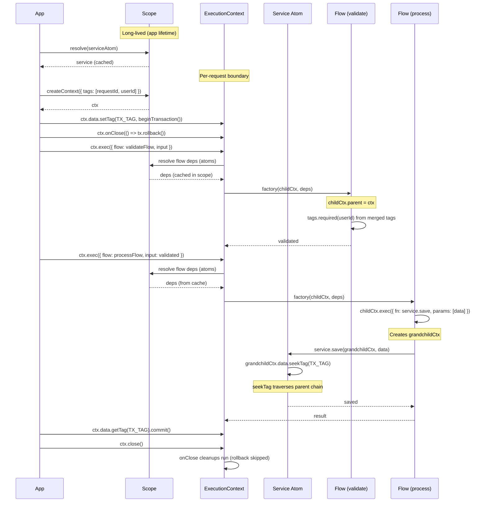
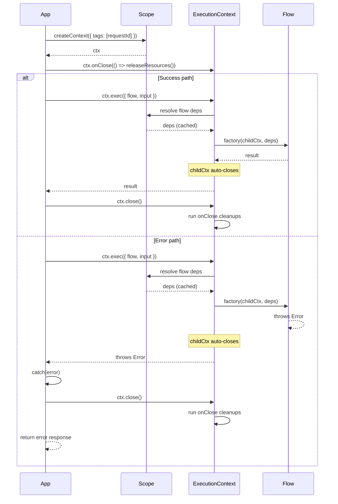
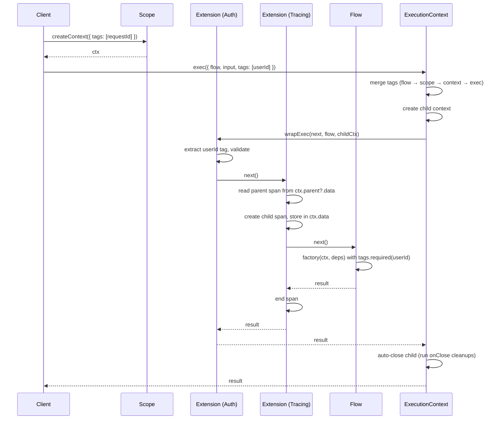
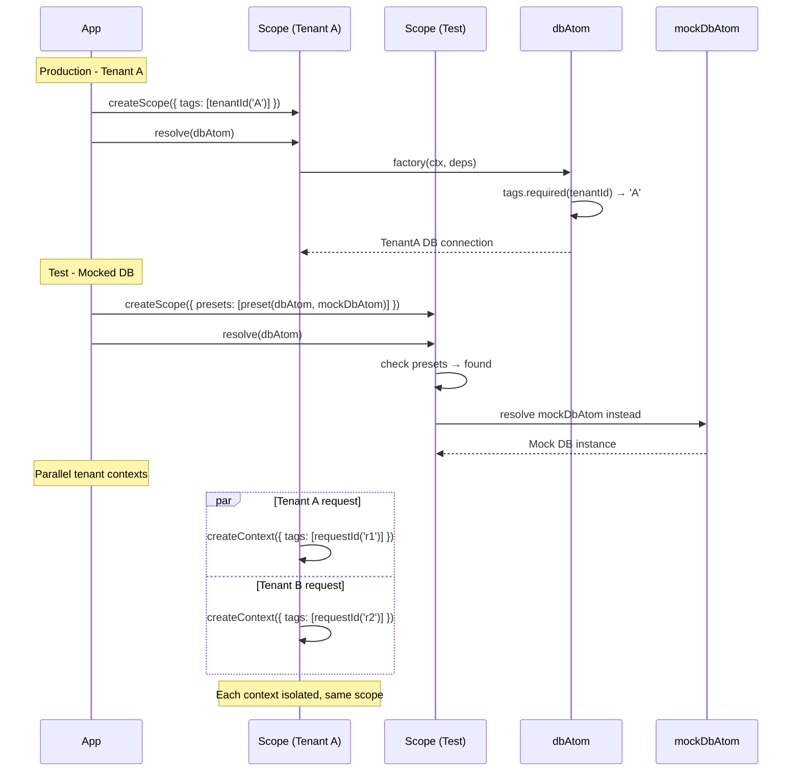
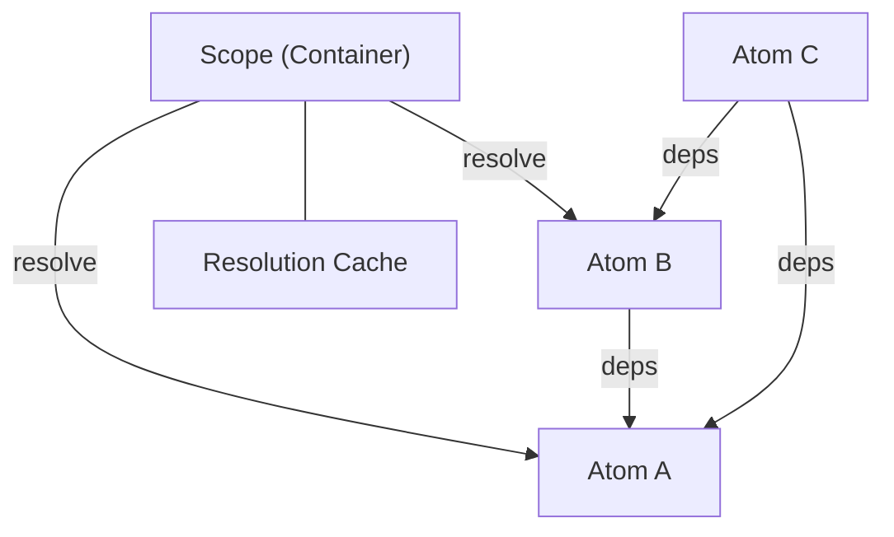
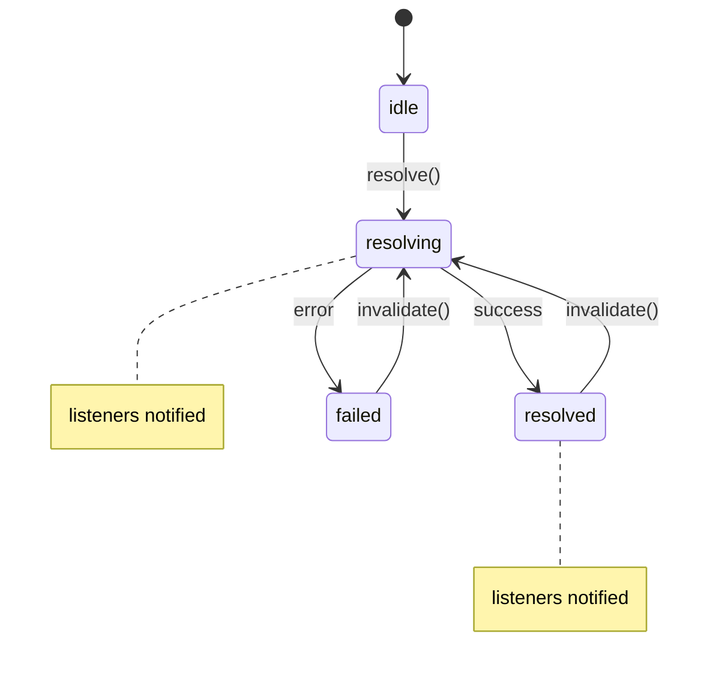
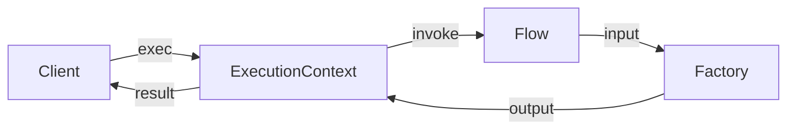
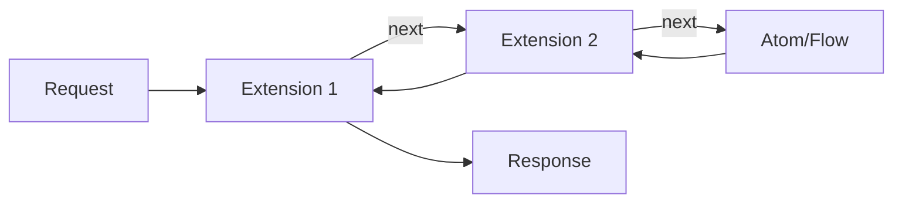
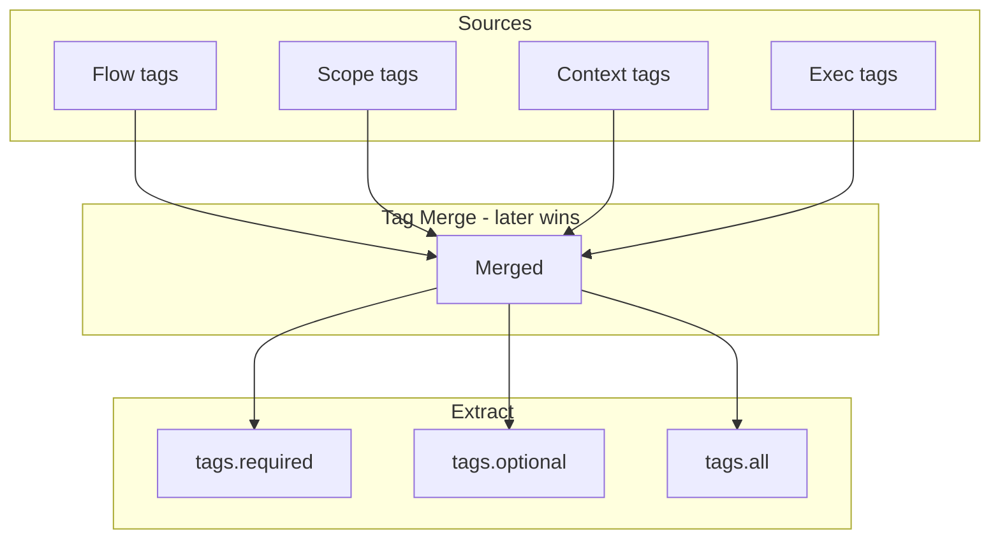
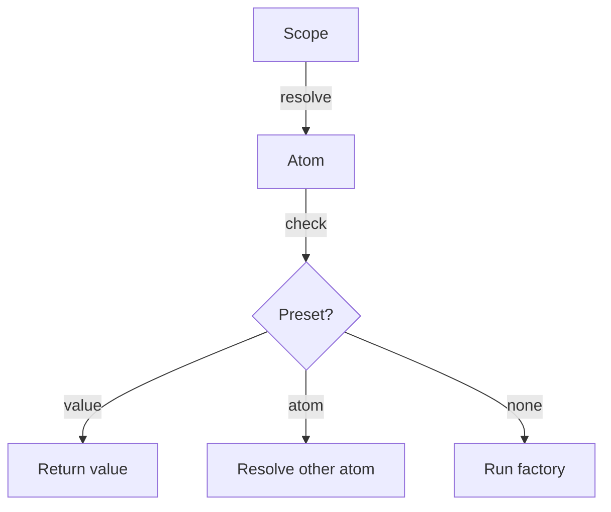

# PATTERNS.md Design

> Design document for `@pumped-fn/lite` architectural patterns documentation.

## Target Audience

- **Library Users**: Developers using @pumped-fn/lite who want to structure applications using the library's patterns
- **Architecture Decision Makers**: Tech leads evaluating whether the library fits their system's needs

## Design Principles

- **Pattern-first**: Assumes readers know GoF patterns, maps to library primitives
- **Lead with composition**: Show powerful composed patterns first, foundational as reference
- **No code examples**: Purely architectural diagrams and primitive mappings
- **Minimal foundational**: ~50-80 words per foundational pattern

## Document Structure

```
PATTERNS.md
├── Overview
├── Composite Patterns
│   ├── Request Lifecycle (IoC + Command + Composite)
│   ├── Request Pipeline (Command + Interceptor + Context Object)
│   └── Scoped Isolation (IoC + Strategy + Composite)
├── Foundational Patterns (inline, minimal)
│   ├── IoC Container (Scope + Atom)
│   ├── Observer (Controller)
│   ├── Command (Flow)
│   ├── Interceptor (Extension)
│   ├── Context Object (Tag)
│   └── Strategy (Preset)
```

## Diagram Style

- **Composite patterns**: Sequence diagrams (show runtime chain behavior)
- **Foundational patterns**: Component diagrams (show structural relationships)

---

## Composite Pattern: Request Lifecycle

**Combines:** IoC Container + Command + Composite

**GoF Mapping:**
- IoC Container → `Scope` (long-lived, caches atoms)
- Command Pattern → `Flow` (operations within request)
- Composite Pattern → Hierarchical `ExecutionContext` (parent-child with isolated data)

**Key Insight:**
- `Scope` = application container (atoms cached here)
- `ExecutionContext` = request boundary (data lives here, closed at request end)
- `Flow` / `ctx.exec` = operations within the request (share context via `seekTag`)

**Sequence Diagram:**



**Key Characteristics:**
- Scope caches atoms across requests (resolve once, use many)
- ExecutionContext bounds request lifecycle (`onClose` for cleanup)
- Each `exec()` creates child context with isolated `data` Map
- `seekTag()` traverses parent chain for shared data (e.g., transaction)
- `ctx.close()` runs all `onClose` cleanups (LIFO order)

**Error Boundary (natural extension):**



**Primitives:** `createScope()`, `scope.createContext()`, `ctx.exec()`, `ctx.data.setTag/seekTag()`, `ctx.onClose()`, `ctx.close()`

---

## Composite Pattern: Request Pipeline

**Combines:** Command + Interceptor + Context Object

**GoF Mapping:**
- Command Pattern → `Flow` (encapsulates request with input/output)
- Interceptor/Decorator → `Extension.wrapExec()` (wraps execution)
- Context Object → `Tag` (propagates metadata without explicit passing)

**Sequence Diagram:**



**Key Characteristics:**
- Extensions wrap in registration order (outer → inner)
- Each `exec()` creates isolated child context with own `data` Map
- Tags merge with later sources winning (exec tags override flow tags)
- Parent chain enables span correlation without AsyncLocalStorage

**Primitives:** `flow()`, `Extension.wrapExec`, `tag()`, `ctx.exec()`, `ctx.parent`, `ctx.data`

---

## Composite Pattern: Scoped Isolation

**Combines:** IoC Container + Strategy + Composite

**GoF Mapping:**
- IoC Container → `Scope` (manages atom lifecycles and resolution)
- Strategy Pattern → `Preset` (swap implementations at scope creation)
- Composite Pattern → Hierarchical `ExecutionContext` (parent-child isolation)

**Sequence Diagram:**



**Key Characteristics:**
- Each Scope is an isolated DI container with own cache
- Presets swap atom implementations without changing definitions
- Tags at scope level apply to all resolutions
- Multiple ExecutionContexts share scope but isolate request data
- Child contexts inherit parent tags, can override

**Use Cases:**
- Multi-tenancy: scope-level tenant tag, context-level request isolation
- Testing: preset mocks without touching production atom definitions
- Feature flags: preset alternative implementations per environment

**Primitives:** `createScope()`, `preset()`, `tag()`, `createContext()`, scope `tags` option

---

## Foundational Patterns

### IoC Container

**GoF:** Inversion of Control / Dependency Injection Container

**Structure:**


**Primitives:** `createScope()`, `atom()`, `deps`, `scope.resolve()`

**Characteristics:** Lazy resolution, automatic caching, dependency graph traversal, circular dependency detection.

---

### Observer

**GoF:** Observer Pattern with State Machine

**Structure:**


**Primitives:** `controller()`, `ctrl.on('resolved' | 'resolving' | '*')`, `ctrl.invalidate()`

**Characteristics:** State-filtered subscriptions, LIFO cleanup before re-resolution, sequential invalidation chains with loop detection.

---

### Command

**GoF:** Command Pattern

**Structure:**


**Primitives:** `flow()`, `ctx.exec()`, `ctx.input`, `parse`

**Characteristics:** Encapsulated request/response, input validation via `parse`, nestable execution, auto-closing child contexts.

---

### Interceptor

**GoF:** Interceptor / Chain of Responsibility

**Structure:**


**Primitives:** `Extension`, `wrapResolve()`, `wrapExec()`, `init()`, `dispose()`

**Characteristics:** Wraps both atom resolution and flow execution, registration order determines nesting, access to scope and context.

---

### Context Object

**GoF:** Context Object / Ambient Context

**Structure:**


**Primitives:** `tag()`, `tags.required()`, `tags.optional()`, `tags.all()`, `Tagged`

**Characteristics:** Implicit propagation through execution layers, type-safe extraction, merge precedence (exec > context > scope > flow).

---

### Strategy

**GoF:** Strategy Pattern

**Structure:**


**Primitives:** `preset()`, `createScope({ presets })`, `isPreset()`

**Characteristics:** Swap implementations at scope creation, value injection bypasses factory, atom redirection for mock substitution.

---

## Validation

This design should be challenged against a real-world scenario (Express.js application architecture) to verify:
1. Request Pipeline maps naturally to Express middleware
2. Scoped Isolation enables multi-tenancy patterns
3. Foundational patterns provide sufficient building blocks
