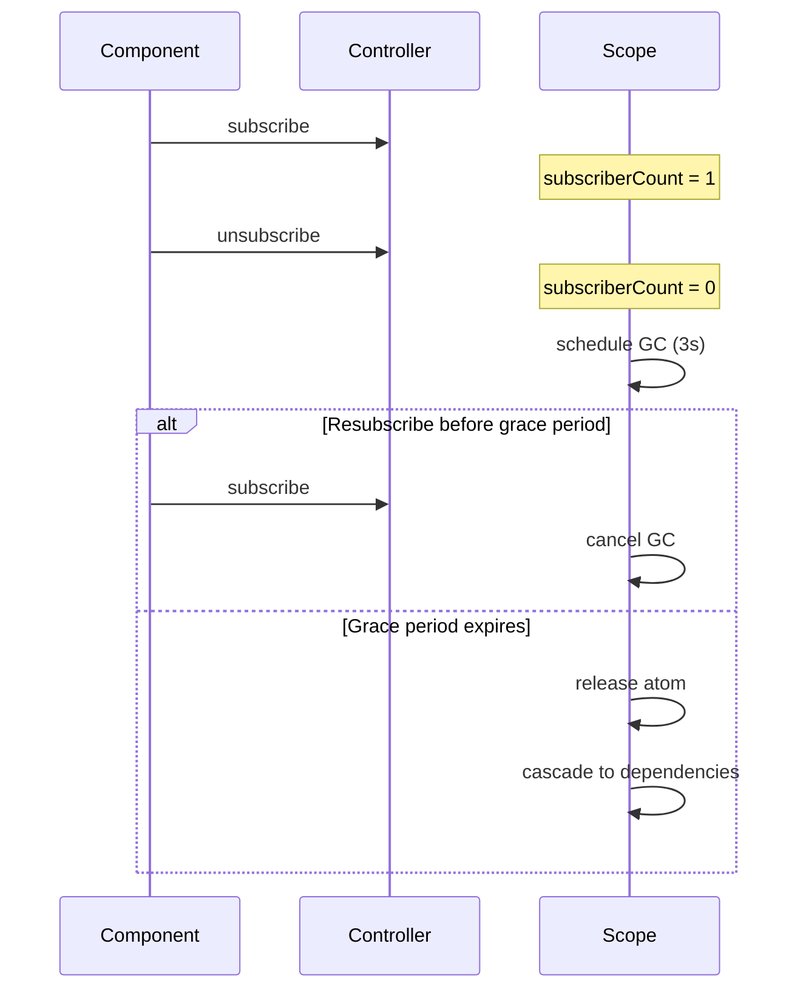

# Automatic Garbage Collection Implementation Plan

> **For Claude:** REQUIRED SUB-SKILL: Use superpowers:executing-plans to implement this plan task-by-task.

**Goal:** Add subscription-based automatic garbage collection to @pumped-fn/lite with cascading dependency tracking, grace period for React Strict Mode, and keepAlive opt-out.

**Architecture:** GC is triggered when an atom loses all subscribers. Before releasing, we check for mounted dependents (atoms that depend on this one). A grace period prevents premature cleanup during React Strict Mode double-mount. The `keepAlive` flag on atoms prevents automatic release entirely.

**Tech Stack:** TypeScript, Vitest, @pumped-fn/lite internals

**Reference:** [ADR-029](./.c3/adr/adr-029-automatic-garbage-collection.md)

---

## System Diagrams

### State Machine: Atom GC Lifecycle

```
                                    ┌─────────────────────────────────┐
                                    │                                 │
                                    ▼                                 │
┌──────────┐  resolve()  ┌──────────────┐  subscribe()  ┌───────────┐│
│   IDLE   │────────────►│   RESOLVED   │◄──────────────│  MOUNTED  ││
│ (no GC)  │             │  (eligible)  │               │ (no GC)   ││
└──────────┘             └──────────────┘               └───────────┘│
     ▲                          │                            │       │
     │                          │ unsubscribe()              │       │
     │                          │ (last subscriber)          │       │
     │                          ▼                            │       │
     │                   ┌──────────────┐                    │       │
     │    graceMs        │  SCHEDULED   │    resubscribe()   │       │
     │    elapsed        │   (timer)    │────────────────────┘       │
     │                   └──────────────┘                            │
     │                          │                                    │
     │                          │ timer fires                        │
     │                          ▼                                    │
     │                   ┌──────────────┐                            │
     │    release()      │   RELEASED   │     cascade to deps        │
     └───────────────────│  (cleanup)   │────────────────────────────┘
                         └──────────────┘
```

### Data Flow: Cascading GC

```
┌─────────────────────────────────────────────────────────────────────┐
│                         DEPENDENCY GRAPH                            │
├─────────────────────────────────────────────────────────────────────┤
│                                                                     │
│   configAtom (keepAlive: true)                                      │
│       ▲                                                             │
│       │ deps.config                                                 │
│       │                                                             │
│   dbAtom ◄──────── dependents: [userServiceAtom]                    │
│       ▲                                                             │
│       │ deps.db                                                     │
│       │                                                             │
│   userServiceAtom ◄──────── dependents: []                          │
│       ▲                                                             │
│       │ listeners: [Component]                                      │
│       │                                                             │
│   ┌───────────┐                                                     │
│   │ Component │                                                     │
│   └───────────┘                                                     │
│                                                                     │
└─────────────────────────────────────────────────────────────────────┘

UNMOUNT SEQUENCE:
─────────────────
1. Component unmounts
   └─► userServiceAtom.listeners = [] → schedule GC (3s)
   
2. After 3s: GC userServiceAtom
   └─► dbAtom.dependents.delete(userServiceAtom)
   └─► dbAtom.listeners = [], dependents = [] → schedule GC (3s)
   
3. After 3s: GC dbAtom  
   └─► configAtom.dependents.delete(dbAtom)
   └─► configAtom.keepAlive = true → STOP (never GC)
```

### Sequence: React Strict Mode Double-Mount

```
    Component          Controller           Scope (GC)
        │                  │                    │
        │  mount (render 1)│                    │
        ├─────────────────►│                    │
        │                  │  subscribe()       │
        │                  ├───────────────────►│
        │                  │                    │ cancelScheduledGC()
        │                  │                    │ subscribers = 1
        │                  │                    │
        │  unmount (cleanup)                    │
        ├─────────────────►│                    │
        │                  │  unsubscribe()     │
        │                  ├───────────────────►│
        │                  │                    │ subscribers = 0
        │                  │                    │ scheduleGC(3000ms)
        │                  │                    │     ┌──────────┐
        │                  │                    │     │  TIMER   │
        │                  │                    │     │ (3000ms) │
        │  mount (render 2)│                    │     └────┬─────┘
        ├─────────────────►│                    │          │
        │                  │  subscribe()       │          │
        │                  ├───────────────────►│          │
        │                  │                    │ cancelScheduledGC() ◄──┘
        │                  │                    │ subscribers = 1
        │                  │                    │
        │                  │                    │ Component works normally
        ▼                  ▼                    ▼
```

### Data Structure Changes

```
BEFORE (AtomEntry):                    AFTER (AtomEntry):
┌─────────────────────┐               ┌─────────────────────────────┐
│ state: AtomState    │               │ state: AtomState            │
│ value?: T           │               │ value?: T                   │
│ hasValue: boolean   │               │ hasValue: boolean           │
│ error?: Error       │               │ error?: Error               │
│ cleanups: []        │               │ cleanups: []                │
│ listeners: Map      │               │ listeners: Map              │
│ pendingInvalidate   │               │ pendingInvalidate           │
│ pendingSet?         │               │ pendingSet?                 │
│ data?               │               │ data?                       │
└─────────────────────┘               │ dependents: Set<Atom>   NEW │
                                      │ gcScheduled: Timer|null NEW │
                                      └─────────────────────────────┘

BEFORE (ScopeOptions):                AFTER (ScopeOptions):
┌─────────────────────┐               ┌─────────────────────────────┐
│ extensions?: []     │               │ extensions?: []             │
│ tags?: []           │               │ tags?: []                   │
│ presets?: []        │               │ presets?: []                │
└─────────────────────┘               │ gc?: GCOptions          NEW │
                                      └─────────────────────────────┘

NEW (GCOptions):                      NEW (Atom field):
┌─────────────────────┐               ┌─────────────────────────────┐
│ enabled?: boolean   │               │ keepAlive?: boolean         │
│ graceMs?: number    │               └─────────────────────────────┘
└─────────────────────┘
```

---

## Task 1: Add Types for GC Configuration

**Files:**
- Modify: `packages/lite/src/types.ts`

**Step 1: Add GCOptions interface**

```typescript
// Add after ScopeOptions interface (around line 44)
export interface GCOptions {
  /** Enable automatic garbage collection. Default: true */
  enabled?: boolean
  /** Grace period before releasing (ms). Default: 3000 */
  graceMs?: number
}
```

**Step 2: Add gc to ScopeOptions**

```typescript
// Modify ScopeOptions interface
export interface ScopeOptions {
  extensions?: Extension[]
  tags?: Tagged<unknown>[]
  presets?: Preset<unknown>[]
  gc?: GCOptions  // NEW
}
```

**Step 3: Add keepAlive to Atom interface**

```typescript
// Modify Atom interface (around line 46)
export interface Atom<T> {
  readonly [atomSymbol]: true
  readonly factory: AtomFactory<T, Record<string, Dependency>>
  readonly deps?: Record<string, Dependency>
  readonly tags?: Tagged<unknown>[]
  readonly keepAlive?: boolean  // NEW
}
```

**Step 4: Run typecheck**

```bash
pnpm -F @pumped-fn/lite typecheck
```
Expected: PASS (no consumers of new types yet)

**Step 5: Commit**

```bash
git add packages/lite/src/types.ts
git commit -m "feat(lite): add GC types - GCOptions, keepAlive"
```

---

## Task 2: Add keepAlive to Atom Creation

**Files:**
- Modify: `packages/lite/src/atom.ts`
- Test: `packages/lite/tests/atom.test.ts`

**Step 1: Write failing test for keepAlive**

```typescript
// Add to atom.test.ts
describe('keepAlive', () => {
  it('atom without keepAlive has keepAlive undefined', () => {
    const myAtom = atom({ factory: () => 'value' })
    expect(myAtom.keepAlive).toBeUndefined()
  })

  it('atom with keepAlive: true has keepAlive true', () => {
    const myAtom = atom({ factory: () => 'value', keepAlive: true })
    expect(myAtom.keepAlive).toBe(true)
  })

  it('atom with keepAlive: false has keepAlive false', () => {
    const myAtom = atom({ factory: () => 'value', keepAlive: false })
    expect(myAtom.keepAlive).toBe(false)
  })
})
```

**Step 2: Run test to verify failure**

```bash
pnpm -F @pumped-fn/lite test -- atom.test.ts -t "keepAlive"
```
Expected: FAIL - keepAlive not passed through

**Step 3: Update AtomConfig interface**

```typescript
// In atom.ts, update AtomConfig
export interface AtomConfig<T, D extends Record<string, Lite.Dependency>> {
  deps?: D
  factory: Lite.AtomFactory<T, D>
  tags?: Lite.Tagged<unknown>[]
  keepAlive?: boolean  // NEW
}
```

**Step 4: Update atom function overloads**

```typescript
// Update all overloads to include keepAlive
export function atom<T>(config: {
  deps?: undefined
  factory: (ctx: Lite.ResolveContext) => MaybePromise<T>
  tags?: Lite.Tagged<unknown>[]
  keepAlive?: boolean  // NEW
}): Lite.Atom<T>

export function atom<
  T,
  const D extends Record<string, Lite.Atom<unknown> | Lite.ControllerDep<unknown> | { mode: string }>,
>(config: {
  deps: D
  factory: (ctx: Lite.ResolveContext, deps: Lite.InferDeps<D>) => MaybePromise<T>
  tags?: Lite.Tagged<unknown>[]
  keepAlive?: boolean  // NEW
}): Lite.Atom<T>
```

**Step 5: Pass keepAlive through in implementation**

```typescript
// In the implementation function, add keepAlive to returned object
export function atom<T, D extends Record<string, Lite.Dependency>>(
  config: AtomConfig<T, D>
): Lite.Atom<T> {
  const atomInstance: Lite.Atom<T> = {
    [atomSymbol]: true,
    factory: config.factory as unknown as Lite.AtomFactory<T, Record<string, Lite.Dependency>>,
    deps: config.deps as unknown as Record<string, Lite.Dependency> | undefined,
    tags: config.tags,
    keepAlive: config.keepAlive,  // NEW
  }

  if (config.tags?.length) {
    registerAtomToTags(atomInstance, config.tags)
  }

  return atomInstance
}
```

**Step 6: Run test to verify pass**

```bash
pnpm -F @pumped-fn/lite test -- atom.test.ts -t "keepAlive"
```
Expected: PASS

**Step 7: Commit**

```bash
git add packages/lite/src/atom.ts packages/lite/tests/atom.test.ts
git commit -m "feat(lite): add keepAlive option to atom config"
```

---

## Task 3: Add Dependents Tracking to AtomEntry

**Files:**
- Modify: `packages/lite/src/scope.ts`
- Test: `packages/lite/tests/scope.test.ts`

**Step 1: Write failing test for dependents tracking**

```typescript
// Add new describe block in scope.test.ts
describe('Dependents Tracking', () => {
  it('tracks dependents when atom depends on another', async () => {
    const scope = createScope() as any  // access private for test
    
    const depAtom = atom({ factory: () => 'dep' })
    const mainAtom = atom({
      deps: { dep: depAtom },
      factory: (ctx, { dep }) => `main-${dep}`
    })
    
    await scope.resolve(mainAtom)
    
    const depEntry = scope.getEntry(depAtom)
    expect(depEntry.dependents.has(mainAtom)).toBe(true)
  })

  it('does not track dependents for atoms without deps', async () => {
    const scope = createScope() as any
    
    const standaloneAtom = atom({ factory: () => 'standalone' })
    await scope.resolve(standaloneAtom)
    
    const entry = scope.getEntry(standaloneAtom)
    expect(entry.dependents.size).toBe(0)
  })

  it('tracks multiple dependents for shared dependency', async () => {
    const scope = createScope() as any
    
    const sharedAtom = atom({ factory: () => 'shared' })
    const consumer1 = atom({
      deps: { shared: sharedAtom },
      factory: (ctx, { shared }) => `1-${shared}`
    })
    const consumer2 = atom({
      deps: { shared: sharedAtom },
      factory: (ctx, { shared }) => `2-${shared}`
    })
    
    await scope.resolve(consumer1)
    await scope.resolve(consumer2)
    
    const sharedEntry = scope.getEntry(sharedAtom)
    expect(sharedEntry.dependents.size).toBe(2)
    expect(sharedEntry.dependents.has(consumer1)).toBe(true)
    expect(sharedEntry.dependents.has(consumer2)).toBe(true)
  })
})
```

**Step 2: Run test to verify failure**

```bash
pnpm -F @pumped-fn/lite test -- scope.test.ts -t "Dependents Tracking"
```
Expected: FAIL - dependents property doesn't exist

**Step 3: Add dependents to AtomEntry interface**

```typescript
// In scope.ts, modify AtomEntry interface
interface AtomEntry<T> {
  state: AtomState
  value?: T
  hasValue: boolean
  error?: Error
  cleanups: (() => MaybePromise<void>)[]
  listeners: Map<ListenerEvent, Set<() => void>>
  pendingInvalidate: boolean
  pendingSet?: { value: T } | { fn: (prev: T) => T }
  data?: ContextDataImpl
  dependents: Set<Lite.Atom<unknown>>  // NEW
  gcScheduled: ReturnType<typeof setTimeout> | null  // NEW
}
```

**Step 4: Initialize dependents in getOrCreateEntry**

```typescript
// Modify getOrCreateEntry method
private getOrCreateEntry<T>(atom: Lite.Atom<T>): AtomEntry<T> {
  let entry = this.cache.get(atom) as AtomEntry<T> | undefined
  if (!entry) {
    entry = {
      state: 'idle',
      hasValue: false,
      cleanups: [],
      listeners: new Map([
        ['resolving', new Set()],
        ['resolved', new Set()],
        ['*', new Set()],
      ]),
      pendingInvalidate: false,
      dependents: new Set(),  // NEW
      gcScheduled: null,      // NEW
    }
    this.cache.set(atom, entry as AtomEntry<unknown>)
  }
  return entry
}
```

**Step 5: Track dependents during dependency resolution**

This is tricky because resolveDeps doesn't know which atom is being resolved. We need to track during doResolve.

```typescript
// Modify doResolve to pass currentAtom to resolveDeps
private async doResolve<T>(atom: Lite.Atom<T>): Promise<T> {
  const entry = this.getOrCreateEntry(atom)
  // ... existing code ...
  
  const resolvedDeps = await this.resolveDeps(atom.deps, undefined, atom)  // Pass atom
  
  // ... rest of method ...
}

// Modify resolveDeps signature and implementation
async resolveDeps(
  deps: Record<string, Lite.Dependency> | undefined,
  ctx?: Lite.ExecutionContext,
  dependentAtom?: Lite.Atom<unknown>  // NEW parameter
): Promise<Record<string, unknown>> {
  if (!deps) return {}

  const result: Record<string, unknown> = {}

  for (const [key, dep] of Object.entries(deps)) {
    if (isAtom(dep)) {
      result[key] = await this.resolve(dep)
      // NEW: Track dependent
      if (dependentAtom) {
        const depEntry = this.getEntry(dep)
        if (depEntry) {
          depEntry.dependents.add(dependentAtom)
        }
      }
    } else if (isControllerDep(dep)) {
      // ... existing controller handling ...
      // Also track for controller deps
      if (dependentAtom) {
        const depEntry = this.getEntry(dep.atom)
        if (depEntry) {
          depEntry.dependents.add(dependentAtom)
        }
      }
    }
    // ... rest of method ...
  }

  return result
}
```

**Step 6: Run test to verify pass**

```bash
pnpm -F @pumped-fn/lite test -- scope.test.ts -t "Dependents Tracking"
```
Expected: PASS

**Step 7: Run full test suite**

```bash
pnpm -F @pumped-fn/lite test
```
Expected: All existing tests PASS

**Step 8: Commit**

```bash
git add packages/lite/src/scope.ts packages/lite/tests/scope.test.ts
git commit -m "feat(lite): track atom dependents for cascading GC"
```

---

## Task 4: Add GC Options to Scope

**Files:**
- Modify: `packages/lite/src/scope.ts`
- Test: `packages/lite/tests/scope.test.ts`

**Step 1: Write failing test for GC options**

```typescript
describe('GC Options', () => {
  it('defaults gc.enabled to true', () => {
    const scope = createScope() as any
    expect(scope.gcOptions.enabled).toBe(true)
  })

  it('defaults gc.graceMs to 3000', () => {
    const scope = createScope() as any
    expect(scope.gcOptions.graceMs).toBe(3000)
  })

  it('respects gc.enabled: false', () => {
    const scope = createScope({ gc: { enabled: false } }) as any
    expect(scope.gcOptions.enabled).toBe(false)
  })

  it('respects custom gc.graceMs', () => {
    const scope = createScope({ gc: { graceMs: 5000 } }) as any
    expect(scope.gcOptions.graceMs).toBe(5000)
  })
})
```

**Step 2: Run test to verify failure**

```bash
pnpm -F @pumped-fn/lite test -- scope.test.ts -t "GC Options"
```
Expected: FAIL - gcOptions not defined

**Step 3: Add gcOptions to ScopeImpl**

```typescript
// In ScopeImpl class, add private field
class ScopeImpl implements Lite.Scope {
  private cache = new Map<Lite.Atom<unknown>, AtomEntry<unknown>>()
  // ... other fields ...
  private gcOptions: Required<Lite.GCOptions>  // NEW

  constructor(options?: Lite.ScopeOptions) {
    // ... existing initialization ...
    
    // NEW: Initialize GC options with defaults
    this.gcOptions = {
      enabled: options?.gc?.enabled ?? true,
      graceMs: options?.gc?.graceMs ?? 3000,
    }
    
    this.ready = this.init()
  }
  // ...
}
```

**Step 4: Run test to verify pass**

```bash
pnpm -F @pumped-fn/lite test -- scope.test.ts -t "GC Options"
```
Expected: PASS

**Step 5: Commit**

```bash
git add packages/lite/src/scope.ts packages/lite/tests/scope.test.ts
git commit -m "feat(lite): add GC options to scope with defaults"
```

---

## Task 5: Implement Core GC Logic - Schedule and Cancel

**Files:**
- Modify: `packages/lite/src/scope.ts`
- Test: `packages/lite/tests/scope.test.ts`

**Step 1: Write test for GC scheduling on unsubscribe**

```typescript
describe('Automatic GC - Scheduling', () => {
  const delay = (ms: number) => new Promise(r => setTimeout(r, ms))

  it('schedules GC when last subscriber unsubscribes', async () => {
    const scope = createScope({ gc: { graceMs: 100 } })
    const myAtom = atom({ factory: () => 'value' })
    
    const ctrl = scope.controller(myAtom)
    await ctrl.resolve()
    expect(ctrl.state).toBe('resolved')
    
    // Subscribe then unsubscribe
    const unsub = ctrl.on('resolved', () => {})
    unsub()
    
    // Still resolved immediately after unsubscribe
    expect(ctrl.state).toBe('resolved')
    
    // After grace period, should be released
    await delay(150)
    expect(ctrl.state).toBe('idle')
  })

  it('cancels scheduled GC when resubscribed during grace period', async () => {
    const scope = createScope({ gc: { graceMs: 100 } })
    const myAtom = atom({ factory: () => 'value' })
    
    const ctrl = scope.controller(myAtom)
    await ctrl.resolve()
    
    const unsub1 = ctrl.on('resolved', () => {})
    unsub1()  // Schedules GC
    
    await delay(50)  // Halfway through grace
    
    const unsub2 = ctrl.on('resolved', () => {})  // Should cancel GC
    
    await delay(100)  // Past original grace period
    expect(ctrl.state).toBe('resolved')  // Still alive!
    
    unsub2()
  })

  it('does not schedule GC when still has other subscribers', async () => {
    const scope = createScope({ gc: { graceMs: 100 } })
    const myAtom = atom({ factory: () => 'value' })
    
    const ctrl = scope.controller(myAtom)
    await ctrl.resolve()
    
    const unsub1 = ctrl.on('resolved', () => {})
    const unsub2 = ctrl.on('resolved', () => {})
    
    unsub1()  // Still has unsub2
    
    await delay(150)
    expect(ctrl.state).toBe('resolved')  // Still alive
    
    unsub2()
  })
})
```

**Step 2: Run test to verify failure**

```bash
pnpm -F @pumped-fn/lite test -- scope.test.ts -t "Automatic GC - Scheduling"
```
Expected: FAIL - GC not happening

**Step 3: Add helper to count subscribers**

```typescript
// Add to ScopeImpl
private getSubscriberCount<T>(atom: Lite.Atom<T>): number {
  const entry = this.cache.get(atom)
  if (!entry) return 0
  let count = 0
  for (const listeners of entry.listeners.values()) {
    count += listeners.size
  }
  return count
}
```

**Step 4: Add maybeScheduleGC method**

```typescript
// Add to ScopeImpl
private maybeScheduleGC<T>(atom: Lite.Atom<T>): void {
  if (!this.gcOptions.enabled) return
  if (atom.keepAlive) return
  
  const entry = this.cache.get(atom)
  if (!entry) return
  if (entry.state === 'idle') return
  
  const subscriberCount = this.getSubscriberCount(atom)
  if (subscriberCount > 0) return
  if (entry.dependents.size > 0) return
  
  // Already scheduled?
  if (entry.gcScheduled) return
  
  // Schedule GC
  entry.gcScheduled = setTimeout(() => {
    this.executeGC(atom)
  }, this.gcOptions.graceMs)
}
```

**Step 5: Add cancelScheduledGC method**

```typescript
// Add to ScopeImpl
private cancelScheduledGC<T>(atom: Lite.Atom<T>): void {
  const entry = this.cache.get(atom)
  if (entry?.gcScheduled) {
    clearTimeout(entry.gcScheduled)
    entry.gcScheduled = null
  }
}
```

**Step 6: Add executeGC method**

```typescript
// Add to ScopeImpl
private async executeGC<T>(atom: Lite.Atom<T>): Promise<void> {
  const entry = this.cache.get(atom)
  if (!entry) return
  
  entry.gcScheduled = null
  
  // Double-check eligibility (state may have changed)
  if (this.getSubscriberCount(atom) > 0) return
  if (entry.dependents.size > 0) return
  if (atom.keepAlive) return
  
  // Release the atom
  await this.release(atom)
}
```

**Step 7: Modify addListener to integrate GC**

```typescript
// Modify addListener method
addListener<T>(atom: Lite.Atom<T>, event: ListenerEvent, listener: () => void): () => void {
  this.cancelScheduledGC(atom)  // NEW: Cancel any pending GC
  
  const entry = this.getOrCreateEntry(atom)
  const listeners = entry.listeners.get(event)!
  listeners.add(listener)
  
  return () => {
    listeners.delete(listener)
    this.maybeScheduleGC(atom)  // NEW: Maybe schedule GC
  }
}
```

**Step 8: Run test to verify pass**

```bash
pnpm -F @pumped-fn/lite test -- scope.test.ts -t "Automatic GC - Scheduling"
```
Expected: PASS

**Step 9: Commit**

```bash
git add packages/lite/src/scope.ts packages/lite/tests/scope.test.ts
git commit -m "feat(lite): implement GC scheduling and cancellation"
```

---

## Task 6: Implement keepAlive Prevention

**Files:**
- Modify: `packages/lite/src/scope.ts` (already has logic)
- Test: `packages/lite/tests/scope.test.ts`

**Step 1: Write test for keepAlive**

```typescript
describe('Automatic GC - keepAlive', () => {
  const delay = (ms: number) => new Promise(r => setTimeout(r, ms))

  it('does not GC atoms with keepAlive: true', async () => {
    const scope = createScope({ gc: { graceMs: 100 } })
    const myAtom = atom({ factory: () => 'persistent', keepAlive: true })
    
    const ctrl = scope.controller(myAtom)
    await ctrl.resolve()
    
    const unsub = ctrl.on('resolved', () => {})
    unsub()
    
    await delay(150)
    expect(ctrl.state).toBe('resolved')  // Still alive due to keepAlive
  })

  it('GCs atoms with keepAlive: false (explicit)', async () => {
    const scope = createScope({ gc: { graceMs: 100 } })
    const myAtom = atom({ factory: () => 'temporary', keepAlive: false })
    
    const ctrl = scope.controller(myAtom)
    await ctrl.resolve()
    
    const unsub = ctrl.on('resolved', () => {})
    unsub()
    
    await delay(150)
    expect(ctrl.state).toBe('idle')  // GC'd
  })
})
```

**Step 2: Run test to verify pass**

```bash
pnpm -F @pumped-fn/lite test -- scope.test.ts -t "Automatic GC - keepAlive"
```
Expected: PASS (already implemented in maybeScheduleGC)

**Step 3: Commit**

```bash
git add packages/lite/tests/scope.test.ts
git commit -m "test(lite): add tests for keepAlive GC prevention"
```

---

## Task 7: Implement Cascading GC

**Files:**
- Modify: `packages/lite/src/scope.ts`
- Test: `packages/lite/tests/scope.test.ts`

**Step 1: Write test for cascading GC**

```typescript
describe('Automatic GC - Cascading', () => {
  const delay = (ms: number) => new Promise(r => setTimeout(r, ms))

  it('does not GC dependency while dependent is mounted', async () => {
    const scope = createScope({ gc: { graceMs: 100 } })
    
    const depAtom = atom({ factory: () => 'dep' })
    const mainAtom = atom({
      deps: { dep: depAtom },
      factory: (ctx, { dep }) => `main-${dep}`
    })
    
    const depCtrl = scope.controller(depAtom)
    const mainCtrl = scope.controller(mainAtom)
    
    await mainCtrl.resolve()
    
    // Main has a subscriber
    const mainUnsub = mainCtrl.on('resolved', () => {})
    
    // Dep has no direct subscribers, but main depends on it
    await delay(150)
    expect(depCtrl.state).toBe('resolved')  // Protected by dependent
    
    mainUnsub()
  })

  it('cascades GC to dependencies after dependent is released', async () => {
    const scope = createScope({ gc: { graceMs: 100 } })
    
    const depAtom = atom({ factory: () => 'dep' })
    const mainAtom = atom({
      deps: { dep: depAtom },
      factory: (ctx, { dep }) => `main-${dep}`
    })
    
    const depCtrl = scope.controller(depAtom)
    const mainCtrl = scope.controller(mainAtom)
    
    await mainCtrl.resolve()
    
    const unsub = mainCtrl.on('resolved', () => {})
    unsub()
    
    // Wait for main to be GC'd
    await delay(150)
    expect(mainCtrl.state).toBe('idle')
    
    // Wait for cascade to dep (another grace period)
    await delay(150)
    expect(depCtrl.state).toBe('idle')
  })

  it('does not cascade to keepAlive dependencies', async () => {
    const scope = createScope({ gc: { graceMs: 100 } })
    
    const configAtom = atom({ factory: () => 'config', keepAlive: true })
    const serviceAtom = atom({
      deps: { config: configAtom },
      factory: (ctx, { config }) => `service-${config}`
    })
    
    const configCtrl = scope.controller(configAtom)
    const serviceCtrl = scope.controller(serviceAtom)
    
    await serviceCtrl.resolve()
    
    const unsub = serviceCtrl.on('resolved', () => {})
    unsub()
    
    // Wait for service to be GC'd
    await delay(150)
    expect(serviceCtrl.state).toBe('idle')
    
    // Config should remain due to keepAlive
    await delay(150)
    expect(configCtrl.state).toBe('resolved')
  })

  it('handles diamond dependency correctly', async () => {
    const scope = createScope({ gc: { graceMs: 100 } })
    
    //     A
    //    / \
    //   B   C
    //    \ /
    //     D (subscriber here)
    
    const atomA = atom({ factory: () => 'A' })
    const atomB = atom({
      deps: { a: atomA },
      factory: (ctx, { a }) => `B-${a}`
    })
    const atomC = atom({
      deps: { a: atomA },
      factory: (ctx, { a }) => `C-${a}`
    })
    const atomD = atom({
      deps: { b: atomB, c: atomC },
      factory: (ctx, { b, c }) => `D-${b}-${c}`
    })
    
    const ctrlA = scope.controller(atomA)
    const ctrlB = scope.controller(atomB)
    const ctrlC = scope.controller(atomC)
    const ctrlD = scope.controller(atomD)
    
    await ctrlD.resolve()
    
    const unsub = ctrlD.on('resolved', () => {})
    
    // All should be protected while D is subscribed
    await delay(150)
    expect(ctrlA.state).toBe('resolved')
    expect(ctrlB.state).toBe('resolved')
    expect(ctrlC.state).toBe('resolved')
    expect(ctrlD.state).toBe('resolved')
    
    unsub()
    
    // D should be GC'd first
    await delay(150)
    expect(ctrlD.state).toBe('idle')
    
    // Then B and C (they depend on A, but no dependents now)
    await delay(150)
    expect(ctrlB.state).toBe('idle')
    expect(ctrlC.state).toBe('idle')
    
    // Finally A
    await delay(150)
    expect(ctrlA.state).toBe('idle')
  })
})
```

**Step 2: Run test to verify failure**

```bash
pnpm -F @pumped-fn/lite test -- scope.test.ts -t "Automatic GC - Cascading"
```
Expected: FAIL - cascade not implemented

**Step 3: Modify executeGC to cascade**

```typescript
private async executeGC<T>(atom: Lite.Atom<T>): Promise<void> {
  const entry = this.cache.get(atom)
  if (!entry) return
  
  entry.gcScheduled = null
  
  // Double-check eligibility
  if (this.getSubscriberCount(atom) > 0) return
  if (entry.dependents.size > 0) return
  if (atom.keepAlive) return
  
  // Collect dependencies BEFORE release (atom.deps will be unavailable after)
  const dependencies: Lite.Atom<unknown>[] = []
  if (atom.deps) {
    for (const dep of Object.values(atom.deps)) {
      if (isAtom(dep)) {
        dependencies.push(dep)
      } else if (isControllerDep(dep)) {
        dependencies.push(dep.atom)
      }
    }
  }
  
  // Release the atom
  await this.release(atom)
  
  // Cascade: remove from dependencies' dependents and check if they can be GC'd
  for (const dep of dependencies) {
    const depEntry = this.cache.get(dep)
    if (depEntry) {
      depEntry.dependents.delete(atom)
      this.maybeScheduleGC(dep as Lite.Atom<unknown>)
    }
  }
}
```

**Step 4: Run test to verify pass**

```bash
pnpm -F @pumped-fn/lite test -- scope.test.ts -t "Automatic GC - Cascading"
```
Expected: PASS

**Step 5: Commit**

```bash
git add packages/lite/src/scope.ts packages/lite/tests/scope.test.ts
git commit -m "feat(lite): implement cascading GC for dependencies"
```

---

## Task 8: Handle GC Disabled

**Files:**
- Test: `packages/lite/tests/scope.test.ts`

**Step 1: Write test for gc.enabled: false**

```typescript
describe('Automatic GC - Disabled', () => {
  const delay = (ms: number) => new Promise(r => setTimeout(r, ms))

  it('does not GC when gc.enabled is false', async () => {
    const scope = createScope({ gc: { enabled: false, graceMs: 100 } })
    const myAtom = atom({ factory: () => 'value' })
    
    const ctrl = scope.controller(myAtom)
    await ctrl.resolve()
    
    const unsub = ctrl.on('resolved', () => {})
    unsub()
    
    await delay(150)
    expect(ctrl.state).toBe('resolved')  // NOT GC'd
  })
})
```

**Step 2: Run test to verify pass**

```bash
pnpm -F @pumped-fn/lite test -- scope.test.ts -t "Automatic GC - Disabled"
```
Expected: PASS (already handled in maybeScheduleGC)

**Step 3: Commit**

```bash
git add packages/lite/tests/scope.test.ts
git commit -m "test(lite): add test for gc.enabled: false"
```

---

## Task 9: Handle Edge Cases

**Files:**
- Modify: `packages/lite/src/scope.ts`
- Test: `packages/lite/tests/scope.test.ts`

**Step 1: Write tests for edge cases**

```typescript
describe('Automatic GC - Edge Cases', () => {
  const delay = (ms: number) => new Promise(r => setTimeout(r, ms))

  it('manual release still works', async () => {
    const scope = createScope({ gc: { graceMs: 100 } })
    const myAtom = atom({ factory: () => 'value' })
    
    const ctrl = scope.controller(myAtom)
    await ctrl.resolve()
    
    await scope.release(myAtom)
    expect(ctrl.state).toBe('idle')
  })

  it('dispose releases all atoms ignoring GC', async () => {
    const scope = createScope({ gc: { graceMs: 5000 } })  // Long grace
    const myAtom = atom({ factory: () => 'value' })
    
    const ctrl = scope.controller(myAtom)
    await ctrl.resolve()
    
    await scope.dispose()
    expect(ctrl.state).toBe('idle')
  })

  it('invalidation does not trigger GC (same subscribers)', async () => {
    const scope = createScope({ gc: { graceMs: 100 } })
    let callCount = 0
    const myAtom = atom({ factory: () => ++callCount })
    
    const ctrl = scope.controller(myAtom)
    await ctrl.resolve()
    expect(ctrl.get()).toBe(1)
    
    const unsub = ctrl.on('resolved', () => {})
    
    ctrl.invalidate()
    await scope.flush()
    
    expect(ctrl.state).toBe('resolved')
    expect(ctrl.get()).toBe(2)  // Factory ran again
    
    await delay(150)
    expect(ctrl.state).toBe('resolved')  // Still subscribed
    
    unsub()
  })

  it('clears pending GC timer on manual release', async () => {
    const scope = createScope({ gc: { graceMs: 100 } })
    const myAtom = atom({ factory: () => 'value' })
    
    const ctrl = scope.controller(myAtom)
    await ctrl.resolve()
    
    const unsub = ctrl.on('resolved', () => {})
    unsub()  // Schedules GC
    
    // Manually release before timer fires
    await scope.release(myAtom)
    expect(ctrl.state).toBe('idle')
    
    // Should not throw when timer would have fired
    await delay(150)
  })

  it('clears GC timers on dispose', async () => {
    const scope = createScope({ gc: { graceMs: 100 } })
    const myAtom = atom({ factory: () => 'value' })
    
    const ctrl = scope.controller(myAtom)
    await ctrl.resolve()
    
    const unsub = ctrl.on('resolved', () => {})
    unsub()  // Schedules GC
    
    // Dispose before timer fires
    await scope.dispose()
    
    // Should not throw when timer would have fired
    await delay(150)
  })
})
```

**Step 2: Run test to verify any failures**

```bash
pnpm -F @pumped-fn/lite test -- scope.test.ts -t "Automatic GC - Edge Cases"
```

**Step 3: Fix release to clear GC timer**

```typescript
// Modify release method
async release<T>(atom: Lite.Atom<T>): Promise<void> {
  const entry = this.cache.get(atom)
  if (!entry) return

  // NEW: Clear any scheduled GC
  if (entry.gcScheduled) {
    clearTimeout(entry.gcScheduled)
    entry.gcScheduled = null
  }

  for (let i = entry.cleanups.length - 1; i >= 0; i--) {
    const cleanup = entry.cleanups[i]
    if (cleanup) await cleanup()
  }

  this.cache.delete(atom)
  this.controllers.delete(atom)
}
```

**Step 4: Fix dispose to clear all GC timers**

```typescript
// Modify dispose method
async dispose(): Promise<void> {
  for (const ext of this.extensions) {
    if (ext.dispose) {
      await ext.dispose(this)
    }
  }

  const atoms = Array.from(this.cache.keys())
  for (const atom of atoms) {
    // Clear GC timers
    const entry = this.cache.get(atom)
    if (entry?.gcScheduled) {
      clearTimeout(entry.gcScheduled)
    }
    await this.release(atom as Lite.Atom<unknown>)
  }
}
```

**Step 5: Run test to verify pass**

```bash
pnpm -F @pumped-fn/lite test -- scope.test.ts -t "Automatic GC - Edge Cases"
```
Expected: PASS

**Step 6: Run full test suite**

```bash
pnpm -F @pumped-fn/lite test
```
Expected: All tests PASS

**Step 7: Commit**

```bash
git add packages/lite/src/scope.ts packages/lite/tests/scope.test.ts
git commit -m "feat(lite): handle GC edge cases - manual release, dispose, invalidation"
```

---

## Task 10: Export GCOptions Type

**Files:**
- Modify: `packages/lite/src/index.ts`
- Modify: `packages/lite/src/types.ts`

**Step 1: Ensure GCOptions is in Lite namespace**

```typescript
// In types.ts, move GCOptions inside Lite namespace if not already
export namespace Lite {
  // ... existing types ...
  
  export interface GCOptions {
    /** Enable automatic garbage collection. Default: true */
    enabled?: boolean
    /** Grace period before releasing (ms). Default: 3000 */
    graceMs?: number
  }
}
```

**Step 2: Verify export in index.ts**

```typescript
// index.ts should already export types from types.ts
export type { Lite, MaybePromise, AtomState } from './types'
```

**Step 3: Run typecheck**

```bash
pnpm -F @pumped-fn/lite typecheck
```
Expected: PASS

**Step 4: Commit**

```bash
git add packages/lite/src/types.ts packages/lite/src/index.ts
git commit -m "feat(lite): export GCOptions type"
```

---

## Task 11: Update Documentation

**Files:**
- Modify: `packages/lite/README.md`

**Step 1: Add GC section to README**

Add the following section after the "Controller Reactivity" section:

```markdown
## Automatic Garbage Collection

Atoms are automatically released when they have no subscribers and no mounted dependents. This prevents memory leaks in long-running applications.



### Configuration

```typescript
// Default: GC enabled with 3s grace period
const scope = createScope()

// Custom grace period
const scope = createScope({
  gc: { graceMs: 5000 }
})

// Disable GC entirely (legacy behavior)
const scope = createScope({
  gc: { enabled: false }
})
```

### Persistent Atoms

Use `keepAlive: true` for atoms that should never be garbage collected:

```typescript
const configAtom = atom({
  factory: () => loadConfig(),
  keepAlive: true  // Never auto-released
})
```

### Cascading Release

When an atom is released, its dependencies are checked for eligibility:

```
configAtom (keepAlive: true)
    ↑
dbAtom ◄── dependents: [userServiceAtom]
    ↑
userServiceAtom ◄── Component subscribes here

1. Component unmounts → userServiceAtom has no subscribers
2. After 3s: release userServiceAtom
3. dbAtom now has no dependents → schedule GC
4. After 3s: release dbAtom
5. configAtom.keepAlive = true → NOT released
```
```

**Step 2: Commit**

```bash
git add packages/lite/README.md
git commit -m "docs(lite): document automatic garbage collection"
```

---

## Task 12: Final Verification

**Step 1: Run full test suite**

```bash
pnpm -F @pumped-fn/lite test
```
Expected: All tests PASS

**Step 2: Run typecheck**

```bash
pnpm -F @pumped-fn/lite typecheck
```
Expected: PASS

**Step 3: Run build**

```bash
pnpm -F @pumped-fn/lite build
```
Expected: PASS

**Step 4: Commit any remaining changes**

```bash
git status
# If any uncommitted changes:
git add .
git commit -m "chore(lite): final cleanup for GC feature"
```

---

## Summary

| Task | Description | Files |
|------|-------------|-------|
| 1 | Add GC types | types.ts |
| 2 | Add keepAlive to atom | atom.ts, atom.test.ts |
| 3 | Track dependents | scope.ts, scope.test.ts |
| 4 | Add GC options to scope | scope.ts, scope.test.ts |
| 5 | Core GC scheduling/cancellation | scope.ts, scope.test.ts |
| 6 | keepAlive prevention | scope.test.ts |
| 7 | Cascading GC | scope.ts, scope.test.ts |
| 8 | GC disabled | scope.test.ts |
| 9 | Edge cases | scope.ts, scope.test.ts |
| 10 | Export types | index.ts, types.ts |
| 11 | Documentation | README.md |
| 12 | Final verification | - |

**Total estimated time:** 2-3 hours

**Test coverage:** 15+ new test cases covering all GC scenarios
