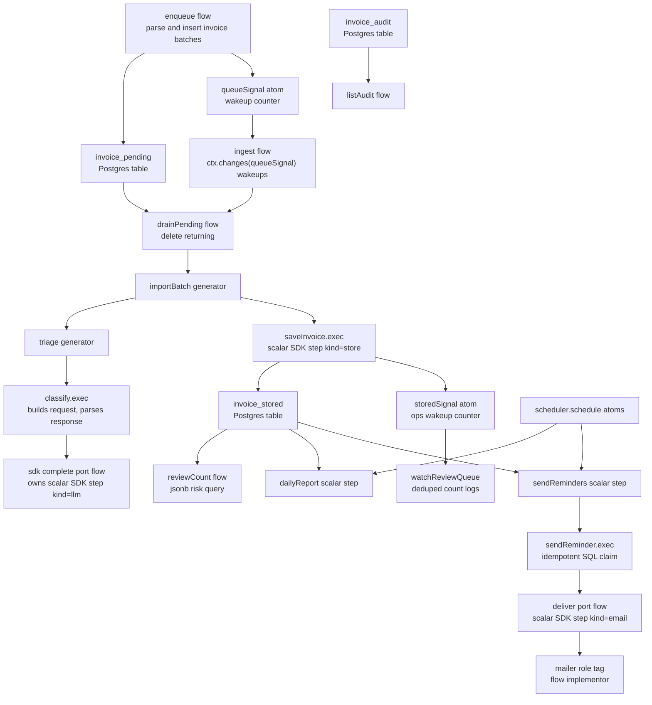

# Invoice Triage

Runnable `@pumped-fn/sdk` example for Postgres-backed invoice import, LLM classification, cron reports, and reminder delivery.

It proves:

- generator flows with `execStream` progress and `exec` summary consumption
- `yield*` progress composition from nested generator flows
- deps-declared scalar flow handles for model calls, durable queue writes, Postgres upserts, reports, and mail delivery
- Postgres-backed ingest queues drained by an `ingest` flow from `ctx.changes(queueSignal)` wakeups
- `scope.resolveStream(...)` fan-out feeds plus `scope.drain(..., { take })` shown in tests with a local status feed
- signal-backed ops views for review queue count
- scheduler-backed cron registration with deterministic manual ticks in tests
- idempotent reminders through ledger state

## Architecture



## Canonical Shape

`triage` and `importBatch` are streaming orchestration flows. They are not tagged with replay, suspend, or workflow policy. The SDK workflow and suspense extensions reject streaming targets through `isStreamingExec`, so durable policy belongs below them.

Business features are flows/resources; free functions are pure calculations; ctx/scope/handles never travel into helpers.

External data is schema-validated with zod at parse and model-output boundaries; graph-internal handoffs stay typed.

Database side effects are scalar store flows backed by a `queries` atom through `traced()`. The public flow names remain workflow store steps, and each database operation runs as a named traced exec edge. Multi-statement aggregates that pair table writes with audit rows run in one transaction.

- `classify` builds the model request and validates the response; it execs the SDK `complete` port flow (a bare flow dep, projected to a handle) rather than owning the llm span itself.
- `enqueue` owns intake validation, calls `store.enqueuePending`, and wakes the queue when rows are accepted.
- `drainPending` calls `store.drainPending` for the pending drain with `delete returning`.
- `saveInvoice` calls `store.upsertStored` for the `invoice_stored` upsert and wakes ops views.
- `dailyReport` owns report materialization.
- `markReminderSent` calls `store.claimReminder` for the idempotent reminder claim.
- `deliver` owns mail delivery through the `mailer` role tag.

`triage`, `importBatch`, `ingest`, `intake`, and `sendReminders` declare the child flows they compose with `controller(childFlow)` deps, then call `child.exec(...)` or `child.execStream(...)` from the injected handle. Those scalar flows use `step({ workflow: true, kind })`, so a production composition can add `workflowExtension({ log })` and replay completed scalar work without journaling streaming generators. `classify` no longer carries its own `kind: "llm"` step tag — the SDK `complete` port flow owns that span. A completed workflow run now shows the model implementor's step followed by `model.complete` where `invoice.classify` used to appear; `invoice.classify` itself is untracked plumbing around that call. Do not put `step({ workflow: true })`, replay, suspend, or durable tags on `triage` or `importBatch`.

The example uses `yield* stream` to pass nested triage progress through `importBatch`, then reads `stream.result` for the typed classification. The current `FlowStream` type preserves output through `.result`; the `yield*` expression itself does not recover the output type from `AsyncIterable`.

## Providers

The provider seam is the SDK `model` tag. `src/main.ts` wires a deterministic heuristic provider:

```ts
createScope({
  tags: [model(heuristic)],
})
```

Tests wire scripted fakes built with `@pumped-fn/sdk-test`'s `modelStub` through the same tag and use `@pumped-fn/sdk-test`'s `kit()` for in-memory workflow logs. Production can swap in the CLI providers without changing the graph:

```ts
import { claude } from "@pumped-fn/sdk-claude"
import { codex } from "@pumped-fn/sdk-codex"

createScope({ tags: [claude({ guard: false })] })
createScope({ tags: [codex({ guard: false })] })
```

## Postgres Queue And Cron

The SDK `channel()` and `schedule()` helpers are agent-turn adapters. This example needs a lossless ingest queue and cron-capable registration, so it uses:

- `enqueue` to parse raw lines or invoice objects and insert invoice batches into `invoice_pending`.
- `ingest` to run a recovery drain once, wake on `ctx.changes(queueSignal)`, drain pending rows, and pass each drained set to `importBatch`.
- `saveInvoice` to upsert completed classifications into `invoice_stored`.
- `outstanding` as the invoices accepted by this process and not settled, `importing` as an in-flight batch count, and `drained` as a derived atom over both — `awaitDrained` resolves only when accepted work is settled and no batch is mid-import.
- `reviewCount` as a Postgres jsonb query over `invoice_stored.classification`.
- `storedSignal` as the conflated ops wakeup for `watchReviewQueue`.
- `@pumped-fn/lite-extension-scheduler` for cron registration.

`resolveStream` and `changes` views conflate to the latest unconsumed value. That is correct for status views and processor wakeups, but not for must-not-drop work items; invoice batches live in Postgres and the processor drains durable state on each wakeup.

`dailyReportJob` and `sendRemindersJob` are module-level `scheduler.schedule` atoms resolved at the composition root. `reminderWindowDays` and `reminderRecipient` are tags. Preset them at the composition root for each environment.

## Ops Notes

Run Postgres with `docker compose -f examples/invoice-triage/compose.yaml up -d postgres`, then run `pnpm start < fixtures/demo.ndjson` from the example package. The composition root execs `intake`, `ingest`, `watchReviewQueue`, and `awaitDrained` as flows — it holds the scope, but every loop lives in the graph. `intake` consumes the stdin transport atom by direct pull and sends raw lines to `enqueue`; exactly one flow owns the iterator, so it is backpressured and lossless. Malformed lines are logged and rejected, never fatal. SIGINT ends intake; the root then waits for `drained` — accepted work settled and no batch in flight — sets `stopping`, bumps `queueSignal` and `storedSignal` to wake both loops, waits for them to settle, then closes the context and disposes the scope. Nothing runs during teardown.

Reminder idempotency is SQL-backed: `sendReminder` claims an invoice through `markReminderSent`, which updates `reminded_at` only when it is still null, then calls `deliver`. Re-running `sendReminders` skips marked invoices, so the second run sends zero messages. In production, bind `mailer` to a real delivery implementor, set `clock` for deterministic tests, and wire a durable workflow event log for scalar steps.

## Run

```sh
pnpm -F @pumped-fn/invoice-triage test
pnpm -F @pumped-fn/invoice-triage typecheck
pnpm -F @pumped-fn/invoice-triage lint
```
