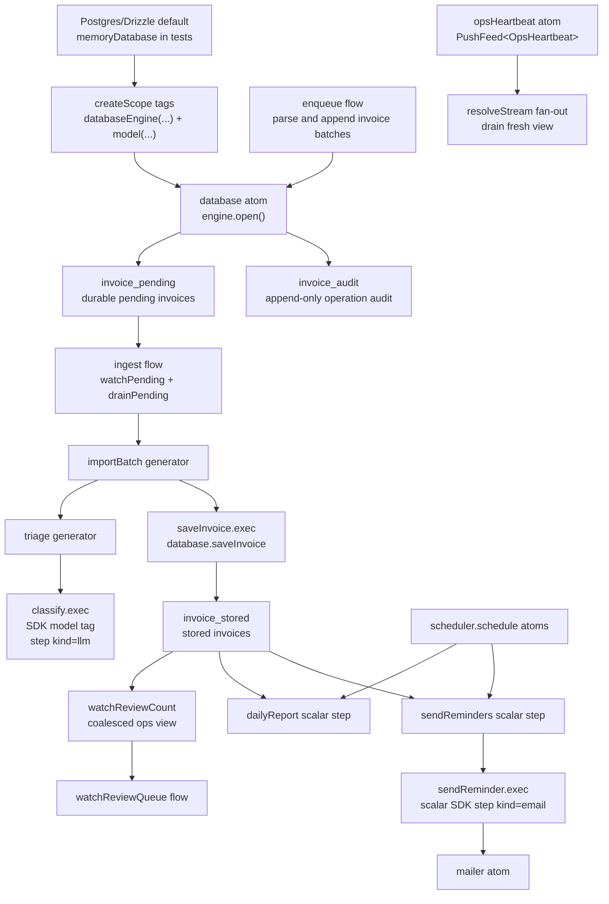

# Invoice Triage

Runnable `@pumped-fn/sdk` example for invoice import, LLM classification, cron reports, and reminder delivery.

It proves:

- generator flows with `execStream` progress and `exec` summary consumption
- `yield*` progress composition from nested generator flows
- deps-declared scalar flow handles for model calls, database appends, database writes, reports, and mailer sends
- a tag-selected database engine with Postgres/Drizzle as the production default and in-memory test engines at the same scope seam
- audit records emitted by the database operations that enqueue, drain, save, and remind invoices
- `scope.resolveStream(opsHeartbeat)` fan-out feeds plus `scope.drain(opsHeartbeat, { take })`
- coalesced ops views for review queue count
- scheduler-backed cron registration with deterministic manual ticks in tests
- idempotent reminders through durable invoice state

## Architecture



## Canonical Shape

`triage` and `importBatch` are streaming orchestration flows. They are not tagged with replay, suspend, or workflow policy. The SDK workflow and suspense extensions reject streaming targets through `isStreamingExec`, so durable policy belongs below them.

Business features are flows/resources; free functions are pure calculations; ctx/scope/handles never travel into helpers.

External data is schema-validated with zod at parse and model-output boundaries; graph-internal handoffs stay typed.

Every side effect is a scalar flow reached through a deps-declared flow handle:

- `classify` owns the model call and output validation.
- `enqueue` owns intake validation and appending invoice work into the database engine.
- `saveInvoice` owns the durable invoice write and audit record.
- `dailyReport` owns report materialization.
- `sendReminder` owns idempotent reminder marking and mail delivery.

`triage`, `importBatch`, `ingest`, `intake`, and `sendReminders` declare the child flows they compose with `controller(childFlow)` deps, then call `child.exec(...)` or `child.execStream(...)` from the injected handle. Those scalar flows use `step({ workflow: true, kind })`, so a production composition can add `workflowExtension({ log })` and replay completed scalar work without journaling streaming generators. Do not put `step({ workflow: true })`, replay, suspend, or durable tags on `triage` or `importBatch`.

The example uses `yield* stream` to pass nested triage progress through `importBatch`, then reads `stream.result` for the typed classification. The current `FlowStream` type preserves output through `.result`; the `yield*` expression itself does not recover the output type from `AsyncIterable`.

## Providers

The provider seam is the SDK `model` tag. `src/main.ts` wires a deterministic heuristic provider:

```ts
createScope({
  tags: [model(heuristic)],
})
```

Tests wire scripted fakes through the same tag and use `@pumped-fn/sdk-test` for in-memory workflow logs. Production can swap in the CLI providers without changing the graph:

```ts
import { claude } from "@pumped-fn/sdk-claude"
import { codex } from "@pumped-fn/sdk-codex"

createScope({ tags: [claude({ guard: false })] })
createScope({ tags: [codex({ guard: false })] })
```

## Database Queue And Cron

The SDK `channel()` and `schedule()` helpers are agent-turn adapters. This example needs a lossless ingest queue and cron-capable registration, so it uses:

- `databaseEngine` as the tag-carried engine seam. `postgresDatabase()` is the default; tests use `databaseEngine(memoryDatabase(...))`.
- `database` as the scoped atom that opens and closes the engine for the current composition root.
- `databaseStartup` as an optional operational tag read by `prepareDatabase`; that flow holds controllers for `migrateDatabase` and `verifyDatabase` and executes only the selected path.
- `enqueue` to parse raw lines or invoice objects and append invoice batches with `database.enqueue`.
- `ingest` to wake on `database.watchPending()`, drain all pending invoices with `database.drainPending`, and pass that drained set to `importBatch`.
- `saveInvoice` to upsert completed classifications with `database.saveInvoice`.
- `watchReviewQueue` to read `database.watchReviewCount()` as a coalesced operational view.
- `opsHeartbeat` as an async-iterable atom consumed with `scope.resolveStream(opsHeartbeat)` only for conflatable status views.
- `@pumped-fn/lite-extension-scheduler` for cron registration.

The production database adapter uses Drizzle over `pg` and exposes explicit migration operations. `migrateDatabase` applies ordered, checksum-tracked migrations into `invoice_schema_migrations` and emits `database.migrated` audit records; `verifyDatabase` fails if pending migrations or checksum drift exist. The daemon composition root sets `databaseStartup("migrate")` by default through `INVOICE_DATABASE_STARTUP`, while tests can omit that optional tag and avoid loading migration resources at all. Tests still swap only the `databaseEngine` tag, so inside-out and outside-in tests exercise the same public seam.

`dailyReportJob` and `sendRemindersJob` are module-level `scheduler.schedule` atoms resolved at the composition root. `reminderWindowDays` and `reminderRecipient` are tags. Preset them at the composition root for each environment.

## Ops Notes

The operational expansion frame is tracked in `OPERATIONS-OKR.md`. Replay the current gate metrics with `pnpm okr:invoice-triage`.

Run with `pnpm start < fixtures/demo.ndjson` (invoices arrive as NDJSON on stdin - pipe from any producer); tests with `pnpm test`. The composition root execs `prepareDatabase`, `intake`, `ingest`, `watchReviewQueue`, and `awaitDrained` as flows. It holds the scope, but every loop lives in the graph. Set `INVOICE_DATABASE_STARTUP=verify` when a pre-start migration job owns schema mutation. `intake` consumes the stdin transport atom by direct pull and sends raw lines to `enqueue`; exactly one flow owns the iterator, so it is backpressured and lossless. Malformed lines are logged and rejected, never fatal. SIGINT ends intake; the root then drains pending work and disposes.

Reminder idempotency is database-backed: `sendReminder` marks an invoice as reminded before sending. Re-running `sendReminders` skips marked invoices, so the second run sends zero messages. In production, keep `databaseEngine` on the Postgres default or tag it with another engine at the composition root, preset `mailer` with the real delivery sink, set `clock` for deterministic tests, and wire a durable workflow event log for scalar steps.

## Run

```sh
pnpm -F @pumped-fn/invoice-triage test
pnpm -F @pumped-fn/invoice-triage typecheck
pnpm -F @pumped-fn/invoice-triage lint
```
