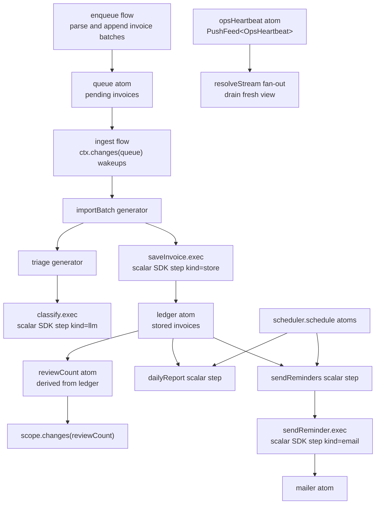

# Invoice Triage

Runnable `@pumped-fn/sdk` example for invoice import, LLM classification, cron reports, and reminder delivery.

It proves:

- generator flows with `execStream` progress and `exec` summary consumption
- `yield*` progress composition from nested generator flows
- deps-declared scalar flow handles for model calls, queue appends, ledger writes, reports, and mailer sends
- state-backed ingest queues drained by an `ingest` flow from `ctx.changes(queue)` wakeups
- `scope.resolveStream(opsHeartbeat)` fan-out feeds plus `scope.drain(opsHeartbeat, { take })`
- derived-atom ops views for review queue count
- scheduler-backed cron registration with deterministic manual ticks in tests
- idempotent reminders through ledger state

## Architecture



## Canonical Shape

`triage` and `importBatch` are streaming orchestration flows. They are not tagged with replay, suspend, or workflow policy. The SDK workflow and suspense extensions reject streaming targets through `isStreamingExec`, so durable policy belongs below them.

Business features are flows/resources; free functions are pure calculations; ctx/scope/handles never travel into helpers.

External data is schema-validated with zod at parse and model-output boundaries; graph-internal handoffs stay typed.

Every side effect is a scalar flow reached through a deps-declared flow handle:

- `classify` owns the model call and output validation.
- `enqueue` owns intake validation and appending invoice work into queue state.
- `saveInvoice` owns the ledger write.
- `dailyReport` owns report materialization.
- `sendReminder` owns idempotent reminder marking and mail delivery.

`triage`, `importBatch`, `ingest`, `intake`, and `sendReminders` declare the child flows they compose with `controller(childFlow)` deps, then call `child.exec(...)` or `child.execStream(...)` from the injected handle. Those scalar flows use `step({ workflow: true, kind })`, so a production composition can add `workflowExtension({ log })` and replay completed scalar work without journaling streaming generators. Do not put `step({ workflow: true })`, replay, suspend, or durable tags on `triage` or `importBatch`.

The example uses `yield* stream` to pass nested triage progress through `importBatch`, then reads `stream.result` for the typed classification. The current `FlowStream` type preserves output through `.result`; the `yield*` expression itself does not recover the output type from `AsyncIterable`.

## Providers

The provider seam is the SDK `model` tag. `src/main.ts` wires a deterministic heuristic provider:

```ts
createScope({
  tags: [model(heuristic)],
})
```

Tests wire scripted fakes through the same tag and use `@pumped-fn/sdk-test` for in-memory workflow logs. Production can swap in the CLI providers without changing the graph:

```ts
import { claude } from "@pumped-fn/sdk-claude"
import { codex } from "@pumped-fn/sdk-codex"

createScope({ tags: [claude({ guard: false })] })
createScope({ tags: [codex({ guard: false })] })
```

## State Queue And Cron

The SDK `channel()` and `schedule()` helpers are agent-turn adapters. This example needs a lossless ingest queue and cron-capable registration, so it uses:

- `enqueue` to parse raw lines or invoice objects and append invoice batches into `queue`.
- `ingest` to wake on `ctx.changes(queue)`, drain all pending invoices from queue state, and pass that drained set to `importBatch`.
- `saveInvoice` to upsert completed classifications into `ledger`.
- `reviewCount` as a derived atom over `ledger`.
- `opsHeartbeat` as an async-iterable atom consumed with `scope.resolveStream(opsHeartbeat)` only for conflatable status views.
- `@pumped-fn/lite-extension-scheduler` for cron registration.

`resolveStream` and `changes` views conflate to the latest unconsumed value. That is correct for status views and processor wakeups, but not for must-not-drop work items; invoice batches live in `queue` and the processor drains state on each wakeup.

`dailyReportJob` and `sendRemindersJob` are module-level `scheduler.schedule` atoms resolved at the composition root. `reminderWindowDays` and `reminderRecipient` are tags. Preset them at the composition root for each environment.

## Ops Notes

Run with `pnpm start < fixtures/demo.ndjson` (invoices arrive as NDJSON on stdin — pipe from any producer); tests with `pnpm test`. The composition root execs `intake`, `ingest`, `watchReviewQueue`, and `awaitDrained` as flows — it holds the scope, but every loop lives in the graph. `intake` consumes the stdin transport atom by direct pull and sends raw lines to `enqueue`; exactly one flow owns the iterator, so it is backpressured and lossless, the correct shape for must-not-drop transport (contrast with the conflated `changes()` wakeup that drives `ingest` from queue state). Malformed lines are logged and rejected, never fatal. SIGINT ends intake; the root then drains pending work and disposes — shutdown is the graph closing, not a kill.

Reminder idempotency is ledger-backed: `sendReminder` marks an invoice as reminded before sending. Re-running `sendReminders` skips marked invoices, so the second run sends zero messages. In production, preset `ledger` with durable data, preset `mailer` with the real delivery sink, set `clock` for deterministic tests, and wire a durable workflow event log for scalar steps.

## Run

```sh
pnpm -F @pumped-fn/invoice-triage test
pnpm -F @pumped-fn/invoice-triage typecheck
pnpm -F @pumped-fn/invoice-triage lint
```
