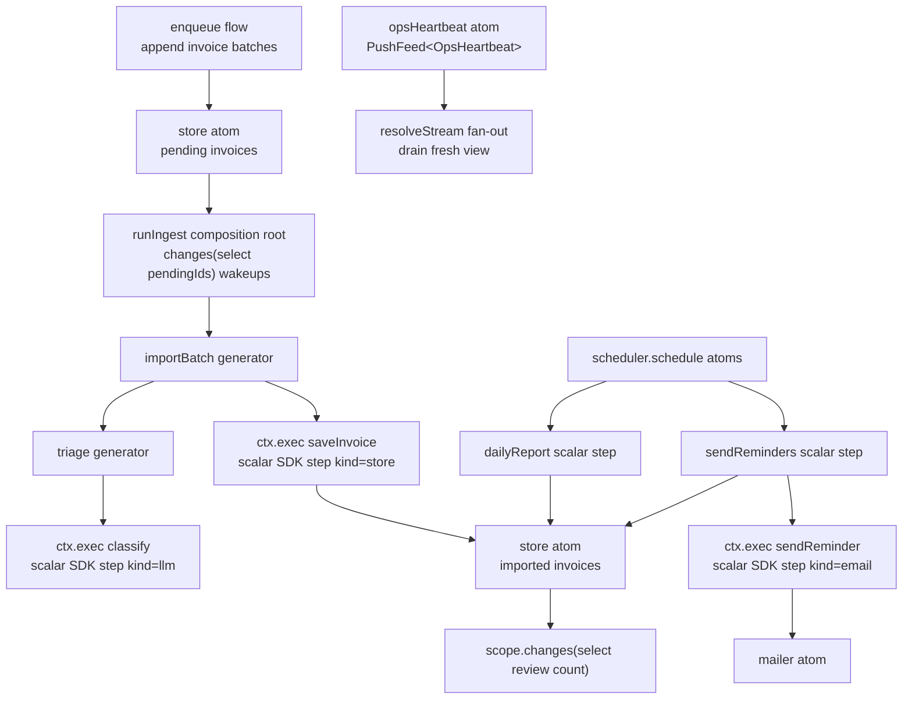

# Invoice Triage

Runnable `@pumped-fn/sdk` example for invoice import, LLM classification, cron reports, and reminder delivery.

It proves:

- generator flows with `execStream` progress and `exec` summary consumption
- `yield*` progress composition from nested generator flows
- scalar `ctx.exec` steps for model calls, store writes, reports, and mailer sends
- state-backed ingest queues drained from `scope.changes(scope.select(...))` wakeups
- `scope.resolveStream(opsHeartbeat)` fan-out feeds plus `scope.drain(opsHeartbeat, { take })`
- `scope.changes(scope.select(...))` ops views for review queue count
- scheduler-backed cron registration with deterministic manual ticks in tests
- idempotent reminders through store state

## Architecture



## Canonical Shape

`triage` and `importBatch` are streaming orchestration flows. They are not tagged with replay, suspend, or workflow policy. The SDK workflow and suspense extensions reject streaming targets through `isStreamingExec`, so durable policy belongs below them.

Every side effect is a scalar flow reached with `ctx.exec`:

- `classify` owns the model call and output validation.
- `enqueue` owns appending invoice work into pending state.
- `saveInvoice` owns the store write.
- `dailyReport` owns report materialization.
- `sendReminder` owns idempotent reminder marking and mail delivery.

Those scalar flows use `step({ workflow: true, kind })`, so a production composition can add `workflowExtension({ log })` and replay completed scalar work without journaling streaming generators. Do not put `step({ workflow: true })`, replay, suspend, or durable tags on `triage` or `importBatch`.

The example uses `yield* stream` to pass nested triage progress through `importBatch`, then reads `stream.result` for the typed classification. The current `FlowStream` type preserves output through `.result`; the `yield*` expression itself does not recover the output type from `AsyncIterable`.

## Providers

The provider seam is the SDK `model` tag. `src/main.ts` wires a deterministic heuristic provider:

```ts
createScope({
  tags: [model(heuristic)],
})
```

Tests wire scripted fakes through the same tag and use `@pumped-fn/sdk-test` for in-memory workflow logs. Production can swap in the CLI providers without changing the graph:

```ts
import { claude } from "@pumped-fn/sdk-claude"
import { codex } from "@pumped-fn/sdk-codex"

createScope({ tags: [claude({ guard: false })] })
createScope({ tags: [codex({ guard: false })] })
```

## State Queue And Cron

The SDK `channel()` and `schedule()` helpers are agent-turn adapters. This example needs a lossless ingest queue and cron-capable registration, so it uses:

- `enqueue` to append invoice batches into `store.pending`.
- `runIngest` to wake on `scope.changes(scope.select(store, pendingIds))`, drain all pending invoices from state, and pass that drained set to `importBatch`.
- `opsHeartbeat` as an async-iterable atom consumed with `scope.resolveStream(opsHeartbeat)` only for conflatable status views.
- `@pumped-fn/lite-extension-scheduler` for cron registration.

`resolveStream` and `changes` views conflate to the latest unconsumed value. That is correct for status views and processor wakeups, but not for must-not-drop work items; invoice batches live in `store.pending` and the processor drains state on each wakeup.

`reportCron`, `reminderCron`, and `reminderWindowDays` are tags. Preset them at the composition root for each environment.

## Ops Notes

`scope.dispose()` closes change and stream views and ends the ingest loop. The entrypoint also registers a SIGINT handler that disposes the scope.

Reminder idempotency is store-backed: `sendReminder` marks an invoice as reminded before sending. Re-running `sendReminders` skips marked invoices, so the second run sends zero messages. In production, preset `store` with a durable persistence adapter or an outbox-backed implementation, preset `mailer` with the real delivery sink, set `clock` for deterministic tests, and wire a durable workflow event log for scalar steps.

## Run

```sh
pnpm -F @pumped-fn/invoice-triage test
pnpm -F @pumped-fn/invoice-triage typecheck
```
