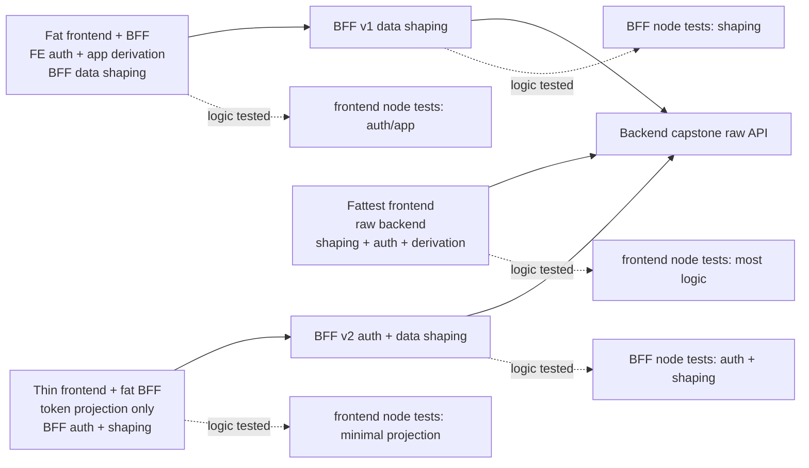

# Service Health Dashboard Logic Spectrum

Diagram: https://diashort.apps.quickable.co/d/14909a2e

## Anchors

| Anchor | Frontend talks to | Frontend owns | BFF owns | Where logic is tested |
|---|---|---|---|---|
| Fattest frontend | raw backend API | data shaping, auth, app derivation, optimistic interaction | nothing | frontend node tests |
| Fat frontend + BFF | BFF data endpoints | auth, session atom, app graph derivation | dashboard/detail shaping | frontend node tests for auth/app; BFF node tests for shaping |
| Thin frontend + fat BFF | auth-gated BFF endpoints | token storage and projection | auth, session shaping, dashboard/detail shaping | BFF node tests; minimal frontend node tests |

## Implemented Slices

The BFF package proves the middle tier owns calculation without a browser:
`examples/lite-golden-bff` has `dashboardView`, `serviceDetailView`, and auth adapter flows, all tested in
node through `createScope` + `preset(capstoneClient, fake)` or `preset(authProvider, fake)`.

The fat frontend (`capstone/fat`) consumes BFF-shaped `DashboardView` data but owns frontend auth:
`authProvider`, `session`, `login`, `logout`, `isAuthed`, and the `dashboard` atom. Components observe
those graph nodes; they do not calculate the dashboard shape.

The thin frontend (`capstone/thin`) moves auth shaping behind the BFF. The browser graph holds only a
token and asks the BFF for an auth-gated dashboard view-model.

## Test Delta

- fat frontend: 9 node-logic tests across auth/app/adapter ownership.
- thin frontend: 5 node-logic tests across sign-in/token and dashboard projection.

The drop is the point: moving auth/session rules down a tier reduces frontend logic without changing the
testing seam. Both versions still use the same mechanism: construct a scope, preset the adapter atom, and
exercise public flows/atoms. Observer tests stay in `*.dom.test.tsx` and assert rendering only.

## Invariants

- Components observe the graph through `ScopeProvider`, `useAtom`, and `useScope`.
- `main.tsx` is a tested composition-root adapter: create one scope, render through `ScopeProvider`, and
  dispose the root/scope together.
- Browser APIs enter through adapter atoms; only adapter-owned tests fake `fetch`.
- No `vi.mock`, `msw`, or fetch-mock is needed above the seam.
- Packages stay independent and redeclare their wire/view-model types at the transfer boundary.
