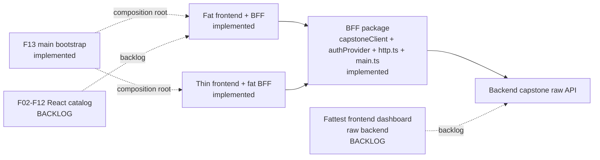

# Service Health Dashboard Logic Spectrum

Diagram: https://diashort.apps.quickable.co/d/859f2072

## Implemented Slices

| Slice | Source | Claim |
|---|---|---|
| BFF package | `examples/lite-golden-bff` | `capstoneClient` shapes backend data, `authProvider` authenticates and validates sessions, `src/http.ts` maps HTTP-shaped requests through flows, and `src/main.ts` mounts one lite scope for the process boundary. |
| Fat frontend + BFF | `capstone/fat` + `examples/lite-golden-bff` | Frontend owns auth/session/form state, composes `authedBffClient`, and projects BFF-shaped dashboard data. |
| Thin frontend + fat BFF | `capstone/thin` + `examples/lite-golden-bff` | Frontend owns token/form projection, composes `authedBffClient`, and projects BFF-shaped dashboard data. |
| F13 main bootstrap | `patterns/F13-main-bootstrap` | `main.tsx` is a tested composition-root adapter that returns the scope for assertions. |

## Backlog

| Slice | Status |
|---|---|
| Fattest frontend dashboard against the raw backend | Backlog: there is no `capstone/raw` or `capstone/fattest` implementation in this PR. |
| F02-F12 frontend catalog | Backlog: only F01 and F13 are implemented in the React pattern catalog. |

## Current Node Test Inventory

| Slice | Test file | Test count |
|---|---|---|
| fat frontend | capstone/fat/tests/app.test.ts | 4 |
| fat frontend | capstone/fat/tests/auth-provider.test.ts | 2 |
| fat frontend | capstone/fat/tests/auth.test.ts | 10 |
| fat frontend | capstone/fat/tests/bff-client.test.ts | 2 |
| thin frontend | capstone/thin/tests/bff-client.test.ts | 4 |
| thin frontend | capstone/thin/tests/dashboard.test.ts | 5 |
| thin frontend | capstone/thin/tests/signIn.test.ts | 8 |

The inventory above is intentionally file-derived by `tests/capstone-comparison.test.ts`. It is not a
package-wide test-total claim; it documents where frontend node logic currently lives.

## Boundary Rules

- Components observe the graph through `ScopeProvider`, `useAtom`, and `useScope`.
- `main.tsx` is a tested composition-root adapter: create one scope, render through `ScopeProvider`, return
  the scope for assertions, and dispose the root/scope together.
- BFF `main.ts` is a tested lite composition root: create one scope, delegate requests through
  `handleBffRequest`, return the scope for assertions, and dispose the scope with the mounted BFF.
- Ambient browser/runtime APIs (`fetch`, `document`, timers, storage, clock, random) enter only through
  adapter atoms or composition-root adapters; feature graph nodes and observers do not call them inline.
- Feature atoms depend on auth-capable ports such as `authedBffClient`; they do not combine raw HTTP
  clients with session/token storage or manually pass credentials into service calls.
- No `vi.mock`, `vi.spyOn`, `msw`, or fetch-mock is needed above the seam.
- Packages stay independent and redeclare their wire/view-model types at the transfer boundary.
