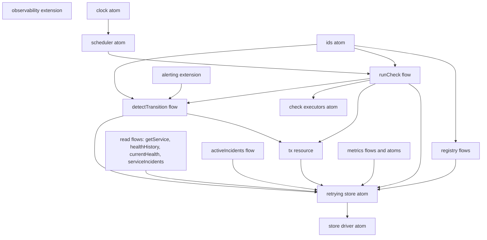

# Service Health Monitor Capstone

This capstone combines the catalog patterns into one service health monitor: API flows, execution-scoped transactions, scheduled checks, extension-based observability, alert hooks, and deterministic shutdown.

## Architecture

Diagram: https://diashort.apps.quickable.co/d/206cca4e (previous version: https://diashort.apps.quickable.co/d/10e7f4bf)



## Transaction design

`store.begin()` returns an op-buffered write-through handle (`StoreTx`): transactional writes go through the tx object (`tx.checks.append`, `tx.incidents.open/close`) into a per-tx buffer, and `commit()` applies the buffered ops atomically against live state using the same internal apply functions as the direct API — `incidents.close`'s `NotFoundError` branch exists exactly once. `rollback()` discards only its own buffer. There is no global staging slot: interleaved transactions each own their buffer (tx OI4), and direct writes made while a foreign tx is open are never captured by it (tx OI5).

Reads always see committed state — this is a unit-of-work design. A check chain (`runCheck` → `detectTransition`) resolves one `tx` at its root context, reads committed data, stages its writes, and `ctx.onClose` commits on `{ok:true}` or rolls back on `{ok:false}` — so a failed chain leaves neither the check nor the incident behind (tx OI3). Because reads are committed-only, each check chain runs in its own execution context.

`store` wraps `begin()` so the store-revision bump happens on commit only: staged writes are invisible to direct reads and revision watchers, a committed tx fires exactly one cascade, and a rolled-back tx fires none (tx E3).

## Retry policy

`store` resolves the driver with at most 2 attempts: on the first failure it releases the driver controller and re-resolves once (store OI-SC6); a driver failing both attempts propagates the failure to the caller (store OI2).

## Composition at the use site

There is no `createApp` facade. Tests and consumers import the atoms and flows they need and compose via `createScope({ presets?, extensions?, tags? })` + direct `ctx.exec({ flow, input })`. The scheduler starts with `scope.resolve(scheduler)`. The reconnect sequence is an exported function in `infra/store.ts` because the store owns the concern.

## Reconnect mechanism

`reconnectStore(scope)` releases `store`, releases the `storeDriver` controller, and re-resolves — product atoms only, no preset introspection in the composition root.

Pinned lite semantics (S11): an atom preset redirect (`preset(storeDriver, replacement)`) resolves and caches under the replacement atom — `scope.resolve` returns before creating an entry for the redirected target (`packages/lite/src/scope.ts`, `resolve()` preset branch), so `release`/`invalidate` on the target find no cache entry and are no-ops. lite has no test for release-on-a-redirected-target; store OI-SC6 is the pin: a preset-redirected driver survives `reconnectStore()` with its factory not re-run and its data intact, while the real driver (no preset) is released and rebuilt fresh (store OI1).

## Request identity

The observability extension seeds one `requestId` per root exec via `ctx.data.setTag`; nested execs inherit it through `ctx.data.seekTag`, and every exec record carries it — a root exec chain shares one requestId, the next root exec gets a fresh one (acceptance OI3). This is the P02 ambient-data pattern applied across the capstone.

## Run

```bash
pnpm -F @pumped-fn/lite-golden test
pnpm -F @pumped-fn/lite-golden typecheck
```

## Acceptance Map

| SC | Test |
|---|---|
| SC1 | `capstone/tests/acceptance.test.ts` OI-SC1 |
| SC2 | `capstone/tests/scheduler.test.ts` E-SC2 |
| SC3 | `capstone/tests/acceptance.test.ts` OI-SC3 |
| SC4 | `capstone/tests/acceptance.test.ts` OI-SC4 |
| SC5 | `capstone/tests/metrics.test.ts` IO-SC5 |
| SC6 | `capstone/tests/store.test.ts` OI-SC6 |
| SC7 | `capstone/tests/lifecycle.test.ts` E-SC7 |
| SC8 | `capstone/tests/alerting.test.ts` OI-SC8 |

## Lens coverage

| Module test file | Lenses present | Absent-lens justification |
|---|---|---|
| `registry.test.ts` | IO | OI runs through direct flow execs in acceptance OI1/OI2; no E because registry owns no effects — writes delegate to the store atom. |
| `checker.test.ts` | IO | OI is the composed path in acceptance OI-SC3/OI-SC4; no E because executors are stateless and the chain tx lifecycle is owned by `tx.test.ts`. |
| `incidents.test.ts` | IO | OI runs via acceptance and alerting OI-SC8; no E because incident writes ride the chain tx pinned in `tx.test.ts`. |
| `metrics.test.ts` | IO | OI runs via acceptance OI1 (`uptime`); no E because the watch-derived atom owns no cleanup — watch lifecycle is pinned in pattern 08. |
| `scheduler.test.ts` | E | No IO because the scheduler's unit IS its timer lifecycle (tick logic delegates to `runCheck`, unit-tested in checker IO); the composed OI path is acceptance OI-SC3. |
| `lifecycle.test.ts` | E | No IO/OI because dispose order, timer teardown, and in-flight settlement are the subject — there is no unit or boundary smaller than the lifecycle itself. |
| `store.test.ts` | OI, E | No IO block because the in-memory driver's units are exercised by every module IO file that presets it and seeds it directly. |
| `tx.test.ts` | IO, OI, E | All three lenses present. |
| `alerting.test.ts` | IO, OI | No E because the extension holds only hook registrations — no owned resources or timers. |
| `acceptance.test.ts` | OI | The outside-in suite for the composed system; IO lives in the module files, E in scheduler/lifecycle/tx. |
