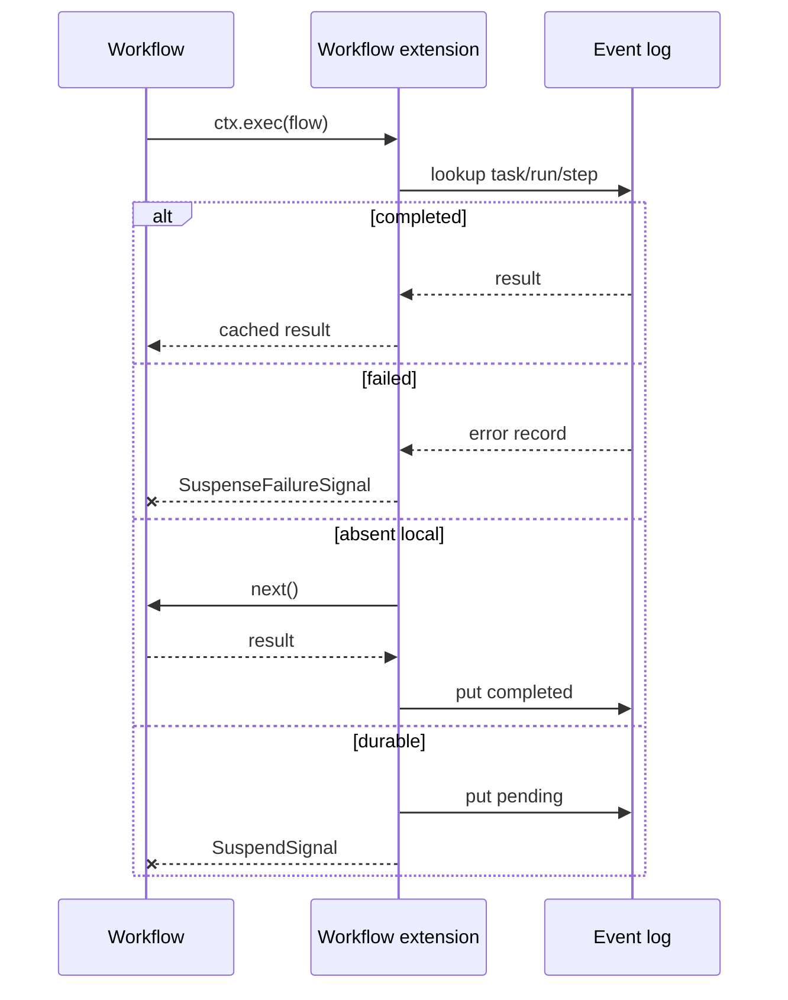

# Agent SDK Patterns

Use this package as a small agent convention layer over `@pumped-fn/lite` and `@pumped-fn/lite-extension-workflow`. If a use case can be expressed with `flow`, state/service, tags, and `ctx.exec`, do that before adding another primitive.

## 0. Standalone Suspense

Use suspense when the system needs deterministic replay or external resolution, but not agents, workers, or remote routing.

```ts
import { eventLog, extension, runId, stepCounter, suspend, taskId } from "@pumped-fn/lite-extension-suspense"

const waitForCommit = flow({
  name: "wait-for-commit",
  parse: typed<{ revision: number }>(),
  tags: [suspend(true)],
  factory: () => {
    throw new Error("resolved by sync service")
  },
})

const scope = createScope({
  tags: [eventLog(log)],
  extensions: [extension()],
})

const ctx = scope.createContext({
  tags: [
    taskId("doc-123"),
    runId("sync-42"),
    stepCounter({ next: 0 }),
  ],
})
```

Suspense has no agent knowledge. It sees tagged `ctx.exec` calls, assigns `(taskId, runId, step)`, returns completed/resolved log entries, writes pending entries for suspended steps, records failed entries when the log supports `putFailed()`, and throws `SuspendSignal`. Reusable workflow policy lives in `@pumped-fn/lite-extension-workflow` units over this lower extension.

## 1. Workflow Flow

Use a workflow flow when code chooses order, branching, retries, and fan-out.

```ts
import { createScope, flow, tags, typed } from "@pumped-fn/lite"
import {
  agent as agentRuntime,
  step,
  workflow as workflowRuntime,
  workflowRun,
  workerRegistry,
  workers,
} from "@pumped-fn/agent-sdk"
import { agent as testAgent } from "@pumped-fn/agent-sdk-test"

export const processPr = flow({
  name: "process_pr",
  parse: typed<PrEvent>(),
  tags: [
    step({ workflow: true }),
    workers(workerRegistry([lint, test, security])),
  ],
  deps: {
    workflow: tags.required(workflowRuntime),
    agent: tags.required(agentRuntime),
  },
  factory: async (ctx, { workflow, agent }) => {
    const lintResult = await agent.delegate<{ failed: boolean }>("lint", { sha: ctx.input.sha })
    if (lintResult.failed) return { taskId: workflow.taskId, status: "lint-failed" }

    const [tests, security] = await Promise.all([
      agent.delegate("test", { sha: ctx.input.sha }),
      agent.delegate("security", { sha: ctx.input.sha }),
    ])

    return { taskId: workflow.taskId, status: "ok", tests, security }
  },
})

export async function runProcessPr(input: PrEvent) {
  const { extensions, tags: scopeTags } = testAgent()
  const scope = createScope({ tags: scopeTags, extensions })
  const ctx = scope.createContext({
    tags: [workflowRun({ taskId: input.sha, runId: "run-1" })],
  })

  try {
    return await ctx.exec({ flow: processPr, input })
  } finally {
    await ctx.close()
    await scope.dispose()
  }
}
```

Why: normal TypeScript control flow stays visible. Replay still works because expensive work is behind `ctx.exec()` through `agent.delegate()`.

`step({ workflow: true })` marks the flow as workflow policy surface. `workflowRun()` is a context tag for run metadata, passed through `createContext({ tags: [...] })`. Workflow execution requires that tag or `runDefaults()`/explicit extension defaults; missing run identity is rejected before a default log key can collide across runs. `workflow` and `agent` runtime tags are required deps when using the full `workflowExtension()`, so missing extensions fail before the factory runs. Event-log policy and remote routing stay normal extension composition tags.

When a runtime only needs the workflow mechanics, use the composable unit path instead of the full convenience extension:

```ts
import { extension as suspenseExtension } from "@pumped-fn/lite-extension-suspense"
import { eventLog, units, workflowExtensionUnits } from "@pumped-fn/lite-extension-workflow"

createScope({
  tags: [
    eventLog(log),
    units(workflowExtensionUnits()),
  ],
  extensions: [suspenseExtension({
    name: "workflow",
  })],
})
```

That path gives replay, stable keys, durable pending entries, and timer policy without installing agent runtime tags. `units()` entries are prepended to extension units; use the bare suspense extension for this composition path so the workflow unit stack is installed exactly once.

## 2. Worker Flow

Use a worker flow for one executable unit. `step()` says how it may run.

```ts
export const lint = flow({
  name: "lint",
  parse: typed<{ sha: string }>(),
  tags: [step({ remote: true, kind: "code", timeoutMs: 30_000 })],
  factory: async (ctx) => runLinter(ctx.input.sha),
})
```

`remote: true` means the extension may route it to a worker runner. Remote workers are still workflow steps, so a completed remote result is written before a later durable suspend can replay the parent flow. Without a remote runner, the default test helper runs it locally through `next()`.

## 3. LLM Provider

Prefer AI provider as a service. The flow owns prompt shape and output parsing.

```ts
import { service, type Lite } from "@pumped-fn/lite"

interface Model {
  complete(ctx: Lite.ExecutionContext, input: { system: string; prompt: string }): Promise<string>
}

export const model = service<Model>({
  factory: () => {
    const client = new ClaudeModel()
    return {
      complete: async (_ctx, input) => client.complete(input),
    }
  },
})

export const classify = flow({
  name: "classify",
  parse: typed<{ text: string }>(),
  deps: { model },
  tags: [step({ kind: "llm" })],
  factory: async (ctx, { model }) => {
    const raw = await model.complete(ctx, {
      system: "Return JSON only.",
      prompt: ctx.input.text,
    })
    return JSON.parse(raw) as { label: string }
  },
})
```

Test by preset, not by special agent hooks:

```ts
const scope = createScope({
  presets: [preset(model, { complete: async () => '{"label":"test"}' })],
})
```

## 4. CLI Worker Adapter

Use CLI helpers when the runtime must call real local tools like Claude or Codex.

```ts
const review = codexCliWorker({
  name: "codex-review",
  sandbox: "workspace-write",
  timeoutMs: 120_000,
})

const plan = claudeCliWorker({
  name: "claude-plan",
  timeoutMs: 120_000,
})
```

Keep CLI workers at the edge. Stable domain tests should use provider state and presets.

## 5. Durable Step

Use `step({ durable: true })` for a step that should suspend until another process resolves it.

```ts
const approve = flow({
  name: "approve",
  parse: typed<{ title: string }>(),
  tags: [step({ durable: true })],
  factory: () => {
    throw new Error("durable step should be resolved externally")
  },
})
```

First run writes a pending log entry and throws `SuspendSignal`. Replay returns the resolved value and continues. A propagated `SuspendSignal` is pending work, not a failed parent workflow.

## 6. Remote Runner

Remote routing belongs in `AgentRemoteRunner`, not inside workflow code.

```ts
const scope = createScope({
  tags: [
    eventLog(log),
    remoteRunner({
      run: async (event, next) => {
        if (canRoute(event.target)) return publishAndAwaitReply(event)
        return next()
      },
    }),
  ],
  extensions: [
    workflowExtension(),
    extension(),
  ],
})
```

The runner may short-circuit before worker dependencies resolve. If it calls `next()`, the worker runs locally.

## 7. Materials

Use materials for task state the workflow or workers must patch.

```ts
const inventory = material("inventory", {
  kind: "json",
  initialState: { items: [] as string[] },
})

await patchMaterial(ctx, inventory, [
  { op: "add", path: "/items/-", value: "typescript" },
])
```

Use derived materials for pure projections:

```ts
const count = derivedMaterial("inventory-count", inventory, (state) => state.items.length, {
  kind: "json",
})
```

## 8. Event Log Boundary

The event log key is `(taskId, runId, step)`. The step increments in standalone suspense `wrapExec`; `workflowExtension()` from `@pumped-fn/lite-extension-workflow` composes that lower layer. Use `step({ key: "stable-name" })` for branches whose idempotency cannot depend on positional order.



Because lite wraps the full executable step, cached replay and remote routing skip both dependency resolution and factory execution. Logs can optionally expose `list()` for dashboards and `observer()` can stream lifecycle events without changing workflow code.

## 9. Failure Ownership

| Failure | Owner |
|---|---|
| Parse error | Flow boundary |
| Missing worker | `WorkerRegistry` / caller setup |
| Missing workflow run identity | Workflow extension setup |
| CLI exit or timeout | `cliWorker()` |
| Material revision mismatch | Material writer |
| Pending durable step | Resolver / event log |
| Failed replayed step | Event log |
| Replay mismatch | Workflow determinism and event log |

Tests should prove the owning layer. Do not hide a missing dependency by adding a broad fake runner. Make the fake prove the exact behavior under test.

## 10. Add No Primitive Unless Forced

Before adding an agent SDK primitive, ask:

1. Can this be a tag on a `flow`?
2. Can this be a state/service dependency?
3. Can this be a `ctx.exec()` helper?
4. Can this be an extension policy?

Only add a primitive when all four answers are no and the new concept has its own lifecycle or type boundary.
